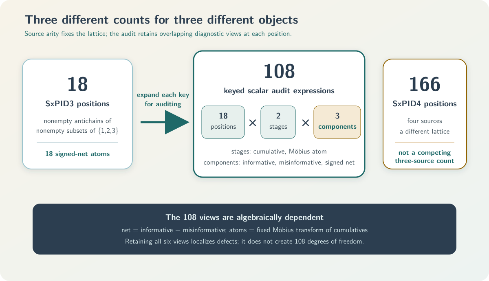

# Mathematical results guide

This guide gives a self-contained map of the principal mathematical results and assurance work in
pid-rs. Each result card identifies the mathematical object and its assumptions. Each card also
gives the central formula, evidence, cost, use, strongest nonclaim, and complete proof or
publication artifact.

> **Non-authoritative guide.** Scope-specific files govern each type of statement:
>
> - [`method-catalog.json`](method-catalog.json) governs method identity, provenance,
>   implementation status, and the public surface.
> - [`METHODS.md`](METHODS.md) and [`METHODS_SUMMARY.md`](METHODS_SUMMARY.md) provide generated views
>   of the catalog.
> - The linked active revision index and decision govern the claim lifecycle.
> - The detailed Markdown and PDF reports govern exact statements.
>
> If this guide conflicts with a scope-specific governing source, the governing source takes
> precedence.

The repository assigns authority by scope. The narrow SxPID3 factorization/bounded audit is an
integrated stable validation entry. The separate full SxPID3 certificate specification remains
proposed and unsupported. Neither status changes the other.

In this guide, “New in pid-rs” means repository implementation, rederivation, theorem composition,
counterexample, diagnostic, or assurance work. The phrase is **not** a scientific-priority claim.
All information quantities below use natural logarithms and are in **nats**. The MGW paper uses
bits. Multiplication by the positive factor $\log 2$ converts its values to nats without changing
signs or equalities.

## 1. Reading conventions and semantic firewall

### Evidence labels

| Label | Meaning | Boundary |
|---|---|---|
| **[P]** | Published definition or theorem | Does not prove the local transcription or code |
| **[R]** | Exact repository proof or rederivation | No scientific-priority, runtime, or statistical claim |
| **[X]** | Exact counterexample | Refutes only the stated stronger claim |
| **[B]** | Bounded exhaustive/finite-corpus result | No conclusion outside its declared domain |
| **[E]** | Executable observation/test | Not a proof of its specification or runtime |
| **[O]** | Open obligation or prohibited transfer | Does not negate a narrower accepted result |

A **functional** takes a probability law as its input. An **estimator** infers a functional from
samples. A PID **cumulative** belongs to a lattice node. Möbius inversion produces an **atom** from
the cumulatives.

Exact real, exact rational, and represented binary64 statements are different types of
statements. Formal and executable routes can share human statements or transcriptions. Therefore,
route counts do not imply independence.

### Five distinct lanes

| Lane | Object in this repository | Do not conflate it with |
|---|---|---|
| **Categorical MGW shared exclusions** | Finite-law event-logical PID of [Makkeh, Gutknecht, and Wibral (2021)](https://doi.org/10.1103/PhysRevE.103.032149), implemented for two to four sources | Ehrlich continuous Sx, Williams–Beer $I_{\min}$, or BROJA |
| **Continuous Ehrlich shared exclusions** | Distinct continuous functional/kNN estimator of [Ehrlich et al. (2024)](https://doi.org/10.1103/PhysRevE.110.014115). Experimental here | A categorical theorem or transparent quantization of the categorical theorem |
| **Williams–Beer $I_{\min}$** | Different categorical redundancy of [Williams and Beer (2010)](https://arxiv.org/abs/1004.2515) | Categorical Sx merely because both use an antichain carrier |
| **BROJA** | Bivariate finite-alphabet optimization-based PID proposal of [Bertschinger et al. (2014)](https://doi.org/10.3390/e16042161). Comparison boundary only here | Any accepted mapping from Sx or $I_{\min}$. The repository asserts no mapping |
| **KSG** | MI estimator of [Kraskov, Stögbauer, and Grassberger (2004)](https://doi.org/10.1103/PhysRevE.69.066138) | A PID definition or proof of a downstream continuous PID |

This guide therefore avoids the blanket phrase “Wibral PID.” The repository has no accepted result
for either of these ideas:

- A target-permutation affine-reflection theorem.
- A generic affine reconstruction across different PID definitions.

### Lattice positions versus audit coordinates

Categorical Sx has 4, 18, and 166 lattice positions for two, three, and four sources. Audit
registries expand each lattice by two stages (cumulative/atom) and three components
(informative/misinformative/net):

$$
24=4\times2\times3,
\qquad
108=18\times2\times3.
$$

Thus, SxPID3 has 18 net atoms. The count 108 is an audit-registry coordinate count. The count 166
belongs to SxPID4.

## 2. Result map

`stable` is a catalog family status. The status does not claim estimator consistency, calibration,
application validity, scientific novelty, or complete formal verification.

| Family | Status and evidence | Detailed source |
|---|---|---|
| 1. Foundational categorical-Sx audit | Stable validation.  Published object **[P]**. Repository audit **[R,X,B,E]**. Broad semantics open **[O]** | [`FOUNDATIONAL_SHARED_EXCLUSIONS_PID_AUDIT.md`](FOUNDATIONAL_SHARED_EXCLUSIONS_PID_AUDIT.md) · [PDF](output/pdf/foundational-shared-exclusions-pid-audit.pdf) |
| 2. Finite plug-in convergence | Stable validation.  Published limit tools **[P]**. Repository composition **[R,X,B,E]**. Floating/runtime bridge open **[O]** | [`FINITE_ALPHABET_PLUGIN_CONVERGENCE.md`](FINITE_ALPHABET_PLUGIN_CONVERGENCE.md) · [PDF](output/pdf/finite-alphabet-plugin-convergence.pdf) |
| 3. Support-change averaged-Sx continuity | Stable validation.  Theorem/counterexamples **[R,X]**. Bounded/formal subevidence **[B,E]**. Full refinement open **[O]** | [`SUPPORT_CHANGE_TOLERANT_AVERAGED_SXPID_CONTINUITY.md`](SUPPORT_CHANGE_TOLERANT_AVERAGED_SXPID_CONTINUITY.md) · [PDF](output/pdf/support-change-tolerant-averaged-sxpid-continuity.pdf) |
| 4. Dependency-color concentration | Stable validation.  Published inequalities **[P]**. Repository composition/Sx bounds **[R,X,B,E]**. Automatic coloring absent **[O]** | [`DEPENDENCY_COLORED_SXPID_CONCENTRATION.md`](DEPENDENCY_COLORED_SXPID_CONCENTRATION.md) · [PDF](output/pdf/dependency-colored-sxpid-concentration.pdf) |
| 5. Exact SxPID2 assurance | Count-to-atom formal scope complete **[R]**.  Product-one counterexample **[X]**. Certifier conditional **[B,E]** with integration open **[O]** | [count-to-atom proof](audit/formal/TWO_SOURCE_SXPID_COUNT_ATOM_BRIDGE.md) · [exact-product report](audit/formal/EXACT_LOG_PRODUCT_SXPID2_ASSURANCE.md) · [certifier decision v3](claims/SX-CERTIFIED-AVERAGED-PID2-001/decision-v3.md) |
| 6. SxPID3 factorization/audit | Integrated stable validation: method anchor **[P]**, factorization **[R]**, counterexamples **[X]**, bounded audit **[B,E]**, correspondence/certificate open **[O]** | [`SXPID3_SOURCE_MARGINAL_AND_BOUNDED_AUDIT.md`](SXPID3_SOURCE_MARGINAL_AND_BOUNDED_AUDIT.md) · [PDF](output/pdf/sxpid3-source-marginal-and-bounded-audit.pdf) |
| 7. Binary64/quantizer assurance | Implemented measure-specific arithmetic/diagnostics **[R,B,E]**.  Bounded nonfindings and policy rejections **[B,E,O]**. No estimator or full refinement **[O]** | [`NUMERICAL_ASSURANCE.md`](NUMERICAL_ASSURANCE.md) · [PDF](output/pdf/numerical-assurance.pdf) |
| 8. KSG integer-harmonic arithmetic | Exact/formal/bounded core scoped GO **[P,R,X,B,E]**.  Repository/publication integration **NO-GO [O]** | [`claim-v4.md`](claims/KSG-INTEGER-HARMONIC-001/claim-v4.md) · [`integration-disposition-v4.md`](claims/KSG-INTEGER-HARMONIC-001/integration-disposition-v4.md) |
| 9. Common-radius manifold small-ball bridge | Ehrlich analytic object **[P]**. Conditional population lemma **[R]** and boundary counterexamples **[X]**. Manifold estimator and manifold PID implementation remain open **[O]** | This guide, Section 6.1 below |

## 3. Categorical-Sx theory

### 3.1 Foundational semantic audit

**Scope and formula.** The formula uses a supported finite key $z=(s,t)$ and an antichain
$\alpha$. The symbol $p$ denotes the finite probability law. The symbol $A_\alpha(s)$ denotes the
MGW disjunction of matching source events. The cumulative components are:

$$
c_\alpha^+=-\log p(A_\alpha),\qquad
c_\alpha^-=\log\frac{p(T=t)}{p(T=t,A_\alpha)},\qquad
c_\alpha^{\mathrm{net}}=c_\alpha^+-c_\alpha^-.
$$

The symbols $c_\alpha^+$, $c_\alpha^-$, and $c_\alpha^{\mathrm{net}}$ denote informative,
misinformative, and net cumulative components, respectively.

The full-lattice atoms are the fixed finite Möbius inverse of these cumulatives. [Rota
(1964)](https://doi.org/10.1007/BF00531932) supplies the classical tool. pid-rs did not invent
Möbius inversion.

**Result and boundary.** The audit separates native Sx properties from imported desiderata. The
audit retains exact failures of these properties:

- Generic identity/local positivity.
- Source-target symmetry.
- Coarse-graining monotonicity.
- Pairwise identifiability.
- Descriptor substitution.

Published informative and misinformative component atoms are nonnegative on the stated full
lattice. The net difference may be negative.

Exact witnesses and a generic Lean descriptor-factorization lemma do not prove all laws, Rust
refinement, causality, or a unique interpretation. **[P,R,X,B,E,O]**

**Cost/use.** The result adds no new estimator. Sampled use requires the empirical full joint PMF.
Lattice/event cost grows sharply from 4 to 18 to 166 nodes.

In neural or sensor work, a negative signed atom does not by itself prove harm, suppression, or
common deterministic information. A separate domain theorem must support any such label.

**Read next.** [`FOUNDATIONAL_SHARED_EXCLUSIONS_PID_AUDIT.md`](FOUNDATIONAL_SHARED_EXCLUSIONS_PID_AUDIT.md)
and the corresponding [PDF](output/pdf/foundational-shared-exclusions-pid-audit.pdf). Catalog entry:
`validation.foundational-shared-exclusions-audit`.

### 3.2 Fixed finite-alphabet plug-in convergence

**Assumptions/result.** The result fixes a finite alphabet, a lattice, and a law $P$ with support
$S$. The sequence of laws $Q_n$ must satisfy both conditions:

- $Q_n(z)\to P(z)$ for every cell.
- $\mathrm{supp}(Q_n)\subseteq S$.

The supports of $Q_n$ eventually equal $S$. All supported-key categorical-Sx
cumulatives/atoms/averages then converge. Separate continuity arguments cover the listed
$I_{\min}$ and Shannon quantities without equating their definitions.

The premises hold almost surely in either of two cases:

- The rows are i.i.d. with marginal $P$.
- The rows are strictly stationary **ergodic** with marginal $P$.

Stationarity alone is insufficient. **[P,R,X]**

For i.i.d. rows on $K$ cells, $\alpha$ is a failure-probability budget with $0<\alpha<1$. A
Hoeffding/spending-sequence composition gives the following simultaneous bound for every prefix
$n$ with probability at least $1-\alpha$:

$$
\lVert\widehat P_n-P\rVert_1
\le B_n:=K\sqrt{\frac{\log(K\pi^2n^2/(3\alpha))}{2n}}.
$$

Here, $\widehat P_n$ is the empirical law of the first $n$ rows. The quantity $B_n$ is the
simultaneous $L^1$ radius.

A guaranteed support-entry time also needs a known population floor
$p_{\min}=\min_{z\in S}P(z)>0$. An empirical minimum cannot reveal an unseen rare cell.

The frozen-transform corollary uses the training sigma-field $\mathcal G$. The training artifact
and fitted transform generate $\mathcal G$. The corollary requires all these conditions:

- The raw evaluation space is standard Borel.
- The failure symbol $\bot$ is outside the finite output alphabet $\mathcal Z$.
- One map $Q(\omega,x)$ is measurable from $\mathcal G\otimes\mathcal B(\mathcal X)$ to
  $\mathcal Z\cup\{\bot\}$.
- The training sigma-field determines the random choice of $Q$.
- The output alphabet and block structure are finite and fixed.
- The map is frozen for every evaluation row and every prefix.
- Evaluation rows are conditionally i.i.d. given $\mathcal G$.
- $\Pr(Q(W_1)\ne\bot\mid\mathcal G)=1$ almost surely.

Here, $\mathcal B(\mathcal X)$ is the Borel sigma-field on the raw evaluation space. The symbol
$W_1$ denotes one raw evaluation row.

Conditional on $\mathcal G$, the target is the random push-forward law
$P_Q(z)=\Pr(Q(W_1)=z\mid\mathcal G)$. It is generally not the unconditional mixture law. The
theorem applies to the conditional functional for almost every training realization.

An i.i.d. raw evaluation sequence independent of the training artifact is an important special
case. Otherwise, the corollary does not require independence from the training artifact after the
conditional-i.i.d. contract is proved.

This theorem-level statement is broader than the stable fitted-wrapper contract. The stable
fitted-quantized APIs require the training artifact to be independent of the raw evaluation
sequence. This guide does not relax that cataloged API condition.

**Evidence/cost/use.** Lean covers a deterministic core. Lean does not cover the stochastic
theorem, complete higher-source semantics, Rust, or floating point. The bound can be conservative.

This result gives a consistency route for an empirical plug-in estimator. The result is not a new
estimator or calibration theorem. The corollary covers a held-out quantizer application only when
all frozen-transform conditions hold. Quantization changes the estimand. **[R,B,E,O]**

**Read next.** [`FINITE_ALPHABET_PLUGIN_CONVERGENCE.md`](FINITE_ALPHABET_PLUGIN_CONVERGENCE.md) and
the corresponding [PDF](output/pdf/finite-alphabet-plugin-convergence.pdf). Catalog entry:
`validation.finite-alphabet-plugin-convergence`.

### 3.3 Support-change-tolerant averaged-Sx continuity

**Assumptions/result.** The result fixes three objects:

- One complete finite alphabet of size $K$.
- The source-event family.
- The full Möbius lattice.

Laws $p,q$ may create/delete support inside that alphabet. The definitions are
$\eta=\frac12\lVert p-q\rVert_1$, $r_z=\min(p_z,q_z)$, $a=p-r$, and $b=q-r$. The result also uses
$E_\vee=\max(E(a),E(b))$ and $E_\Sigma=E(a)+E(b)$, where
$E(d)=-\sum_{d_z>0}d_z\log d_z$.

The quantity $\eta$ is the total variation distance. The vector $r$ contains the shared cellwise
mass. The vectors $a$ and $b$ contain the two residual masses. The function $E$ is the displayed
residual-mass sum.

The function is $g_J(\eta)=(1-\eta)\log(1+J\eta/(1-\eta))$ on $0<\eta<1$. Its endpoint values are
$g_J(0)=g_J(1)=0$. The other definitions are
$W_\alpha=\sum_\beta|M_{\alpha\beta}|g_{J_\beta}$ and
$s_\alpha=\sum_\beta M_{\alpha\beta}$.

Here, $M_{\alpha\beta}$ is a coefficient of the fixed Möbius inverse. The branch count is
$J_\beta=|\beta|$. The quantity $s_\alpha$ is a row sum of that inverse. The atom bounds are:

$$
|\Delta\Pi_\alpha^+|\le E_\vee+W_\alpha,\quad
|\Delta\Pi_\alpha^-|\le E_\vee+W_\alpha+|s_\alpha|g_1,\quad
|\Delta\Pi_\alpha^{\mathrm{net}}|\le E_\Sigma+2W_\alpha+|s_\alpha|g_1.
$$

For $\eta>0$ (which implies $K\ge2$),
$E_\vee\le\eta\log((K-1)/\eta)$ and
$E_\Sigma\le\eta\log(\lfloor K^2/4\rfloor/\eta^2)$. Both envelopes take the value zero at
$\eta=0$.

The exact functions above are not all monotone on $[0,1]$. Suppose a statistical result gives only
$\eta\le\varepsilon$. Direct substitution of $\varepsilon$ into the exact formulas is invalid
without a monotonicity proof.

For $K\ge2$, the monotone upper envelopes are:

$$
\bar e_K^\vee(\varepsilon)
=\varepsilon\left[1+\log\frac{K-1}{\varepsilon}\right],
\qquad
\bar e_K^\Sigma(\varepsilon)
=\varepsilon\left[2+\log\frac{\lfloor K^2/4\rfloor}{\varepsilon^2}\right].
$$

Both barred envelopes take the value zero at $\varepsilon=0$. For
$0\le\eta\le\varepsilon\le1$, the valid replacements satisfy:

$$
E_\vee\le\bar e_K^\vee(\varepsilon),
\qquad
E_\Sigma\le\bar e_K^\Sigma(\varepsilon),
\qquad
g_J(\eta)\le J\eta\le J\varepsilon.
$$

These monotone replacements can feed the atom bounds.

**Evidence/boundary.** The repository proves the residual/load decomposition. Fixed-system
witnesses establish a lower limit for one specified family of bounds. This family uses one common
leading coefficient and covers the retained witnesses. Such a family needs a coefficient of at
least 1 for components and 2 for net atoms.

The result does not include any of these theorems:

- A global linear theorem.
- A pointwise disappearing-key theorem.
- An alphabet-free theorem.
- An active-face Fannes theorem.
- A truncated-lattice theorem.

Lean covers subclaims. Lean does not cover the complete probability/Rust bridge. **[R,X,B,E,O]**

**Cost/use.** The result adds neither an estimator nor a confidence interval. A separately
justified law-distance radius can feed the deterministic modulus through the barred replacements
above. Fixed lattice coefficients are precomputable.

The result applies when rare cells enter/leave while the alphabet and quantizer remain fixed.

**Read next.** [`SUPPORT_CHANGE_TOLERANT_AVERAGED_SXPID_CONTINUITY.md`](SUPPORT_CHANGE_TOLERANT_AVERAGED_SXPID_CONTINUITY.md)
and the corresponding [PDF](output/pdf/support-change-tolerant-averaged-sxpid-continuity.pdf).
Catalog entry:
`validation.support-change-tolerant-averaged-sxpid-continuity`.

## 4. Sampling and exact finite-table assurance

### 4.1 Dependency-color concentration

**Assumptions/result.** Fix an integer $n\ge1$. Complete rows
$Z_i=(S_{1i},\ldots,S_{mi},T_i)$ for $1\le i\le n$ share one law $P$ on a $K$-cell alphabet with
$K\ge2$. The design must declare a coloring $\kappa$ before outcomes are observed. The set of color
labels is finite or countable. Rows must be jointly mutually independent **within** each color.

Dependence across colors may be arbitrary. Dependence among coordinates within each complete row
is unrestricted.

None of these weaker conditions is sufficient:

- Pairwise independence.
- Zero covariance.
- Adaptive colors.
- An unspecified mixing label.

The class load $n_{a,n}$ counts the first $n$ rows that have color $a$. The following bound holds
for every $\varepsilon>0$. The sums run over occupied colors:

$$
V_n=\left(\sum_a\sqrt{n_{a,n}}\right)^2,
\qquad
\Pr(\lVert\widehat P_n-P\rVert_1\ge\varepsilon)
\le\min\left\{1,(2^K-2)e^{-n^2\varepsilon^2/(2V_n)}\right\}.
$$

$V_n$ is Janson's cover-specific factor. The factor is not an estimated effective sample size. The
derivation uses [Hoeffding](https://doi.org/10.1080/01621459.1963.10500830),
[Janson](https://doi.org/10.1002/rsa.20008), and
[Weissman et al](https://shiftleft.com/mirrors/www.hpl.hp.com/techreports/2003/HPL-2003-97R1.pdf).
Repository work supplies prefix/drift and Sx-specific compositions.

A separate common-support local theorem uses laws $p$ and $q$ on the same fixed complete finite
alphabet. It has both law conditions:

- $\mathrm{supp}(q)\subseteq\mathrm{supp}(p)$.
- $\delta=\lVert q-p\rVert_1<2p_{\min}$.

Here, $p_{\min}=\min_{z\in\mathrm{supp}(p)}p(z)>0$.

The local theorem uses a supported realization $z=(s_1,\ldots,s_m,t)$. It also uses a nonempty
antichain $\alpha$ of nonempty source subsets. For each component
$u\in\{+,-,\mathrm{sx}\}$, the theorem states:

$$
\left|c_\alpha^u(z;q)-c_\alpha^u(z;p)\right|
\le\Lambda,
\qquad
\Lambda=\log\frac{p_{\min}}{p_{\min}-\delta/2}.
$$

The label $\mathrm{sx}$ denotes the net cumulative component. Thus, $\Lambda$ bounds the absolute
between-law change, not the cumulative value. **[P,R,X]**

**Evidence/cost/use.** Lean checks deterministic algebra. Lean does not check whether a scientific
design satisfies independence. Computing $V_n$ is cheap. However, $2^K-2$ can make the bound
vacuous, and validation of the dependence premise can be difficult. pid-rs supplies no public
automatic color estimator.

A fixed-width transformation of i.i.d. innovations can satisfy the premise. The coloring must be
predeclared, and same-color windows must use disjoint innovations. Arbitrary rolling data does not
satisfy the premise merely because a transformation has fixed width. **[B,E,O]**

**Read next.** [`DEPENDENCY_COLORED_SXPID_CONCENTRATION.md`](DEPENDENCY_COLORED_SXPID_CONCENTRATION.md)
and the corresponding [PDF](output/pdf/dependency-colored-sxpid-concentration.pdf). Catalog entry:
`validation.dependency-color-sxpid-concentration`.

### 4.2 Exact two-source categorical-Sx assurance

**Assumptions/result.** Exactly two finite categorical sources and a finite target have natural
counts $c_z$ with $n=\sum_zc_z>0$. The conditions allow zero cells. The conditions prohibit
smoothing. For every cumulative or atom coordinate, exact event counts give a positive rational
$R$ with

$$
V=\frac1n\log R,
\qquad
V=0\iff R=1,
\qquad
\mathrm{sign}(V)=\mathrm{sign}(R-1).
$$

The assurance covers the 24 coordinates $4\times2\times3$. A retained counterexample shows that a
nonempty term map may still have product one. **[R,X]**

**Exact-product preflight.** A canonical expression has positive rational bases $x_j$ and rational
coefficients $q_j$ with $nq_j\in\mathbb Z$. Its denominator-cleared product and conservative
projection are:

$$
R=\prod_j x_j^{nq_j},
\qquad
B=\sum_j |nq_j|\left(
\mathrm{bits}(\mathrm{num}\,x_j)
+\mathrm{bits}(\mathrm{den}\,x_j)
\right).
$$

Here, $\mathrm{num}$ and $\mathrm{den}$ give the numerator and denominator. The function
$\mathrm{bits}$ gives the integer bit length.

**Status 1: count-to-atom bridge.** The Lean bridge is complete only in its supplied-count,
fixed-two-source scope. It does not prove paper correspondence, component nonnegativity, decoding,
Rust/binary64, sampling, or higher sources.

**Status 2: exact-product path.** One expression has at most 256 terms. Each absolute cleared
exponent is at most 16,384. Per-expression projected bits satisfy $B\le262{,}144$. The aggregate
projection is at most 1,048,576. A rejection means `unavailable` and never supplies a sign.

**Status 3: conditional certifier.** Certifier revision 3 gives conditional assurance for accepted
interval reports. It gives an exact sign or zero only when status is `compared`. Integration and
independent custody remain open. The intervals are not confidence intervals. **[R,B,E,O]**

**Cost/use.** Big rational products can grow quickly. Therefore, the exact-product path is an
offline oracle/escalation path for small empirical tables or near cancellation. The exact-product
path is not a population estimator.

**Read next: count-to-atom proof.** See
[`TWO_SOURCE_SXPID_COUNT_ATOM_BRIDGE.md`](audit/formal/TWO_SOURCE_SXPID_COUNT_ATOM_BRIDGE.md) and its
[PDF](output/pdf/two-source-sxpid-count-atom-bridge.pdf).

**Read next: exact-product report.** See
[`EXACT_LOG_PRODUCT_SXPID2_ASSURANCE.md`](audit/formal/EXACT_LOG_PRODUCT_SXPID2_ASSURANCE.md) and its
[PDF](output/pdf/exact-log-product-sxpid2-assurance.pdf).

**Read next: lifecycle decisions.** See the [`count-bridge decision
v2`](claims/SX-COUNT-ATOM-BRIDGE-001/decision-v2.md) and [`certifier decision
v3`](claims/SX-CERTIFIED-AVERAGED-PID2-001/decision-v3.md).

## 5. Higher-source, numerical, and continuous-estimator assurance

### 5.1 SxPID3 source-marginal factorization and bounded audit

**Factorization.** The factorization assumes:

- Finite source/target alphabets.
- One supplied source-only shared-exclusions event family **intended to transcribe MGW**.
- For every supported source state $s$, the supplied event is anchored by
  $s\in E_\alpha(s)$. This makes its probability strictly positive, so the logarithm is defined.
- Natural-log units.
- When two laws are compared: the same source alphabet, the same supplied event family, and the
  same logarithm base.
- When transformed coordinates are compared: one literally fixed finite transform on both sides.

“Source marginal” means the joint law $P_S$ of $(S_1,S_2,S_3)$. The term does not mean three
separate marginals. The set $E_\alpha(s)$ is the supplied source-only shared-exclusions event for
key $s$ and node $\alpha$. For supported source keys, the informative cumulative is:

$$
I_\alpha^+(P)=\sum_{s:P_S(s)>0}P_S(s)\left[-\log\sum_{s'\in E_\alpha(s)}P_S(s')\right]=G_\alpha(P_S).
$$

Hence, equal complete source marginals give equal informative cumulatives. Applying one fixed
linear transform to equal cumulatives gives equal transformed coordinates. Equal complete source
marginals need **not** preserve misinformative/net components. Exact counterexamples also show that
equal separate one-source marginals do not determine the informative vector.

On one common finite source--target alphabet, marginalization contracts total variation:

$$
d_{\mathrm{TV}}(P_S,Q_S)\le d_{\mathrm{TV}}(P_{S,T},Q_{S,T}).
$$

Therefore, a continuity bound for the informative block may use the complete-source-marginal
radius instead of the joint-law radius. This is a semantic sharpening because the smaller object
is sufficient. The inequality need not be strict for a particular pair of laws. It does not
sharpen the misinformative or signed-net blocks, and it is deterministic rather than a permutation
calibration. **[P,R,X]**

**Bounded audit.** The exact domain has:

- Three ordered binary sources.
- One binary target.
- Every labeled 16-cell count table with $1\le N\le5$.

$$
\sum_{N=1}^{5}\binom{N+15}{15}=20{,}348,
\qquad
20{,}348\times108=2{,}197{,}584.
$$

The audit evaluates 2,197,584 products per route. Under a source-bound execution receipt, two
routes emit the same route-neutral v2 expression-stream SHA-256. The routes also emit the same
six-block sign/zero census. The routes use disjoint implementations under shared semantics.
Therefore, the routes are not independent proofs. Both routes retain the human transcription and
host/runtime premises.
**[B,E,O]**

**Revision-5 semantic bridge.** A fresh owner-controlled acquisition replay reproduced the exact
MGW v5 PDF, source archive, and unique `apstemplate.tex` member identities. Ten source anchors now
state the paper meaning, local analogue, preserved assumptions, changed conventions, prohibited
inference, and evidence still required. From three source bits, the executable bridge regenerates
all 18 antichains. It also regenerates all 324 order/zeta entries, of which 129 are true. It
computes the exact two-sided integer Möbius inverse, which has 65 nonzero coefficients.

The bridge covers 144 event cases, 288 event/target cases, and all six source-label automorphisms.

A separate hash-bound compatibility edge checks the regenerated carrier, zeta, and Möbius objects
against the frozen conventions and prior route registries. The edge does not import either route's
computation. This is owner-controlled semantic and registry-drift
evidence, not independent source review, machine interpretation of prose, a formal proof, parser or
Rust refinement, or logical independence. **[P,B,E,O]**

**Status/cost/use.** The catalog marks the narrow entry
`validation.sxpid3-source-marginal-bounded-audit` as integrated and stable. Paper-to-local
correspondence now has a recorded owner-controlled partial result. Independent acquisition/review
and concrete formal correspondence remain open. These additional obligations also remain open:

- Concrete carrier/order proofs in the required formal systems.
- Nonzero-log enclosure.
- Compiled-Rust/binary64 refinement.
- Larger domains.
- Population validity.
- External review.

The result adds no estimator. Cached source-event masses let target-only reallocations reuse the
informative block. A surrogate test still needs exchangeability. The exact audit is expensive.
Big-integer size depends on the input.

**Read next.** [`SXPID3_SOURCE_MARGINAL_AND_BOUNDED_AUDIT.md`](SXPID3_SOURCE_MARGINAL_AND_BOUNDED_AUDIT.md)
and [PDF](output/pdf/sxpid3-source-marginal-and-bounded-audit.pdf). The separate full-certificate
[`evidence-adjudication index`](claims/SX-CERTIFIED-AVERAGED-PID3-001/evidence-adjudication-index.md)
and current [`decision record 3`](claims/SX-CERTIFIED-AVERAGED-PID3-001/decision-v3.md) accept three
scoped sub-results. They keep the complete target proposed/open, with Programs A--E at zero of five
closed.

The detailed
[`source-correspondence map`](claims/SX-CERTIFIED-AVERAGED-PID3-001/source-correspondence-v4.md)
retains the per-anchor transfer ledger. The historical
[`revision index`](claims/SX-CERTIFIED-AVERAGED-PID3-001/revision-index.md) and first
[`proposed decision`](claims/SX-CERTIFIED-AVERAGED-PID3-001/decision.md) remain preserved evidence.
The complete-target status neither downgrades nor strengthens the integrated narrow result.

### 5.2 Represented-binary64 and quantizer assurance

**Result.** Every finite binary64 number is an integer multiple of $2^{-1074}$. On supported 32-bit
and 64-bit targets, each positive or negative magnitude array has $L=34$ fixed limbs. Thus, one
accumulator has 68 limb slots in its two magnitude arrays. For finite operands, the reducer returns:

$$
\mathrm{reduce}(x_1,\ldots,x_n)
=\mathrm{RN}_{\mathrm{even}}\left(\sum_i x_i\right).
$$

The operator $\mathrm{RN}_{\mathrm{even}}$ rounds to nearest in binary64 and breaks ties to
even. The inner sum is exact for the **already represented** operands. The measure-specific call
sites are:

- Final averaging of represented categorical-Sx informative and misinformative components. The
  net component remains their derived difference.
- The four-operand Williams–Beer $I_{\min}$ PID2 synergy.
- Represented continuous-PID2 synergy plus its three reconstruction checks.

The reducer does not make probabilities, logarithms, or estimates exact. The reducer transfers no
semantics between those PID families. The reducer rejects a non-finite input. The reducer also
rejects an accepted-operand count beyond `usize::MAX`.

Exact cancellation returns positive zero.
Categorical SxPID averaging and checked continuous PID2 explicitly reject a finite-input exact sum
that rounds beyond the finite binary64 range. Categorical $I_{\min}$ PID2 has no separate
post-reduction infinity branch. Its admitted four finite operands and mathematical range make such
an overflow unreachable under that call-site contract. These are different assurance arguments.
**[R,B,E]**

The equal-width quantizer now constructs finite monotone edges across extreme ranges. The
quantizer reports nominal and finite-map-reachable joint cardinalities as `Option<u128>` values.
The quantizer reports the observed joint cardinality as `usize`. An optional numeric value is
present only when the relevant product fits in `u128`. `None` denotes overflow of that optional
product. Map reachability is not population support.

Bounded investigations did not justify these changes:

- Changing pointwise Sx Möbius reduction.
- Changing three-source $I_{\min}$ reduction.

These are bounded executable nonfindings, not counterexamples. **[B,E,O]**

The repository also rejected an order-dependent fast mode as policy-incompatible. **[O]**

**Cost/use.** For $n$ operands, reduction is $O(nL)$ with fixed $L=34$. The resource envelope
charges at most $2L$ limb visits per accepted add and $4L$ visits for finalization. Two Sx component
accumulators per lattice node require about:

- 4,416 bytes for two sources.
- 19,872 bytes for three sources.
- 183,264 bytes for four sources.

These amounts exclude other structures. Suitable uses include reproducible channel ordering,
exact reachability diagnostics, and resource preflight. The assurance is not a portable latency or
estimator-error theorem.

**Read next.** [`NUMERICAL_ASSURANCE.md`](NUMERICAL_ASSURANCE.md) gives every arithmetic derivation,
call-site boundary, retained witness, rejected transfer, resource bound, and application example.
The checked [PDF](output/pdf/numerical-assurance.pdf) is the human-readable projection of that
canonical Markdown. It adds no claim or evidence beyond the source and its cited artifacts.

### 5.3 KSG positive-integer harmonic arithmetic

**Status and theorem.** Revision 4 is active. Its exact/formal/bounded core has scoped GO results.
Repository/publication integration remains **NO-GO**. Final `decision-v4.md` and
`evidence-matrix-v4.md` are absent.

The later composite-v12 qualification route is terminal. Its exact C12 commit is
`01466e88b0550333c2718f1716289e9642e30dc6`. At that commit, $Q_{12}$ is false, $R_{12}$ is
permanently unissued, and $L_{12}$ is `not_adjudicated`. That terminalizes only the specified v12 route. It
does not invalidate the scoped revision-4 mathematics or silently authorize a future lifecycle.

The symbol $\psi$ denotes the digamma function, and $\gamma$ denotes the Euler–Mascheroni
constant. For every positive integer $m$, [NIST DLMF Equation
5.4.14](https://dlmf.nist.gov/5.4.E14) gives $\psi(m)=H_{m-1}-\gamma$. Here, $H_0=0$ and
$H_j=\sum_{r=1}^j1/r$ for $j\ge1$. The variables $x$ and $y$ are positive-integer digamma arguments
from the inventoried estimator mappings.

The theorem has these conditions:

- $n\ge2$.
- $1\le k<n$.
- $k\le x,y\le n$.
- Coefficient pattern $(+1,+1,-1,-1)$.
- The published positive-integer identity is supplied as a typed premise at all four arguments.

Under these conditions, the arithmetic term satisfies:

$$
T=\psi(k)+\psi(n)-\psi(x)-\psi(y)
=H_{k-1}+H_{n-1}-H_{x-1}-H_{y-1},
\qquad
-D\le T\le D.
$$

Here, $D=H_{n-1}-H_{k-1}$. The bound is sharp on the rectangular arithmetic domain. Neighbor
geometry need not fully realize that domain. A stronger $x+y\le n+k$ route remains an unpromoted
conditional source lemma. **[P,R,O]**

**Evidence/boundary.** The packet has 19 scoped Lean theorems and 4 conditional Z3 obligations. The
packet also has bounded 8,198-row modular/enclosure/compiled evidence. Routes share the analytic
premise and human statement choices.

A rejected prime has exact-nonzero zero-residue collisions. Thus, modular zero is not exact zero in
general. Selected primes provide redundant fault diversity, not independent proofs.

Nothing here proves:

- Rust refinement.
- Neighbor geometry.
- KSG consistency.
- Ehrlich validity.
- PID atoms. **[X,B,E,O]**

**Cost/use.** A shifted harmonic table costs $O(n)$ setup/storage and gives $O(1)$ eligible local
terms. The table is a strong arithmetic regression oracle. The table is not a new estimator, speed
guarantee, support theorem, or calibration result.

**Read next.** [`revision-index.md`](claims/KSG-INTEGER-HARMONIC-001/revision-index.md),
[`claim-v4.md`](claims/KSG-INTEGER-HARMONIC-001/claim-v4.md),
[`formal-assurance-v4.md`](claims/KSG-INTEGER-HARMONIC-001/formal-assurance-v4.md), and
[`integration-disposition-v4.md`](claims/KSG-INTEGER-HARMONIC-001/integration-disposition-v4.md).
The current route boundary is the [composite-v12 terminal
record](audit/evidence/ksg-rev4-m1a-composite-v12-boundary-2026-08-23.md). The existing
`ksg-m1a-composite-*` PDFs are process/boundary packets, not a self-contained math paper.

## 6. Estimator choice, global nonclaims, and further reading

| Data/question | First route | Still required |
|---|---|---|
| Supplied finite PMF/counts | Direct categorical functional. Exact assurance within its scope | Correct method/event encoding |
| I.i.d. categorical sample | Empirical plug-in plus finite-alphabet result | Fixed law, support/sample-size and UQ arguments |
| Explicit dependence coloring | Dependency-color bound | Predeclared valid within-color mutual independence |
| Nearby finite laws with support changes | Averaged-Sx modulus | Same alphabet/event/lattice and a justified law-distance radius |
| Continuous sample | Report-first KSG or experimental Ehrlich surface | Support, geometry, bias/calibration, dependence, and UQ |
| Near-zero empirical SxPID2 value | Bounded exact-product escalation | Two-source supplied-count scope and conditional statuses |

### 6.1 Wibral-line roadmap for high dimension and non-Euclidean geometry

This roadmap uses “Wibral line” narrowly. It includes the categorical shared-exclusions functional
of Makkeh, Gutknecht, and Wibral. It includes the measure-theoretic discrete/continuous/mixed
construction of Schick-Poland and colleagues. It also includes the continuous analytic and
nearest-neighbour construction of Ehrlich and colleagues. A generic MI estimator, projection,
geometry diagnostic, or Lorentz embedding is not itself an extension of shared exclusions.

That boundary matters in pid-rs. The repository has useful hyperbolic and high-dimensional
infrastructure. It does not yet have a hyperbolic shared-exclusions functional or estimator. Calling
the existing Lorentz KSG route “hyperbolic PID” would conflate a prerequisite MI calculation with
the missing redundancy term and lattice decomposition.

- **Finite categorical MGW SxPID.** Stable empirical-PMF APIs cover two through four sources.
  Population claims still need fixed laws, meaningful alphabets, dependence handling, and UQ. This
  is the best current route for offline categorical studies.
- **Fitted-quantized categorical MGW SxPID.** A fitted quantizer feeds the paper-defined categorical
  functional. The estimand is the frozen quantized law. Use requires separate fitting data and
  justified bin semantics.
- **Euclidean continuous Ehrlich SxPID.** Two-source PID is experimental, and mixed-dimensional
  PID3 is research-only. Use needs declared regular support, finite information, a justified gauge,
  calibration, and dependence-aware UQ. Restrict it to low-dimensional offline analysis.
- **Frozen projection or screening.** PCA, hash, PLS, and hierarchy tools can reduce work. The
  result is PID of transformed variables. Supervised selection needs an outer holdout or
  cross-fitting. This route does not recover the original high-dimensional estimand.
- **Lorentz KSG MI.** Typed distance, diagnostics, and pairwise reports are research-only. Even MI
  still needs a population manifold model and a consistency theorem. No redundancy is computed.
  Raw sensor values do not become hyperbolic by declaration.
- **Hyperbolic shared exclusions.** No implementation exists. The conditional lemma below settles
  one population limit only. Estimator consistency and the product-space kernel remain long-term
  research. No current Galadriel or CREBAIN use depends on them.
- **General mixed support.** No estimator is implemented. The Schick-Poland construction still needs
  tractable conditional-kernel and Radon--Nikodým estimation. This gap matters when variables mix
  atoms and continua. It is not deployment-ready.

The continuous Ehrlich construction explains why a metric substitution is insufficient. Its
nearest-neighbour estimator changes the KSG search region from a conjunction to a union of source
neighbourhoods intersected with the target neighbourhood. The derivation relies on compatible local
scales and shrinking neighbourhoods whose volume terms have the required cancellation. Replacing
the maximum norm with Lorentz distance does not by itself supply those facts. They must be derived
for the declared manifold and its reference measures.

There is a second obstruction even if the one-variable Lorentz geometry is correct. A bivariate
PID requires the three measure-independent terms $I(S_1;T)$, $I(S_2;T)$, and
$I((S_1,S_2);T)$ as well as a shared-exclusions redundancy. The joint source $(S_1,S_2)$ lies on a
product space. Concatenating two Lorentz-coordinate vectors does not generally produce a point on a
larger hyperboloid.

The present API supplies no product-manifold neighbour kernel. It also supplies no kernel for
heterogeneous source and target manifolds. A future route must define the product
metric, product reference measure, shell convention, and tie rule. Only then can it state that the
four PID inputs concern the same law and gauge. **[O]**

#### A proved population-level transfer, and why it stops there

**Status.** The following result is a repository-derived conditional lemma, catalogued as
project-defined **[R]**. It proves that a common-geodesic-radius event ratio converges to an
expression with the algebraic form of Ehrlich et al.'s bivariate analytic formula. The expression
is evaluated with declared Riemannian-volume densities. Ehrlich et al. define the analytic formula
and relative precision, but they do not prove this manifold small-ball lemma. It is not a new PID
functional, an estimator, or a scientific-priority claim.

Let $d,q\geq1$. Let $M=\mathbb H^d_{-1}$ have Riemannian volume $\mu$. Both sources take values in
the same measured space $M$. Let the target take values in a $q$-dimensional Riemannian manifold
$N$ with volume $\nu$. At a fixed point $(t,s_1,s_2)$, define

$$
E_{i,r}=\{S_i\in B_M(s_i,r)\},\qquad
C_r=\{T\in B_N(t,r)\},\qquad
A_r=E_{1,r}\cup E_{2,r}.
$$

Assume the joint law of $(T,S_1,S_2)$ is absolutely continuous with respect to
$\nu\otimes\mu\otimes\mu$. Its displayed marginals are then absolutely continuous with respect to
the corresponding marginal product measures. Require the laws to admit the following density
versions at the fixed point:

- Each $f_{S_i}$ is continuous at $s_i$.
- $f_T$ is continuous at $t$.
- Each $f_{T,S_i}$ is continuous at $(t,s_i)$.
- A version of $f_{S_1,S_2}$ is essentially bounded on a neighbourhood of $(s_1,s_2)$.
- A version of $f_{T,S_1,S_2}$ is essentially bounded on a neighbourhood of $(t,s_1,s_2)$.
- $f_T(t)$ and both density sums in the following ratio are strictly positive.

Selected continuous versions matter because changing a density on a null set can change its value at
one point. Continuity of the last two densities is a stronger sufficient condition. Under these
assumptions, the common-radius limit exists in nats:

$$
\boxed{
\lim_{r\downarrow0}\log
\frac{\Pr(C_r\cap A_r)}{\Pr(C_r)\Pr(A_r)}
=\log
\frac{f_{T,S_1}(t,s_1)+f_{T,S_2}(t,s_2)}
{f_T(t)\,[f_{S_1}(s_1)+f_{S_2}(s_2)]}}
$$

The right side has the bivariate local analytic form that Ehrlich et al. define. Here it is evaluated
with Riemannian-volume densities and a repository-declared common-radius gauge.
Their Definition 2 uses $\log_2$ and reports bits. pid-rs uses $\ln$ and reports nats. Their
Definitions 1--2 and Equations 7--8 identify finite density and relative source precision as
substantive premises. **[P,R]**

**Proof.** Hyperbolic homogeneity makes equal-radius source balls have the same volume:

$$
v_r=\mu(B_M(s_1,r))=\mu(B_M(s_2,r)),\qquad
w_r=\nu(B_N(t,r)).
$$

Continuity and averaging over the shrinking balls give

$$
\begin{aligned}
\Pr(E_{i,r})&=v_r[f_{S_i}(s_i)+o(1)],\\
\Pr(C_r)&=w_r[f_T(t)+o(1)],\\
\Pr(C_r\cap E_{i,r})&=w_rv_r[f_{T,S_i}(t,s_i)+o(1)].
\end{aligned}
$$

Local essential boundedness supplies finite constants $K_{12}$ and $K_{T12}$ for all small balls.
It therefore controls the two overlap terms:

$$
\begin{aligned}
\Pr(E_{1,r}\cap E_{2,r})&\leq K_{12}v_r^2=O(v_r^2)=o(v_r),\\
\Pr(C_r\cap E_{1,r}\cap E_{2,r})&\leq K_{T12}w_rv_r^2
=O(w_rv_r^2)=o(w_rv_r).
\end{aligned}
$$

The proof needs only the two displayed little-$o$ overlap conditions. Local essential boundedness is
a convenient sufficient condition, not a necessary one.

Exact inclusion--exclusion now gives

$$
\begin{aligned}
\Pr(A_r)
 &=v_r[f_{S_1}(s_1)+f_{S_2}(s_2)+o(1)],\\
\Pr(C_r\cap A_r)
 &=w_rv_r[f_{T,S_1}(t,s_1)+f_{T,S_2}(t,s_2)+o(1)].
\end{aligned}
$$

The factors $w_rv_r$ cancel in the probability ratio. Positivity makes its logarithm defined for
all sufficiently small $r$. Continuity of $\log$ proves the boxed limit.

Here $v_r\asymp r^d$ and $w_r\asymp r^q$. The discarded overlap terms are $O(r^{2d})$ and
$O(r^{q+2d})$. Positivity makes the retained union scales $\Theta(r^d)$ and
$\Theta(r^{q+d})$. The target dimension can differ because $w_r$ cancels.

**Why the displayed smooth marginals do not suffice.** Smooth displayed densities and boundedness of
the full density do not force a lower-order source overlap. The following absolutely-continuous
counterexample breaks that shortcut **[X]**.

Set $N=\mathbb R$. Use a geodesic coordinate $x$ on
$\mathbb H^1$. Its Riemannian arclength is Lebesgue measure $dx$, and $B(0,r)=(-r,r)$. Test the
lemma at $(t,s_1,s_2)=(0,0,0)$.

Choose smooth probability densities $g_0,g_1$ on $\mathbb R$ with disjoint supports and
$g_0(0)>0$. Thus, $g_1$ vanishes on a neighbourhood of zero. Draw a component label $Z$ with
$\Pr(Z=0)=\alpha\in(0,1)$.

In both components, let $U_i=|S_i|$ be uniform on $(0,1)$. Draw two fair signs independently of
each other and of $(U_1,U_2)$, and use them to form $S_1,S_2$. Each source is therefore uniform on
$(-1,1)$ with density $1/2$. Conditional on $Z$, draw $T$ independently of the sources with density
$g_Z$.

When $Z=0$, draw $U_1,U_2$ independently. When $Z=1$, couple $(U_1,U_2)$ with the modern
positive-parameter Clayton form at a fixed parameter $\theta>0$. It is used here as an ordinary
copula, with no survival-time semantics. This form is equivalent to a reparameterization of
Clayton's 1978 survival-association model:

$$
\begin{aligned}
C_\theta(u,v)&=(u^{-\theta}+v^{-\theta}-1)^{-1/\theta},\\
c_\theta(u,v)&=(1+\theta)(uv)^{-1-\theta}
 (u^{-\theta}+v^{-\theta}-1)^{-2-1/\theta},\\
\int_\varepsilon^1\!\int_\varepsilon^1 c_\theta(u,v)\,du\,dv
 &=1-2\varepsilon+C_\theta(\varepsilon,\varepsilon)\longrightarrow1.
\end{aligned}
$$

The limit verifies normalization despite the density's corner singularity. With axes assigned
arbitrarily, the signed mixture has the following Lebesgue density almost everywhere:

$$
f_{T,S_1,S_2}(t,x,y)=
\frac{\alpha}{4}g_0(t)\mathbf 1_{\{|x|,|y|<1\}}
+\frac{1-\alpha}{4}g_1(t)c_\theta(|x|,|y|)
 \mathbf 1_{\{0<|x|,|y|<1\}}.
$$

The construction is therefore absolutely continuous. On a sufficiently small neighbourhood of the
tested triple, $g_1$ vanishes and the full density is $\alpha g_0(t)/4$. Hence that density is locally
bounded. The relevant marginals are

$$
\begin{aligned}
f_{S_1,S_2}(x,y)
 &=\tfrac{\alpha}{4}\mathbf 1_{\{|x|,|y|<1\}}
 +\tfrac{1-\alpha}{4}c_\theta(|x|,|y|)
 \mathbf 1_{\{0<|x|,|y|<1\}},\\
f_T(t)&=\alpha g_0(t)+(1-\alpha)g_1(t),\\
f_{T,S_i}(t,x)&=\tfrac12[\alpha g_0(t)+(1-\alpha)g_1(t)]
 \mathbf 1_{\{|x|<1\}}.
\end{aligned}
$$

These formulas make the one-source, target, and target-source density versions continuous at the
tested points. The copula density is continuous on $(0,1)^2$. Its diagonal blow-up therefore
persists on positive-measure open sets in every neighbourhood. Thus, the pair density is essentially
unbounded near the origin because

$$
c_\theta(r,r)\sim(1+\theta)2^{-2-1/\theta}r^{-1},\qquad
C_\theta(r,r)\sim\lambda r,\quad \lambda=2^{-1/\theta}>0.
$$

At the origin, $f_T=\alpha g_0$, $f_{S_i}=1/2$, and $f_{T,S_i}=\alpha g_0/2$. The boxed
right-side ratio therefore equals one. For $0<r<1$, put
$G_0(r)=\int_{-r}^{r}g_0(u)\,du$. For all sufficiently small $r$, the disjoint target supports give

$$
\begin{aligned}
\Pr(A_r)&=2r-\alpha r^2-(1-\alpha)C_\theta(r,r),\\
\Pr(C_r)&=\alpha G_0(r),\\
\Pr(C_r\cap A_r)&=\alpha G_0(r)(2r-r^2).
\end{aligned}
$$

Substitution and cancellation now give

$$
\frac{\Pr(C_r\cap A_r)}{\Pr(C_r)\Pr(A_r)}
\longrightarrow \frac{2}{2-(1-\alpha)\lambda}>1.
$$

Thus, the other displayed smoothness assumptions plus full-density boundedness do not imply a
lower-order source overlap. The example does not prove that pair local boundedness is necessary.
It proves that some replacement condition must control the overlap. A singular graph
$S_2=\Phi(S_1)$ gives a simpler failure, but absolute continuity already suffices here.

**Gauge and dimension boundary.** Suppose the two source-ball volumes obey
$v_i(r)/a(r)\to\lambda_i\in(0,\infty)$. Also assume
$\Pr(E_{1,r}\cap E_{2,r})=o(a(r))$ and
$\Pr(C_r\cap E_{1,r}\cap E_{2,r})=o(w_r a(r))$. The unlogged limit then becomes

$$
\frac{\lambda_1f_{T,S_1}+\lambda_2f_{T,S_2}}
{f_T(\lambda_1f_{S_1}+\lambda_2f_{S_2})}.
$$

Radii $a_1r,a_2r$ in dimension $d$ produce weights $a_1^d,a_2^d$. If $d_1<d_2$ and both
branch-one coefficients are positive, branch one dominates. If either coefficient vanishes,
continuity alone does not determine which branch dominates or its replacement rate. Densities with
different units cannot be added without a declared reference and scaling rule. Equal numeric source
radii are therefore a gauge choice.

Hyperbolic curvature affects higher-order ball-volume terms, not the boxed leading identity. The
proof extends to same-dimensional smooth Riemannian source spaces with matched leading ball scales.
This fact narrows the result: curvature is not the mechanism that creates shared exclusions.

**Strict nonclaims.** The lemma proves no adaptive-kNN consistency, bias, variance, calibration,
global expectation interchange, PID-atom property, mixed-support result, or software refinement.
It does not authorize a Chebyshev-to-geodesic metric substitution. The source-union operation
$\min(d_1,d_2)$ is not itself a metric, so a generic metric-kNN theorem does not transfer. **[O]**

The proof uses classical inclusion--exclusion and standard hyperbolic homogeneity. Ratcliffe gives
the latter geometry. Ehrlich et al. supply the analytic shared-exclusions formula and relative
precision in their Euclidean density setting. They do not supply this manifold-domain theorem.
The Riemannian-volume gauge and conditional bridge are repository work. The repository-derived
contribution, catalogued as project-defined, includes the assumption ledger and counterexamples.

The current Lorentz KSG code also has a concrete performance boundary. Its exact kd-tree path is
available only for Chebyshev geometry. Lorentz queries therefore use the brute-force path, and the
resource model retains quadratic worst-case pairwise work in sample count. A correct future index
could improve speed only if it preserves the same neighbour and shell semantics. It would not prove
estimator consistency.

#### Ranked research program

1. **Keep the deployable baseline finite and low arity.** Use categorical MGW SxPID on frozen,
   source-meaningful alphabets. Fit any quantizer on disjoint training data and report the changed
   estimand. This is the most credible current ecosystem path.
2. **Strengthen the low-dimensional continuous Wibral path first.** Add analytic and simulated
   calibration families for the existing Ehrlich estimator, with source exchange, gauge,
   neighbourhood-shell, strong-dependence, and sample-size trajectories. A negative or abstaining
   result is acceptable. This work directly tests the estimator already used by pid-rs.
3. **Extend the proved population bridge before an estimator.** The lemma above settles one local
   common-radius limit. It does not settle random kNN radii, shell counts, bias, or global
   integration. Prove those obligations for a declared manifold model before deriving an estimator.
4. **Treat intrinsic dimension as a diagnostic, not a replacement exponent.** The existing
   Levina--Bickel trajectory can reveal scale instability. It cannot authorize substituting an
   estimated dimension into the Ehrlich formula. A future intrinsic-manifold estimator must prove
   which marginal, joint, and disjunctive dimensions enter each branch and how their estimation
   error propagates.
5. **Keep mixed support separate.** The Schick-Poland paper supplies measure-theoretic direction but
   states that a tractable estimator remains open. Barà and colleagues give a narrower
   discrete-target/continuous-source estimator based on the Williams--Beer minimum over specific
   information. It is not the MGW/Ehrlich shared-exclusions redundancy. That method is a useful
   comparator, not evidence that the general Wibral construction or a hyperbolic version has been
   implemented.
6. **Do not import a generic high-dimensional MI correction unchanged.** Gao, Ver Steeg, and
   Galstyan show a strong-dependence limitation of kNN MI and propose a local-nonuniformity
   correction. Their correction is not a shared-exclusions estimator. Any transfer would have to
   rederive the correction for the target-intersected union regions and prove that PID
   reconstruction uses compatible MI and redundancy estimands.

The highest-value new-math target is therefore not “use a hyperbolic metric.” It is a consistency
theorem for the target-intersected source-union estimator on a declared manifold model. The theorem
must cover random radii, shell conventions, bias, and global integration. The best near-term
engineering target is different. Make low-dimensional categorical or Ehrlich analyses
reproducible, held out, resource bounded, and fast enough for offline ecosystem studies.

#### What would count as a sound new estimator

A candidate must pass all of the following gates before it enters a stable or ecosystem-facing
surface:

1. **Estimand identity:** state the pointwise and averaged functional, units, source gauge,
   reference measures, and lattice coordinates. State whether the result is categorical,
   continuous, manifold, or mixed-support SxPID.
2. **Population premises:** state row dependence, support, density, dimension, curvature,
   injectivity, finite-information, and tie assumptions. A sample diagnostic cannot prove them.
3. **Estimator argument:** derive every neighbourhood and count, prove the required limiting volume
   relations, and give bias, variance, or consistency conditions. A correct distance formula is not
   this argument.
4. **Algebraic correspondence:** show that redundancy and all MI terms refer to the same law and
   gauge. The declared Möbius reconstruction identities must hold without clamping.
5. **Independent controls:** include analytic laws, source permutations, nulls, near-deterministic
   stress, mixed-dimension counterexamples, and an oracle that does not read production answers.
6. **High-dimensional comparison:** compare against the unprojected abstention, a frozen projection,
   categorical/quantized MGW, joint MI or conditional MI, and direct held-out task loss. Equal
   information access and compute budgets are required.
7. **Resource and latency evidence:** record sample/source/dimension scaling, peak memory,
   cancellation, exact backend, and deployment-hardware benchmarks. A single fast fixture is not a
   complexity result.
8. **Application utility:** preregister the decision that the PID allocation can change and compare
   it with simpler baselines. If joint MI, conditional MI, ablation, or task loss answers the
   question, PID must remain an explanatory audit rather than a forced objective.

#### Concrete ecosystem meaning

For a sensor study, one row can contain frozen categorical camera, microphone, radar, and optional
thermal states. The same row can contain a source-disjoint target label. The MGW output allocates
target information among redundancy, source-specific terms, and joint-only terms under its own
event semantics. It does not estimate detection range, choose map coordinates, prove causal
necessity, or authorize a control action.

The practical calculation should normally be offline. Two or three modality banks keep the lattice
small. Four sources already require 166 lattice positions. Five sources are unsupported. Grouping
multiple cameras or microphones into one source can make the calculation feasible only when that
group has a fixed scientific meaning. Grouping changes the source variables and therefore changes
the PID question.

PID has a legitimate extra role when the full symmetric allocation matters. Fair XOR is the standard
warning: individual pairwise MI can vanish while joint target information is positive. Joint MI or
conditional MI can already detect that dependence. MGW SxPID adds a measure-specific allocation of
the joint information. If that allocation changes no scientific or engineering conclusion, the PID
calculation is unnecessary.

The detailed current-versus-proposed Galadriel and sensor-placement analysis is in
[`PID_SENSOR_PLACEMENT_AND_GALADRIEL_GUIDE.md`](PID_SENSOR_PLACEMENT_AND_GALADRIEL_GUIDE.md). It keeps
the current record-only studies separate from proposed placement research. It compares PID with
task loss, joint MI, conditional MI, ablation, coverage, and established placement objectives.

The following boundaries apply across all results:

- Bounded agreement stays bounded.
- Oracles must not read answer tables.
- Oracles must not import the implementation result as truth.
- Oracles must not weaken tolerances to pass.
- Oracles must not convert “unavailable” into a sign.
- The result boundaries prohibit clamping negative net atoms and exact zeros.
- Quantization or added noise changes the estimand.
- Shared names, citations, lattices, and software dependencies do not transfer semantics.
- No result supplies causal meaning, consumer authorization, or formal verification of all pid-rs.

Every use example above is illustrative. No use example qualifies an application.

These sources describe process and durable evidence:

- [`MATHEMATICAL_PROBLEM_SOLVING_WORKFLOW.md`](MATHEMATICAL_PROBLEM_SOLVING_WORKFLOW.md) and the
  corresponding [PDF](output/pdf/mathematical-problem-solving-workflow.pdf).
- [`PID_MATHEMATICAL_AUDIT_PROTOCOL.md`](PID_MATHEMATICAL_AUDIT_PROTOCOL.md).
- [`PID_DISCOVERY_VERIFICATION_AND_DURABILITY_BLUEPRINT.md`](PID_DISCOVERY_VERIFICATION_AND_DURABILITY_BLUEPRINT.md).
- [`FORMAL_TOOL_ADOPTION_AUDIT.md`](FORMAL_TOOL_ADOPTION_AUDIT.md).
- [`KNOWN_LIMITATIONS.md`](KNOWN_LIMITATIONS.md).

These workflows preserve evidence. The workflows do not raise a theorem beyond its assumptions.

The guide uses these primary sources:

- The MGW categorical-Sx paper.
- The [part-whole/formal-logic account](https://doi.org/10.1098/rspa.2021.0110).
- The [Ehrlich continuous-Sx paper](https://arxiv.org/html/2311.06373v3), especially Definitions
  1--2 and Equations 7--8 for the analytic formula and source gauge.
- The [Schick-Poland et al. measure-theoretic construction](https://arxiv.org/abs/2106.12393v2).
- The [Barà et al. restricted mixed-variable estimator](https://doi.org/10.1103/58bg-5n9s), which
  uses Williams--Beer minimum-specific-information redundancy rather than shared exclusions.
- Williams–Beer $I_{\min}$.
- [Bertschinger et al. (2014)](https://doi.org/10.3390/e16042161) on bivariate finite-alphabet
  unique information.
- KSG.
- [Gao, Ver Steeg, and Galstyan](https://proceedings.mlr.press/v38/gao15.html) on strong-dependence
  limits and local nonuniformity correction for generic kNN MI.
- [Nickel and Kiela](https://proceedings.mlr.press/v80/nickel18a.html) for Lorentz-model geometry,
  not for shared exclusions or PID.
- [Ratcliffe](https://doi.org/10.1007/978-0-387-47322-2) for standard hyperbolic geometry, not for
  shared exclusions or PID.
- [Clayton (1978)](https://doi.org/10.1093/biomet/65.1.141) for the original survival-association
  model behind the reparameterized copula family used only in the pair-regularity counterexample,
  not for shared exclusions or PID.
- [Levina and Bickel](https://papers.nips.cc/paper_files/paper/2004/hash/74934548253bcab8490ebd74afed7031-Abstract.html)
  for the intrinsic-dimension diagnostic basis.
- [NIST DLMF Equation 5.4.14](https://dlmf.nist.gov/5.4.E14).
- [Rota's Möbius theory](https://doi.org/10.1007/BF00531932).
- [Hoeffding](https://doi.org/10.1080/01621459.1963.10500830).
- [Janson](https://doi.org/10.1002/rsa.20008).
- [Weissman et al](https://shiftleft.com/mirrors/www.hpl.hp.com/techreports/2003/HPL-2003-97R1.pdf).

The linked detailed reports give equation-level provenance. Each report marks the precise point
where each source stops applying.
