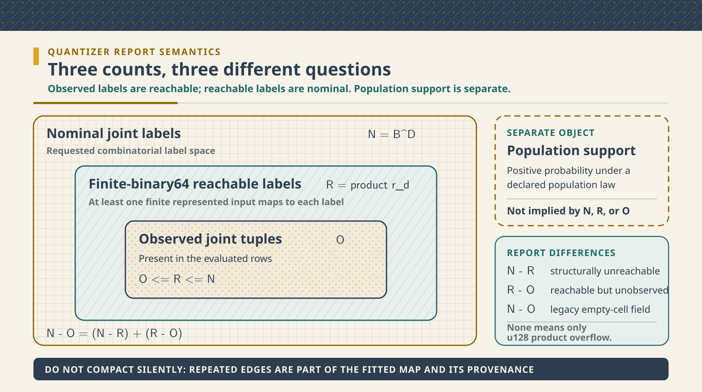

# Represented-Binary64 Assurance for PID Reconstruction and Quantization

## Status and claim boundary

This note documents a numerical-assurance change in pid-rs. It changes implementation arithmetic,
resource estimates, diagnostics, serialized reports, and some final binary64 bits. It does **not**
change a PID estimand, a redundancy definition, a lattice, a paper-defined formula, or the units
(all information quantities remain nats). It is not a claim that the published work of Williams
and Beer, Makkeh, Gutknecht and Wibral, or Ehrlich et al. is wrong.

The central distinction is:

> Exact reduction of already represented binary64 operands is not exact estimation.

The inputs to a reduction may already contain empirical-PMF error, finite-sample estimator bias,
logarithm rounding, probability rounding, product rounding, nearest-neighbour error, or model
misspecification. The implementation removes one narrower error source: dependence of a selected
sum on an incidental order of the same represented operands.

The work has four outcomes:

1. A private, order-independent binary64 reduction primitive.
2. Witnessed repairs to categorical SxPID final empirical-PMF averaging, categorical $I_{\min}$
   PID2 synergy, and continuous shared-exclusions PID2 synergy.
3. Overflow-safe fitted equal-width edges and diagnostics that distinguish nominal, reachable, and
   observed labels.
4. Explicit negative dispositions that block transfer of this arithmetic policy to pointwise SxPID
   Möbius inversion or $I_{\min}$ PID3 without retained defect evidence.

### How to read this document

This document keeps four layers separate:

1. **Mathematical object.** A PID functional, a PID reconstruction identity, or a fitted
   quantization map.
2. **Represented input.** A finite IEEE 754 binary64 bit pattern that approximates a mathematical
   value. A represented value is not the value before probability, logarithm, estimator, or prior
   floating-point rounding error.
3. **Arithmetic implementation.** The exact sum of the represented inputs, followed by one
   round-to-nearest, ties-to-even conversion back to binary64.
4. **Evidence.** Deductive algebra, bounded exact-oracle replay, empirical count-table witnesses,
   source-level tests, and build checks. These evidence classes answer different questions.

The main result concerns layers 2 and 3. It does not move an estimator error claim, a population
claim, or a PID interpretation from layer 1 into layer 3.

Sections 2 and 5 derive the arithmetic and reachability rules. Sections 3 and 4 show exactly where those rules are used. Sections 6 and 7
state cost and evidence. Sections 8--11 give the design alternatives, hostile review, applications,
nonclaims, and future work. Section 12 gives the primary references and exact repository routes.

### Object card, provenance, and novelty

| Field | Exact scope |
|---|---|
| Defining arithmetic standard | IEEE 754-2019 supplies binary64 formats and round-to-nearest, ties-to-even semantics. It does not define pid-rs's accumulator layout or prove the Rust code. |
| Classical numerical background | Exact or highly accurate summation with a wide accumulator is classical. Kulisch and Bohlender describe exact fixed-point accumulation followed by one rounding. Neal gives fast exact superaccumulator algorithms. Rump, Ogita, and Oishi analyze accurate floating-point summation. |
| PID sources | Makkeh--Gutknecht--Wibral define the categorical shared-exclusions functional. Williams--Beer define $I_{\min}$. Ehrlich et al. define the continuous shared-exclusions PID construction. KSG supplies the mutual-information estimator used in the continuous composition. These objects remain distinct. |
| Project-defined contribution | pid-rs selects a fixed 34-limb, two-magnitude binary64 reduction policy and applies it only at witnessed call sites. It adds quantizer-reachability diagnostics, resource contracts, and bounded positive and negative evidence. This is implementation, API, diagnostic, and assurance work. It is not claimed as a new summation theorem or a new PID measure. |
| Domain and units | Reducer inputs are finite binary64 values. PID outputs are in nats. Quantizer inputs are finite binary64 training and evaluation coordinates. |
| Open correspondence edges | There is no deductive Rust-to-mathematics refinement proof, no global elementary-function error theorem, no universal estimator guarantee, and no application-validity theorem. |

The primary references are listed in Section 12. A citation to a PID paper identifies the formula or
estimand only. It does not provide evidence for the project-defined accumulator, quantizer report,
resource bound, or API policy.

## 1. Why the change was needed

PID reconstruction and averaging formulas contain cancelling sums. In exact real arithmetic, the
order of addition does not matter. In binary64 arithmetic it can matter because each intermediate
operation rounds.

Reordering sources can reorder the weighted pointwise terms in an SxPID final
empirical-PMF average. It can also reorder the represented terms in a two-source synergy residual.
Either change can alter one or more last bits. That is undesirable when source exchange is part of
the formula-level symmetry.

The defect is numerical, not statistical and not a flaw in a defining paper. For a fixed empirical
table, the old final reductions could evaluate the same represented multiset through two different
floating-point association trees. Compensated summation greatly reduces ordinary error but does
not define an order-independent result for every cancelling input. This observation alone does not
justify changing every compensated sum: the repository requires retained evidence at the actual
call site.

The retained bounded pointwise SxPID suites establish only tolerance agreement. The larger raw-bit
SxPID and $I_{\min}$ PID3 probes were not retained. Neither route justifies a broader scalar
change.

Fitted equal-width quantization had a different boundary. The mathematical interpolation

$$
e_j = m + \frac{j}{B}(M-m), \qquad 0 \leq j \leq B,
$$

can encounter binary64 subtraction overflow when finite endpoints have opposite extreme signs.
At the other end of the scale, a requested partition can be finer than the representable values
between adjacent endpoints. The resulting repeated edges are not necessarily an implementation
failure, but treating all $B$ nominal labels as usable obscures the fitted map actually applied.

## 2. Exact reduction of represented operands

### 2.1 Integer model of every finite binary64 value

Every finite binary64 number is an integer multiple of $2^{-1074}$. The reducer decodes a finite
operand into its sign, 52 stored fraction bits, and exponent. A normal value contributes the hidden
leading bit. A subnormal does not. The resulting nonnegative integer significand is shifted into a
fixed unsigned limb array at the common $2^{-1074}$ scale.

Here is the bit-width calculation. The largest finite binary64 number is

$$
x_{\max}=(2-2^{-52})2^{1023}=(2^{53}-1)2^{971}.
$$

At the common $2^{-1074}$ scale, its integer magnitude is

$$
X_{\max}=x_{\max}2^{1074}=(2^{53}-1)2^{2045}.
$$

The highest set bit of $X_{\max}$ has zero-based index $2045+52=2097$. Thus one maximum finite
operand needs 2,098 bits. Let $w=\mathtt{usize::BITS}$. The accumulator rejects an operand once its
accepted-term counter reaches `usize::MAX`, and production collections cannot contain more than
`usize::MAX` elements.

Since $n<2^w$, the magnitude of either the positive or negative subtotal is
strictly less than $2^{2098+w}$. Therefore 2,098 base bits plus $w$ carry bits suffice. The compiled
array length is

$$
L = \left\lceil\frac{2098 + \mathtt{usize::BITS}}{64}\right\rceil = 34
$$

on supported 32- and 64-bit targets: both $\lceil2130/64\rceil$ and
$\lceil2162/64\rceil$ equal 34. Positive and negative magnitudes are stored separately. This avoids
a signed-integer minimum-value corner case and makes exact cancellation explicit. The bound is a
storage proof under the term-count premise. It is not a proof that every caller has enough time or
memory to approach that theoretical term count.

### 2.2 One correctly rounded result

Finalization compares the positive and negative integers, subtracts the smaller magnitude from the
larger, and rounds the exact signed difference once to binary64. It keeps the leading 53-bit
significand and evaluates the guard and sticky bits. A halfway case increments only when the
retained significand is odd, implementing round-to-nearest, ties-to-even.

More explicitly, let $D\geq0$ be the exact integer difference at scale $2^{-1074}$.

1. If $D=0$, return positive zero. This is a declared canonical-zero policy.
2. If $0<D<2^{52}$, the result is a subnormal and $D2^{-1074}$ is already exactly representable.
3. If $D\geq2^{52}$, let $k=\lfloor\log_2 D\rfloor$. Retain the leading 53 bits. If lower bits were
   discarded, compare them with half of one retained unit. A remainder below half rounds down. A
   remainder above half rounds up. At exactly half, select the candidate whose low retained bit is
   even.
4. If rounding carries out of the 53-bit significand, shift it right once and increase the
   exponent. If the result exceeds the binary64 finite range, return infinity at the primitive
   boundary. The later call-site policy is measure specific. The categorical SxPID averaging path
   and checked continuous PID2 constructor reject a non-finite result. Categorical $I_{\min}$ PID2
   has no separate post-reduction infinity check. For its admitted empirical law, the exact-real MI
   and redundancy coordinates lie between zero and $\log n$. Prior binary64 logarithm and reduction
   steps mean that the represented coordinates need not obey those exact endpoints bit-for-bit.
   The public path nevertheless rejects $n>2^{53}$, and every count product and finite logarithmic
   term is formed from positive counts bounded by $n$. Even a loose operation-level accumulation
   envelope is many orders of magnitude below the binary64 overflow boundary. Thus this admitted
   path cannot reach an infinite four-coordinate residual. That implementation-domain argument is
   not a generic primitive guard or a global estimator-error bound.
5. Apply the sign of the larger exact magnitude. Exact cancellation never returns negative zero.

Because $D$ is exact before step 3, only the final conversion rounds. Ordinary sequential,
pairwise, Kahan, or Neumaier summation rounds intermediate additions and therefore has a different
contract even when it is often accurate in practice.

For finite operands $x_1,\ldots,x_n$, the intended arithmetic contract is therefore

$$
\mathrm{reduce}(x_1,\ldots,x_n)
= \mathrm{RN}_{\mathrm{even}}\!\left(\sum_{i=1}^{n} x_i\right),
$$

where the sum inside the parentheses is the exact real sum of the **represented binary64
operands**. Permuting those operands cannot change the result. Exact cancellation is canonicalized
to positive zero. A non-finite input is rejected.

If the exact sum rounds beyond the finite binary64 range, the primitive returns infinity. Its
callers must then apply their own documented domain or fail-closed policy. The two current explicit
rejection sites are categorical SxPID final averaging and the checked continuous PID2 constructor.

This contract does not claim that an input $x_i$ equals the exact mathematical quantity it was
intended to approximate.

Figure 1 summarizes the boundary. The left side can contain statistical and earlier numerical
error. The middle fixed-point reduction removes only order-dependent addition error for the supplied
bit patterns. The right side is one correctly rounded binary64 value, not an exact PID estimate.


*Figure 1 — Scope of the exact-reduction result. Statistical estimation and earlier floating-point
evaluation occur before the boundary on the left. The accumulator then sums the supplied finite
binary64 operands exactly and rounds once, ties to even. The output is reproducible for those
represented operands; it is not thereby an exact value of the underlying PID functional.*

### 2.3 Bounded conformance oracle

The committed same-project generator uses only the Python standard library. It converts binary64
payloads to exact integers and `Fraction` values, forms the exact rational sum, and implements
ties-to-even binary64 rounding along a separate code route. The fixture includes generic
four-operand residual-shaped arithmetic cases as well as variable-arity streaming challenges at
lengths 0, 1, 2, 3, 5, 63, 64,
and 65. It covers signed
zero, subnormals, normal-boundary transitions, long carry chains, cancellation, halfway rounding,
overflow, and deterministic stress cases. Every four-operand case is tested under all 24
permutations. The 63--65-term cases are replayed in their original order, reverse order, and
one-position left and right rotations.

The generator does not import pid-rs. Normal and optimized-Python no-write runs verify the fixture
and its SHA-256 sidecar. A separate Rust custody test binds the live generator bytes to the pinned
snapshot. Rust replays every case through both the array helper and streaming accumulator.

There is no test-only switch that changes the production rounding rule. The Python expected-value
route decodes bit patterns to `Fraction`, sums exact rationals, and rounds with integer
quotient/remainder comparisons. A second common-$2^{-1074}$ integer representation must agree with
that exact rational sum before an expected payload is accepted. The Rust route instead decodes into
fixed limbs and uses guard/sticky-bit rounding.

The committed JSON stores inputs and expected bits. The no-write generator rebuilds those bytes and
fails if the corpus, digest sidecar, or frozen
generator snapshot differs. The Rust test then checks the digest, generator-source binding, exact
schema and counts, both array and streaming routes, and the declared permutations or rotations.

This separation makes a broad class of implementation errors observable. It does not make the
routes logically independent. Both routes implement the same human-written specification and
reside in the same repository. They can share a mistaken interpretation of IEEE 754.

A universal claim would require a deductive specification-to-Rust refinement or an equivalent
independently checked proof. That edge remains open rather than being hidden behind passing
fixtures.

This is finite-corpus implementation-conformance evidence. It is not a universal proof, a formal
Rust refinement theorem, an independent external review, or a numerical bound for a PID estimator.

## 3. Measure-specific applications without semantic transfer

### 3.1 Categorical shared-exclusions PID

Let $x=(s,t)$ be a supported joint source--target event of a finite categorical law. For a fixed
event $x$ and redundancy-lattice node $\alpha$, categorical SxPID has informative and
misinformative cumulative components. If $\beta\prec\alpha$ denotes a strict predecessor in that
same finite lattice, Möbius inversion has the exact-real form

$$
\pi_x^{\pm}(\alpha)
= I_{\cap,x}^{\pm}(\alpha)
-\sum_{\beta \prec \alpha}\pi_x^{\pm}(\beta).
$$

The pointwise Möbius inversion retains its established compensated reduction. pid-rs now averages
each already represented pointwise component over the supported events of one fixed empirical law
through

$$
\bar\pi^{\pm}(\alpha)
= \sum_x \widehat p(x)\,\pi^{\pm}_x(\alpha)
$$

using the exact represented-binary64 reducer. Each product
$\widehat p(x)\pi^{\pm}_x(\alpha)$ is already rounded before it enters the accumulator. Thus this
change makes the final sum of a fixed product multiset order independent. It does not change the
pointwise atom bits. The signed net remains informative minus misinformative and may be negative.
It is never clamped.

This is a project-defined arithmetic policy in pid-rs's evaluator of the paper-defined categorical
shared-exclusions functional. It does not change the paper's functional. It transfers no theorem,
interpretation, or atom value to Williams--Beer $I_{\min}$, BROJA, MMI, continuous shared
exclusions, or another PID.

#### Negative result: no promoted pointwise Möbius change

An earlier candidate also applied the exact reducer inside pointwise Möbius inversion. The three
pinned SxPID witnesses did not support that broader change. In each exact table, committed tests
map lattice keys under the named source exchange. They require mapped pointwise informative,
misinformative, and net payloads to be raw-bit identical. They exact-reduce only the historical
weighted pointwise terms, and that route reproduces each repaired averaged payload.

This is a three-table statement, not a general raw-bit theorem. The bounded general suites
deliberately use a floating tolerance and contain a signed-zero bit counterexample.

A temporary, uncommitted release-mode red-team probe then exercised the parent through public APIs.
Its executable and raw log were not preserved, so the counts below are an append-only historical
observation with **zero current release-evidence credit**. For every
table it compared every source transposition after mapping lattice keys, and compared informative,
misinformative, and derived-net pointwise payloads. The two- and three-source probes exercised both
specialized and general-$n$ paths. Four sources has only the general path. It found no witness in:

- SxPID2: all 43,757 nonempty binary count tables through total mass 10. The probe also used 200,000
  random binary tables and 50,000 random ternary tables through mass 128. Its `xorshift64` seeds were
  `0x2c125a22900d0001` and `0xb225239bef477c14`, respectively.
- SxPID3: all 20,348 nonempty binary count tables through total mass 5. The probe also used 75,000
  random binary tables and 10,000 random ternary tables through mass 96. Its seeds were
  `0x3c125a33900d0002` and `0xa225238aef477c17`, respectively.
- SxPID4: all 6,544 nonempty binary count tables through total mass 3. No random SxPID4 result is
  claimed because the unlogged phase was interrupted rather than retained as evidence.

In total, the unqualified run reported 405,649 tables, 194,865,076 mapped pointwise atom pairs, and
584,595,228 component payload comparisons. Those totals are not independently replayable and must
not appear in a qualification numerator.

The durable evidence is narrower. It includes tolerance-based bounded suites and exact raw-bit
assertions for the three named final-average witnesses. For the discarded probe, it retains only
partial seed, count, and source-scope notes. Those notes omit the executable, raw log, PRNG
recurrence, and complete table-generation algorithm, so they are not a replay recipe. The durable
record also retains the decision not to promote an unwitnessed change.

Pointwise Möbius inversion
therefore remains on the prior compensated path. This prevents unnecessary scalar churn and
prevents a general arithmetic capability from being mistaken for evidence that every
eligible-looking call site needed modification.

### 3.2 Williams--Beer $I_{\min}$ PID2

$I_{\min}$ is a different redundancy measure. Its two-source algebra uses

$$
U_1=I_1-R,\qquad U_2=I_2-R,
$$

and

$$
S=J-I_1-I_2+R,
$$

where all terms use the same finite categorical empirical law and natural logarithm. Here,
$I_1=I(S_1;T)$, $I_2=I(S_2;T)$, $J=I(S_1,S_2;T)$, and $R$ is Williams--Beer redundancy.
Only the four-operand represented synergy sum receives the new reduction contract. No
shared-exclusions axiom or interpretation is imported.

For every valid public call, each observed target must have a corresponding stored value in every
source table. The implementation returns `NumericalInstability` if a requested target key is
missing, its matching value is absent, or that value is non-finite.
It no longer silently substitutes zero. This changes no admitted result: the two-source
accumulation and the three-source Neumaier order remain identical. It is an implementation fail-closed repair, not an
observed estimator defect and not a correction to the Williams--Beer definition.

The three-source $I_{\min}$ Möbius path deliberately retains its earlier compensated reduction.
An uncommitted exhaustive search reported no $S_0\leftrightarrow S_1$ atom-bit witness among
245,156 nonempty binary count tables through total mass seven. An internal release-mode red-team
probe used exact source commit `01466e88b0550333c2718f1716289e9642e30dc6`. It evaluated 200,000
additional valid binary tables with totals uniformly selected from 8 through 512. It compared every
table under all three source transpositions.

The probe used four 50,000-case `xorshift64` streams. Their seeds were `0x4f035cfaa1c89380`,
`0x3c5f333ec24fa33f`, `0xedab1672e4c2b2aa`, and `0xdae7ecb60541c241`. Two of every three
iterations used uniform `raw & 15` cell selection. The remaining iterations used an intentionally
uneven restricted-cell mapping. The probe found no mismatch for $S_0\leftrightarrow S_1$,
$S_0\leftrightarrow S_2$, or $S_1\leftrightarrow S_2$.

Neither executable nor raw log was retained, so both totals have zero current release-evidence
credit. They are preserved only as unqualified historical observations. They do not prove global
bit equivariance or rule out a larger witness. The durable conclusion is conservative. Current
retained evidence does not justify changing stable $I_{\min}$ PID3 scalar bits merely because a
measure-neutral arithmetic primitive exists.

### 3.3 Continuous shared-exclusions PID2

Continuous PID2 uses the Ehrlich-et-al. shared-exclusions redundancy estimate and three separately
estimated KSG mutual-information coordinates. Its represented synergy is now defined as

$$
S_{64}=\mathrm{RN}_{\mathrm{even}}
\bigl(\mathrm{exact}(J_{64}-I_{1,64}-I_{2,64}+R_{64})\bigr).
$$

The formula assumes all four inputs are finite and belong to one declared PID2 construction. The
subscript emphasizes that they are already represented binary64 estimates. The exact real PID2
identities are $R+U_1=I_1$, $R+U_2=I_2$, and $R+U_1+U_2+S=J$. The implementation checks their
represented-coordinate reconstructions under the project guard described below. The change does
not remove distinct finite-sample biases, validate a support declaration, or turn the estimator
into an exact-real PID.

`Pid2Result::from_estimate` also reconstructs the supplied $I_1$, $I_2$, and $J$ coordinates from
the separately rounded atoms. All three reconstructed sums use the exact represented-input reducer.
The $I_1$ and $I_2$ reconstructions each use two atom operands. The $J$ reconstruction uses four,
and the synergy reduction uses four. Thus construction performs four reductions over 12
represented addends.

Exact reduction can change whether the public constructor admits or rejects a tuple. It fails
closed if any reconstruction lies outside an inclusive 32-position ordered-binary64 guard. This
inherited project policy is not a derived identity, representability, forward-error, conditioning,
relative-accuracy, or statistical bound. Against a reconstructed positive zero, its near-zero
boundary accepts positive-subnormal payload 32 and rejects payload 33. Because the ordered mapping
distinguishes signed zeros, it accepts negative payload 31 and rejects negative payload 32.

Accepted boundary cases have complete relative loss. The guard must therefore not be presented as
verified identity or representability. Synergy is not perturbed to conceal rounding in the two
unique atoms.

This threshold's 32 ordered-binary64 **positions** is unrelated to the KSG integer-harmonic
fixture's separate `32 * f64::EPSILON`-**nat** finite-corpus ceiling. They measure different
objects, use different units, and provide no evidence for one another.

Revision-4 assurance closes the declared exponent family rather than retaining a single scaling
example. There are 1,023 distinct finite seed tuples, indexed by `k = 1,...,1023`. Every seed is
accepted, and exact multiplication of all four represented coordinates by its corresponding
power of two maps it to the same finite-input endpoint whose atom reconstruction overflows and is
rejected. The `k = 4` member is the named multiplication-by-16 example. This proves that the
project compatibility policy is not homogeneous under that synthetic represented-coordinate
scaling family. It does **not** prove a scale defect in a PID measure, a valid probability-law or
source-coordinate transformation, an estimator-level gauge result, or a defect in Ehrlich et al.

The complete assumptions, exact bit patterns, symbolic family derivation, representative cases,
signed-zero census, conditioning branches, Neumaier and left-association negative controls, cost,
host/API expectations, verification layers, and nonclaims are in
[`PID2_REPRESENTED_COORDINATE_ASSURANCE.md`](https://github.com/sepahead/pid-rs/blob/main/PID2_REPRESENTED_COORDINATE_ASSURANCE.md). The earlier
bounded search that found no Neumaier discriminator remains useful negative historical evidence;
the exact counterexamples now supersede only its absence-of-witness conclusion. They do not turn
that bounded search into a general statement about Neumaier summation.

## 4. Reproducible counterexamples

Sections 4.1--4.3 use binary flat count tables in the lexicographic convention below. Section 4.4
starts from paired categorical rows, which induce an empirical count law, and then gives separate
binary flat-count boundary witnesses under the same convention. Section 4.5 is deliberately
different: it is a represented-coordinate public-constructor tuple, not retained estimator output.

For a binary $k$-source table, every variable has alphabet $\{0,1\}$. Write the generic sources as
$s_0,\ldots,s_{k-1}$ and the target as $t$. The count at flat index

$$
i=2^k s_0+2^{k-1}s_1+\cdots+2s_{k-1}+t
$$

is the number of rows with state $(s_0,\ldots,s_{k-1},t)$. In the two-source table below, $s_0$ is
named $S_1$ and $s_1$ is named $S_2$. Thus `[c0,...,c7]` means

| Flat index | $(S_1,S_2,T)$ | Count |
|---:|---:|---:|
| 0 | $(0,0,0)$ | `c0` |
| 1 | $(0,0,1)$ | `c1` |
| 2 | $(0,1,0)$ | `c2` |
| 3 | $(0,1,1)$ | `c3` |
| 4 | $(1,0,0)$ | `c4` |
| 5 | $(1,0,1)$ | `c5` |
| 6 | $(1,1,0)$ | `c6` |
| 7 | $(1,1,1)$ | `c7` |

The empirical joint PMF is $\widehat p(s_0,\ldots,s_{k-1},t)=c_i/n$, where
$n=\sum_i c_i>0$. The categorical examples therefore start from exact nonnegative integer counts.
Probabilities, logarithms, pointwise values, products, and output atoms are subsequently represented
in binary64. A source exchange is a bijective coordinate relabeling with the corresponding lattice
key map. It preserves $n$ and cell masses after that map, but the coordinate labels themselves do
change.

For the displayed redundancy-lattice keys, a nonzero integer mask denotes the source subset whose
bit positions are set: source $S_i$ corresponds to bit $i$. A brace-delimited set of masks is one
antichain. For example, under $S_0\leftrightarrow S_1$, mask 1 maps to 2 and mask 6 (sources 1 and
2) maps to mask 5 (sources 0 and 2). This convention makes the key maps in Sections 4.2 and 4.3
directly checkable.

### 4.1 Two-source categorical SxPID

For cells $(S_1,S_2,T)$, use

```text
[0, 1, 1, 1, 2, 1, 5, 1]    n = 12
```

Thus the input alphabet is $S_1,S_2,T\in\{0,1\}$ and, for example, the table contains five
observations of $(1,1,0)$ and one of $(1,1,1)$. The output discussed below is one averaged
signed-net synergy atom in nats. It is not a class prediction or a probability.

Before the repair, source exchange changed the **averaged** synergy net from hexadecimal payload
`0x3fb41d4d04f468e3` to `0x3fb41d4d04f468e4`. The repaired specialized and general paths, with and
without pointwise retention, all select `0x3fb41d4d04f468e3` for the exact sum of the represented
weighted pointwise terms. The mapped pointwise atoms were already bit-identical for this table.

The seven weighted informative operands, in the original event order, are

```text
3fad9303fea2f7e9 3f988c82c19bcf6e 3f988c82c19bcf6e 3f9f1dc017db7340
3f8f1dc017db7340 3fa28ffb38cabfc8 3f7db32b8e1132d9
```

The corresponding weighted misinformative operands are

```text
3f988c82c19bcf6c bc55555555555555 3f988c82c19bcf6c bc65555555555555
3f988c82c19bcf6c 3f94d12fdf1fa69e 3f988c82c19bcf6c
```

Each token is the hexadecimal payload of the already rounded product
$\widehat p(x)\pi_x^{\pm}$. Source exchange swaps the second and third source-state blocks,
$(S_1,S_2)=(0,1)$ and $(1,0)$, while preserving target order within each block. The
exchanged informative sequence is

```text
3fad9303fea2f7e9 3f9f1dc017db7340 3f8f1dc017db7340 3f988c82c19bcf6e
3f988c82c19bcf6e 3fa28ffb38cabfc8 3f7db32b8e1132d9
```

The exchanged misinformative sequence is

```text
3f988c82c19bcf6c bc65555555555555 3f988c82c19bcf6c bc55555555555555
3f988c82c19bcf6c 3f94d12fdf1fa69e 3f988c82c19bcf6c
```

For the original misinformative order, historical Neumaier accumulation ends with running sum
`0x3fbdc0ceb963b913` and correction `0xbc5fffffffffffff`. Their rounded addition remains
`0x3fbdc0ceb963b913`. In the exchanged order, its final running sum is also
`0x3fbdc0ceb963b913`, but correction `0xbc60000000000000` rounds the historical result down to
`0x3fbdc0ceb963b912`. Exact reduction of either misinformative multiset gives
`0x3fbdc0ceb963b913`. Both informative orders give exact result `0x3fc8ef0ddf2c10fb`.
Subtracting exact informative minus exact misinformative produces the repaired net
`0x3fb41d4d04f468e3`.

The executable fixture uses this test identifier, shown with one typographic line break:

```text
pinned_two_source_average_is_
bit_equivariant_after_source_swap
```

Remove the line break to obtain the Rust identifier in
`crates/pid-core/tests/sxpid_nsource.rs`. The test constructs both labeled tables from these counts and
maps the lattice key. It compares every retained pointwise component, reconstructs the historical
weighted terms, and checks both production routes. The trace above is self-contained for the final
reduction defect. The test remains the authoritative executable route from counts through
logarithms and every Möbius predecessor.

### 4.2 Three-source categorical SxPID

For cells $(S_0,S_1,S_2,T)$, use

```text
[4, 0, 3, 2, 1, 1, 0, 4,
 0, 0, 1, 1, 3, 4, 0, 0]    n = 24
```

The line break is typographic. The two lines form one 16-entry vector. All four alphabets are
$\{0,1\}$. The output key identifies one node of the 18-node three-source
redundancy lattice. The hexadecimal values are exact binary64 payloads of averaged informative,
misinformative, and signed-net atom coordinates in nats.

Under $S_0\leftrightarrow S_1$, averaged atom key $\{1,6\}$ maps to $\{2,5\}$. The repaired
informative, misinformative, and net payloads on both sides are

```text
0x3fa3b0124a6b77db  0x3f8a61d97c813f4d  0x3f9a2f37d6965010
```

The historical informative payload was already `0x3fa3b0124a6b77db` on both sides. The historical
misinformative payload changed from `0x3f8a61d97c813f4c` to `0x3f8a61d97c813f4d`. Both historical
net subtractions rounded to `0x3f9a2f37d6965010`. Exact averaging selects the latter
misinformative payload for both mapped coordinates and preserves the net.

The executable fixture uses this test identifier, shown with one typographic line break:

```text
pinned_three_source_average_components_
are_bit_equivariant_after_source_swap
```

Remove the line break to obtain the Rust identifier in
`crates/pid-core/tests/sxpid_nsource.rs`. The test recomputes the 18-node result from the declared flat
table, maps every key under the exchange, and pins the three represented outputs above. The table,
formula in Section 3.1, key map, and named test are the reproducibility route. They do not replace a
general source-symmetry proof.

### 4.3 Four-source categorical SxPID

For cells $(S_0,S_1,S_2,S_3,T)$, use

```text
[4,4,3,1,1,4,5,0,
 5,3,2,0,0,1,1,2,
 3,1,3,0,3,2,3,4,
 0,2,5,4,3,2,3,1]
n = 75
```

The line breaks are typographic. The four lines form one 32-entry vector. All five alphabets are
$\{0,1\}$. The output key identifies one node of the 166-node four-source
redundancy lattice. This example is an arithmetic source-exchange witness, not a claim that a
166-node result is statistically estimable from 75 observations.

The averaged atom $\{1,4,10\}$ maps to $\{2,4,9\}$ under $S_0\leftrightarrow S_1$. Before repair,
source exchange changed the mapped misinformative payload from `0x3f721964bc3d4223` to
`0x3f721964bc3d4222` and the net from `0x3f316092e5b5f2a0` to `0x3f316092e5b5f2b0`. The repaired
values on both sides are

```text
informative     0x3f732f6dea98a14d
misinformative  0x3f721964bc3d4223
net             0x3f316092e5b5f2a0
```

The executable fixture uses this test identifier, shown with one typographic line break:

```text
pinned_four_source_average_components_
are_bit_equivariant_after_source_swap
```

Remove the line break to obtain the Rust identifier in
`crates/pid-core/tests/sxpid_nsource.rs`. The test recomputes all 166 nodes from the declared counts,
applies the named key map, and checks the informative, misinformative, and derived-net payloads.
This is an exact implementation witness over one empirical table, not a sample-size claim or a
general theorem about the paper functional.

### 4.4 Two-source categorical $I_{\min}$

Use the twelve rows

```text
S1 = [2,1,0,2,0,0,
      2,1,0,2,1,0]
S2 = [2,2,3,2,1,1,
      0,3,3,2,2,0]
T  = [2,0,1,0,2,0,
      0,1,2,2,1,0]
```

Each wrapped pair forms one 12-entry row vector. Here $S_1\in\{0,1,2\}$,
$S_2\in\{0,1,2,3\}$, and $T\in\{0,1,2\}$ on the observed rows. The input is
the twelve paired categorical observations, not a binary flat count table. The output is the seven
field tuple $(R,U_1,U_2,S,I_1,I_2,J)$ in nats. Source exchange must preserve $R$, $S$, and $J$,
swap $(U_1,U_2)$ and $(I_1,I_2)$, and preserve row pairing and empirical masses under the
coordinate map $(s_1,s_2,t)\mapsto(s_2,s_1,t)$. The labeled triple multiset need not be literally
unchanged; this witness even uses different observed alphabets for $S_1$ and $S_2$.

The pinned payloads in result-field order
$(R,U_1,U_2,S,I_1,I_2,J)$ are

```text
3fcb65a8c841cbb6 3fa14cc29dd51034 3fc31cb2a6c6c002 3fc65cf895b1f81f
3fcfb8d96fb70fc3 3fd7412db78445dc 3fe24ca12b0bf1f9
```

Before repair, source exchange changed the mapped synergy from `0x3fc65cf895b1f81e` to
`0x3fc65cf895b1f81f`. The repaired result selects the latter payload on both sides, preserves every
symmetric coordinate bit-for-bit, and swaps only the two unique coordinates.

More explicitly, the historical original association was

$$
\mathrm{fl}\!\left(
  \mathrm{fl}\!\left(\mathrm{fl}(J-I_1)-I_2\right)+R
\right)
=\mathtt{0x3fc65cf895b1f81e}.
$$

After source exchange it evaluated the equally valid exact-real association with $I_1$ and $I_2$
reversed and returned `0x3fc65cf895b1f81f`. The exact reducer instead sums the same represented
multiset $\{J,-I_1,-I_2,R\}$ and rounds once to `0x3fc65cf895b1f81f` in both orders. The test
`categorical_imin_pid2_pinned_synergy_is_bit_equivariant_under_source_swap` in
`crates/pid-core/tests/imin.rs` starts from the twelve rows, recomputes all seven fields, and checks
this complete association trace.

The retained boundary suite additionally enumerates all 12,869 nonempty binary
$(S_1,S_2,T)$ count tables of total mass one through eight. Exact rational-product comparison finds
5,070 target-specific minimum-tie events—that is, supported `(table, target-value)` pairs, not
5,070 distinct tables—split by total mass as

```text
8, 36, 104, 230, 464, 800, 1,344, 2,084
```

The split is symmetric, with 2,535 tie events for each target value. All seven public scalar fields
are bitwise source-exchange equivariant on that bounded census.

The suite retains three fully specified binary flat-count witnesses:

- CE-003, `[0,0,0,1,1,2,3,0]`, is an exact target-specific minimum tie. It confirms that no
  internal argmin or tie field is public.
- `[0,0,0,1,1,0,0,2]` is a separate minimal exact-zero and source-exchange witness. The historical
  residual gave `0x3c70000000000000` in the original order and positive zero after exchange. The
  repaired result is positive zero in both orders. Direct, budgeted, cancellable, fitted-quantized,
  and same-sample wrappers agree on this minimal witness.
- `[0,0,0,1,1,1,2,3]` has total mass eight and exact exponentiated synergy ratio
  $\exp(8S)=823543/800000>1$. Because the exponential function is strictly increasing and
  $\exp(0)=1$, this implies $8S>0$ and therefore $S>0$.

The minimal wrapper agreement and historical negative control use this identifier, shown with one
typographic line break:

```text
minimal_source_swap_witness_uses_exact_
represented_sum_without_clamping
```

The separate exact-ratio sign certificate uses:

```text
genuine_small_positive_synergy_is_not_
clamped_to_zero
```

Remove each line break to obtain the Rust identifier. Both tests are in
`crates/pid-core/tests/imin_numerical_boundary.rs`.

These are finite implementation results. The census does not expose or certify an internal argmin
choice. It does not exhaust larger alphabets or counts, bound elementary-function error globally,
or establish population behavior.

These witnesses establish that the repaired cases were real. They do not establish a universal
floating-point theorem for every atom, estimator, build, platform, or source permutation.

### 4.5 Continuous PID2 represented-coordinate/API witness

The continuous PID2 arithmetic repair also has a public-constructor witness, but not a retained
dataset whose Ehrlich/KSG estimator calls emitted these coordinates. Let

```text
small = f64::from_bits(0x3fb5bf406b543dad)
large = f64::from_bits(0x3fe1fea645f0ef4e)
```

and call `Pid2Result::from_estimate` first with

$$
(I_1,I_2,J,R)=(\mathtt{small},\mathtt{large},\mathtt{large},\mathtt{small}),
$$

then with the first two coordinates exchanged. The historical left-associated synergy produced
`0x3c70000000000000` for the first order and positive zero for the second. Exact reduction of the
same four represented operands produces positive zero for both. This establishes a reachable
constructor-level source-order defect and its algebraic repair. It does not establish how often an
Ehrlich/KSG estimator pipeline emits such a tuple, nor validate that estimator.

The intermediate binary64 operations make the defect explicit. In the first order,

```text
fl(large - small) = 0x3fde8d7c710ccf31
fl(previous - large) = 0xbfb5bf406b543dac
fl(previous + small) = 0x3c70000000000000
```

In the exchanged order,

```text
fl(large - large) = 0x0000000000000000
fl(previous - small) = 0xbfb5bf406b543dad
fl(previous + small) = 0x0000000000000000
```

As exact real numbers, the represented operands satisfy
$\mathtt{large}-\mathtt{small}-\mathtt{large}+\mathtt{small}=0$. The exact reducer therefore returns
canonical positive zero for either permutation. The integration test
`pid2_checked_constructor_kills_represented_coordinate_source_order_residual` in
`crates/pid-core/tests/pid2.rs` pins both historical final outputs and both repaired final outputs.

The intermediate payloads above are direct evaluations of the displayed left-associated operations.
The test does not assert each intermediate separately. Python does not expose
`Pid2Result::from_estimate` or its 32-position reconstruction guard. Therefore no Python parity
claim is made for this constructor witness.

## 5. Binary64-aware equal-width quantization

### 5.1 Edge construction

Let finite represented training endpoints satisfy $m\leq M$, and let the requested bin count be an
integer $B\geq2$. The implementation first branches on binary64 numeric equality. If $m=M$, it
fills all $B+1$ edges
with the payload of $m$ and then assigns the endpoints directly, $e_0=m$ and $e_B=M$. This includes
the signed-zero case: total-order fitting can select $m=-0.0$ and $M=+0.0$, even though they compare
numerically equal. No interpolation is evaluated in this branch.

If $m<M$, let $j\in\{1,\ldots,B-1\}$. The ideal real interpolation fraction is $t_j^*=j/B$, but
the implementation does not evaluate that exact-real expression. It converts $j$ and $B$ to
binary64 and divides them:

$$
t_{j,64}=\mathrm{fl}\!\left(\frac{\mathrm{f64}(j)}{\mathrm{f64}(B)}\right).
$$

Here, $\mathrm{fl}$ denotes the represented result of the stated binary64 operation. Endpoints are
assigned directly. The interpolation helper also checks the **represented** fraction before any
subtraction. If $t_{j,64}=0$, it returns $m$. If $t_{j,64}=1$, it returns $M$. An interior exact
fraction can reach an endpoint after integer-to-binary64 conversion when the integer inputs exceed
binary64's exact-integer range, even if resource preflight makes the corresponding edge allocation
impractical.

Only when $0<t_{j,64}<1$ does the implementation compute
$d_{64}=\mathrm{fl}(M-m)$. When $d_{64}$ is finite, it uses

$$
c_{64}=\mathrm{fl}\!\left(m+\mathrm{fl}(t_{j,64}d_{64})\right).
$$

If the subtraction overflows, which requires a sufficiently wide opposite-sign interval, it uses

$$
u_{64}=\mathrm{fl}(1-t_{j,64}),\qquad
c_{64}=\mathrm{fl}\!\left(\mathrm{fl}(m u_{64})+\mathrm{fl}(M t_{j,64})\right).
$$

A finite $c_{64}$ is clamped to $[m,M]$ to absorb harmless last-bit overshoot. Every stored edge
must be finite, in range, and nondecreasing. Failure returns a typed numerical error. This is a
stable sequence of binary64 operations. It does not claim that every interior edge is the correctly
rounded value of the ideal real interpolation $m+t_j^*(M-m)$.

### 5.2 Exact map-reachability test

When $m<M$, the transform gives $m$ label 0 and $M$ label $B-1$. For $m<v<M$, it uses the half-open partition
$[e_j,e_{j+1})$. Therefore the endpoint labels are reachable whenever $m<M$. An interior label
$j\in\{1,\ldots,B-2\}$ is reachable exactly when

$$
\bigl(e_j>m\ \mathrm{and}\ e_j<e_{j+1}\bigr)
\quad\mathrm{or}\quad
\bigl(e_j=m\ \mathrm{and}\ \mathrm{nextUp}(m)<e_{j+1}\bigr).
$$

The second branch matters because $v=m$ is intercepted by the endpoint rule. If the next
representable value is already $e_{j+1}$, the half-open interval contains no admissible binary64
value. Subtraction-based width tests would lose precisely this adjacent-value case.

For a constant numeric range, including the numerically equal signed-zero pair, only label 0 is
reachable. Signed `-0.0` and `+0.0` are counted as distinct stored edge payloads but compare as one
numeric value for partitioning.

### 5.3 Nominal, reachable, and observed cardinality

For a fitted report with $D\geq1$ dimensions and integer $B\geq2$ requested bins per dimension,
define

$$
N=B^D,\qquad R=\prod_{d=1}^{D}r_d,\qquad O=\text{observed joint label tuples},
$$

where $r_d$ is the exact finite-binary64 reachable-label count of dimension $d$. The transform
ensures $0\leq O\leq R\leq N$ when the two products are representable in `u128`. Under those
conditions, the report gives

$$
\text{structurally unreachable}=N-R,
$$

$$
\text{unobserved reachable}=R-O,
$$

and preserves the legacy field

$$
\text{empty joint cells}=N-O=(N-R)+(R-O).
$$

`None` means only that the relevant product overflowed `u128`. An impossible subtraction is an
error. Reachability is a property of the fitted finite-binary64 map. It is not population support,
positive probability, joint-law support, or evidence that a sample or bin count is adequate.

Figure 2 shows the three nested counts. A nominal label can be structurally unreachable because no
finite binary64 value maps to it. A reachable label can still be unobserved in the evaluated rows.
Only the observed set is populated by those rows, and none of the three sets is a population-support
claim.



*Figure 2 — Three finite-sample cardinalities for one fitted quantizer. Nominal labels are requested
by the configuration, reachable labels have at least one finite binary64 preimage under the fitted
map, and observed labels occur in the evaluated rows. None of these finite sets establishes the
support of the population distribution.*

### 5.4 Boundary examples

- A constant range with $B=4$ has four nominal labels, one reachable label, and three structurally
  unreachable labels.
- Training on `[-0.0, +0.0]` has two distinct endpoint payloads but one numeric range and one
  reachable label.
- With $B=4$ and two adjacent binary64 endpoints, only labels 0 and 3 are reachable.
- With $B=4$ and endpoints two representable steps apart, fitted edges can be
  $[m,m,\mathrm{nextUp}(m),M,M]$. The reachable set is noncontiguous: $\{0,2,3\}$.
- For `m=0x7feffffffffffffd`, `M=0x7feffffffffffffe`, $B=7$, and $j=3$, the historical convex
  association rounded to `0x7feffffffffffffc`, one representable value below the training minimum.
  The difference-first path returns $m$ and the range/monotonicity validation pins that repair.
- Training on `[-f64::MAX, f64::MAX]` with 100 bins now produces finite monotone edges through the
  convex fallback, including an exact positive-zero centre edge.

No automatic compaction is performed. Compacting labels would change the serialized transform and
could hide that the requested quantizer exceeded the available binary64 resolution.

## 6. Cost and latency

The reducer has fixed $L=34$ limbs. One accumulator holds a positive and negative array with a
544-byte limb payload plus one `usize` accepted-term counter. SxPID retains these accumulators.
Its public preflight charges their compiled `size_of` value. The scalar $I_{\min}$ PID2 and
continuous PID2 reducers are short-lived stack values. Their public `estimated_bytes` fields do not
separately charge that stack storage.

A worst-case add is charged as at most $2L=68$ limb visits. Finalization is charged as at most
$4L=136$ limb visits for comparison, subtraction, leading-bit search, and sticky-bit scan. These
are conservative resource-accounting envelopes, not CPU-instruction counts. Continuous PID2
construction charges the synergy and three reconstruction reductions as 12 adds and four
finalizations. The resulting envelope is $12\cdot68+4\cdot136=1{,}360$ limb visits.

The repository also carries full-call Criterion benchmarks for categorical $I_{\min}$ PID2 and
averaged categorical SxPID at two, three, and four sources. A local `--quick` observation on
2026-08-24 used an Apple M4 Max, macOS 26.5.1, release mode, and Rust 1.97.1:

In this table, $q$ is the common alphabet size used by the synthetic fixture for each source and
the target. It is not an inferred support size or a general complexity parameter.

| Call and fixture | Criterion interval |
|---|---:|
| $I_{\min}$ PID2, $n=128$, $q=4$ | 66.165--66.964 $\mu$s |
| SxPID2 averaged, $n=128$, $q=4$ | 92.461--94.463 $\mu$s |
| SxPID3 averaged, $n=64$, $q=2$ | 186.10--189.04 $\mu$s |
| SxPID4 averaged, $n=32$, $q=2$ | 5.3102--5.3168 ms |
| Quantizer labels only, $n=100{,}000$, $d=4$, $B=256$ | 2.8014 ms median |
| Quantizer with report, same fixture | 26.250 ms median |

These are machine-specific smoke observations of the whole calls, not portable latency promises,
not isolated exact-reducer overhead, and not a statistically adequate performance study. Their raw
Criterion output and exact dirty-worktree source identity were not retained, so they receive zero
release-qualification credit.

Reproduce or supersede the categorical rows with
`cargo bench --locked -p pid-core --all-features --bench estimators -- categorical_pid_latency`.
Use the same command with `equal_width_quantizer_transform` for the two quantizer rows. Run both on
deployment hardware. The order-of-magnitude jump at four sources is consistent with the
166-node lattice and event scans. It must not be attributed solely to the exact accumulator.

For $0\leq n\leq\mathtt{usize::MAX}$ finite operands, add-plus-finalize time is $O((n+1)L)$ with
fixed $L$: additions cost $O(nL)$ and finalization costs $O(L)$, including the empty input. For
$n\geq1$, this is $O(nL)$. The constant is larger than for ordinary or Neumaier addition. SxPID
retains two averaged accumulators per lattice node.

On the audited 64-bit target, the two 34-limb arrays occupy 544 bytes. The `usize` counter occupies
eight bytes, and the compiled accumulator size is $A=552$ bytes. Two accumulators at each of $N_L$
nodes therefore occupy $2N_LA$. The public
preflight uses the actual compiled `size_of` value, so another target need not use this table.

| Sources | Lattice nodes $N_L$ | Audited 64-bit accumulator storage $2N_LA$ |
|---:|---:|---:|
| 2 | 4 | 4,416 bytes |
| 3 | 18 | 19,872 bytes |
| 4 | 166 | 183,264 bytes |

This does not include atoms, pointwise output, histograms, keys, or vector headers, all of which are
covered separately by public resource preflight. The 166-node four-source lattice and empirical
event scans can dominate the measured full calls, but the unretained observation cannot allocate
their runtime among causes. The change is not a free optimization. Callers with strict ceilings may
need to raise memory or operation budgets.

Assume that a retained quantization report's checked byte arithmetic does not overflow. Let $E$ be
the total number of stored edges. Let $C$ be the number of edge vectors. Let $D_r$ be the total length
of its four diagnostic vectors, and let $S$ be the UTF-8 byte length of the scaling description.
Report-copy preflight charges

$$
H=C\,\mathrm{sizeof}(\mathrm{Vec}\langle f64\rangle)
  +E\,\mathrm{sizeof}(f64)+D_r\,\mathrm{sizeof}(usize)+S
$$

heap bytes and $O_r=E+D_r+S$ copy-work units. It uses actual vector lengths, not the report's
nominal `dimensions` field. Fitted-quantized $I_{\min}$ and SxPID preflights sum $H$ and $O_r$ for
every retained source and target report. Their different inline/`Vec` report containers are
charged separately.

For an ordinary $d$-dimensional transform with $B$ requested bins, the quantizer additionally
holds $O(dB)$ transient observed-label flags. Its conservative operation hint charges a $2E$
structural-diagnostic envelope. It charges another $E$ units for the retained edge copy. It adds
$6d$ units for four diagnostic-vector writes and two cardinality passes. It also adds $S$ units for
the scaling-string copy. These additions sit beside the pre-existing $O(nd)$ labeling, hashing,
sorting, and occupancy terms.

These are declared accounting units, not CPU instructions or latency predictions.

No new statistical estimator is required. The work changes arithmetic and diagnostics around
existing estimators. Fast ecosystem paths can choose among:

- categorical $I_{\min}$ PID2, whose synergy uses one four-term exact residual with small fixed
  cost,
- averaged categorical SxPID2, whose four-node lattice uses exact final accumulators and a separately
  declared resource budget rather than one four-term residual,
- pre-fitted quantizers reused across batches, avoiding repeated fitting, and
- bounded resource configurations that reject a workload before allocation.

The stable Rust `transform` call is now a genuine labels-only execution path. It preserves the
same validation and conservative report-sized budget admission as `transform_with_report`. It uses
the same bin-assignment helper, out-of-range errors, cancellation contract, and categorical output.
After admission, it skips occupancy sorting, diagnostic vectors, edge/scaling copies, and
provenance hashes.

On the local fixture above that was about 9.37 times faster, or 89.3% lower latency. This is not a
portable speedup guarantee. Stable Python intentionally continues through the report path so its
provenance fields are not silently lost.

An optional fast-but-order-dependent mode was rejected because it would make scientific output
depend on an undocumented arithmetic policy. If future profiling shows a material bottleneck, a
new optimized reducer must preserve the same represented-input result and pass the same oracle and
source-exchange witnesses.

## 7. Testing and evidence layers

The assurance stack deliberately separates different questions:

1. **Arithmetic corpus:** 561 oracle cases: all positional permutations for arities through five,
   plus original, reverse, and two rotations for the 63--65-term streaming cases.
2. **Reachable empirical witnesses:** pinned SxPID2, SxPID3, and SxPID4 final-average defects plus
   one $I_{\min}$ PID2 synergy defect. A separate continuous PID2 witness occurs at the
   represented-coordinate API boundary. No retained estimator dataset emitted that witness.
3. **Negative promotion disposition:** retained bounded pointwise suites establish tolerance
   agreement, not a general raw-bit nonfinding. The three named categorical witnesses now carry
   exact mapped pointwise-bit assertions. Larger reported raw-bit probe totals remain unqualified
   history with zero release-evidence credit because their executable and raw log were lost.
4. **Bounded exhaustive agreement:** every binary SxPID2 count table through four samples and every
   binary SxPID3 table through three samples, including source exchange.
5. **Quantizer boundary tests:** constants, signed zero, adjacent values, noncontiguous reachable
   labels, opposite extremes, and `u128` cardinality overflow.
6. **API parity:** Rust serialization, Python classes/stubs, immutable NumPy labels, and ordinary
   and boundary-case Python tests.
7. **Resource/cancellation tests:** preflight includes accumulator/report storage and long loops
   remain cooperatively cancellable.
8. **Build diversity required at final source:** stable, no-default-feature, parallel, all-feature,
   and release-mode gates. Earlier local passes do not qualify a later integrated source. Terminal
   final-source evidence remains a release-closure obligation.

Passing one layer does not imply another. In particular, a rational arithmetic oracle does not
validate a paper correspondence, population support, neighbour geometry, estimator consistency,
or an application decision.

## 8. Design alternatives and fifty-lens council

Enumeration and council agreement are design-review tools, not mathematical evidence. The exact
sum contract, bit-width argument, count-table witnesses, and bounded oracle each retain their own
evidence status. Reviewer preference does not change that status.

### 8.1 Twelve materially distinct routes considered

| Route | Benefit | Decisive limit or disposition |
|---:|---|---|
| 1. No change | Zero migration cost and no output-bit churn. | Rejected at the retained source-exchange witnesses for SxPID final averaging and the two-source residuals. Retained at unwitnessed pointwise SxPID and $I_{\min}$ PID3 sites. |
| 2. Keep Neumaier everywhere | Low overhead and good usual accuracy. | Rejected as the repair for witnessed sites because compensation does not define one result for every permutation of a cancelling represented multiset. |
| 3. Sort by value, then compensate | A canonical order can improve reproducibility. | Rejected. Sorting adds $O(n\log n)$ work, signed-zero/NaN policy, and still rounds at each addition. It does not implement the stated one-round result. |
| 4. Fixed pairwise tree | Deterministic and parallel-friendly for a fixed indexed input. | Rejected as a source-exchange repair because exchanging sources can change the index order, and a rounded tree is not permutation invariant. |
| 5. Kahan instead of Neumaier | Another established compensated route. | Rejected for the same contract mismatch as route 2. Neither method gives an exact represented-input sum for all orders. |
| 6. Arbitrary-precision rational production sum | Direct exact-real representation of the binary64 operands. | Rejected for routine calls because dynamic allocation, denominator bookkeeping, and unbounded resource behavior are unnecessary for a fixed binary format. Retained in the bounded Python oracle. |
| 7. Dynamic big-integer common-grid sum | Exact and simpler to reason about than floating compensation. | Rejected for production because heap allocation and data-dependent capacity complicate the public resource envelope. Useful as a possible independent checker. |
| 8. Fixed two-magnitude superaccumulator | Exact common-grid sum, one final rounding, fixed storage, and permutation independence. | Selected only at witnessed final-average and two-source residual sites. The 34-limb bound follows from binary64 and `usize` term capacity. |
| 9. Floating-point expansion | Can retain rounding residues efficiently and support reproducible sums. | Not selected: a canonical correctly rounded result and fixed worst-case resource proof would require an additional algorithm and proof effort. Reconsider only if profiling shows the fixed-limb route is material. |
| 10. Hardware or compiler-specific long accumulator | Potentially much faster on supported targets. | Rejected as the portable repository contract because availability and semantics differ across targets. A future acceleration must be bit-identical to route 8. |
| 11. Return an interval or exact dyadic object | Exposes arithmetic uncertainty or exact represented sum. | Not selected because it changes public result types and downstream meaning. It remains a research/API alternative, not a compatible repair. |
| 12. Optional order-dependent fast mode | Preserves old cost for latency-sensitive users. | Rejected because scientific output would depend on a mode with different scalar semantics. Optimize only under exact-output parity. |

The selected design is deliberately mixed. It uses route 8 at the explicitly named, retained
final-averaging and two-source residual sites.
It uses route 1 where no retained defect justifies scalar churn. Quantizer reachability uses
fail-closed diagnostics. This is not inconsistency. The call sites have different evidence and
different semantic roles.

### 8.2 Fifty-lens hostile review

The council used fifty non-interchangeable lenses. The table records the question and the resulting
boundary. It is internal, correlated project review rather than external replication or peer review.

| Lens | Question | Disposition |
|---:|---|---|
| 1 | Estimand identity | Unchanged. This is an implementation revision only. |
| 2 | PID-family semantics | Categorical SxPID, $I_{\min}$, and continuous PID2 remain distinct. |
| 3 | Exact-real algebra | Reconstruction and averaging formulas are unchanged. |
| 4 | Represented arithmetic | Exact only for supplied finite binary64 operands. |
| 5 | Source symmetry | Pinned final-average defects are repaired at two, three, and four Sx sources. |
| 6 | Negative evidence | Pointwise SxPID and $I_{\min}$ PID3 transfers are rejected without retained witnesses. |
| 7 | Lattice dependency | Pointwise Möbius paths remain compensated. Only the later average changes. |
| 8 | Overflow | The primitive returns infinity on an overflowing exact sum. SxPID averaging and checked continuous PID2 reject it. The admitted empirical $I_{\min}$ PID2 range excludes it without a separate postcheck. Invalid quantizer edges fail closed. |
| 9 | Underflow and subnormals | The oracle includes subnormal, normal-boundary, and halfway cases. |
| 10 | Signed zero | Exact cancellation is canonicalized. Quantizer payload and numeric equality are separated. |
| 11 | Conditioning | No global condition-number theorem is claimed. |
| 12 | Statistical validity | No bias, consistency, support, or calibration inference follows. |
| 13 | Determinism | Fixed operands have one result. Serial/parallel identity remains separately gated. |
| 14 | Resource accounting | Storage and conservative limb visits enter preflight. |
| 15 | Cancellation | Long report and lattice paths retain cooperative cancellation checks. |
| 16 | Rust API | New report fields and checked failures are explicit migration changes. |
| 17 | Python parity | Bindings, stubs, serialization, and tests expose the same diagnostics where supported. |
| 18 | Oracle diversity | Python avoids pid-rs imports but remains correlated by the shared specification. |
| 19 | Formal-method boundary | No Lean-to-Rust refinement or universal floating-point proof is asserted. |
| 20 | Latency | No new estimator is added. Fixed costs are explicit and workload costs remain benchmark questions. |
| 21 | Bit-width derivation | 2,098 value bits plus `usize::BITS` carry bits give 34 limbs on supported targets. |
| 22 | Counter saturation | An addition at `usize::MAX` is rejected without mutating accumulator state. |
| 23 | Carry saturation | Defensive carry-beyond-capacity paths roll back rather than return a corrupted sum. |
| 24 | Final rounding | Guard, sticky, halfway, carry-out, and overflow branches are all represented in the oracle corpus. |
| 25 | Empty input | Arity zero returns canonical positive zero and is explicitly tested. |
| 26 | Duplicate permutations | Permutation replay may repeat equal operands. This is harmless coverage, not an inflated unique-case claim. |
| 27 | Corpus bound | 561 base cases are finite and do not imply all-input correctness. |
| 28 | Generator custody | Corpus bytes, digest sidecar, and generator snapshot are cross-bound and replayed in normal and optimized Python. |
| 29 | Shared-human-specification risk | A common semantic mistake can survive both Python and Rust. This remains an open evidence cut. |
| 30 | Empirical witness reachability | Categorical witnesses use valid nonnegative count tables. Continuous PID2 has only a constructor-level tuple. |
| 31 | Population interpretation | Count tables define plug-in PMFs only. No population theorem follows from their binary64 bits. |
| 32 | Pointwise versus averaged | Exact final averaging does not change or certify pointwise Möbius atom bits. |
| 33 | Informative versus misinformative | Components remain separate until the signed-net subtraction. Neither is silently clamped. |
| 34 | Coordinate reconstruction | The 32-position guard is policy, not an accuracy theorem. |
| 35 | Near-zero behavior | Signed-zero ordering and complete relative loss at admitted subnormal boundaries are stated. |
| 36 | Quantizer interpolation | Difference-first and convex fallback branches have distinct activation conditions. |
| 37 | Quantizer monotonicity | Every stored edge must be finite, in range, and nondecreasing. |
| 38 | Label reachability | The test uses representable-value existence, not positive real interval width. |
| 39 | Cardinality semantics | Nominal, reachable, observed, and population-support counts are not conflated. |
| 40 | Cardinality overflow | `None` reports `u128` product overflow only. It is not a missing-data sentinel. |
| 41 | Label compaction | Rejected because it would change transform identity and hide excess requested resolution. |
| 42 | Fit/evaluation separation | Reachability comes from fitted edges. Observed occupancy comes from the evaluated rows. |
| 43 | Benchmark provenance | Unretained local timings have zero release-qualification credit. |
| 44 | Four-source scaling | The 166-node lattice and event scans are distinguished from accumulator overhead. |
| 45 | No-PID alternative | If a task needs only predictive performance or failure cost, direct loss and ablation can be preferable. |
| 46 | Another-PID alternative | Arithmetic assurance does not select SxPID over $I_{\min}$, BROJA, or another functional. |
| 47 | Application alphabet | Binning choices require domain justification. Binary64 reachability does not make bins scientifically meaningful. |
| 48 | Security and malformed input | Non-finite inputs, impossible report arithmetic, and unsafe resource requests fail closed. |
| 49 | Documentation reproducibility | Canonical Markdown, rendered PDF, equations, examples, source routes, and nonclaims must stay synchronized. |
| 50 | Reconsideration trigger | Profiled cost, a retained counterexample, a new proof, or a changed public requirement can reopen a rejected route. |

The outcome was to keep only witnessed scalar changes: exact SxPID final averaging and the
two-source synergy repairs. It kept the quantizer diagnostics, rejected unwitnessed exact SxPID
pointwise-Möbius and $I_{\min}$ PID3 transfers, and required publication of both positive and
negative results. Shared agreement across the lenses is not counted as additional theorem evidence.

## 9. Real-world use

The change helps where result identity and auditability matter more than an unreported last-bit
speed gain. It does not by itself justify using PID. The ten scenarios below make the physical
input, mathematical alphabet, output, and narrower numerical benefit explicit.

| # | Scenario and physical input | Example mathematical input | Output and legitimate numerical use | Reason to reject or prefer a simpler method |
|---:|---|---|---|---|
| 1 | Two electrophysiology channels and a stimulus label, aligned into preregistered trials | $S_1,S_2\in\{0,1\}$ indicate no-spike/spike in a fixed bin. $T\in\{0,1\}$ is the two-condition stimulus | A categorical MGW shared-exclusions SxPID2 atom vector in nats. Channel exchange should not alter a symmetric averaged atom merely through addition order | Use decoding accuracy, MI, or a generalized linear model if the scientific question is prediction or coupling rather than information allocation. Time dependence still needs an appropriate sampling/UQ design |
| 2 | Genotype, exposure, and phenotype categories in a fixed cohort | $S_1\in\{AA,Aa,aa\}$, $S_2\in\{0,1\}$ exposure, $T\in\{0,1\}$ phenotype | A fixed empirical count table supports repeatable analysis. Raw-bit equality is scoped to the same qualified source, build, target, and elementary-function environment | Small cells, selection, confounding, and population inference are untouched. Logistic interaction or a preregistered contingency analysis can be more direct |
| 3 | Galadriel's current offline CREBAIN conformance fixture | The pinned study uses declared binary modality/target variables in its own fixture. Do not substitute a live sensor law | For its categorical MGW SxPID fixture, Galadriel must update beyond pid-rs pin `bc3aa80fb6025e709c2906a08bce25a4fac40578` to a revision containing exact-reducer commit `32622986f8f0a4b6b62275c61429bd56d439cbde`, then requalify the fixture. Other lanes receive no inferred benefit | The current consumer does not yet contain this repair. This is record-only synthetic conformance, not live fusion, placement, alerting, authorization, or command evidence |
| 4 | Proposed CREBAIN visual and acoustic window, without thermal | After a frozen, externally justified encoder, visual source $V\in\{0,1\}$, acoustic source $A\in\{0,1\}$, and target $T\in\{0,1\}$ encode a separately labeled event | A low-arity held-out categorical MGW SxPID2 can ask whether $V$ and $A$ carry redundant, unique, or synergistic information under that measure | CREBAIN currently supplies candidate evidence only. No live receiver/window/scientific-contract path is qualified. Direct detector loss and modality ablation are required comparators |
| 5 | Proposed CREBAIN visual, acoustic, and thermal window | $V,A,H,T\in\{0,1\}$ after frozen thresholds, with $H$ the thermal event symbol | Categorical MGW SxPID3 reports 18 net atoms. Its exact final averaging removes one source-order arithmetic nuisance from a fixed table | Three-source sample complexity, temporal dependence, encoder choice, and false-alarm utility remain. This statement does not describe $I_{\min}$ PID3, which keeps its prior reduction path. PID cannot grant operational authority |
| 6 | Multiple cameras plus one microphone | Either group camera features into one declared source $V$, or use $C_1,C_2,A$ as three sources. Each symbol can be a frozen categorical detection state | The two groupings answer different questions. Within an MGW SxPID analysis, stable averaged-atom bits help compare repeated runs within one grouping, not different estimands | Choose grouping from the scientific intervention/question. A detector ensemble ablation is usually the primary operational comparison |
| 7 | Candidate sensor placement on a map | For each candidate layout $L$, collect frozen window symbols $(S_1,\ldots,S_m,T)$ and held-out task outcomes. PID is a secondary descriptive criterion | Reachability diagnostics expose collapsed quantizer labels. Reproducible MGW SxPID atoms can support a secondary portfolio screen when that measure is justified | Placement must be optimized against task utility, coverage, cost, and retrained ablations. Current pid-rs/Galadriel work does not implement or validate a placement optimizer |
| 8 | Prisoma offline analysis | Use only Prisoma's own declared variables, frozen transform, and held-out target. Do not relabel them as camera, audio, thermal, or map-placement data | Quantizer reports can distinguish requested label count from representable and observed label tuples before a categorical screen | Current compatibility is not scientific qualification. Same-row fitted transforms or an unverified support declaration cannot support confirmatory claims |
| 9 | Industrial monitoring with two categorical alarms and a failure label | $S_1,S_2\in\{normal,warn,alarm\}$. $T\in\{no\ failure,failure\}$ on predeclared windows | A declared categorical MGW SxPID2 or Williams--Beer $I_{\min}$ PID2 can describe overlap and complementarity under its own axioms. Their exact-reducer call sites are different and must not be conflated | If the goal is alarm policy, expected failure cost, precision/recall, conditional error, and intervention tests are usually more decision-relevant |
| 10 | Rust/Python reproducibility in a regulated analysis pipeline | The same frozen count table or fitted-edge payloads enter both language surfaces | Where a binding exists, matching schemas, edge bits, reachability fields, and exposed result payloads reduce silent implementation drift | Matching bits do not authenticate the software, validate the estimator, or establish the real-world claim. Source/build identity and domain validation remain separate |

Two details matter for sensor examples. First, a source is a declared random variable, not
automatically a physical device. Multiple cameras can be separate sources, one grouped visual
source, or features inside one multivariate source. Those choices induce different PID questions.

Second, raw pixels, waveforms, and temperatures are not categorical symbols until a fitted encoder
defines the map. Fit that encoder without using confirmatory rows, and retain its edges or category
map. State whether the target is a label, a future event, or another sensor. Binary64 label
reachability says whether a fitted numeric bin can be emitted. It does not say the category is
scientifically meaningful or has positive population probability.

The current Galadriel/CREBAIN and proposed placement boundaries are documented in
[`PID_SENSOR_PLACEMENT_AND_GALADRIEL_GUIDE.md`](PID_SENSOR_PLACEMENT_AND_GALADRIEL_GUIDE.md).
These examples do not establish application validity. A domain analysis must still justify the
chosen PID, target/source semantics, preprocessing, support model, estimator, and sample size. It
must also justify dependence treatment, uncertainty procedures, task comparators, and authority
boundaries.

## 10. What this work does and does not establish

It establishes, within the documented software and evidence scopes:

- one permutation-independent rounding of a fixed multiset of finite binary64 operands,
- concrete reachable source-exchange repairs for selected final-average or synergy reductions,
- finite monotone fitted quantizer edges across extreme ranges,
- exact finite-binary64 label-map reachability diagnostics, and
- Rust and resource-contract coverage for those behaviors, plus Python parity where the affected
  behavior is exposed by the binding.

It does not establish:

- exact PID estimates or exact logarithms/probabilities,
- a new redundancy measure, PID lattice, or statistical estimator,
- a correction to the mathematics in a defining PID publication,
- a global floating-point, conditioning, or estimator-error bound,
- support, consistency, calibration, causal meaning, or real-world decision validity,
- universal source-permutation identity for every output or platform, or
- formal verification of Rust execution.

That narrower conclusion is intentional. It is stronger than an undocumented numerical patch
because it states semantics, counterexamples, negative results, costs, API consequences, and
evidence limits. It remains weaker than claims the evidence cannot support.

## 11. Deferred numerical and ecosystem closure roadmap

The following work is intentionally **not** claimed by this change. It is retained as an ordered
roadmap rather than being compressed into an unjustified release cutoff:

1. Add a non-breaking typed reconstruction diagnostic for each supplied coordinate $I_1$, $I_2$,
   and $J$. Record the supplied value, exactly reduced reconstruction, and signed-zero-aware
   ordered-position distance. Also record the policy revision and admitted limit. Preserve
   `Pid2Result::from_estimate` as the
   compatibility wrapper. Carry the diagnostic through complete Rust reports and resource
   accounting. Also carry it through Python reports/stubs, hierarchy, pair screening, and
   cross-fit. Do not expose it in only one language or path.
2. Derive and review an IEEE-binary64 forward-error envelope from constituent absolute sums under
   explicit no-overflow premises. Report it beside a conditioning diagnostic. Do not call it
   statistical accuracy, and do not use relative error at zero. Compare it against the inherited
   ordered-position policy before considering any behavioral change.
3. Expand retained adversarial coverage across signed zeros, subnormal/normal boundaries,
   cancellation scales, overflow-adjacent values, source permutations, serial/parallel modes,
   platforms, and compiler profiles. Include mutation controls and preserve exact generator,
   fixture, command, source, environment, and raw-output custody.
4. Run estimator-level experiments separately from constructor arithmetic. Use analytic Gaussian
   regimes where applicable and categorical exact oracles. Vary dependence, support, and sample
   size. Require explicit abstention for unsupported mixed or singular laws. A constructor witness
   must never be relabeled as an estimator-dataset result.
5. Replace the current zero-credit performance observations with revision-bound benchmark receipts.
   Include repeated confidence intervals, warm/cold and batch latency, peak memory, and
   representative two-/three-/four-source workloads on deployment-class hardware. Optimize only after profiling,
   and require exact output parity plus resource/cancellation preservation for every fast path.
6. Design ecosystem APIs around report-first provenance and explicit latency/resource budgets.
   Candidate components include pre-fitted reusable quantizers, labels-only categorical transforms,
   batch PID2 reports, typed partial-failure retention for screening, and stable serialization. Do not introduce a new
   estimator merely to obtain lower latency. An estimator addition requires its own assumptions,
   calibration evidence, method provenance, and validation scope.
7. Re-run the full numerical, statistical, formal, API-snapshot, Python-wheel, cross-platform, and
   publication gates on the final exact source. Formal tools remain supporting evidence with stated
   bounds. Mathematical and statistical review remain independent obligations.

The preferred long-term design is item 1, followed by item 2 as a separately scoped theorem-backed
diagnostic. Returning exact-dyadic expansions and splitting formula-synergy from closure-synergy
are research alternatives. They would materially change the API and interpretation. The present
repair does not need them.

## 12. References and exact repository routes

### 12.1 Primary and classical sources

1. IEEE, *IEEE Standard for Floating-Point Arithmetic*, IEEE Std 754-2019,
   [DOI record](https://doi.org/10.1109/IEEESTD.2019.8766229). Source for the
   binary64 format and rounding-mode terminology. It is not a source for pid-rs's accumulator design.
2. Ulrich Kulisch and Gerd Bohlender, “High Speed Associative Accumulation of Floating-point
   Numbers and Floating-point Intervals,”
   [manuscript](https://grouper.ieee.org/groups/1788/email/pdfVGPWGgR1kE.pdf). Classical background
   for exact fixed-point accumulation followed by one final rounding. Its worked format uses a
   custom 9-bit exponent, 54-bit significand, and `ubit`. It is not an IEEE-binary64 layout or a
   specification for pid-rs's 34-limb accumulator.
3. A. Neumaier, “Rundungsfehleranalyse einiger Verfahren zur Summation endlicher Summen,” *ZAMM*
   54(1), 39--51 (1974),
   [DOI record](https://doi.org/10.1002/zamm.19740540106). Original source for
   the compensated summation route named in this document. That route is the historical comparator,
   not the new exact represented-input contract.
4. Radford M. Neal, “Fast Exact Summation Using Small and Large Superaccumulators,” 2015,
   [arXiv:1505.05571v1](https://arxiv.org/abs/1505.05571v1). Classical algorithmic background.
   pid-rs does not claim to implement Neal's particular small/large algorithms.
5. Siegfried M. Rump, Takeshi Ogita, and Shin'ichi Oishi, “Accurate Floating-Point Summation Part I:
   Faithful Rounding,” *SIAM Journal on Scientific Computing* 31(1), 189--224 (2008),
   [DOI record](https://doi.org/10.1137/050645671). Background for accurate summation.
   Faithful rounding and pid-rs's correctly rounded exact represented-input contract are not the
   same claim.
6. Abdullah Makkeh, Aaron J. Gutknecht, and Michael Wibral, “Introducing a differentiable measure
   of pointwise shared information,” *Physical Review E* 103, 032149 (2021),
   [arXiv:2002.03356v5](https://arxiv.org/abs/2002.03356v5),
   [DOI record](https://doi.org/10.1103/PhysRevE.103.032149). Defining source
   for the categorical shared-exclusions object used here.
7. Paul L. Williams and Randall D. Beer, “Nonnegative Decomposition of Multivariate Information,”
   2010, [arXiv:1004.2515v1](https://arxiv.org/abs/1004.2515v1). Defining source for $I_{\min}$.
   This is a different redundancy measure from shared exclusions.
8. David A. Ehrlich et al., “Partial Information Decomposition for Continuous Variables based on
   Shared Exclusions: Analytical Formulation and Estimation.” *Physical Review E* 110, 014115
   (2024), [arXiv:2311.06373v3](https://arxiv.org/abs/2311.06373v3),
   [DOI record](https://doi.org/10.1103/PhysRevE.110.014115). Defining source
   for the continuous shared-exclusions construction and its estimator.
9. Alexander Kraskov, Harald Stögbauer, and Peter Grassberger, “Estimating Mutual Information,”
   *Physical Review E* 69, 066138 (2004),
   [DOI record](https://doi.org/10.1103/PhysRevE.69.066138). Source for the KSG
   mutual-information estimator composed into continuous PID2.
10. Robert M. Gray and David L. Neuhoff, “Quantization,” *IEEE Transactions on Information Theory*
   44(6), 2325--2383 (1998),
   [DOI record](https://doi.org/10.1109/18.720541). General quantization background.
   pid-rs's binary64 reachability fields and exact report schema are project-defined.

### 12.2 Reproduction and implementation map

| Question | Canonical repository route |
|---|---|
| Fixed-limb decode, exact accumulation, subtraction, and rounding | `crates/pid-core/src/exact_binary64.rs` |
| Separate exact-rational/common-grid corpus generator | `scripts/generate-exact-binary64-sum-oracle.py` |
| Frozen generator, 561-case corpus, and digest | `crates/pid-core/tests/fixtures/generate-exact-binary64-sum-oracle.py.snapshot`, `exact_binary64_sum_oracle.json`, and its `.sha256` sidecar |
| Categorical SxPID final averaging | `crates/pid-core/src/sxpid.rs` and exact witnesses in `crates/pid-core/tests/sxpid_nsource.rs` |
| Williams--Beer PID2 synergy | `crates/pid-core/src/discrete_pid.rs`, the source-exchange witness in `crates/pid-core/tests/imin.rs`, and the boundary/census evidence in `crates/pid-core/tests/imin_numerical_boundary.rs` |
| Continuous shared-exclusions PID2 construction and guard | `crates/pid-core/src/pid2.rs` and `crates/pid-core/tests/pid2.rs` |
| Fitted equal-width edges and reachability diagnostics | `crates/pid-core/src/quantizer.rs`, including its in-module boundary tests, plus `crates/pid-core/tests/fitted_quantized_sxpid.rs` and discrete resource-contract tests |
| Rust/Python exposure and parity | `crates/pid-python/src/`, `crates/pid-python/tests/`, and the generated Python stubs |
| Method origin, implementation status, and exact limitations | `method-catalog.json` and its generated `METHODS.md` rendering |
| Broader application boundary | `ECOSYSTEM_COMPATIBILITY_AUDIT.md` and `PID_SENSOR_PLACEMENT_AND_GALADRIEL_GUIDE.md` |

To replay the bounded arithmetic corpus without regenerating or modifying the committed
oracle/custody files, run:

```text
python3 scripts/generate-exact-binary64-sum-oracle.py
python3 -O scripts/generate-exact-binary64-sum-oracle.py
cargo test --locked -p pid-core exact_binary64
```

The first two commands must reconstruct the committed corpus, digest, and generator snapshot
exactly. The Rust command then exercises the production array and streaming implementations. These
commands are necessary regression evidence for this numerical layer. They are not a substitute for
the repository's estimator, formal, cross-platform, Python-wheel, documentation, or release gates.
