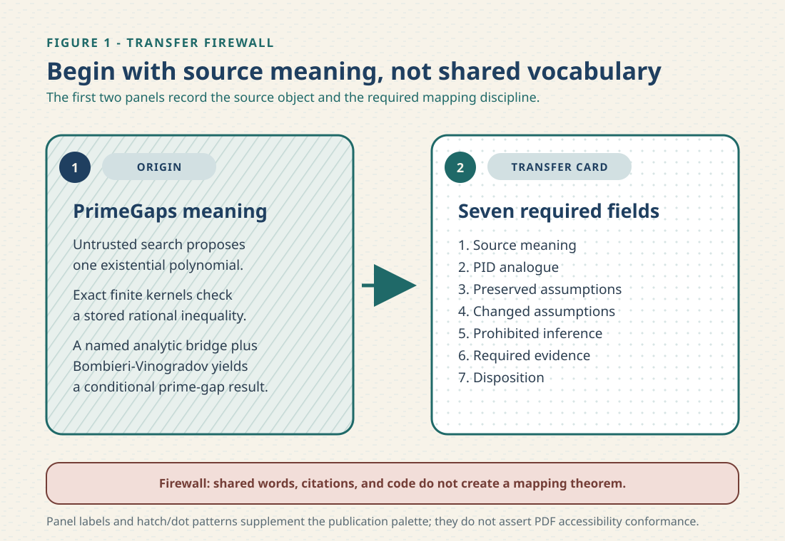
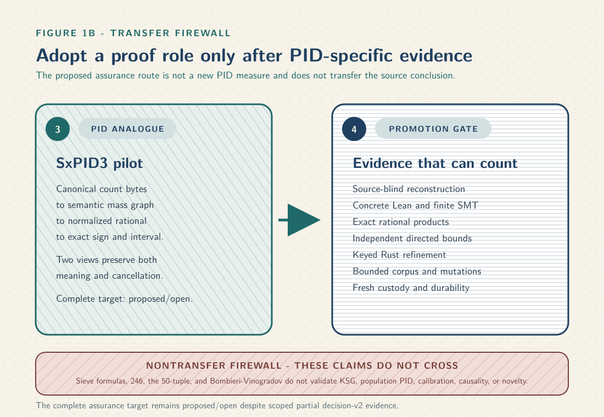
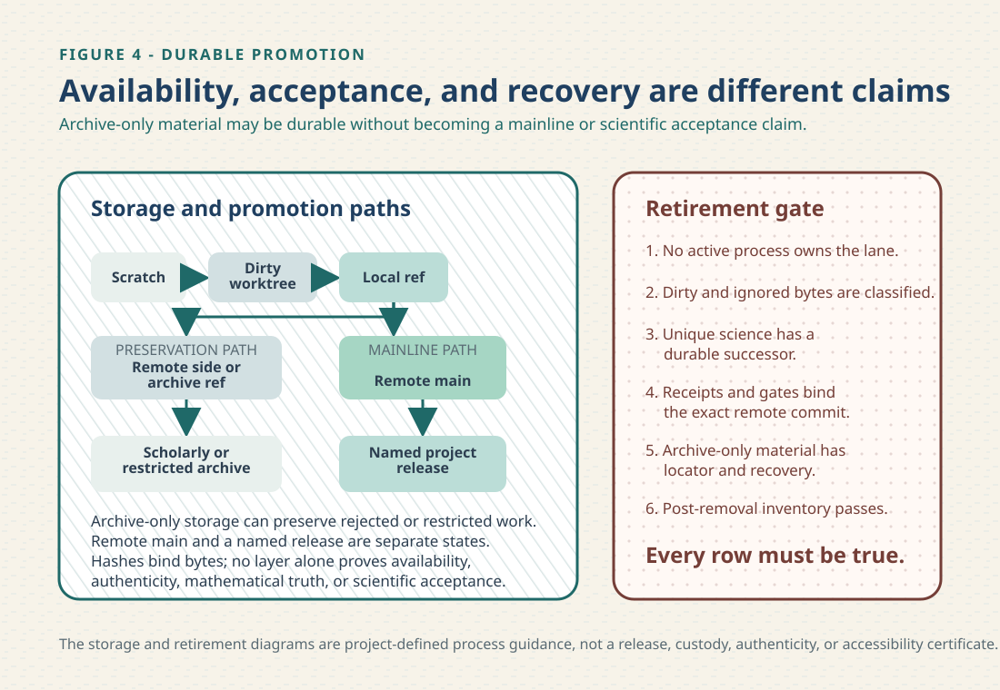

# PID discovery, verification, and durability blueprint

## Status and scope

This document is a source-pinned research and engineering review, not a theorem and not an
acceptance receipt. Its PrimeGapsLib observations are dated **19 August 2026**: it studies Axiom
Math's `PrimeGapsLib` at exact Git commit
`1faa7b14e82ddebc2772dfb9153922f01b106477`, the interactive paper and its 132-page blueprint,
then asks which proof-engineering patterns can improve `pid-rs` discovery and verification.

The current status of the proposed SxPID3 packet is governed separately by
[decision record 2](claims/SX-CERTIFIED-AVERAGED-PID3-001/decision-v2.md) and the
[evidence-adjudication index](claims/SX-CERTIFIED-AVERAGED-PID3-001/evidence-adjudication-index.md),
not by the dated PrimeGaps review. Decision record 2 keeps the complete target **proposed/open**;
it credits two scoped results and leaves every load-bearing end-to-end cut open. The frozen
[revision-1 index](claims/SX-CERTIFIED-AVERAGED-PID3-001/revision-index.md) remains historical
intake evidence and is not silently rewritten as a current decision pointer.

The answer is deliberately asymmetric:

- several proof-engineering structures transfer usefully;
- the prime-gap mathematics does not transfer to partial information decomposition;
- an exact finite certificate does not validate a continuous estimator, a population model, a
  statistical procedure, or a scientific interpretation; and
- formal verification is one instrument in an argument, never a replacement for semantic review,
  mathematical judgment, falsification, numerical analysis, or independent custody.

The principal positive design is scoped to the proposed three-source empirical categorical
shared-exclusions packet `SX-CERTIFIED-AVERAGED-PID3-001`. It introduces a typed semantic mass DAG,
a separate reduced-rational product plan, forward and backward sparse-completeness checks, and a
content-addressed sharded replay. This is a project-defined assurance architecture for an existing
paper-defined functional. It is not a new PID measure or a currently accepted certificate.

The process is part of the result. This document therefore records the source inventory, formulas,
theorem chain, the dated 20-lens transfer council, a separate current 50-lens and 10-route
adversarial closure, dissent and limitations, the autoresearch boundary, the implementation
roadmap, the evidence hierarchy, and the repository durability state machine. Exact path
inventories, hashes, run rosters, and mutation records belong in machine-readable JSON or TSV
companions rather than being copied repeatedly into human-facing migration PDFs.

### Publication contract

This Markdown file is the canonical human narrative. The paired PDF is a derived publication, not
a second editable source. Run `scripts/check-pid-discovery-verification-blueprint-pdf.sh` for the
default committed-byte check, or `scripts/build-pid-discovery-verification-blueprint.sh` to
regenerate it. The builder stages only this Markdown, its formatting filter/header, and four
handcrafted SVG panels; canonicalizes the temporary root; fixes locale, time zone, creation epoch,
document fonts, and temporary state; performs two isolated three-pass LuaLaTeX builds; rejects
compiler/layout warnings, non-A4 output, missing semantic text anchors, and unembedded or
non-Unicode-mapped fonts; and requires the two PDF byte strings to match.

That equality is a **same-toolchain observation**, not a universal cross-platform theorem. A new
Pandoc, LuaLaTeX, SVG renderer, font stack, or operating-system backend must rerun the gate and may
legitimately produce different bytes. There is no accepted cross-toolchain equivalence relation or
producer profile for this PDF: `--cross-toolchain` intentionally refuses rather than compare a
convenient substitute. The four source SVG panels include titles, descriptions, numbered captions,
and labels/patterns that do not rely on color alone. The PDF remains untagged; these source-level
descriptions do not establish PDF `/Alt`, reading order, assistive-technology behavior, or PDF/UA
conformance. The transfer ledger remains the machine-readable authority for the dated source
hashes, anchors, semantic cards, and historical 20-lens registry. The current 31 August closure
below is a separate publication review and does not rewrite that ledger. Neither review, the PDF,
nor its polish upgrades the scientific status of the proposed SxPID3 packet.

Repository links remain relative in this canonical Markdown so forks and local checkouts stay
portable. The PDF renderer rewrites only its declared repository-document links to canonical
GitHub main-branch navigation URLs for this repository. Those mutable navigation URLs are not
provenance; exact PrimeGaps source claims continue to use commit-pinned links.

## Executive decision

### Adopt

1. **Same-revision theory, certificate, and composite lanes.** Keep abstract mathematics, finite
   exact evidence, and the theorem that combines them separate, but require them to refer to the
   same immutable source revision.
2. **Untrusted discovery followed by a smaller checker.** Numerical search, autoresearch, and code
   generators may propose candidates; acceptance reconstructs the mathematical object from frozen
   input and checks it with a smaller, separately reviewed route.
3. **Explicit finite-to-semantic bridges.** A checked integer or rational inequality becomes useful
   only through named lemmas that connect stored data, mathematical definitions, and the final
   conditional claim.
4. **Assumptions in theorem and report types.** External premises, support conditions, units,
   estimand identity, and conditional status remain visible instead of being shortened away in
   summaries.
5. **Human-readable challenge plus machine comparator.** Freeze a small theorem roster, import and
   axiom policy, and an optional second-kernel replay independently of the candidate implementation.
6. **Typed dependency graph and completeness checks.** Sparse or packed evidence needs both
   directions: every required object is represented, and every represented object is semantically
   valid.
7. **Content-addressed shards and promotion receipts.** A large finite replay is a partitioned
   certificate family, not an opaque long job or an expiring CI artifact.

### Adopt conditionally

1. Packing, custom kernels, and generated tables only after a simple streaming implementation is
   correct and profiling shows a real bottleneck.
2. A comparator only after its binary, version, theorem roster, allowed axioms, inputs, and full
   output are pinned and replayed in CI or under independently controlled custody.
3. A factor DAG inside SxPID3 revision 1 only if it leaves the frozen certificate semantics and
   resource admission policy unchanged. If the graph becomes an acceptance-bearing public object
   or changes an admission limit, the claim needs a new adjudicated revision.

### Reject or defer

1. Direct transfer of GPY/Maynard sieve formulas, the number 246, the 50-tuple, factorial moments,
   or Bombieri--Vinogradov reasoning to PID.
2. Any implication from a finite exact categorical certificate to KSG consistency, continuous
   support, bias, variance, confidence coverage, population PID, causality, or scientific novelty.
3. Treating a green cached build, model consensus, self-assessed formalization, source hash, or
   polished blueprint as sufficient independent review.
4. Treating mutable `blob/main` source links or a status-colored dependency graph as a durable
   proof-to-paper correspondence receipt.
5. Kernel evaluation of millions of SxPID3 verdicts before a general proof and a bounded,
   independently replayable executable checker exist.

## Epistemic contract

Every proposed transfer is represented by seven fields:

1. source meaning;
2. PID analogue;
3. assumptions preserved;
4. assumptions changed or introduced;
5. prohibited inference;
6. evidence required before adoption; and
7. disposition.

The complete machine-readable form is
`audit/evidence/primegaps-to-pid-transfer-ledger-v1.json`. Shared words such as *information*,
*lattice*, *factor*, *kernel*, *moment*, *certificate*, *positive*, or *independent* do not create a
mapping theorem. Context determines meaning.

The council is advisory. Reviewers are asked to produce falsifiers and corrections, not votes.
The integrator must reconstruct decisive claims from primary sources and owns the final scope. Two
agents in one environment remain correlated evidence even when they use different roles or prompts.

### What the tools can and cannot establish

| Tool or method | Useful conclusion | Boundary that remains |
|---|---|---|
| Lean kernel | A term has the declared type under the recorded imports and axioms. | It does not prove that the formal statement faithfully represents the intended scientific claim. |
| Exact integer/rational checker | A finite algebraic predicate holds for reconstructed exact inputs. | It does not establish sampling validity, a population parameter, continuous support, or external provenance. |
| SMT solver | The bounded encoding is unsatisfiable or has a model under the encoded theory. | A missing premise, wrong encoding, or unsupported unbounded generalization remains possible. |
| Directed interval arithmetic | The declared exact real lies inside a rigorously constructed interval under its runtime assumptions. | It is not a confidence interval and does not establish model or estimator validity. |
| Mutation suite | Named faults are detected by the acceptance predicate. | It does not prove that all relevant faults have been enumerated. |
| CI | One bound revision passed one recorded environment and command family. | It does not prove universal portability, fresh reproducibility, or scientific correctness. |
| SHA-256 | Two byte strings are equal except with the hash's cryptographic collision risk. | It does not establish truth, authorship, authenticity, semantic identity, or durable availability. |
| Multi-agent council | Diverse objections and candidate routes can be generated efficiently. | Shared training, prompts, sources, tools, custody, or objectives can create correlated blind spots. |

## Exact source inventory

The review uses the following identities. `Reviewed` means the bytes or Git object were inspected;
it does not mean every statement was independently reproved.

| Object | Exact identity | Review use |
|---|---|---|
| PrimeGapsLib tree | commit `1faa7b14e82ddebc2772dfb9153922f01b106477`; tree `611f4b1caccb7850996cf425aefb1a6c42ed629f` | Lean source, dependencies, comparator, history, and CI architecture |
| Interactive paper HTML | SHA-256 `8ab349b59a897780ee7b023ec9b350442fc77b36aec84873019bff2612a97c90`; 10,793,548 bytes | statement/proof dependency graph, status, and source-link audit |
| Blueprint PDF | SHA-256 `c93efd077ff4236926379d9879cc82e124a12f4eecc1c43a685054b6ba866117`; 1,153,093 bytes; 132 A4 pages | human proof narrative and visual inspection |
| Blueprint layout text | SHA-256 `1ea1f0fb79561a91edba050bc767325882aee83c51dd1ba169e2e0a5e25bd8cf`; 495,392 bytes | searchable formula and statement review |
| Certificate source JSON | SHA-256 `99808e1d95204c5bbc0cde845641cfdbb41ea950fa7fa9858df8bd093111787a`; 55,303 bytes; 1,295 rows | untrusted candidate data input |
| Reviewed CI job log | SHA-256 `408c6b2193069268c2250227e326d0aabdd233244b1b6de804c9c98d4750c2b5`; 33,294 bytes | observed warm-cache build behavior and skipped assurance routes |

Primary locators are [PrimeGapsLib](https://github.com/AxiomMath/PrimeGapsLib), the
[interactive paper](https://primegaps.axiommath.ai/paper/), and the
[blueprint PDF](https://primegaps.axiommath.ai/blueprint.pdf). Repository links in this review use
the exact commit rather than mutable `main`.

The non-Git web/PDF/log rows above are **hash-only review observations**: their bytes are not
shipped in this repository. Their digests neither provide a recovery route nor authenticate the
publisher, and a future reacquisition may differ. The companion ledger marks that custody limit
explicitly; the commit-pinned Git source is the only source family in this report with a direct
object-recovery locator.

## What PrimeGapsLib proves

The headline result is conditional. The paper states the result using the familiar liminf
formulation

$$
\liminf_{n\to\infty}(p_{n+1}-p_n)\le 246.
$$

whereas the reviewed public Lean declaration keeps the Bombieri--Vinogradov premise explicit and
uses a frequently-at-infinity formulation:

```text
bombieriVinogradov_implies_frequently_prime_gap_le_246
  (hBV : BombieriVinogradov) :
  exists frequently m atTop,
    nth Prime (m + 1) - nth Prime m <= 246
```

The two formulations belong to the same mathematical narrative, but this review does not silently
substitute one theorem statement for the other. Neither may be summarized as an unconditional
proof supplied by the certificate alone.

### Mathematical skeleton

For an admissible tuple and nonnegative sieve weights, the analytic argument studies a difference
of weighted sums of the form

$$
S(N,\rho)=S_2(\lambda)-\rho S_1(\lambda).
$$

The finite numerical route supplies a strict variational witness for

$$
M_{k,\varepsilon}=\sup_F
\frac{\sum_{m=1}^{k}J_{k,\varepsilon}^{(m)}(F)}{I_k(F)}.
$$

At `k = 50` and `epsilon = 1/25`, the repository represents a polynomial candidate as

$$
F_c=\sum_i c_i b_{a_i,\alpha_i}
$$

and checks, after clearing denominators, the exact inequality

$$
4\sum_{i,j}c_ic_j I^{\varepsilon}_k(i,j)
<
k\sum_{i,j}c_ic_j J^{\varepsilon}_k(i,j).
$$

The exact Lean certificate conclusion used here is the strict threshold
$M_{50,1/25}>4$. The blueprint discusses a numerically constructed rational vector with an exact
quotient above $4.0043$, and a separate Lean file verifies that the parameter
$Q=4.004306$ makes a named positivity window nonempty. This review found no Lean theorem joining
that stronger numeric margin to the stored certificate. It therefore does **not** describe the
packed certificate as kernel-checking $M_{50,1/25}>4.0043$.

Likewise, the blueprint's full degree-27 basis has 2,526 elements, while the reviewed JSON contains
1,295 nonzero sparse labels. The JSON row count is not the full basis size. The blueprint's
degree-through-24 numerical observation is not presented here as a formal optimality theorem.

The numerical search that found the coefficient vector is not part of the trusted conclusion.
The accepted route checks the exact integer/rational predicate, bridges the stored tables to the
explicit quadratic forms, converts the explicit polynomial to an analytic `L2` witness, derives
`M_{50,1/25} > 4`, combines it with the analytic distribution premise, and uses an admissible
50-tuple whose diameter is checked to be 246.

### Discovery-to-theorem chain

The source implements the following typed chain:

```text
untrusted labelled JSON and search candidate
  -> untrusted canonical generator
  -> packed sparse tables
  -> small Nat/Bool/RArray kernels
  -> soundness bridges to direct mathematical recurrences
  -> exact cleared-denominator inequality
  -> explicit rational epsilon certificate
  -> analytic L2 certificate
  -> M_(50,1/25) > 4
  -> Bombieri-Vinogradov and admissible H50
  -> infinitely frequent prime gaps <= 246
```

The most transferable feature is not the particular recurrence. It is the refusal to trust the
candidate generator, combined with local soundness lemmas that recover the mathematical
specification from compact stored data.

### Selected theorem and lemma map

| Lean declaration | Role in the chain | What remains external or contextual |
|---|---|---|
| `EpsCertificateExplicit` | Finite rational coefficient family with a strict quadratic-form inequality. | The structure is specific to the sieve variational problem. |
| `certFactorTables_correct` | Connects cached factor tables to their declared mathematical factors. | It says nothing about PID event masses or lattices. |
| `certStoredInequality` | Kernel-decided strict inequality over stored row totals. | Stored-row correspondence needs separate lemmas. |
| `certLhsStoredRowSum_eq`, `certRhsStoredRowSum_eq` | Recover the original left and right quadratic forms from stored rows. | They share the certificate interpretation and source data. |
| `certInequality` | Produces the complete cleared-denominator witnessing inequality. | It is still a finite certificate predicate. |
| `EpsCertificateExplicitPrecomputedInt.toExplicit` | Bridges packed exact data and direct moments to the explicit rational certificate. | Integer runtime and soundness premises remain in the trust analysis. |
| `EpsCertificateExplicit.toAbstract` | Converts the explicit rational polynomial into the analytic `L2` certificate. | This bridge is prime-gap-specific; only its architectural role transfers. |
| `EpsCertificate.four_lt_MEps` | Derives the strict variational inequality from the analytic witness. | It does not provide the Bombieri--Vinogradov premise. |
| `existsEpsCert50` | Packages the checked certificate as the endgame hypothesis. | The existential is only one premise of the final theorem. |
| `lem_theta_bv` | Uses Bombieri--Vinogradov to choose a certificate-admissible distribution level. | This is the analytic black box of the 246 development. |
| `card_H50`, `diameter_H50`, `admissible_H50` | Kernel-check the explicit 50-tuple, its diameter, and admissibility. | They do not prove the comment's “narrowest” optimality claim; the tuple has no PID analogue. |
| `thm_main` | Combines the analytic and finite routes to obtain frequent gaps at most 246. | The conclusion remains conditional on `BombieriVinogradov`. |

Exact source anchors are retained in the transfer ledger. The theorem table is an architectural
map, not an independent proof audit of every imported lemma.

## The proof document and interactive graph

The blueprint is a readable 132-page mathematical document. Visual inspection of every page at
contact-sheet scale and representative pages at higher resolution found consistent margins,
legible formulas, stable headers, and useful per-statement Lean annotations. This is a substantial
review aid.

The interactive paper contains 255 typed entities: 126 marked formalized, 21 marked gap, and 108
marked unknown. The graph records 1,126 typed uses: 805 statement uses and 321 proof uses. The
observed dependency edges are acyclic and backward-pointing, with a maximum depth of 27 to the final
theorem. This makes the site useful for locating high-centrality definitions and incomplete cuts.

The graph is not, in its present form, a durable correspondence certificate:

- 186 observed repository source links use mutable `blob/main` URLs;
- status and link presence are not equivalent: some formalized or gap nodes lack links, while some
  unknown nodes have links;
- later paper sections are largely marked unknown despite substantial Lean source elsewhere in the
  repository;
- `PaperTag.lean` constructs its blueprint URL from a literal `todo` string; and
- its duplicate-handling path logs “skipping duplicate” but still inserts the duplicate entry; and
- no same-revision receipt binds the HTML, PDF, Lean tree, graph edges, statuses, and source spans.

The concept transfers: maintain a revision-pinned claim/proof/evidence DAG. The current mutable
site implementation does not transfer as an assurance mechanism.

## Repository and CI audit

PrimeGapsLib separates `PrimeGapsTheory`, `PrimeGapsCert`, and their composite library. That split is
valuable because a reviewer can build or inspect the mathematical theory without always replaying
the large computation.

The reviewed repository nonetheless has important reproducibility and custody limits:

- the reviewed commit's reachable history contains seven commits and begins with a large
  monolithic import; no release tag or GitHub release asset is bound into this report;
- `PrimeNumberTheoremAnd` is requested from mutable `main`, although the manifest records the
  resolved commit used by this checkout;
- the certificate JSON is transitively bound by the reviewed Git tree, but has no explicit
  sidecar content digest or candidate-generation/search receipt beyond that repository-object
  binding;
- the workflow uses mutable action version tags rather than full commit pins;
- the latest reviewed run restored roughly 2.47 GB of cache, built successfully, but skipped the
  comparator, `leanchecker`, and `nanoda` routes and uploaded no proof receipt;
- the comparator configurations are documented but not wired into the reviewed CI workflow; and
- the reviewed project metadata describes self-assessed and internal review, and this report binds
  no independent human or institutional review receipt.

None of these observations refutes the Lean theorem. They limit claims about fresh
reproducibility, external verification, review independence, and durable publication.

One parser detail illustrates why even a good architecture cannot be copied mechanically. The
PrimeGaps source generator converts some labelled JSON integers using `Int.toNat`, so a negative
input can be coerced rather than rejected. For an existential witness theorem this can be safe:
the downstream checker only needs the reconstructed object to be *some* valid witness. A PID
report, by contrast, is a deterministic function of the exact experimental count table. Its
decoder must reject such coercions, require canonical bytes, and bind the accepted data identity.

## Historical twenty-lens transfer council

This dated council belongs to the 19 August PrimeGaps review. It is a structured attack, not a
vote. Each lens asks a different question of the same proposed transfer. Agreement among lenses
does not create evidence, and a single load-bearing objection can veto promotion. The detailed
evidence and nonimplications are preserved in the machine-readable transfer ledger. The table below
uses the same canonical names, numbering, and order as that historical 20-lens registry; it is the
human synthesis of those exact rows. The separate current closure in the next section does not
retroactively change these rows.

| # | Lens | PrimeGaps observation | PID decision |
|---:|---|---|---|
| 1 | Estimand | The public result concerns bounded gaps between primes. | Name the deterministic averaged empirical categorical SxPID3 functional; transfer proof roles only, never sieve objects or constants. |
| 2 | Types | One fixed existential rational polynomial witness suffices for the source theorem. | PID accepts bounded runtime count tables, so canonical bytes, row roles, semantic masses, exact plans, intervals, and dispositions require distinct types. |
| 3 | Quantifiers | The public theorem retains an explicit `BombieriVinogradov` premise and an existential certificate. | State the finite-input SxPID3 implication and its quantifier order; do not replace it with population, estimator, asymptotic, or causal prose. |
| 4 | Mappings | No theorem maps GPY/Maynard objects to shared-exclusions PID. | Transfer assurance roles only; any mathematical value or proposition needs a positive premise-checked target map. |
| 5 | Support/reference measure | PrimeGaps' analytic measure premises are internal to its simplex and sieve problem. | Reconstruct positive empirical support from the PID definition; do not infer continuous support, a reference measure, or KSG validity. |
| 6 | Lattice/source count | Packed signatures and recurrence indices form source-specific carriers. | Freeze the 18-node three-source antichain poset, its order, event semantics, and Möbius direction independently. |
| 7 | Units/gauge | The certificate compares dimensionless exact rational forms. | Preserve natural logarithms, nats, informative/misinformative/net orientation, normalization, and any later preprocessing gauge. |
| 8 | Population/empirical | The source certificate is an exact finite witness inside a number-theory proof, not a statistical estimate. | Keep empirical PMF functional, estimator output, fixture, represented binary value, and population quantity separate. |
| 9 | Sampling | The fixed prime-gap witness does not supply PID row-law assumptions. | The narrow exact categorical claim is deterministic; any later population, bootstrap, permutation, or confidence statement needs its own sampling contract. |
| 10 | Selection/UQ | Numerical search found a successful candidate, but the reviewed project lacks a complete exposure, stopping, and rejected-candidate ledger. | Freeze objectives and judges before candidate access, retain adaptation history, and never treat rediscovery or consensus as calibration. |
| 11 | Formal correspondence | Lean bridges explicit objects, but the website graph has mutable links and status inconsistencies. | Bind a reviewed paper-to-formula map for event, averaging, order, units, and conclusion before formal code earns semantic credit. |
| 12 | Kernel/axioms/toolchain | The project pins Lean and resolved dependencies, while reviewed CI skips comparator, leanchecker, and nanoda. | Inventory kernel/runtime/import closure/axioms and require fresh fail-closed replay; `sorry`, theorem premises, conventional axioms, and `noncomputable` are different categories. |
| 13 | Route dependency diversity | Theory, certificate, packed kernels, and optional comparator diversify some cuts but share source mathematics and data. | Record shared semantic, parser, arithmetic, custody, and model cuts; route or agent count is not independence. |
| 14 | Numerical/binary64 | Approximate search is replaced by an exact rational acceptance inequality. | Use exact products for finite sign and separately verified directed intervals for log magnitude; neither validates binary64 estimators or platform `libm`. |
| 15 | Compiled/wrapper parity | The reviewed certificate route does not exercise pid-rs Rust/Python surfaces. | Compare all 108 keyed scalar audit expressions across specialized/general, serial/parallel, feature, build, platform, serialization, and Python routes. |
| 16 | Counterexample/mutation | Small exact kernels are valuable only if load-bearing premises actually affect acceptance. | Mutate decoding, event connectives, target restriction, count weighting, lattice order, products, intervals, resources, claims, and coordinated reseals. |
| 17 | Custody/threat/refusal | Public source and a warm-cache build do not provide an external-custody comparator or certificate receipt. | Freeze candidate scope and judge authority, refuse unavailable verification, and retain exact acquisition/execution records plus same-actor limits. |
| 18 | Citations/novelty | PrimeGaps cites its mathematical sources and presents a formalization. | Pin primary statements and application hypotheses; classify the PID assurance design as project-defined engineering, not a new measure or theorem. |
| 19 | Ecosystem/authority | The interactive graph is useful navigation metadata, not an acceptance authority or proof-term DAG. | Bind claim, source, theorem, executable, consumer, and archive authority directions at one revision. |
| 20 | Resource/platform/release | Packed computation is fast in a warm cached run, but no reviewed same-revision release receipt closes the lane. | Start with a bounded streaming route; freeze resource refusal, attempts, withdrawals, OS/toolchain scope, release assets, durability, and recovery before promotion. |

### Council synthesis and dissent

- **Strongest surviving mechanism:** untrusted candidate generation followed by exact
  reconstruction in a smaller checker and a named semantic bridge.
- **Strongest objection:** identical words such as *factor*, *certificate*, *positive*, or
  *lattice* can conceal different objects and different sufficient conditions.
- **Most likely false assumption:** that two nominally independent routes do not share the same
  paper transcription, generated registry, parser, arithmetic library, model lineage, or custody.
- **Evidence that would change the decision:** a pinned primary-source map; a source-blind direct
  exact implementation; concrete Lean and separately encoded finite-SMT routes; complete hostile
  models; dependency-disjoint interval reconstruction; keyed Rust refinement; and a fresh,
  externally held replay.
- **Dissent retained:** the semantic DAG may be unnecessary. A simpler direct reconstruction is
  the baseline and remains preferred unless profiling and proof size show a measured benefit.

## Current 31 August 2026 adversarial publication closure

This is a new review of the present publication and decision boundary, not an amendment to the
historical 20-lens ledger. Fifty explicitly named hostile lenses were applied beyond the ordinary
author pass. Ten materially distinct routes were then compared, including no action and the
simplest applicable non-PID route. The counts are coverage checklists, not mathematical evidence.
The closure verdict is narrow: publish this document as a proposed/open research blueprint, preserve
the two scoped decision-record-2 results, and grant no complete-certificate, estimator, population,
application, novelty, or cross-toolchain-PDF credit.

### Fifty named hostile lenses

| # | Hostile lens | Adjudication at the current boundary |
|---:|---|---|
| 1 | Scientific-object identity | The object is the averaged empirical categorical SxPID3 functional on one finite count table, not a population parameter or estimator output. |
| 2 | PID-functional identity | Makkeh--Gutknecht--Wibral shared exclusions remains distinct from Williams--Beer, BROJA, continuous Ehrlich shared exclusions, and every target-free analogue. |
| 3 | Variable-role identity | Three ordered sources and one target have different semantic roles; no relabeling may silently exchange a source with the target. |
| 4 | Alphabet and support | Every displayed exact formula requires declared finite alphabets and a nonempty finite empirical support; the bounded audit further fixes all four alphabets as binary. |
| 5 | Empirical versus population | Exact count-table evaluation supplies no sampling, consistency, bias, variance, confidence, or causal statement. |
| 6 | Sampling and dependence | No independent-row, exchangeability, stationarity, or block-length premise is needed for the deterministic functional; any inferential wrapper must add its own. |
| 7 | Source-event connective | The event is a union across antichain branches and an intersection within each branch; reversing either connective changes the functional. |
| 8 | Target restriction | The misinformative mass intersects the source event with the realized target event; omitting or moving that restriction is a different formula. |
| 9 | Antichain semantics | Every node is a nonempty family of nonempty source subsets with no two distinct members comparable by inclusion. |
| 10 | Carrier completeness | A hard-coded list of 18 keys is not a completeness proof; generation, uniqueness, and exclusion of the zero mask remain explicit obligations. |
| 11 | Source-count boundary | Eighteen is the three-source carrier size; 166 is the separate four-source carrier and cannot be imported into this audit. |
| 12 | Redundancy-order direction | The quantified subset direction in the order is load-bearing; a reversed order can produce a coherent but wrong lattice. |
| 13 | Zeta orientation | Cumulatives are rows and atoms are columns in the frozen matrix; transposition is not a serialization-only change. |
| 14 | Möbius direction | The inverse maps cumulative vectors to atom vectors; algebraic invertibility alone does not prove that either matrix has the intended semantics. |
| 15 | Component orientation | Informative, misinformative, and signed-net components remain separate, with signed net equal to informative minus misinformative. |
| 16 | Count weighting | Averaging uses each supported cell with weight equal to its count divided by the total, not one vote per distinct supported cell. |
| 17 | Units and logarithm base | Natural logarithms and the factor one over the total produce nats; bit labels or an omitted normalization are rejected. |
| 18 | Exact-zero meaning | A nonempty rational product can equal one, so zero is an exact product equality, never an empty-plan test or floating tolerance. |
| 19 | Negative-value preservation | Signed-net cumulatives and atoms may be negative; clamping, absolute values, and positive-only summaries change the object. |
| 20 | Coordinate ontology | The 108 audit entries are keyed scalar expressions, not 108 atoms, lattice nodes, or independent parameters. |
| 21 | Algebraic dependence | Net blocks derive from component blocks and atom blocks derive from cumulative blocks; expanded audit coverage is not dimension counting. |
| 22 | Source permutation | A source permutation must transport alphabets, cells, events, keys, and output identities together; positional array equality is insufficient. |
| 23 | Integer replication | Multiplying every count by a common positive integer preserves the empirical law but remains a useful executable regression, not a new law. |
| 24 | Domain extrapolation | Totals one through five and binary alphabets do not imply arbitrary totals, alphabets, full-support tables, or pointwise certification. |
| 25 | Canonical parsing | Accepted bytes need one strict decoding, member order policy, integer grammar, and rejection of noncanonical alternatives. |
| 26 | Integer coercion | Negative-to-natural coercion that can be harmless for an existential witness is forbidden for a deterministic PID count table. |
| 27 | Duplicate and unknown fields | Duplicate members, missing keys, unknown acceptance-bearing fields, and reordered identities must fail rather than be normalized silently. |
| 28 | Data and software identity | Hashes bind bytes only; input identity, source revision, executable identity, build context, and result identity remain distinct fields. |
| 29 | Resource preflight | Aggregate and per-coordinate bounds must be checked before expensive powers or allocations; refusal cannot emit a partial verified result. |
| 30 | Cancellation and atomicity | Cancellation, timeout, precision exhaustion, or storage failure is terminal and must not install a partial certificate or shard root. |
| 31 | Rational normalization | Exact sign authority compares normalized positive rationals with one; raw factor syntax or prime-exponent shape alone is insufficient. |
| 32 | Semantic-factor aliasing | Equal numeric masses with different event roles remain different semantic nodes until a proved evaluation map reaches the arithmetic plan. |
| 33 | Directed-log enclosure | Nonzero magnitudes need outward enclosures of the declared exact logarithm under a recorded precision and backend contract. |
| 34 | Interval decision rule | Verifier containment is stronger than overlap; an interval touching zero does not decide exact sign. |
| 35 | Binary64 boundary | Exact rational sign and real-log enclosure do not validate floating-point KSG, libm behavior, or the current Rust implementation. |
| 36 | Compiled-route refinement | Specialized and general Rust paths need keyed value traces from bound binaries; lexical source routing computes no values. |
| 37 | Build and parallel parity | Serial/parallel, debug/release, feature, platform, and toolchain comparisons are separate finite observations, not portable identity theorems. |
| 38 | Binding and serialization | Python exposure, report encoding, field order, and stable keys require their own refinement checks; a binding is not a method-origin claim. |
| 39 | Source-to-formula correspondence | A primary paper map must bind event, averaging, order, units, and conclusion before formal or executable evidence earns semantic credit. |
| 40 | Lean trust boundary | Kernel checking is scoped by the exact proposition, imports, axioms, generated code, and absence or location of intentional holes. |
| 41 | SMT trust boundary | Unsatisfiability concerns only the encoded finite theory; unknown is no evidence and a shared wrong transcription can survive two solvers. |
| 42 | Mutation causality | Every hostile mutation must fail for the intended predicate; a named mutation suite does not prove fault-model completeness. |
| 43 | Route independence | Language, algorithm, parser, data, semantics, toolchain, host, model lineage, reviewer, and custody are separate independence dimensions. |
| 44 | Current-decision freshness | The PDF must fail closed if the evidence-adjudication index or decision-record-2 disposition and Program A--E statuses drift. |
| 45 | Selection and autoresearch | Candidate grammar, objective, budget, exposure, stopping, withdrawals, and judge authority must be frozen before promotion evidence is seen. |
| 46 | External custody | Same-repository hashes and same-host reruns provide no independent acquisition, authenticity, or institutional-review receipt. |
| 47 | Link and PDF portability | Markdown links remain repository-relative; PDF repository links use declared canonical navigation URLs, while exact rendering remains same-toolchain only. |
| 48 | Durability and recovery | Local refs, remote main, named releases, and scholarly or restricted archives are different states; retirement requires a tested successor. |
| 49 | Application and non-PID alternative | If MI, CMI, direct task loss, ablation, coverage, or explicit failure utility answers the application question, PID must not be forced. |
| 50 | Provenance, novelty, and citation | Published definitions and classical finite-poset Möbius inversion are cited; the proposed assurance composition is project-defined and claims no scientific priority. |

### Ten materially distinct routes

| # | Route | Decision, reason, and reconsideration evidence |
|---:|---|---|
| 1 | No action; preserve the dated packet only | Retained as the safe fallback if source correspondence stays ambiguous. Rejected as the active publication route because it leaves current status and useful bounded evidence difficult to find. |
| 2 | Withdraw the PID claim and use the simplest non-PID analysis | Selected whenever the scientific question is answered by MI, CMI, direct task loss, ablation, coverage, or failure utility. It cannot certify a PID functional, but it prevents method forcing. |
| 3 | Prose review plus a few hand fixtures | Useful for discovery and teaching, but rejected as acceptance evidence because it cannot establish the complete carrier, registry, parser, or bounded corpus. |
| 4 | Treat the two existing Python routes and matching digest as final | Rejected as complete certification because both routes share the publication transcription, registry, runtime class, host, framing, and local custody. Their bounded result remains credited. |
| 5 | Simple source-blind direct exact checker | Selected as the baseline. It must reconstruct canonical counts, events, order, matrices, products, and keyed signs without importing generated answer tables. |
| 6 | Semantic mass DAG plus separate reduced-rational plan | Selected conditionally as an internal refinement only if a proof of evaluation, forward and backward completeness, mutations, and benchmarks beat the direct baseline without changing the claim. |
| 7 | Lean-only concrete formalization | Selected as one supporting route, never as the whole argument. It can close concrete finite semantics but not source correspondence, runtime bytes, intervals, Rust refinement, or custody. |
| 8 | SMT-only finite encoding | Selected as a differently encoded supporting route under at least two solvers. It remains subordinate to a raw constraint derivation, satisfiable hostile models, and explicit unknown handling. |
| 9 | Immediate custom packing and content-addressed sharding | Deferred. Shard coverage and simple streaming are useful, but custom kernels earn adoption only after the direct route is correct and profiling shows a real resource bottleneck. |
| 10 | Layered composite with direct baseline, conditional IR, dual formal routes, intervals, compiled refinement, shards, and external replay | Selected overall because each layer owns a different cut and no downstream layer repairs an upstream semantic error. Promotion still requires every Program A--E obligation and fresh external custody. |

The selected design takes the baseline from route 5, the provenance separation from route 6, the
bounded formal diversity from routes 7 and 8, the measured-only optimization rule from route 9, and
the end-to-end discipline from route 10. Route 2 remains an application-level veto: even a perfect
PID certifier is irrelevant when PID adds no justified information to the real decision.

Shared failure cuts remain the paper transcription, the exact registry, parser semantics, one host
and toolchain family, common data, same-actor custody, and correlated model or reviewer blind spots.
Dissent is preserved: the semantic DAG may add more proof surface than value; exact sharding may be
premature; and the correct application decision can be to use no PID at all. New evidence can change
those dispositions only through a premise-explicit source map, source-blind direct replay, measured
resource results, causal hostile tests, and fresh independently held execution.

## The transfer ledger: adopt structure, not conclusions

Every row in the companion ledger has source semantics, a PID analogue, preserved assumptions,
changed assumptions, prohibited inferences, required evidence, and a disposition. The decisions
compress to the following map.





### Accepted architectural transfers

1. **Theory / certificate / composite separation.** The theory lane states general categorical
   semantics. The certificate lane checks one finite input. The composite lane is the only lane
   allowed to state the bound end-to-end implication.
2. **Untrusted discovery / small checker.** Search and generation remain replaceable. Acceptance
   reconstructs the object from canonical bytes rather than trusting a producer's tables.
3. **Finite-to-semantic bridges.** Stored products, matrices, or graph nodes earn meaning only
   through checked evaluation and refinement statements.
4. **Premises in types and reports.** Theorem inputs and report fields preserve units, support,
   estimand, source, and conditional status.
5. **Content-addressed promotion.** Exact inputs, outputs, tools, and evidence move together under
   one same-revision manifest.

### Conditional transfers

- A human challenge and comparator are useful only when executed with pinned binaries, theorem and
  import rosters, axiom policy, raw results, and hostile tests.
- A proof-document DAG is useful only when revision-pinned and checked for unique identities,
  valid spans, status coherence, and evidence direction.
- Sparse graphs, packing, and sharding are implementation choices. They require completeness
  proofs and benchmarks; they are not mathematical evidence by themselves.
- Autoresearch may adaptively search, but a candidate-inaccessible judge and a complete exposure
  ledger control promotion.

### Rejected transfers

- No GPY or Maynard expression, eigenvector objective, admissible tuple, or number 246 transfers to
  PID without a new theorem establishing an actual typed map.
- No exact categorical product validates KSG, continuous shared exclusions, population PID, or a
  statistical procedure.
- No warm-cache build, self-review, agent consensus, mutable website, or polished PDF supplies
  independent acceptance.

## PID target: averaged empirical categorical SxPID3

The chosen pilot is narrow because it has exact finite semantics and a real open assurance packet.
It is **not** the full mixed-dimensional continuous PID3, not KSG, not fitted quantization, and not
pointwise certification. The complete packet remains proposed/open. Current decision-v2 evidence
is partial and bounded; it does not close any end-to-end implication.

The assumptions for every equation in this section are: three ordered finite source alphabets
$\mathcal S_1,\mathcal S_2,\mathcal S_3$; one finite target alphabet $\mathcal T$; one finite,
nonempty empirical count table with nonnegative integer cell counts; natural logarithms and nats;
and the deterministic empirical-PMF estimand. Zero-count cells are omitted from the positive
support. No equation in this section asserts a population, sampling, continuous-support,
estimator, calibration, or application result. The bounded audit later adds the stricter
assumptions that every alphabet is binary and $1\le N\le5$.

Let

$$
\mathcal Z=\mathcal S_1\times\mathcal S_2\times\mathcal S_3\times\mathcal T,
\qquad c_z\in\mathbb N_0,
\qquad
\mathcal Z_+=\{z\in\mathcal Z:c_z>0\},
\qquad
N=\sum_{z\in\mathcal Z}c_z>0.
$$

A supported joint realization is

$$
z=(s_1,s_2,s_3,t)\in\mathcal Z_+.
$$

An antichain $\alpha$ is a nonempty family of nonempty subsets of $\{1,2,3\}$ in which no two
distinct members are comparable by inclusion. For the keyed row $z$, define the source event

$$
E_\alpha(z)=\bigcup_{a\in\alpha}
\bigcap_{i\in a}\{S_i=s_i\}.
$$

The union across antichain branches and conjunction within a branch are load-bearing. Write the
target event as $T(z)=\{T=t\}$. Define

$$
\begin{aligned}
U_{\alpha,z} &= \sum_{z'\in E_\alpha(z)} c_{z'},\\
V_{\alpha,z} &= \sum_{z'\in E_\alpha(z)\cap T(z)} c_{z'},\\
T_z &= \sum_{z'\in T(z)} c_{z'}.
\end{aligned}
$$

For valid supported rows these masses are positive. The informative, misinformative, and net local
ratios are

$$
\rho^+_{\alpha,z}=\frac{N}{U_{\alpha,z}},\qquad
\rho^-_{\alpha,z}=\frac{T_z}{V_{\alpha,z}},\qquad
\rho^{\mathrm{sx}}_{\alpha,z}
=\frac{\rho^+_{\alpha,z}}{\rho^-_{\alpha,z}}
=\frac{N V_{\alpha,z}}{U_{\alpha,z}T_z}.
$$

Empirical weighting is by $c_z/N$, not uniformly over distinct supported rows. Clearing the
logarithmic sums into exact positive-rational products gives

$$
\begin{aligned}
Q^+_\alpha &= \prod_{z\in\mathcal Z_+}\left(\frac{N}{U_{\alpha,z}}\right)^{c_z},\\
Q^-_\alpha &= \prod_{z\in\mathcal Z_+}\left(\frac{T_z}{V_{\alpha,z}}\right)^{c_z},\\
Q^{\mathrm{sx}}_\alpha &= Q^+_\alpha/Q^-_\alpha,\\
C^u_\alpha &= \frac1N\ln Q^u_\alpha,
\qquad u\in\{+,-,\mathrm{sx}\}.
\end{aligned}
$$

There are exactly 18 nonempty antichains of the seven nonempty subsets of three sources in the
frozen registry. The
[complete carrier, stable keys, zeta rows, sparse inverse, and six-block coordinate order](claims/SX-CERTIFIED-AVERAGED-PID3-001/conventions.md#the-complete-18-node-carrier)
are listed in the frozen conventions. The redundancy order is

$$
\alpha\preceq\beta
\iff
\forall b\in\beta\;\exists a\in\alpha:\;a\subseteq b.
$$

With cumulative rows and atom columns,

$$
Z_{ij}=\mathbf 1[\alpha_j\preceq\alpha_i],\qquad
C^u_i=\sum_j Z_{ij}\Pi^u_j.
$$

The frozen $Z$ has 129 ones. Its exact inverse $M=Z^{-1}$ has 65 nonzero entries in
$\{-1,0,1\}$. This passage from cumulative values to atom values uses classical finite-poset
Möbius inversion, not a technique introduced in this repository; see
[Rota (1964)](https://doi.org/10.1007/BF00531932). The frozen acceptance contract checks both
$MZ=I$ and $ZM=I$ as defense-in-depth; over the exact square rational matrices, either one-sided
inverse identity already implies the other. Neither direction establishes event semantics: a
consistently transposed or wrongly ordered pair can remain algebraically invertible.

Atom products and values are

$$
R^u_i=\prod_{j=0}^{17}(Q^u_{\alpha_j})^{M_{ij}},
\qquad
\Pi^u_i=\frac1N\ln R^u_i.
$$

Because every $R^u_i$ is a positive rational and $N>0$, exact integer cross-multiplication
decides

$$
\Pi^u_i=0\iff R^u_i=1,
\qquad
\Pi^u_i>0\iff R^u_i>1,
\qquad
\Pi^u_i<0\iff R^u_i<1.
$$

A nonempty product may equal one. Exact zero is therefore not syntactic emptiness and not a
floating tolerance. Magnitudes require a separate outward interval for $(1/N)\ln R$; interval
overlap is not enough, and an interval touching zero does not decide exact sign.

The audit registry is indexed by **18 three-source lattice positions** and contains **108 keyed
scalar audit expressions**: 54 cumulative component expressions ($18\times3$ for informative,
misinformative, and signed net) plus 54 atom component expressions ($18\times3$ for the same
components). They are not 108 PID atoms, 108 lattice nodes, or 108 independent degrees of freedom.
The number 166 belongs to the separate four-source SxPID4 carrier and is outside this three-source
audit. The signed-net block is derived from the informative and misinformative blocks, while each
atom block is a fixed linear transform of its cumulative block. The bounded binary qualification
corpus has

$$
\sum_{n=1}^{5}\binom{n+15}{15}
=\binom{21}{16}-1
=20{,}348
$$

labeled count vectors and $20{,}348\times108=2{,}197{,}584$ coordinate verdicts. These are not
all arbitrary-alphabet inputs and not 20,348 distinct probability laws; only 20,164 are primitive
rational laws after division by the count-vector gcd.

## Proposed proof-carrying semantic IR

The strongest prospective transfer is a two-view intermediate representation. It generalizes the
existing `certified-sxpid` lowering pipeline to keyed SxPID3; it is not a new PID measure, and it is
not yet a demonstrated engineering improvement.

### View 1: semantic provenance graph

Each node retains a role-labelled key rather than only a number:

```text
Total(N)
TargetMass(target=t)
EventMass(alpha, supported_row)
TargetEventMass(alpha, supported_row)
LocalRatio(component, alpha, supported_row)
Cumulative(component, alpha)
Atom(component, antichain_key)
```

The row count $c_z$ is an exponent and provenance weight, not another multiplicative base. The
graph records why a mass exists, which event produced it, which source/target values key it, and
which coordinate consumes it. Numeric equality does not merge different semantic roles.

Required graph obligations are bidirectional:

1. **Forward completeness:** every mass and factor required by the frozen formulas appears exactly
   once under its semantic key.
2. **Backward soundness:** every stored node corresponds to one valid required object; there are no
   unreferenced or invented factors.
3. **Evaluation commutation:** evaluating the graph from the decoded count table yields the direct
   event/product specification for every key.
4. **Permutation equivariance:** renaming sources transports keys and values through one of the six
   source permutations without positional assumptions.

### View 2: normalized exact arithmetic

Semantic keys are not a canonical arithmetic normal form. For example,

$$
\frac{2\cdot6}{3\cdot4}=1
$$

despite a nonzero raw exponent vector over bases $2,3,4,6$. Therefore the acceptance route
evaluates the semantic graph into a normalized positive rational, or compares its exact
numerator/denominator cross-products after resource preflight. Structural cancellation may be a
fast sufficient proof of zero; it is never the exact-zero authority.

Conversely, merging nodes only because their values happen to be equal would erase semantic
mutation visibility. A target mass of six and an event mass of six are equal numbers but different
claims. The two views solve different problems:

| View | Preserves | Must not be used as |
|---|---|---|
| Semantic graph | roles, keys, provenance, completeness, mutation observability | canonical rational equality or exact sign authority |
| Normalized rational/cross-product | arithmetic cancellation, equality with one, strict sign | proof that factors came from the correct events or data |

### Baseline and adoption gate

`audit/tools/certified-sxpid/src/exact.rs`, `extract.rs`, and `product.rs` already provide the broad
two-source pattern: canonical exact log arguments, count/event lowering, Möbius application,
resource preflight, exact rational powers, and comparison with one. The first SxPID3 implementation
must extend or independently reconstruct that simple direct route. The DAG is adopted only if it:

- closes a named Program C or D obligation without weakening semantics;
- is proved equivalent to direct reconstruction;
- reduces measured time, peak memory, certificate size, or review complexity on the exact corpus;
- keeps resource admission and public certificate semantics stable, or triggers a new claim
  revision when it does not; and
- survives the noncanonical-factor and semantic-role mutation suite.

Packed arrays and custom bit-level kernels remain deferred until profiling shows that this clearer
route is inadequate.

## Layered assurance architecture

The architecture separates claims that are often collapsed into the phrase “formally verified.”

```text
paper-to-formula correspondence
        |
canonical bytes -> count table -> events -> antichain/order -> Q/R products
        |                         |                     |
     decoder proof          Lean + SMT            exact rationals
        |                         |                     |
        +---------------- semantic bridges ------------+
                                  |
                         directed log intervals
                                  |
                    keyed Rust/binary refinement
                                  |
                  bounded corpus + metamorphic tests
                                  |
                  provenance, custody, adjudication
```

No downstream green box repairs an upstream semantic error. The five closure programs are:

| Program | Question | Main tools | Explicit nonclaim |
|---|---|---|---|
| A: semantic/combinatorial | Did the paper-defined event and lattice get transcribed correctly? | pinned source map, source-blind derivation, exact minimal witnesses | examples and citations are not a universal bridge |
| B: dual formal | Are carrier, order, matrix, event, product, and sign theorems derivable? | Lean concrete route; independently encoded SMT finite route | two kernels can share the same wrong source transcription |
| C: certified numerics | Do exact products and independent outward log intervals agree? | exact integers/rationals, MPFR/Arb producer, rational-series verifier | deterministic intervals are not confidence intervals |
| D: compiled refinement | Do the shipped Rust paths implement the keyed specification? | stable-key traces, serial/parallel/features/platform matrix | float agreement is not exact-product proof |
| E: adversarial replay | Are bytes, dependencies, mutations, first results, and custody complete? | content manifests, fresh replay, hostile fixtures, independent adjudication | hashes and reruns are not scientific truth |

The complete target remains proposed/open for `SX-CERTIFIED-AVERAGED-PID3-001`. As recorded in
[decision record 2](claims/SX-CERTIFIED-AVERAGED-PID3-001/decision-v2.md), Programs A and B have
scoped partial results; Program C has a bounded exact sign/zero result; Program D has only a
lexical routing observation; and Program E has source-bound local receipt and partial mutation
evidence. None closes an end-to-end implication, and this report does not close the claim.

## Formal methods as bounded instruments

Formal verification is most valuable when it narrows a specific uncertainty and least valuable
when it becomes a ceremonial shield. Every evidence record should name its trusted computing base,
independence dimensions, finite bounds, residual risks, prohibited inference, and the weakest
plausible false claim it could still accept.

### Lean

Lean can establish that a term inhabits the encoded proposition under its imports and axiom
dependencies. It cannot by itself establish that the proposition is the intended paper theorem,
that runtime bytes denote the intended data, or that an estimator is scientifically realistic.

Four notions must remain separate:

1. `hBV : BombieriVinogradov` is a theorem premise;
2. `propext`, `Classical.choice`, and `Quot.sound` are conventional proof-environment
   dependencies reported by an axiom audit;
3. intentional `sorry` placeholders in challenge modules are holes in a human comparator target,
   not holes in the default production theorem libraries; and
4. `noncomputable` marks an execution/extraction property, not an unproved or unsound theorem.

### SMT

For finite masks, antichains, orders, and integer matrices, SMT is a strong second encoding. A
theorem route proves unsatisfiability of the negation; each hostile mutation should become
satisfiable with a retained model. `unknown` is no evidence. A wrong but self-consistent encoding
can still yield `unsat`, so the SMT route starts from raw Boolean/set constraints rather than a
generated Lean registry.

### Exact arithmetic and directed intervals

Exact rational products eliminate rounding only for the encoded finite expression. They still rely
on correct decoding, events, ordering, resource accounting, and big-integer execution. Directed
log intervals rely on correct range reduction, tail bounds, endpoint rounding, and runtime
behavior; they may legitimately abstain. They are deterministic enclosures, not statistical
confidence intervals.

### Exhaustive, mutation, metamorphic, and differential testing

- Exhaustive enumeration proves behavior only over its declared finite carrier.
- Mutation testing demonstrates sensitivity only to named faults.
- Metamorphic relations can be shared by multiple wrong implementations.
- Differential routes are useful only after common code, libraries, generated data, and semantic
  premises are mapped.
- A green CI run is one environment/revision observation. A warm-cache build is not a cold
  reproducibility receipt.

### Hashes, councils, and paper graphs

A digest binds bytes up to collision risk; it does not prove truth, authorship, authenticity,
meaning, or durable availability. A council generates attacks and alternative designs; shared
models, prompts, sources, tools, or custody make it correlated. A paper graph or status badge is
curation metadata until a same-revision checker binds entities, declarations, spans, imports, and
evidence.

## Attack matrix and required negative controls

The acceptance predicates must fail for the intended reason under at least the following classes.

| Cut | Mutation or counterexample | Required observation |
|---|---|---|
| Decoder | duplicate member, noncanonical integer, negative-to-natural coercion, Unicode alias, reordered canonical bytes | rejection before event work |
| Event | OR/AND swap, OR within a mask, missing target intersection | exact retained count witness disagrees |
| Weighting | uniform supported-row weight instead of exponent $c_z$ | count-weighting witness rejects |
| Lattice | missing antichain, padded zero mask, reversed order, transposed $Z$, altered Möbius row | model or exact inverse/semantic reconstruction fails |
| Keying | positional `(3)`/`(4)` swap, source permutation without key transport | stable-key comparison rejects |
| Component | informative/misinformative swap, net multiplication instead of division, negative net clamp | exact quotient and reconstruction reject |
| Units | omit $1/N$, label bits as nats | identity and interval relation reject |
| Factor IR | $(2\cdot6)/(3\cdot4)=1$ with nonzero exponent vector | normalized rational says zero; structural-only route fails |
| Factor roles | equal-valued target/event masses merged, or $c_z$ treated as a base | semantic graph completeness/soundness fails |
| Product | nonempty product one, factor/exponent mutation, huge projected power | exact comparison or preflight rejects |
| Interval | overlap substituted for containment, endpoint sign, mutated $\ln2$, same-backend “independent” route | verifier rejects or abstains |
| Registry | partial 54-expression report, reordered identity, self-consistently resealed wrong registry | complete 108-key expression binding rejects |
| Corpus | replicated tables called distinct laws; missing or duplicate shard range | ordinal/coverage checker rejects |
| Refinement | specialized/general paths compared positionally or a feature path omitted | keyed execution matrix rejects |
| Interpretation | exact empirical sign called significance, calibration, or population truth | wording/schema gate rejects |

## Autoresearch without evidence laundering

Autoresearch is a candidate generator. It can be ambitious, adaptive, and computationally broad,
but promotion rules depend on the question being asked.

### Four distinct research loops

1. **Theorem discovery.** Models or search produce lemmas, proof outlines, witnesses, or
   counterexamples. Promotion requires a kernel-checked theorem plus source-correspondence review.
2. **Exact finite PID falsification.** Search produces canonical integer count tables that
   maximize disagreement, cancellation, resource use, or mutation sensitivity. Promotion requires
   independent exact reconstruction of the table and predicate.
3. **Estimator design.** Search proposes algorithms or hyperparameters. Promotion requires
   preregistered data-generating families, held-out and repeated confirmation, uncertainty,
   multiplicity control, robustness, and selection-aware reporting. An exact finite witness cannot
   substitute for these.
4. **Formal proof generation.** A model proposes terms or tactics. Kernel acceptance checks the
   formal proposition; human and source-mapping review still own intended meaning.

### Promotion ledger

Before a run, record:

- objective and prohibited proxies;
- candidate grammar and resource budget;
- seed, environment, code revision, and allowed tools;
- stopping and retention rules;
- judge identity and the candidate's access to it; and
- confirmation data or theorem surface held back from adaptive selection.

During search, retain every exposure that can influence later choices, not only winners. After
search, freeze the candidate bytes before judging. The judge reconstructs from source input, emits
one terminal result, and cannot be rewritten or queried adaptively by the candidate lane.

The research record keeps failures, near misses, exploit attempts, judge disagreements, and the
first accepted result. A later clean rerun does not erase the selection history. Search frequency,
score, model consensus, and repeated rediscovery are discovery signals, not evidence of the claim.

### Council protocol

For consequential designs, twenty lenses are applied in three passes:

1. independent pre-merge memos identify the strongest falsifier and most likely hidden shared cut;
2. an integrator reconstructs decisive facts from primary sources and synthesizes competing
   designs; and
3. an adversarial pass attacks the selected design, its evidence boundaries, and its wording.

The record preserves dissent, the strongest surviving objection, evidence that would reverse the
decision, and independence limitations. There is no majority vote and no “assurance percentage.”

## Repository durability and promotion

Simple migrations should follow one reusable state machine rather than produce a bespoke PDF.
The human overview lives here; exact per-path facts belong in a JSON/TSV cleanup ledger.




```text
Discover -> Freeze -> Classify -> Preserve -> Integrate -> Verify -> Retire
```

### Storage and trust ladder

| Layer | Useful for | Not sufficient for |
|---|---|---|
| Scratch file / model context | rapid exploration | recovery, review, or durable identity |
| Dirty worktree | active local development | evidence that all bytes are tracked or backed up |
| Local commit/ref | recoverable local history | off-machine durability |
| Remote side/archive ref | off-host exact recovery | accepted mainline status or scholarly permanence |
| Remote `main` | integrated project history | release identity or long-term external archive |
| Signed-off project release metadata, unsigned Git objects per repository policy | named immutable project milestone | independent scholarly deposit or authenticity by itself |
| DOI/scholarly or restricted archive | long-term citation/recovery under its policy | automatic scientific correctness |
| CI artifact | short-lived diagnostic exchange | archival storage; expiration is expected |

The repository policy requires unsigned commits and no AI attribution. “Signed-off” in the table is
therefore a human decision concept, not a cryptographic Git signature.

### Discover and freeze

Inventory every common Git directory, worktree, branch, tag, stash, checkpoint, unreachable
object, dirty tracked path, untracked path, and relevant ignored path. Record HEAD, tree, merge base,
mode, size, digest, and process owner. Stop writers before taking a final manifest. Do not assume
`git status` covers ignored research archives, caches that contain unique results, or alternate
object stores.

### Classify and preserve

Classify each byte variant as accepted science, open candidate, retained negative evidence,
superseded-but-needed recovery state, restricted/local-only material, reproducible cache, or
discardable temporary output. Secret-screen before copying. Environment files, credentials,
device IDs, tokens, and private paths never enter a public snapshot.

Unique or uncertain material receives an immutable local ref and an off-host, content-addressed
snapshot or reviewed archive path before integration. A branch is not deleted because its name
looks old; a worktree is not removed because its files resemble main.

### Integrate

Start from fresh remote `main`, not from a dirty primary worktree. Port explicit paths or coherent
claim packets. Reconcile changes by semantic role, not wholesale directory copy. Regenerate
self-referential source states, receipts, and publication derivatives last. Keep commits small,
unsigned, human-authored, and free of agent trailers.

For unpublished PID material, use separate reviewed successors for distinct scientific claims.
Negative and withdrawn results remain reachable under explicit archive/evidence paths rather than
being silently overwritten by accepted variants.

### Verify and retire

Before push, require the relevant mathematical, formal, numerical, source-custody, build, test,
lint, documentation, PDF, and mutation gates. After push, bind the exact remote head and hosted run
identities. Local and remote `main` must resolve to the same intended commit without force.

A branch or worktree is retirement-eligible only when:

1. no process owns it;
2. every dirty, untracked, and relevant ignored byte has an explicit disposition;
3. its commits are remote-main ancestors, or every unique payload has a durable successor and
   recovery ledger;
4. restricted material has a safe non-public home;
5. the remote proof and recovery drill pass; and
6. a post-removal inventory shows no newly unreachable required object.

Cache deletion and Git garbage collection come last, after a retention window and repeated object
inventory. Remote archive branches remain until exact preimages have a main-reachable or verified
external successor.

### Current safety disposition

At the review boundary, the dirty primary worktree contained substantial unpublished PID claim
packets, scripts, reviews, and ignored material not proved redundant with remote main. It was
therefore treated as a protected source, not a cleanup target. The SxPID3 packet used here was
ported into this isolated lane with an exact preimage manifest, then received bounded
presentation-only GitHub-Markdown normalization: legacy inline/display delimiters became
`$`/`$$`, four `\operatorname` occurrences across three formulas became `\mathrm`, and one
blockquoted implication was reflowed as ordinary prose plus display math. The ledger binds both
preimage and current bytes.
These mechanical edits were not intended to change mathematical or prose content, but the hashes
alone do not prove semantic equivalence, and the preservation step does not adjudicate the packet.
No cleanup or repository-wide integration claim is made here.

## Implementation roadmap for SxPID3

The order below optimizes for semantic risk reduction, not visual progress. It is a prospective
roadmap from the current decision-v2 boundary: it preserves partial bounded evidence without
calling it an accepted certifier or silently re-opening the frozen revision-1 claim.

### Phase 0: preserve and adjudicate the packet

- Preserve the frozen revision-1 packet, current decision-v2 record, and bounded negative results
  as distinct evidence objects.
- Keep the complete target proposed/open while the evidence-adjudication index remains the current
  pointer; do not edit the historical revision index to make later evidence appear contemporaneous.
- Pin the exact Makkeh--Gutknecht--Wibral source and construct a paper-equation-to-local-formula map.
- Decide whether the semantic DAG is internal revision-1 machinery or a claim-v2 acceptance object
  before changing an acceptance rule, schema, registry, or resource policy.

**Stop condition:** any unresolved source/event/unit/order ambiguity.

### Phase 1: simple direct specification

- Implement the strict canonical decoder and direct event-count route.
- Reconstruct all 18 antichains, order entries, $Z$, $M$, 54 cumulative component expressions,
  54 atom component expressions, and the 108 keyed scalar audit expressions without generated
  acceptance tables. Do not label those expressions as atoms or independent degrees of freedom.
- Add minimal exact witnesses for every semantic mutation and the noncanonical-factor example.

**Promotion condition:** source-blind review and exact keyed results on hand-checkable fixtures.

### Phase 2: dual formal semantics

- In Lean, define the concrete carrier, event membership, counts, order, zeta/Möbius relation,
  products, and sign reduction.
- Independently encode finite masks, antichains, order, all 324 zeta entries, inverse products,
  permutations, and event mutations for SMT.
- Freeze theorem/import/axiom rosters and run hostile substitutions.

**Nonclaim:** this does not close paper correspondence, log intervals, or Rust execution.

### Phase 3: exact products and intervals

- Build a producer and dependency-disjoint verifier from canonical count bytes.
- Compare normalized exact rationals with one after aggregate/per-coordinate preflight.
- Produce directed intervals and require the verifier interval to be a subset of the producer
  interval.
- Make precision exhaustion and resource refusal terminal, with no partial `verified` result.

### Phase 4: keyed Rust refinement

- Expose audit-only stable-key traces from specialized and general three-source routes.
- Compare serial/parallel, debug/release, features, platforms, package/binary identity, and Python
  exposure without positional assumptions.
- Keep binary64 tolerance results diagnostic; exact products and intervals remain the authority.

### Phase 5: bounded corpus and shards

- Freeze a canonical ordinal for all 20,348 count vectors.
- Partition half-open ranges into content-addressed shards with no overlap or gap.
- Replay all 2,197,584 keyed-expression verdicts plus permutations, relabelings, replication,
  canonical gates, retained failures, cancellation, and resource refusals.
- Prove the shard root corresponds to the exact ordinal domain; do not call it arbitrary-alphabet
  exhaustiveness.

### Phase 6: promotion and external review

- Freeze source, tools, schemas, binaries, first-result records, negative evidence, and mutation
  receipts under one same-revision manifest.
- Obtain fresh acquisition and execution under separate custody.
- Adjudicate every Program A--E obligation. Any load-bearing open cut keeps the claim proposed or
  blocked.
- Publish one milestone MD/PDF and machine companions; do not create migration-specific narrative
  PDFs.

## Evidence-card template

Every acceptance-bearing artifact should answer:

| Field | Required content |
|---|---|
| Claim | Exact proposition and quantifiers supported by this item |
| Source semantics | What the originating object means in its own field |
| Bound | Input domain, count, precision, resource, platform, and revision limits |
| TCB | Kernels, runtimes, parsers, libraries, solvers, filesystem, and hardware assumptions |
| Independence vector | Different acquisition, custody, language, encoding, algorithm, backend, and reviewer dimensions |
| Shared cuts | Paper transcription, registry, parser, generator, arithmetic, data, or tooling dependencies |
| Defeaters | Conditions under which valid-looking evidence no longer supports the claim |
| Weak false claim accepted | The most plausible wrong proposition this route could still pass |
| Prohibited inference | What downstream statement must not cite this item |
| Reproduction | Exact inputs, command, outputs, hashes, and terminal status |
| Durability | Remote/release/archive locator, retention policy, and recovery test |

## Final recommendation

PrimeGapsLib offers a strong architectural lesson: a sophisticated search may remain outside the
trusted argument if exact finite data are reconstructed by a smaller checker and connected to the
final theorem through explicit bridges. It also offers a warning: elegant formal code, a large
blueprint, a public build, and an interactive graph can coexist with mutable links, unexecuted
comparators, warm-cache evidence, sparse process provenance, and no same-revision publication
receipt.

For `pid-rs`, the best next step is not to imitate prime-gap mathematics or immediately build a
packed kernel. It is to preserve the open SxPID3 packet, close the paper-to-formula map, implement a
simple source-blind exact route, and pilot a two-view proof-carrying semantic IR whose semantic and
arithmetic obligations are separately testable. Only measured benefit justifies packing or
sharding. Only Programs A--E justify a certificate disposition. Nothing in that path upgrades KSG,
continuous PID, population inference, or scientific interpretation without their own evidence.

The process recommendation is equally important: keep adaptive discovery broad, make promotion
narrow, retain failures and selection history, expose shared cuts, generate one canonical human
report from the same mathematical source, and move every valuable byte through an auditable
storage-and-promotion ladder before retiring any branch or worktree.

## Source-anchored claim register

The links below are pinned to the reviewed Git commit. They are locators for review, not a claim
that a line range alone contains every transitive proof dependency.

The repository-wide search found six `sorry` placeholders, all in the two intentional challenge
roots rather than the default theorem libraries. That fact does not turn challenge holes into
production proof holes, nor does it establish that the challenge statements perfectly represent
the paper. The comparator still needs an executed, pinned receipt before it earns verification
credit.

| Review claim | Primary anchor |
|---|---|
| Final public declaration is conditional | [`PrimeGaps/Bounded246.lean`, lines 21--31](https://github.com/AxiomMath/PrimeGapsLib/blob/1faa7b14e82ddebc2772dfb9153922f01b106477/PrimeGaps/Bounded246.lean#L21-L31) |
| Stored certificate proves the cleared threshold corresponding to `> 4` | [`PrimeGapsCert/Gap246/Witness.lean`, lines 35--46](https://github.com/AxiomMath/PrimeGapsLib/blob/1faa7b14e82ddebc2772dfb9153922f01b106477/PrimeGapsCert/Gap246/Witness.lean#L35-L46) |
| `4.004306` appears in a separate positivity-window theorem | [`Sieve/PositivityWindow.lean`, lines 68--81](https://github.com/AxiomMath/PrimeGapsLib/blob/1faa7b14e82ddebc2772dfb9153922f01b106477/PrimeGapsTheory/Gap246/Sieve/PositivityWindow.lean#L68-L81) |
| Explicit tuple card, diameter, and admissibility are checked | [`H50.lean`, lines 31--50](https://github.com/AxiomMath/PrimeGapsLib/blob/1faa7b14e82ddebc2772dfb9153922f01b106477/PrimeGapsTheory/Gap246/Tuple/H50.lean#L31-L50) |
| Candidate generator is explicitly untrusted | [`Emit/SourceGen.lean`, lines 10--15](https://github.com/AxiomMath/PrimeGapsLib/blob/1faa7b14e82ddebc2772dfb9153922f01b106477/PrimeGapsCert/Gap246/Emit/SourceGen.lean#L10-L15) |
| Generator uses integer-to-natural conversion in labelled input decoding | [`Emit/SourceGen.lean`, lines 69--89](https://github.com/AxiomMath/PrimeGapsLib/blob/1faa7b14e82ddebc2772dfb9153922f01b106477/PrimeGapsCert/Gap246/Emit/SourceGen.lean#L69-L89) |
| Small kernel layer is isolated from the untrusted producer | [`Kernel/Core.lean`, lines 9--14](https://github.com/AxiomMath/PrimeGapsLib/blob/1faa7b14e82ddebc2772dfb9153922f01b106477/PrimeGapsCert/Gap246/Kernel/Core.lean#L9-L14) |
| Stored rows and the terminal inequality are reconstructed and packaged | [`Witness.lean`, lines 19--46](https://github.com/AxiomMath/PrimeGapsLib/blob/1faa7b14e82ddebc2772dfb9153922f01b106477/PrimeGapsCert/Gap246/Witness.lean#L19-L46) |
| Precomputed integer tables are converted to the explicit rational certificate | [`Certificate/Fast.lean`, lines 4068--4134](https://github.com/AxiomMath/PrimeGapsLib/blob/1faa7b14e82ddebc2772dfb9153922f01b106477/PrimeGapsCert/Gap246/Certificate/Fast.lean#L4068-L4134) |
| The explicit rational certificate is bridged to the analytic `L2` witness | [`ExplicitToAbstract.lean`, lines 687--731](https://github.com/AxiomMath/PrimeGapsLib/blob/1faa7b14e82ddebc2772dfb9153922f01b106477/PrimeGapsTheory/Gap246/Sieve/Certificate/ExplicitToAbstract.lean#L687-L731) |
| Human challenge and solution are separate roots | [`Challenge/Basic.lean`, lines 8--48](https://github.com/AxiomMath/PrimeGapsLib/blob/1faa7b14e82ddebc2772dfb9153922f01b106477/Challenge/Basic.lean#L8-L48), [`Solution/Basic.lean`, lines 1--3](https://github.com/AxiomMath/PrimeGapsLib/blob/1faa7b14e82ddebc2772dfb9153922f01b106477/Solution/Basic.lean#L1-L3) |
| Paper-tag URL and duplicate handling need hardening | [`PaperTag.lean`, line 100 and lines 158--168](https://github.com/AxiomMath/PrimeGapsLib/blob/1faa7b14e82ddebc2772dfb9153922f01b106477/PrimeGapsTheory/Tactic/PaperTag.lean#L100-L168) |
| Reviewed public CI is a minimal tagged-action build | [`.github/workflows/lean.yml`, lines 1--17](https://github.com/AxiomMath/PrimeGapsLib/blob/1faa7b14e82ddebc2772dfb9153922f01b106477/.github/workflows/lean.yml#L1-L17) |
| External PNT dependency is requested from mutable `main` | [`lakefile.toml`, lines 20--23](https://github.com/AxiomMath/PrimeGapsLib/blob/1faa7b14e82ddebc2772dfb9153922f01b106477/lakefile.toml#L20-L23) |

## Primary references

- Axiom Math, [PrimeGapsLib at reviewed commit](https://github.com/AxiomMath/PrimeGapsLib/tree/1faa7b14e82ddebc2772dfb9153922f01b106477).
- Axiom Math, [interactive bounded-prime-gaps paper](https://primegaps.axiommath.ai/paper/).
- Axiom Math, [formalization blueprint PDF](https://primegaps.axiommath.ai/blueprint.pdf).
- Makkeh, Gutknecht, and Wibral, *Introducing a differentiable measure of pointwise shared information*, Physical Review E 103, 032149 (2021), arXiv:2002.03356.
- Gian-Carlo Rota, [*On the Foundations of Combinatorial Theory I. Theory of Möbius Functions*](https://doi.org/10.1007/BF00531932), *Zeitschrift für Wahrscheinlichkeitstheorie und Verwandte Gebiete* 2, 340--368 (1964).
- `pid-rs`, `MATHEMATICAL_PROBLEM_SOLVING_WORKFLOW.md`, the existing repository-wide scientific and autoresearch process record.
- `pid-rs`, `claims/SX-CERTIFIED-AVERAGED-PID3-001/`, proposed revision-1 specification and open Programs A--E.
