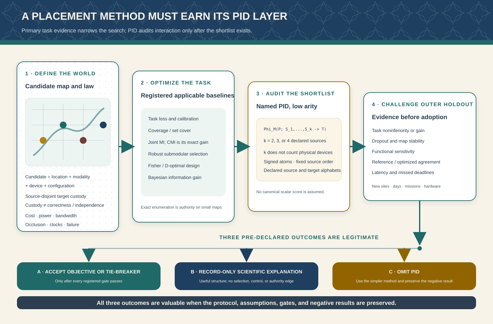
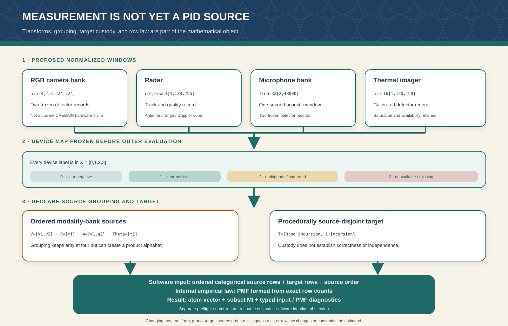

# PID in Galadriel and sensor placement

## Current use, proposed research, and evidence gates

**Status date:** 30 August 2026\
**Scope:** pid-rs, the inspected Galadriel revision, and a proposed sensor-placement research
program\
**Claim status:** current Galadriel use is implemented but bounded; sensor placement is proposed and
has no implementation or performance claim in pid-rs or Galadriel

This guide answers two different questions:

1. Where does Galadriel use partial information decomposition (PID) now, and what does that use
   establish?
2. Could PID help select or place cameras, microphones, radar, or thermal sensors on a map?

The short answer is precise. Galadriel currently uses PID only in three separate **offline synthetic
studies**. One is a deterministic conformance study of categorical Makkeh-Gutknecht-Wibral (MGW)
shared exclusions on a frozen CREBAIN fixture. A second evaluates categorical MGW PID2 on generated
independent fair bits with an XOR target. A third evaluates the distinct continuous Ehrlich
shared-exclusions PID2 estimator on a generated sign-parity law. None drives Galadriel fusion,
alerts, authorization, or commands. The sensor analysis in this guide is grounded in the
categorical CREBAIN path; results from the categorical XOR and continuous studies are not
transferred to it.
Galadriel does not currently optimize sensor locations. A defensible placement study would use a
mission objective such as held-out task loss, coverage, mutual information, robust utility, or
Fisher information as the primary optimizer. PID can then audit a small shortlist of two- to
four-source portfolios. It should become a placement objective only if a separately defined,
tested objective beats those baselines without violating its assumptions.

The distinction is not cosmetic. A successful PID calculation does not prove that a sensor detects
a drone, that a location is optimal, that a result is causal, or that a system is safe. Conversely,
a strong detector or placement optimizer may need no PID at all.


## 1. Claim map

The labels in this document have fixed meanings.

| Label | Meaning in this guide |
|---|---|
| **Current** | The inspected source tree executes the named path. |
| **Verified, bounded** | A declared finite test or proof obligation passed. It is not a universal theorem. |
| **Paper-defined** | A cited publication defines the mathematical object. |
| **Project-defined** | pid-rs or an ecosystem repository defines the composition, report, or workflow. |
| **Proposed** | A research design is specified, but the implementation or evidence is not complete. |
| **Unsupported** | The current API or evidence does not support the claim. |

The categorical shared-exclusions functional is paper-defined by Makkeh, Gutknecht, and Wibral
[[1]](#references). Its empirical probability-mass-function (PMF) Rust route, resource receipts,
typed interpretations, and
ecosystem compositions are implementation or project-defined work. The proposed placement audit in
this guide is also project-defined. It is not attributed to the authors of shared exclusions, and
it is not presented as an established placement method.

## 2. What Galadriel uses now

### 2.1 Exact source boundary

This section describes the read-only Galadriel tree at commit
`466986416a711d2868b94dc26710e03e1761a57b`. Galadriel selects pid-core 0.9.0 at pid-rs revision
`bc3aa80fb6025e709c2906a08bce25a4fac40578` for its current PID and dependence study code. The
older revision `1cd2424f...` remains historical preregistration evidence; it is not silently treated
as the executable dependency.

Galadriel has three separate mathematical lanes:

| Lane | Current object | Does it use PID? | Operational authority? |
|---|---|---:|---:|
| Fusion and monitoring | Normalized innovation squared (NIS), cumulative sum (CUSUM), signed correlation, and conservative project-defined rules | No | Advisory monitoring only; PID is absent |
| Optional dependence companion | Pairwise report-first Kraskov-Stögbauer-Grassberger (KSG) mutual information | No. Mutual information is not PID. | No fusion, permission, or command edge |
| Offline justification | Categorical CREBAIN MGW PID2/PID3, categorical XOR MGW PID2, and a separate continuous Ehrlich PID2 route | Yes | Record-only research evidence |

The categorical path is implemented in
`crates/galadriel-justify/src/crebain_mgw.rs`. The standalone
`galadriel-crebain-mgw` binary reads one byte-pinned fixture, validates its schema and provenance,
preflights each PID call, executes stable pid-core categorical entry points, checks algebraic
identities and controls, and emits JSON or Markdown evidence. CREBAIN itself does not consume the
PID output.

A second offline binary, `galadriel-justify`, emits plain-text reports. Among its other synthetic
dependence studies, it executes the generated categorical XOR MGW PID2 route and the generated
continuous sign-parity Ehrlich PID2 route described in Sections 2.5 and 2.6. Thus the current census
is three mathematical PID studies across two binaries, not one common pipeline.

The fixture's producer provenance is separate and exact. The inspected CREBAIN artifact is
`src-tauri/tests/fixtures/crebain_drone_mgw_v1.json` at CREBAIN commit
`6ef60fabbf8c8a8008e7a77304d3e095b6b9e91d`. Its raw length is 64,218 bytes and its SHA-256 digest is
`82a837415b56c3646386a5c3e6fe28a492906c164edc461249bab7844aa4ebda`. These bindings establish which
synthetic bytes were inspected. They do not establish the producer's physical fidelity, row
independence, consumer behavior, or field validity.

No current PID-to-Haldir runtime route exists, and the PID record is not an input to Galadriel
trusted-state policy or a plant command. A separate prospective adapter contract would have to prove
fixed-input noninterference if PID evidence were ever exposed across that boundary; this guide does
not claim that such an adapter exists. Audit records and human interpretation can still change.

### 2.2 The actual no-thermal fixture

The fixture has three ordered one-column sources and two targets:

$$
V,R,A,T_H,T_V\in\{0,1\}.
$$

The source symbols have the following synthetic meanings. On this manufactured 64-row law, the
realized source and target columns also obey the last two equalities exactly:

$$
\begin{aligned}
V &= \mathbf 1[N_{\mathrm{visual}}\le 1\ \mathrm m],\\
R &= \mathbf 1[E_{\mathrm{radar}}\le 50\ \mathrm m],\\
A &= \mathbf 1[U_{\mathrm{acoustic}}\le 1\ \mathrm m],\\
T_H &= V\land R,\\
T_V &= V\land R\land A.
\end{aligned}
$$

Here `V`, `R`, and `A` are labels, not pixels, waveforms, or range-Doppler tensors. Their source
order is permanently `(V,R,A)`. The equations $T_H=V\land R$ and $T_V=V\land R\land A$ describe
exact equalities among the columns of this manufactured law. They do not describe how the producer
computes the target: the implementation derives each target label from latent synthetic
east-north-up (ENU) truth. If $(E^\star,N^\star,U^\star)$ denotes that latent truth row, the producer
uses

$$
T_H=\mathbf1\{E^\star\le50\ \mathrm m\ \land\ N^\star\le1\ \mathrm m\},
\qquad
T_V=\mathbf1\{E^\star\le50\ \mathrm m\ \land\ N^\star\le1\ \mathrm m\ \land\ U^\star\le1\ \mathrm m\}.
$$

It does so
without reading the source labels, projections, fusion output, a Galadriel verdict, or PID output.
Thus the construction has a source-to-target data-flow separation, not statistical independence;
in the realized table each target is a deterministic function of the source labels. It is also not
the stronger claim that the target existed before every sensor object was constructed.

Every source cell appears eight times:

| `V` | `R` | `A` | `T_H` | `T_V` | Repetitions |
|---:|---:|---:|---:|---:|---:|
| 0 | 0 | 0 | 0 | 0 | 8 |
| 0 | 0 | 1 | 0 | 0 | 8 |
| 0 | 1 | 0 | 0 | 0 | 8 |
| 0 | 1 | 1 | 0 | 0 | 8 |
| 1 | 0 | 0 | 0 | 0 | 8 |
| 1 | 0 | 1 | 0 | 0 | 8 |
| 1 | 1 | 0 | 1 | 0 | 8 |
| 1 | 1 | 1 | 1 | 1 | 8 |

The producer reports a fresh synthetic engine initialization for each of the 64 rows, but this
compact fixture does not prove engine-state independence. The rows realize only eight distinct
source cells. Repetition gives each cell empirical mass `1/8`; it does not create 64 independent
field flights or establish sampling precision.

One literal row in the producer fixture contains source labels `[0,0,0]`, a visual Cartesian ENU
coordinate `[50,2,1]`, radar polar values `[51,0,0]`, an acoustic Cartesian ENU coordinate
`[50,1,2]`, and latent truth `[51,2,2]`; both targets are zero. The PID computation consumes the
categorical labels and target, not the raw coordinate arrays.

### 2.3 What the calculation returns

The primary study computes the four averaged PID2 atoms for ordered sources `(V,R)` about `T_H`.
Each coordinate retains an informative component $\Pi^+$, a misinformative component
$\Pi^-$, and signed net value $\Pi=\Pi^+-\Pi^-$:

$$
\Pi^+\ge0,\qquad \Pi^-\ge0,\qquad \Pi\in\mathbb R.
$$

These inequalities describe the exact MGW quantities; binary64 output near an exact zero still
needs a declared numerical policy. "Misinformative" names the nonnegative magnitude that is
subtracted. It is not itself a negative number. Only the signed-net coordinate can be negative.

| PID2 coordinate | Informative | Misinformative | Net, nats |
|---|---:|---:|---:|
| Redundancy | 0.287682072 | 0.202732554 | 0.084949518 |
| Unique visual | 0.405465108 | 0.274653072 | 0.130812036 |
| Unique radar | 0.405465108 | 0.274653072 | 0.130812036 |
| Synergy | 0.287682072 | 0.071920518 | 0.215761554 |

The four net atoms reconstruct

$$
I(V,R;T_H)=0.562335145\ \text{nats}.
$$

The table prints each atom to nine decimal places. Those four displayed values sum to
`0.562335144`; reconstruction uses the unrounded binary64 values, whose sum is
`0.5623351446188083` and rounds to the displayed MI. The one-unit final-decimal difference is
display rounding, not a failed PID identity.

The exploratory study computes the 18-node three-source lattice for `(V,R,A)` about `T_V`.
Eighteen is the number of PID lattice positions, and hence the number of net atoms. The number 108
in pid-rs's separate bounded SxPID3 audit is

$$
18\ \text{lattice positions}\times
2\ \text{representation stages}\times
3\ \text{components}=108.
$$

The two stages are cumulative values and their Möbius-inverted atoms. The three components are
informative, misinformative, and signed net. Thus 108 is an audit-registry coordinate count, not a
claim that PID3 has 108 atoms. A four-source lattice has 166 positions. The analogous bookkeeping
count $166\times2\times3=996$ is only arithmetic; this guide does not claim that pid-rs has a
996-coordinate exhaustive SxPID4 certificate.

### 2.4 Exactly which pid-rs work Galadriel consumes

| pid-rs object or result | Galadriel use | Legitimate conclusion | Prohibited conclusion |
|---|---|---|---|
| Stable categorical MGW PID2 API | Executed on `(V,R;T_H)` with a resource budget | The pinned Rust route returns the declared empirical-PMF PID2 record on this fixture | Field validity, causality, or optimal placement |
| Stable categorical MGW PID3 API | Executed on `(V,R,A;T_V)` with a resource budget | The pinned Rust route returns 18 averaged atoms and pointwise rows | Full PID3 formal closure or a five-source route |
| Typed informative, misinformative, and net atoms | Serialized and checked | Consumers cannot silently confuse component magnitudes, signed net, or aggregation scope | Nonnegative signed-net atoms or generic harm/benefit semantics |
| Resource preflight | Applied separately to nine production/control calls | Each admitted call is below a conservative allocation/operation ceiling | Measured latency, aggregate peak memory, or a real-time deadline |
| Target-rotation informative invariance | Used as a control | Holding source rows fixed while rotating only the target leaves informative atoms unchanged | Misinformative or net invariance, null calibration, or target independence |
| Galadriel Decimal oracle | Compares 66 averaged PID2/PID3 atom components | Two separately constructed routes agree within the declared finite fixture tolerance | Pointwise equality, all 108 cumulative-plus-atom coordinates, or universal correctness |
| Categorical MGW PID2 XOR study | Executes the stable categorical plug-in route on generated fair-bit XOR trials and within-trial target-permutation controls | The retained study compares a categorical MGW synergy atom with Pearson, pairwise categorical MI, and a project-defined joint contrast on its declared accepted-sample law | CREBAIN semantics, continuous PID, placement evidence, an independent control sample, or evidence that PID is needed when the joint contrast suffices |
| Continuous Ehrlich PID2 sign-parity study | Executes report-first KSG constituents and continuous shared-exclusions PID2 on generated full-dimensional rows | The retained route compares a continuous PID2 synergy score with Pearson, pairwise MI, and the project-defined joint contrast on one declared synthetic law | Categorical MGW semantics, field validity, estimator consistency, or evidence that PID is needed when the joint contrast suffices |
| pid-rs two-source count-to-atom Lean bridge | External supporting assurance; not executed by Galadriel | Exact supplied counts entail the formalized two-source coordinates under the formal transcription | Rust parser/refinement, binary64 correctness, population inference, or PID3 |
| pid-rs bounded all-108 SxPID3 audit | External supporting assurance; not executed by Galadriel | A route-neutral digest and six-block sign/zero census match across two implementation-disjoint-under-shared-semantics routes on all 20,348 labelled binary count tables of total 1-5 | Retained record-by-record dual streams, nonzero-log magnitude enclosures, arbitrary-count proof, Galadriel version identity, or continuous PID |
| Support-change continuity theorem | Not used by any current Galadriel study | On one fixed finite alphabet, it bounds how averaged categorical MGW cumulatives and atoms change with total variation, even when cells enter or leave support | Pointwise boundary continuity, changing alphabets or quantizers, binary64 error, estimator calibration, or current-study validation |
| Dependency-color concentration theorem | Not used by any current Galadriel study | It bounds empirical-law error when complete rows have one common law and a predeclared coloring makes the rows inside each color mutually independent | Evidence that a proposed coloring is valid, generic time-series validity, an effective-sample-size estimate, PID-specific calibration, or current-study validation |
| Sensor placement | Not present | None | Any claim that current Galadriel optimizes a map |

This mapping is the central semantic firewall. A theorem can be relevant without being consumed by
the application, and a passing application fixture can be useful without certifying the theorem's
full domain.

### 2.5 The separate categorical XOR study

The default `galadriel-justify` executable runs another categorical MGW PID2 study that is not the
CREBAIN fixture. Its population generator is

$$
A,B\overset{\mathrm{iid}}{\sim}\mathrm{Bernoulli}(1/2),
\qquad T=A\mathbin{\mathrm{XOR}}B.
$$

For this law, $T$ is a fair bit and each source alone is independent of it, while the pair determines
it. Therefore

$$
I(A;T)=I(B;T)=0,
\qquad I(A,B;T)=\ln2.
$$

For the exact population law and pid-rs natural-log convention, categorical MGW gives the
signed-net vector

$$
(\mathrm{Red},\mathrm{Unq}_A,\mathrm{Unq}_B,\mathrm{Syn})
=\left(\ln\frac23,\ln\frac32,\ln\frac32,\ln\frac43\right)
\ \text{nats}.
$$

It sums to $\ln2$. In bits this is approximately
$(-0.5849625,0.5849625,0.5849625,0.4150375)$. Consequently, the population joint contrast is
$Q=1$ bit while the MGW synergy atom is only $\log_2(4/3)$ bits; indeed
$Q=\mathrm{Syn}+\min(\mathrm{Unq}_A,\mathrm{Unq}_B)$ here. The joint contrast detects the
joint-only relation without providing MGW's functional-specific allocation.

Each coupled trial attempts to generate 600 independent rows. It accepts the first table in which
$A$, $B$, and $T$ each contain both binary values and aborts after 32 attempts. The analyzed
finite-sample law is therefore conditional on that nondegeneracy event; it is not an unconditional
600-row sample from the population. Exact zero/one generator values feed Pearson and the categorical
pid-core route, which evaluates the accepted rows as an empirical PMF. A without-replacement target
permutation inside the same trial forms the paired control. That control is exchangeable conditional
on the generated rows, not a second independent population sample.

The report compares maximum absolute pairwise Pearson correlation, maximum pairwise categorical MI,
the project-defined joint contrast

$$
Q=I(A,B;T)-\max\{I(A;T),I(B;T)\},
$$

and the categorical MGW PID2 synergy atom. It retains the complete PID trial records, coupled-versus-
control ROC-AUC summaries, separately bootstrapped descriptive intervals, resource contracts, and
software identity. The intervals are not intervals for pairwise AUC differences and carry no
multiplicity guarantee. Accepted empirical tables fluctuate around the population values above.
The retained per-trial pid-core result and every pid-rs quantity remain in nats. Galadriel divides
categorical aggregate/display MI, $Q$, synergy, and redundancy values by $\ln2$ exactly once and
reports those means in bits; ROC-AUC values are dimensionless. Continuous aggregate information
scores remain in nats. These unit layers are not interchangeable. As in the continuous study, $Q$
already detects joint-only dependence.
MGW is justified only if its named eventwise allocation is the question. This route supplies no
CREBAIN producer validation, sensor-placement evidence, field calibration, or continuous-estimator
evidence.

### 2.6 The separate continuous sign-parity study

The `galadriel-justify` binary also runs a synthetic question that is mathematically and
computationally distinct from the CREBAIN study. Let

$$
A,B,Z\overset{\mathrm{iid}}{\sim}\mathcal N(0,1),
\qquad
T=\mathrm{sign}(A)\mathrm{sign}(B)|Z|,
$$

where the value of `sign` at zero is immaterial because a standard normal equals zero with
probability zero. Conditional on any realized $A$, the independent sign of $B$ is a fair bit and
$|Z|$ is independent. Therefore $T\mid A$ is standard normal and does not depend on $A$; likewise
$T\mid B$ does not depend on $B$. Hence

$$
I(A;T)=I(B;T)=0.
$$

Together, $(A,B)$ determine the sign of $T$. The magnitude $|T|=|Z|$ is independent of $(A,B)$,
so the only target information available to the source pair is that fair sign bit:

$$
I(A,B;T)=\ln2.
$$

The program generates 600 independent rows per trial, retains complete continuous PID2 reports for
the coupled law and a within-trial shuffled-target control, and compares absolute Pearson
correlation, pairwise KSG MI, the project-defined joint contrast

$$
Q=I(A,B;T)-\max\{I(A;T),I(B;T)\},
$$

and the continuous Ehrlich PID2 synergy atom. It uses a declared full-dimensional support contract,
a fixed source gauge, no added noise, and report-first KSG constituents [[4,19]](#references). The
population equalities above verify the generated mathematical law; they do not verify finite-sample
KSG or the continuous redundancy constituent. The shuffled arm is a within-trial,
without-replacement target permutation. It is a descriptive paired control, not a conditional
randomization test, a new independent population sample, or generic null-calibration evidence.
Most importantly, $Q$ already detects the
joint-only relation. The PID atom is justified only if allocation under the named continuous
functional is itself the question. This study supplies no categorical MGW, sensor-placement,
field-performance, or runtime-authority evidence.

### 2.7 Two relevant later theorems that do not validate the current studies

Two pid-rs results can support a future population study, but neither is evidence for the three
current Galadriel studies. Their premises, outputs, and provenance are different.

First, the repository's project-defined support-change continuity paper concerns two exact
probability laws $p$ and $q$ on one fixed finite Cartesian alphabet $\mathcal Z$. It fixes the
source count, MGW events, full redundancy lattice, natural-log units, and exact-real arithmetic.
Let

$$
\eta=d_{\mathrm{TV}}(p,q)=\frac12\lVert p-q\rVert_1.
$$

$$
R=1-\eta,
\qquad
r_z=\min(p_z,q_z).
$$

$$
a=p-r,
\qquad
b=q-r.
$$

For anchored event neighborhoods $z\in N_z$, define

$$
G_N(p)=-\sum_{z:p_z>0}p_z\log p(N_z),
\qquad
T_N(r,d)=\sum_{z:r_z>0}r_z\frac{d(N_z)}{r(N_z)}.
$$

If $E(d)=-\sum_{z:d_z>0}d_z\log d_z$ and
$E_\vee=\max\{E(a),E(b)\}$, the residual-plus-load theorem proves

$$
|G_N(p)-G_N(q)|
\le
E_\vee+R\log\left(
1+\frac{\max\{T_N(r,a),T_N(r,b)\}}{R}
\right),
$$

where $a$ and $b$ are subprobability residuals of total mass $\eta$. Thus $E(a)$ and $E(b)$
are not Shannon entropies of normalized residual laws.

The logarithmic term is defined as zero when $R=0$. The project then specializes these
neighborhoods to the paper-defined MGW events and transfers the cumulative bounds through the
fixed finite Möbius matrix. The result gives explicit continuity moduli for **averaged**
categorical cumulatives and atoms even when a cell appears or disappears. It does not make the
pointwise atom at a disappearing realization continuous: a rare-key term can diverge as
$-\log\eta$. It also gives no changing-alphabet, adaptive-quantizer, continuous-variable,
binary64, sampling, or calibration theorem. Thus it is a future sensitivity tool: after a study
has a justified confidence radius for its law, the theorem can propagate that radius to MGW
coordinates. It cannot create that confidence radius. The transfer must use a monotone envelope:
the exact branch function in the theorem is not globally monotone. If a sampling theorem gives
$\lVert\widehat p-p\rVert_1\le D$ on an event, set
$\varepsilon=\min\{D,2\}/2$ because total variation is half the $L^1$ distance and the distance
between probability laws is at most two. For $K\ge2$ and
$0<\varepsilon\le1$, define

$$
\bar e_K^\vee(\varepsilon)
=\varepsilon\left[1+\log\frac{K-1}{\varepsilon}\right],
\qquad
\bar e_K^\Sigma(\varepsilon)
=\varepsilon\left[2+\log\frac{\lfloor K^2/4\rfloor}{\varepsilon^2}\right],
$$

with both values defined as zero at $\varepsilon=0$. For a lattice node $\beta$ whose event union
has $J_\beta$ branches, one safe simultaneous transfer is

$$
\begin{aligned}
|\Delta I_\beta^+|&\le \bar e_K^\vee+J_\beta\varepsilon,\\
|\Delta I_\beta^-|&\le \bar e_K^\vee+(J_\beta+1)\varepsilon,\\
|\Delta I_\beta^{\mathrm{net}}|&\le
\bar e_K^\Sigma+(2J_\beta+1)\varepsilon.
\end{aligned}
$$

For Möbius matrix $M$, define

$$
L_\alpha=\sum_\beta|M_{\alpha\beta}|J_\beta,
\qquad
s_\alpha=\sum_\beta M_{\alpha\beta}.
$$

The corresponding atom bounds are

$$
\begin{aligned}
|\Delta\Pi_\alpha^+|&\le \bar e_K^\vee+L_\alpha\varepsilon,\\
|\Delta\Pi_\alpha^-|&\le
\bar e_K^\vee+(L_\alpha+|s_\alpha|)\varepsilon,\\
|\Delta\Pi_\alpha^{\mathrm{net}}|&\le
\bar e_K^\Sigma+(2L_\alpha+|s_\alpha|)\varepsilon.
\end{aligned}
$$

For the full redundancy lattice, $s_\alpha=\mathbf1\{\alpha=\bot\}$. Substituting $D$ directly
for total variation, or substituting $\varepsilon$ into a nonmonotone exact formula, is invalid.

Second, finite-sample Theorem DC-1 in the repository's project-defined dependency-color
concentration paper starts with complete rows
$Z_i=(S_{1i},\ldots,S_{mi},T_i)$ on one finite alphabet of size $K$. Every row must have the same
law $P$. A map $\kappa(i)$ must be fixed without using the evaluation outcomes, and the complete
rows assigned to each one color must be **jointly mutually independent**; pairwise independence,
a correlation cutoff, or an observed grouping is insufficient. Dependence across colors can be
arbitrary. If $n_a$ is the size of color $a$ and

$$
V_n=\left(\sum_a\sqrt{n_a}\right)^2,
$$

then for every $\varepsilon>0$,

$$
\Pr\!\left(\lVert\widehat P_n-P\rVert_1\ge\varepsilon\right)
\le
\min\!\left\{1,
(2^K-2)\exp\!\left(-\frac{n^2\varepsilon^2}{2V_n}\right)
\right\}.
$$

With at most $d$ occupied colors, $V_n\le dn$ gives the coarser exponent
$-n\varepsilon^2/(2d)$. This is a partition specialization of Janson's published
fractional-cover argument followed by the finite-alphabet subset reduction of Weissman and
colleagues; the transfer to categorical SxPID is the pid-rs composition [[25,26]](#references).
The factor can be vacuous for a large alphabet or a poor coloring. It is not an estimated effective
sample size, and the theorem does not test whether the color contract is true. It can become
relevant to overlapping fixed-width windows only after their innovation structure proves the
required within-color mutual independence. It does not calibrate the deterministic CREBAIN
fixture, the accepted XOR trials, their target permutations, or the continuous KSG study.
The same document has a distinct DC-3 result for row-specific laws with an explicit drift term;
that extension is not being invoked here and must not be collapsed into the common-law DC-1 claim.

The premise failures are concrete. CREBAIN is a deterministic weighted count table, not random
rows with a proved common law and independence coloring. Whole-table nondegeneracy acceptance
generally couples the categorical XOR rows, and its without-replacement target permutation couples
them further. A singleton coloring is formally possible, but then $V_n=n^2$ and the displayed
exponent has no shrinking concentration rate. The KSG study is continuous and is outside this
finite-categorical theorem's domain.

These results are retained because they close two different future obligations: deterministic
law-to-MGW sensitivity and dependence-aware law concentration. Combining them is valid only when
one study separately establishes every premise of both results. The composition is not a new PID
functional and does not turn conformance evidence into population evidence.

## 3. What PID answers, and what it does not

Let $S_1,\ldots,S_k$ be ordered sources, $T$ a fixed target, $P$ their joint law, and
$M$ a named PID measure. A PID returns a measure-relative vector of atoms

$$
\Phi_M(P;S_1,\ldots,S_k\to T)
=\bigl(\Pi_M(\alpha)\bigr)_{\alpha\in\mathcal A_k},
$$

where $\mathcal A_k$ is the selected redundancy lattice. For categorical MGW shared
exclusions, an informative or misinformative component magnitude is nonnegative, whereas its
signed-net atom can be negative. Changing the source grouping, target, alphabet,
quantizer, law, or PID functional changes the estimand.

Appendix A makes this construction explicit. In brief, each lattice node is an antichain $\alpha$;
at a supported realization it defines a source-only union of source-conjunction events
$U_\alpha$. The paper-defined informative and misinformative cumulatives use
$P(U_\alpha)$ and $P(T=t,U_\alpha)$, respectively. Möbius inversion converts those cumulative
values into pointwise atoms, and the joint law averages the pointwise atoms. The exact event,
order, logarithm, inversion, and averaging formulas are given in Sections A.2-A.5. This chain is why
the terms in this guide name one functional rather than generic intuitive notions.

PID can answer a narrow, useful question:

> Under one declared law and one named PID functional, how is target information allocated among
> redundant, source-specific, and joint-only lattice coordinates?

It does not by itself answer any of these questions:

- Which sensor is causally necessary?
- Which detector is trustworthy?
- Which placement maximizes mission success?
- Which source should control an actuator?
- How often will a false alarm occur?
- Is a signed atom beneficial or harmful?
- Will the result remain valid under a different PID measure?
- Is a deployment safe, calibrated, or robust to sensor failure?

Conditional mutual information, ablation, interventions, predictive task loss, calibration, and
robust optimization often answer those questions more directly. PID is justified only when the
allocation itself matters.

### 3.1 Why categorical MGW is the current object - and when it is not the right one

Current Galadriel does not consume a generic "Wibral PID." It consumes the finite-categorical
Makkeh-Gutknecht-Wibral (MGW) shared-exclusions construction because the frozen fixture is an
empirical categorical law, the study asks for the informative/misinformative event allocation, the
implementation retains signed atoms, and the current conformance controls and bounded assurance are
written for that exact object. This is a lineage and estimand justification for the current fixture.
It is not evidence that MGW is the best placement criterion.

For a future study, select the method from the question before observing results:

- Use joint or conditional MI when the question is total portfolio information or incremental target
  information. These quantities are measure-independent with respect to the choice of PID functional.
- Use held-out task loss and ablation when the question is detection, localization, calibration, or
  graceful degradation. PID cannot replace those direct outcomes.
- Use Williams-Beer $I_{\min}$ only when its specific redundancy axiom and nonnegative decomposition
  answer the question; its atoms are not MGW atoms.
- Use BROJA only when its coupling-optimization definition of unique information is the intended
  two-source object. pid-rs has no local BROJA implementation or numerical-assurance claim.
- Use categorical MGW when a frozen categorical empirical law and its eventwise shared-exclusion
  allocation are scientifically material, signed atoms are acceptable, and the study will report
  functional sensitivity rather than treating one PID as measure-independent truth.

If no functional-specific rationale survives this choice, the correct result is MI/CMI, ablation,
or task evaluation without PID. Agreement or disagreement among PID functionals is a comparison
result, not evidence that their axioms or terms are interchangeable.

There is also a substantive axiomatic reason not to present MGW as uniquely correct. Let $S_1$ and
$S_2$ be independent fair bits and let the target be their two-bit copy, $T=(S_1,S_2)$. The identity
property discussed by Harder, Salge, and Polani assigns redundancy $I(S_1;S_2)=0$. To see the MGW
value directly, fix any supported copy outcome $t=(s_1,s_2)$. The redundancy-node source event is
$U=\{S_1=s_1\}\cup\{S_2=s_2\}$, so

$$
P(U)=\frac34,
\qquad P(T=t)=P(T=t\cap U)=\frac14.
$$

The MGW informative redundancy cumulative is therefore $-\ln(3/4)=\ln(4/3)$, its
misinformative cumulative is $\ln((1/4)/(1/4))=0$, and the bottom-node signed-net atom is
$\ln(4/3)$ nats at every outcome. Its average is also $\ln(4/3)$ [[1,20]](#references). This is
not a floating-point error; it is a disagreement about what redundancy should mean. Higher-source
lattice work has additional consistency limitations under combinations
of natural desiderata, but the scopes must remain separate. Rauh and colleagues prove that the
specific bivariate shared, unique, and complementary quantities they study cannot be extended to a
nonnegative decomposition on the Williams-Beer partial-information lattice; this is not a direct
impossibility theorem about MGW [[21]](#references). Lyu, Clark, and Raviv analyze broader
multivariate lattice-consistency limits under their stated axioms [[22]](#references). Successful
MGW computation is not refuted by either result, but it also does not settle those desiderata.
A placement study must therefore justify the MGW event semantics and retain functional-sensitivity
results.

### 3.2 Why the informative component alone is not a target score

In the narrow categorical factorization used by the current higher-source audit, assume finite
alphabets, natural-log units, one fixed transform, and a supplied source-only event family
$E_\alpha(s)$ intended to transcribe MGW. Write $S=(S_1,\ldots,S_k)$ and let $P_S$ be the **complete
joint source marginal**, not the collection of separate one-source marginals. For supported source
keys, the averaged informative cumulative is

$$
I_\alpha^+(P)
=\sum_{s:P_S(s)>0}P_S(s)
\left[-\log\sum_{s'\in E_\alpha(s)}P_S(s')\right]
=G_\alpha(P_S).
$$

Thus equal complete source marginals give equal informative cumulatives; applying one literally
fixed Möbius transform gives equal informative atom coordinates. This supplied-event result leaves
the paper-to-local event correspondence as a separate obligation. It does not extend to the
misinformative magnitudes or signed-net atoms, and equal separate one-source marginals are
insufficient.

The placement consequence is important: an informative-only score cannot by itself measure target
relevance or mission utility because target rearrangement leaves it unchanged while $P_S$ is fixed.
It could be registered as a source-diversity question, but it is prohibited as a target-utility
surrogate without a separate rationale and validation.

## 4. A proposed map-placement problem

### 4.1 Design variables and data

Let $J$ be a finite set of candidate deployments. A candidate

$$
j=(\text{map location},\text{modality},\text{device},\text{configuration})
$$

defines a potential observation $X_j(E)$ on a common externally generated scenario $E$. A portfolio
selects $D\subseteq J$ subject to cost, power, bandwidth, coverage, compatibility, and safety
constraints. The target $T(E)$ is a source-disjoint externally adjudicated state fixed before model
comparison. Examples include protected-zone incursion, drone presence, object class, or a reference
position bin. Localization error, detection delay, and mission loss depend on the selected portfolio
and decision rule, so they belong in task utilities; they are not interchangeable with the fixed PID
target.

Source-disjoint custody does not make an adjudicated label error-free. If a reference process emits
$Y$ through an error channel $P(Y\mid T^\star)$ from an unobserved physical state $T^\star$, then a
calculation using $Y$ decomposes information about $Y$, not automatically about $T^\star$. The study
must report reference-system calibration, resolution, clock alignment, blinding to candidate outputs,
inter-rater or repeat reliability where applicable, and sensitivity to plausible target errors. An
audited high-accuracy subset or an explicit latent-label model may be necessary; neither can be
inferred from the phrase "external target."

Writing all candidates as $X_j(E)$ asserts a **common-scenario coupling** and passive-observation
premise: each candidate can be evaluated on the same scenario, and deploying one sensor does not
change the physical state or another candidate's potential measurement law. Simulation and a
synchronized reference rig can sometimes supply this table. If placement, active illumination,
radar emissions, occlusion, or a policy changes another measurement, the correct object is
$X_{j,D}(E)$. Then a subset law cannot be borrowed from one universal table; every portfolio needs a
declared intervention or design-specific joint model. Field data that never jointly observe
candidate portfolios require a randomized/crossover design or a separately validated counterfactual
model before a subset comparison is identified.

The primary objective should have a declared relation to the mission. A task utility can be direct
by construction when its loss and decision rule match the mission; information, Fisher, coverage,
and design criteria are model-based surrogates unless a decision-theoretic link is separately
justified. For example, under the declared portfolio law $P_D$,

$$
\begin{aligned}
U(D) &= \mathbb E_{P_D}[u(d_D(X_D),T)],\\
F_{\mathrm{MI}}(D) &= I_{P_D}(X_D;T),\\
F_{\mathrm{rob}}(D) &= \min_{\omega\in\Omega}U_\omega(D),\\
F_{\mathrm{det}}(D) &= \log\det\mathcal I_{D,P_D}(\theta),
\end{aligned}
$$

where $d_D$ is a frozen decision rule, $\Omega$ is a declared set of failure or environment
scenarios, and $\mathcal I_{D,P_D}$ is a Fisher information matrix under a stated parametric model.
Under the passive common-scenario premise, each $P_D$ must be the corresponding marginal of one
common joint law. Under an active or design-dependent process, each $P_D$ needs its own identified
intervention law.
Coverage, false-negative risk at a fixed false-positive rate, energy, and detection delay can be
constraints or additional Pareto objectives.

These expressions require domains, not only names. Declare a nonempty feasible family
$\mathcal F\subseteq2^J$ and whether each objective is maximized or minimized. The rule $d_D$ must
be measurable and frozen for evaluation, and $u(d_D(X_D),T)$ must be integrable. The displayed
minimum requires finite $\Omega$ or an attained minimum; otherwise use
$\inf_{\omega\in\Omega}U_\omega(D)$. A pointwise minimum of submodular functions is not generally
submodular. The mutual information must be well-defined under the declared joint law and finite if
it is compared as a real-valued optimization score; empirical and continuous estimators add their
own support and sampling premises. The log-determinant is finite only when
$\mathcal I_D(\theta)$ is positive definite; adding a ridge $\lambda I$ defines a different
regularized objective and must be named as such.

Device count is not PID source count. For each shortlisted $D$, preregister an ordered grouping

$$
g_D=(G_1(D),\ldots,G_{k(D)}(D)),
\qquad
S_r^{g_D}=(X_j)_{j\in G_r(D)},
$$

where $G_r(D)\subseteq D$ is nonempty,
$G_r(D)\cap G_q(D)=\varnothing$ for $r\ne q$, and
$\bigcup_{r=1}^{k(D)}G_r(D)=D$. Thus the groups partition candidate deployments, not merely physical
device identities; location and configuration are part of each candidate. Feasibility rules must
forbid incompatible candidates, including mutually exclusive configurations of one device.
$k(D)$ is the number of PID sources. Both the groups and the candidate deployments within each
vector have a fixed order. A modality bank can contain several devices but is one multicolumn
source. Only after the primary stage should the grouped
low-arity signature be computed:

$$
\Phi_M(D,g_D)
=\Phi_M(P_D^{g_D};S_1^{g_D},\ldots,S_{k(D)}^{g_D}\to T),
\qquad 2\le k(D)\le4.
$$

Here $P_D^{g_D}$ is the declared joint law after grouping. Two vectors on different source lattices,
or under different grouping rules, are not coordinatewise comparable. Direct comparison requires
the same ordered source-role schema and the same $k$; when the devices filling a role differ across
portfolios, the report must retain that substitution. Any comparison across role schemas or source
counts needs an explicit typed mapping and a scientific reason for it.

A PID-derived optimizer would also need a total objective on its search domain. The current atom
vector is undefined for empty and one-source portfolios, and its coordinate space changes with
$k(D)$. The simplest admissible domain is therefore

$$
\mathcal F_{\mathrm{PID}}
=\{D\in\mathcal F:k(D)=k_0\},
\qquad k_0\in\{2,3,4\},
$$

with one fixed ordered role schema and an optimizer that never queries outside this family.
Otherwise the study must define and justify empty, singleton, and cross-arity values and prove that
the intended comparison remains meaningful. Standard greedy selection starts from the empty set,
so it cannot be applied directly to an objective that is undefined there.

There is no canonical scalar "PID placement score." For the categorical proposal below, set
$M=\mathrm{MGW}$; the informative/misinformative and signed-net component types are specific to
that construction and must not be attached to $I_{\min}$ or BROJA by analogy. A proposed scalar such as

$$
G^{\mathrm{net}}_{w,g}(D)
=\sum_{\alpha\in\mathcal A_k}w_\alpha\Pi^{\mathrm{net}}_{M,D,g}(\alpha)
$$

must first undergo algebraic and semantic recognition. This formula deliberately uses signed-net
atoms. Informative or misinformative components would define different objectives and require their
own weight vectors and interpretations; their cumulatives are not ordinary MI. Index the finite
lattice in one declared order. Let $\boldsymbol\pi$ contain its signed-net atoms and $\mathbf c$ its
signed-net cumulative values, and
define the zeta matrix and its inverse by

$$
Z_{\alpha\beta}=\mathbf1\{\beta\preceq\alpha\},
\qquad \mathbf c=Z\boldsymbol\pi,
$$

Finite-poset Möbius inversion gives $\boldsymbol\pi=Z^{-1}\mathbf c$. Therefore every linear atom score,
not only special cases, has a cumulative-basis representation:

$$
G^{\mathrm{net}}_{w,g}(D)=\mathbf w^{\mathsf T}\boldsymbol\pi
=\bigl(Z^{-\mathsf T}\mathbf w\bigr)^{\mathsf T}\mathbf c.
$$

This invertible change of basis is classical algebra, not a new objective. It does not say that the
resulting coefficients have an accepted scientific meaning. For example, from the zeta relation,

$$
w_\beta=\mathbf1\{\beta\preceq\alpha\}
\quad\Longrightarrow\quad
G^{\mathrm{net}}_{w,g}(D)=I_{\cap,M,D,g}^{\mathrm{sx,net}}(\alpha).
$$

At a self-redundancy node this cumulative is ordinary subset MI, and assigning weight one to every
atom sums to $I(S_1,\ldots,S_k;T)$. Those choices are established quantities written in PID
coordinates. Before naming any weighted score, compare $Z^{-\mathsf T}\mathbf w$ with every
registered cumulative, subset MI, joint MI, and known linear combination. If it matches one, use
the established name. If it does not, its *use as a placement score* is a project-defined
composition; the basis conversion itself is not novel, and scientific novelty would require a
separate literature and theorem audit. In every case the weights, signs, normalization, target
meaning, tie rule, and scientific rationale must be fixed before evaluation. Comparing the scalar
across different $g$ or $k$ needs an additional declared mapping; the formula alone does not supply
one. MGW signed-net atoms can be negative, and no monotonicity, submodularity, calibration, or
approximation guarantee follows merely from writing a linear score in PID coordinates.

The bivariate case gives an exact recognition shortcut. Assume finite mutual informations and the
usual four-node PID consistency/self-redundancy equations. Write atom weights as
$(w_r,w_1,w_2,w_s)$ and let $I_1=I(S_1;T)$, $I_2=I(S_2;T)$, and
$I_{12}=I(S_1,S_2;T)$. Substitution gives the elementary identity derived in this repository

$$
\begin{aligned}
G^{\mathrm{net}}_w
={}&(w_r-w_1-w_2+w_s)\rho_M\\
&+(w_1-w_s)I_1+(w_2-w_s)I_2+w_sI_{12}.
\end{aligned}
$$

Only the coefficient $w_r-w_1-w_2+w_s$ carries dependence on the selected bivariate redundancy
functional when the three MI values are fixed. If that coefficient is zero, the score is
measure-independent within these assumptions and should be named as its MI combination, not sold
as a PID-specific criterion. A nonzero coefficient shows sensitivity to the chosen PID functional;
it does not establish that the score is useful.

### 4.2 Why a generic mutual-information guarantee cannot be copied

Krause, Singh, and Guestrin prove a scoped greedy guarantee for a discretized Gaussian-process
sensor-placement objective under the assumptions of their Lemma 5. For a $k$-sensor result $D_g$,
their Theorem 7 has the form

$$
\mathrm{MI}(D_g)\ge(1-1/e)(\mathrm{OPT}-k\varepsilon),
$$

where $\varepsilon$ is the paper's approximate-monotonicity/discretization term [[5]](#references).
It is not an unconditional exact $(1-1/e)$ guarantee. That result cannot be transferred to arbitrary
target mutual information, let alone to a weighted PID objective.

An elementary XOR counterexample shows the problem. Let $X_1,X_2$ be independent fair bits and
$T=X_1\mathbin{\mathrm{XOR}}X_2$. For an index set $C$, define $f(C)=I(X_C;T)$. Then

$$
f(\varnothing)=f(\{1\})=f(\{2\})=0,
\qquad f(\{1,2\})=\log 2.
$$

Submodularity would require diminishing returns. With $C_0=\varnothing$, $C_1=\{1\}$, and
candidate 2,

$$
f(C_0\cup\{2\})-f(C_0)\ge f(C_1\cup\{2\})-f(C_1).
$$

The left side is zero and the right side is $\log2$, so the inequality fails. This is an
elementary project-retained counterexample, not a novelty claim. It proves only that a generic
guarantee is unavailable; it does not refute the scoped Gaussian-process result.

There is an important positive special case. Assume one fixed finite-categorical joint law,
finite entropies, passive observations, and **mutual conditional independence** of all candidates
given the target:

$$
P(X_J=x_J\mid T=t)=\prod_{j\in J}P(X_j=x_j\mid T=t)
$$

for every target value of positive probability. Pairwise conditional independence is not enough.
Then, for every $D\subseteq J$,

$$
F(D)=I(X_D;T)=H(X_D)-H(X_D\mid T)
=H(X_D)-\sum_{j\in D}H(X_j\mid T).
$$

Joint entropy is a submodular set function, and the conditional-entropy sum is modular. Hence
$F$ is submodular. It is normalized, and it is monotone because for $j\notin D$,

$$
F(D\cup\{j\})-F(D)=I(X_j;T\mid X_D)\ge0.
$$

For $b\in\{1,\ldots,|J|\}$, assume an exact value oracle returns $F(D)$ for every subset queried by
the algorithm. Under only the cardinality bound $|D|\le b$, standard greedy maximization therefore
achieves at least $(1-1/e)$ of the optimum [[23]](#references). This theorem is usable
only after the full conditional factorization is justified. Shared weather, occlusion, clocks,
preprocessing, power, network failure, or placement coupling can violate it. Costs, non-cardinality
constraints, estimation error, adaptive sensing, or a different objective require a different
guarantee. The XOR law shows what can happen when the factorization fails.

For the same fixed joint law and finite mutual informations, the chain rule also gives, for
$j\notin D$,

$$
I(X_{D\cup\{j\}};T)-I(X_D;T)=I(X_j;T\mid X_D).
$$

Thus exact greedy maximization of joint target MI and exact greedy maximization of its CMI marginal
gain are one rule, not two independent baselines. Ranking by univariate $I(X_j;T)$ is different.
Separately fitted representations, inconsistent estimators, different tie rules, or different laws
can break sample-level equality; that discrepancy is an estimator or protocol issue, not a failure
of the population chain rule.



### 4.3 Recommended decision rule

Use four stages:

1. **Optimize a registered mission objective.** Compare exhaustive search on small cases, random or
   grid placement, coverage, joint-target-MI greedy selection with CMI as its exact marginal gain,
   robust submodular selection,
   Bayesian experimental design, Fisher-information selection, and task-loss methods.
2. **Audit low-arity finalists.** Compute categorical MGW PID only for fixed two- to four-source
   portfolios whose target, source order, alphabet, and empirical law are fully declared.
3. **Assign one registered PID role.** A PID-aware objective or tie-breaker must yield stable
   held-out decision benefit. A record-only explanation can instead be retained when it is stable
   and scientifically informative but changes no placement. Do not blur these roles.
4. **Validate on held-out episodes and hardware.** Simulation, replay, software-in-the-loop,
   hardware-in-the-loop, and field evidence are separate gates.

A potential publishable method is therefore a **PID-aware robust portfolio audit**, not a claimed
"PID optimizer." It becomes a placement method only after the new objective and its evidence are
complete. The final disposition has three branches: accept a decision role after all utility gates;
retain PID only as record-only scientific explanation; or omit PID because it adds neither stable
decision value nor stable explanation.

"Stable explanation" is not a free-form judgment. Before outer evaluation, name the exact atom
coordinates or contrasts, aggregation rule, sign or interval statement, across-fold stability
statistic, simultaneous uncertainty rule, functional/alphabet/grouping sensitivity set, and pass
threshold. Also name the simpler explanation that would make PID redundant, such as joint MI/CMI,
co-information, fixed/retrained ablation, ordinary Shapley allocation, or a registered-order
Shapley–Taylor interaction analysis under a frozen coalition convention. If fold-fitted transforms
define different categorical variables, report foldwise
atoms; do not pool equal coordinate names without an invariant semantic mapping.

## 5. From physical measurements to PID symbols

PID does not accept a camera, microphone, or thermal imager directly. It accepts mathematical
variables. Every conversion from a physical record to a PID source is part of the estimand and must
be frozen and reported.

### 5.1 One explicit proposed benchmark contract

The following shapes are a **proposed benchmark normalization**, not a description of current
CREBAIN hardware:

| Modality | Example normalized raw window | Frozen upstream output before PID | Categorical PID source |
|---|---|---|---|
| Two RGB cameras | `uint8[2,3,224,224]` | Two detector records with score, quality, and availability | `V=[v_1,v_2]` |
| Two microphones | `float32[2,48000]` for one second at 48 kHz | Two acoustic detector records | `A=[a_1,a_2]` |
| One radar | `complex64[4,128,256]` antenna/range/Doppler cube | Frozen track-existence and quality record | `R=[r_1]` |
| One thermal imager | `uint16[1,120,160]` calibrated frame | Frozen thermal detector and saturation record | `Theta=[theta_1]` |

The raw shapes make the data path concrete. They are not passed to categorical pid-rs. One
illustrative **coarse conformance encoding** maps every device record to

$$
\mathcal X_{\mathrm{device}}=\{0,1,2,3\},
$$

with the declared interpretation

```text
0 = clear negative
1 = clear positive
2 = observed but ambiguous, saturated, or below quality threshold
3 = unavailable, missing, or offline
```

This four-state map deliberately merges different mechanisms. It is not a default field alphabet.
When ambiguity, saturation, low quality, missing data, and device failure have different scientific
meaning, retain a factored device state

$$
Z=(D,Q,M),\qquad
D\in\{\text{negative},\text{positive},\text{ambiguous},\bot\},
$$

$$
Q\in\{\text{nominal},\text{saturated},\text{below-quality},\bot\},
\qquad
M\in\{\text{observed},\text{missing},\text{offline}\},
$$

and declare the allowed combinations. pid-rs can treat the complete tuple as one multicolumn
categorical source. The four-state map is then a deterministic coarsening $q(Z)$. For a fixed joint
law, the data-processing inequality gives $I(q(Z);T)\le I(Z;T)$ [[16]](#references), but it supplies
no atomwise monotonicity or mapping theorem for MGW PID. Coarse and factored analyses are therefore
different estimands, not fast and exact versions of one answer.

For episode `m042`, window 17, one possible row is

```text
camera bank V = [1,0]       # camera 1 positive, camera 2 negative
radar bank  R = [1]         # radar positive
audio bank  A = [3,1]       # microphone 1 unavailable, microphone 2 positive
thermal     Theta = [1]     # thermal positive
target      T = 1           # source-disjoint external adjudication: incursion
```

pid-rs sees four ordered sources `(V,R,A,Theta)`. Each source can have several integer columns, so a
modality bank is a single multicolumn categorical variable. Equality is equality of the complete
row vector. This keeps the PID arity at four, but a bank of $c$ four-state devices has up to
$4^c$ possible joint labels. Sparse occupancy can therefore become a statistical problem before
computation becomes a latency problem.

### 5.2 Three defensible grouping choices

| Choice | Source tuple | Benefit | Cost and changed meaning |
|---|---|---|---|
| Device as source | `(camera_1,camera_2,mic_1,radar)` | Preserves device-specific atoms | Limited to four devices; source lattice grows sharply |
| Modality bank as vector source | `([camera_1,camera_2],[mic_1,mic_2],radar,thermal)` | Supports several devices while retaining modality allocation | Product alphabet, sparse cells, no device-level atom attribution |
| Frozen target-blind summary | `(camera_summary,audio_summary,radar_summary,thermal_summary)` | May reduce occupancy and runtime; measurement is still required | The summary changes the estimand and can hide device-unique information |

None is universally best. The choice follows the scientific question. A device-failure question
usually needs device-level sources. A modality-complementarity question can justify modality banks.
A latency-constrained screen may need a frozen summary followed by a separate low-rate direct
categorical audit. The summary and the direct audit are different estimands unless an explicit
mapping establishes otherwise; neither route is currently qualified for a real-time deadline.
Target-informed grouping, same-window threshold fitting, or grouping chosen after seeing PID atoms
leaks outcome information and invalidates a confirmatory claim.

Here **target-blind** describes evaluation-time data flow, not necessarily unsupervised training. A
summary $h_m$ is target-blind on an outer evaluation episode when it reads only that episode's
source-side measurement and frozen metadata. Its parameters may have been trained with target labels
inside an inner training partition, but the complete fitted transform, thresholds, grouping rule,
and hyperparameters must be frozen before the outer episode is opened. Fitting, choosing, or
recalibrating $h_m$ with labels from the evaluated episode is leakage.

### 5.3 Missingness, calibration, and time

Missingness cannot be silently converted to zero. Three legitimate routes answer different
questions:

1. Treat unavailable as an explicit category. The estimand then includes availability information.
2. Restrict to complete episodes. Valid population interpretation requires a missingness and
   selection argument.
3. Apply a frozen imputation model trained on separate episodes. The estimand includes that model,
   and its uncertainty must be evaluated.

Similarly, a thermal threshold $\Theta_0$, camera score threshold, or acoustic quality rule must
come from calibration data or a physical specification fixed before the PID evaluation. Choosing a
threshold because it produces attractive atoms is not verification.

The sampling unit should normally be an episode, mission, site-day, or another independently
defensible block, not an overlapping video frame. Clock offsets, resampling, window overlap, common
preprocessing, shared power, and common environmental noise can couple rows and sources. If a
dependency-color concentration theorem is invoked, the exact coloring and within-color
independence premise must be established; temporal proximity alone does not do so.

### 5.4 Empirical law, population claim, and selection

For observed rows $Z_i=(S_{1i},\ldots,S_{ki},T_i)$, $i=1,\ldots,n$, the current categorical route
uses the plug-in empirical law

$$
\widehat p_n(z)=\frac{1}{n}\sum_{i=1}^{n}\mathbf 1\{Z_i=z\}.
$$

The software can evaluate the named MGW functional of $\widehat p_n$ through its declared numeric
route. That statement is different from estimating the population functional of an unknown law
$p$. Paninski analyzes finite-sample behavior of entropy and mutual-information estimators
[[17]](#references); that citation is not a PID-specific bias theorem. Because MGW atoms are
nonlinear functions of empirical event probabilities and their Möbius inversion, pid-rs treats their
sampling sensitivity as a separate inference that needs named known-law simulations and, where
claimed, a theorem. Exact arithmetic on counts removes rounding error, not statistical error.

The displayed PMF weights rows equally. If episode $e$ contributes $n_e$ windows, then that episode
receives weight $n_e/\sum_r n_r$; long or densely sampled episodes can dominate. If the scientific
unit is one of $E$ episodes and every episode is intended to have equal weight, a different empirical
law is

$$
\widehat p_{\mathrm{episode}}(z)
=\frac1E\sum_{e=1}^{E}\frac1{n_e}
\sum_{i=1}^{n_e}\mathbf1\{Z_{ei}=z\},
\qquad E\ge1,\ n_e\ge1.
$$

This episode-weighted law is a mathematical alternative, not an input mode of the current stable
row API, which gives every supplied row equal weight. It can be represented without approximation
only by selecting the same number of windows per episode, by an exact and explicitly documented
integer-multiplicity expansion when tractable, or by a future weighted/count API validated against
the defining law. Repeating rows to encode weights does not create independent observations.

This formula assumes that equal episode weighting matches the target population; elapsed-time,
mission-risk, site, or survey weights answer other questions. Class balancing, case-control sampling,
and selective retention also change the empirical prevalence. A population-facing analysis must
either reproduce the intended deployment weighting or use declared design weights with a valid
sampling argument. Row-weighted and episode-weighted PID values are different laws, not two
precision settings for one finite-table answer.

A population-facing study must therefore specify all of the following before outer evaluation:

1. The sampling unit and data-generating process (DGP), including dependence, stationarity scope,
   selection, censoring, missingness, and intended deployment population.
2. An outer split by site, day, mission, or episode. All alphabet design, supervised transforms,
   grouping, model fitting, and hyperparameter selection occur within inner training data only.
   A refitted transform can define a different categorical variable in each fold. Pool atom
   coordinates only if category semantics are invariant or an explicit mapping is justified;
   otherwise report fold-specific estimands and results.
3. The full possible and observed alphabet sizes; occupied, zero-count, singleton, and rare cells;
   and sensitivity to scientifically defensible coarsenings. An unobserved cell is not evidence of
   zero population probability.
4. The estimator and uncertainty procedure. Silent pseudocounts are prohibited. A pseudocount
   changes the finite-sample statistic and the law at which the functional is numerically evaluated.
   It changes the population estimand only if the scientific target is redefined as that smoothed-law
   functional. An estimator can instead target the original population functional, but that claim
   needs its own bias, consistency, and uncertainty argument. Any smoothing, Bayesian prior, bias
   correction, bootstrap, or shrinkage route must be named and compared with the unsmoothed plug-in
   statistic.
5. Dependence-aware intervals or regions at the episode or declared block level. Simulation under
   known laws must test coverage and selection error; resampling alone does not manufacture a
   theorem or validate a wrong block assumption.
6. Multiplicity across candidate sets, targets, lattices, components, alphabets, and analysis
   variants. Selecting a portfolio and reporting its atoms on the same data creates selection bias;
   nested selection or a fresh holdout is required.
7. Sample-size planning against the rarest scientifically relevant cells and the registered
   decision margin. A disjoint pilot can inform the plan, but the balanced eight-cell fixture cannot.

When these obligations are not met, the valid claim is about the finite empirical table only. The
analysis must abstain from population, calibration, or placement-generalization language.

## 6. Worked examples with and without thermal

### 6.1 Without thermal: current Galadriel conformance

The current binary AND law in Section 2 is a good software fixture because all eight source cells
are present and the exact mutual-information and PID identities can be checked. It is not a good
estimate of physical drone-sensor performance. The symbols are manufactured from the same latent
bit geometry, there is no weather or occlusion distribution, the detector calibration is not
learned from field data, and repeated cells do not create new distributional evidence.

Its legitimate use is concrete:

- verify fixture and source-order custody;
- verify the categorical encoding path;
- compare the pinned Rust output with a separately constructed Decimal route;
- exercise positive, negative, permutation, and target-rotation controls;
- preserve a deterministic application example for regression testing.

If the same eight-cell table were relabeled `sensor 1`, `sensor 2`, and `sensor 3`, all PID numbers
would be unchanged. This demonstrates why the current result is mathematical conformance rather
than evidence that visual, radar, or acoustic hardware is useful.

### 6.2 With thermal: proposed four-source conformance

A narrow extension could introduce an independent fair thermal bit and the target

$$
V,R,A,\Theta\in\{0,1\},\qquad T_4=V\land R\land A\land\Theta,
$$

with all 16 source cells equally weighted. Example:

```text
episode = e15
sources = V:1, R:1, A:0, Theta:1
target  = T4:0
```

Let

$$
h(p)=-p\log p-(1-p)\log(1-p)
$$

be binary entropy in nats. Independence and the AND definition imply the following
measure-independent mutual-information checks:

$$
\begin{aligned}
I(V,R,A,\Theta;T_4) &= h(1/16),\\
I(S_i;T_4) &= h(1/16)-\tfrac12 h(1/8),\\
I(S_i,S_j;T_4) &= h(1/16)-\tfrac14 h(1/4),\\
I(S_i,S_j,S_k;T_4) &= h(1/16)-\tfrac18\log2.
\end{aligned}
$$

These follow by conditioning on whether every selected AND input is one. They check the 15
nonempty subset MI values before any PID-specific allocation is considered. The categorical MGW
output would contain 166 informative atoms, 166 misinformative atoms, and 166 signed-net atoms.

This fixture would still prove only software conformance. A physical thermal claim requires a real
pre-fusion measurement, temperature calibration, detector lineage, synchronization, and
source-disjoint external truth. Copying a thermal bit from target truth would test plumbing but
could not establish sensing value.

Multimodal drone work provides a realistic reason to study thermal rather than adding it by name.
Svanström, Alonso-Fernandez, and Englund evaluated visible cameras, microphones, and thermal
infrared in a deployed drone-detection system; their results illustrate modality-specific range
and false-detection trade-offs and the value of fusion [[10]](#references). Their detector,
environment, and fusion method are different. Their result motivates measurement; it does not
validate the proposed PID encoding or a CREBAIN deployment.

### 6.3 A proposed field/replay row law

A confirmatory field study could use

$$
T\in\{0,1\},\qquad
S_m\in\mathcal Z_m^{d_m},
\quad m\in\{V,R,A,\Theta\},
$$

where $d_m$ is the number of devices in modality bank $m$ and $\mathcal Z_m$ is that modality's
preregistered coarse or factored alphabet. The illustrative four-state choice uses
$\mathcal Z_m=\{0,1,2,3\}$; a field study can retain the richer $Z=(D,Q,M)$ state instead. One row
is one frozen observation window inside a preidentified held-out episode. The target is adjudicated
from a reference system that is not one of the candidate sensors and is inaccessible to source
transforms. This is source-disjoint custody, not a claim that $T$ is statistically independent of
the sources.

Required outputs are more than atoms:

- the complete count table in durable access-controlled storage; a public privacy-preserving
  commitment can accompany it for custody and later equality checks, but cannot replace the
  replayable counts or establish that they are correct;
- source order, device identifiers, alphabet definitions, and transform versions;
- distinct-state count, occupancy histogram, and missingness pattern;
- all requested subset MI values and reconstruction residuals;
- the full named PID atom vector, without clamping negative signed-net atoms;
- operation and memory preflight, cancellation status, elapsed-time evidence, and software identity;
- blocked or dependence-aware uncertainty estimates, with the exact row-law premise;
- results on outer held-out sites, days, and missions, including negative results.



## 7. Computational cost and real-time feasibility

### 7.1 What is implemented

The stable categorical API supports two, three, or four sources. Their lattice sizes are 4, 18,
and 166. Five sources are rejected. The theoretical five-source lattice has 7,579 positions. A
direct five-source generalization of the current brute-force enumeration strategy would inspect

$$
2^{2^5-1}-1=2^{31}-1
$$

candidate nonempty families before filtering antichains. Current code does not execute that case;
the displayed count diagnoses why a naive extension is not a small operational change.

The current resource estimator charges conservative operation-accounting units for event scans,
Möbius inversion, exact empirical averaging, and subset histograms. For $N\ge1$ rows,
$s\in\{2,3,4\}$ sources, $C$ total source-plus-target columns, $m$ lattice positions, and $a$ the maximum
number of collections in one antichain, its selected accounting model is

$$
Q_{\mathrm{ops}}
=N^2m(2as)+Nm^2+2m(68N+136)
+(2^s-1)N\lceil\log_2N\rceil C,
$$

with $(m,a)=(4,2),(18,3),(166,6)$ for $s=2,3,4$. It is conservative within its declared accounting
model because occupied support is upper-bounded by $N$. It is not a count of scalar comparisons,
CPU instructions, or latency. In the event-scan term, equality of one possibly multicolumn source
state is one accounting unit, so increasing modality-bank width can increase real work without
changing that term. The column count $C$ enters the subset-histogram term instead. The constants 68
and 136 are implementation-specific exact-averaging limb-visit and finalization allowances, not
mathematical constants of PID. Label cardinality and skew do not enter the formula directly.
For 64 rows, one column per source, one one-column target, and averaged output
(`include_pointwise=false`), the public resource API at pid-rs commit
`718447aa2acc6600a3bdce1d81cda0dba4f4ab3b` gives:

| Sources | Lattice positions | Estimated bytes | Operation-hint units | Evidence-safe interpretation |
|---:|---:|---:|---:|---|
| 2 | 4 | 62,656 | 171,456 | Lowest supported accounting envelope; no scheduling claim |
| 3 | 18 | 141,408 | 1,520,160 | Higher supported accounting envelope; target timing required |
| 4 | 166 | 442,400 | 35,919,328 | Material accounting increase; asynchronous admission until qualified |
| 5 | 7,579 theoretical | Unsupported | Unsupported | Do not call or promise a runtime |

These byte values are estimates, not measured peak resident set size (RSS). Pointwise retention changes the byte
estimates but not the displayed operation hints. Execution traverses occupied empirical-PMF entries,
while subset-MI work still scans all $N$ rows. Alphabet cardinality and skew can therefore affect
runtime indirectly through occupancy. Statistical sparsity can be the limiting factor even when
execution is fast. The displayed byte estimates were generated on the bound 64-bit
`aarch64-apple-darwin` build. They use Rust `size_of` values for `usize`, vectors, references, and
result structures, so a target with a different ABI, compiler layout, or build revision must
regenerate them; they are not portable byte constants.

### 7.2 Existing timings and their boundary

An older `--quick` documentation record reported the following estimate intervals: SxPID2
92.461-94.463 microseconds, SxPID3 186.10-189.04 microseconds, and SxPID4
5.3102-5.3168 milliseconds. The raw samples, reported statistic, and exact dirty source identity
were not retained. Those numbers remain historical negative custody evidence and receive zero
reproducibility or deployment-qualification credit.

A new explicit smoke run retained its complete stdout and 16 Criterion JSON files. It used commit
`718447aa2acc6600a3bdce1d81cda0dba4f4ab3b`, an Apple M4 Max with 16 cores and 128 GiB RAM,
macOS 26.5.1, AC power, release mode, and Rust 1.97.1. Criterion used 100 samples, a 3-second warm-up,
a 5-second measurement target, 100,000 bootstrap resamples, and 95% confidence. The exact command was:

```text
cargo bench --locked -p pid-core --all-features --bench estimators -- \
  categorical_pid_latency --color never --noplot --verbose \
  --sample-size 100 --warm-up-time 3 --measurement-time 5 \
  --nresamples 100000 --noise-threshold 0.01 --confidence-level 0.95 \
  --significance-level 0.05 --save-baseline placement-audit-explicit-20260830
```

| Call | Deterministic fixture | Criterion mean 95% CI |
|---|---|---:|
| Williams-Beer $I_{\min}$ PID2 comparator | `n=128`, cardinality parameter 4 | 62.266-62.650 microseconds |
| Categorical MGW SxPID2 averaged | `n=128`, cardinality parameter 4, 31 joint states | 86.329-87.060 microseconds |
| Categorical MGW SxPID3 averaged | `n=64`, cardinality parameter 2, 15 joint states | 175.488-176.789 microseconds |
| Categorical MGW SxPID4 averaged | `n=32`, cardinality parameter 2, 17 joint states | 5.5694-5.6064 milliseconds |

The four rows are not a like-for-like speed comparison: the $I_{\min}$ and MGW calls use different
functionals, and the PID2/PID3/PID4 fixtures use different row counts, cardinality parameters,
occupancies, and Criterion sampling modes. Ratios across rows are therefore prohibited. Each row is
only a bounded latency observation for its own declared call.

The retained archive is
`audit/evidence/categorical-pid-latency-718447aa-explicit-20260830.tar.gz`, SHA-256
`debd6e36e662dfe50e377bfdef588dc85019f389e5712035009666f112e1eb56`; its machine-readable receipt
is the adjacent `.json` file. It contains only raw stdout and 16 Criterion JSON files; AppleDouble
metadata is excluded without changing those retained bytes. The intervals estimate the Criterion mean, not p95 or p99 latency.
The run used warm synthetic calls without CPU isolation and did not retain a background-load
snapshot. It did not measure cold start, tails, maximum latency, concurrency, throughput, peak RSS,
  allocations, cancellation, result age, deadline misses, or thermal throttling. Williams-Beer $I_{\min}$
is a different PID functional and appears only as a runtime comparator; its atoms are not treated as
MGW atoms. These results justify a controlled target-hardware study, not a schedule or real-time claim.

Galadriel's current 64-row fixture also records per-call preflight estimates of 72,704 bytes and
135,552 operation-hint units for pointwise PID2, and 152,832 bytes and 1,358,592 units for pointwise
PID3, on its older pinned pid-core revision. Those are admission receipts, not timings, total
process-memory measurements, or proofs that concurrent calls meet a deadline.

### 7.3 What a real benchmark must retain

A target-hardware benchmark must bind:

- exact pid-rs and consumer commits, build flags, Rust version, CPU, memory, OS, and power mode;
- cold, warm, single-call, batch, and concurrent modes;
- arity, row count, source-column count, alphabet size, distinct states, skew, missingness, and
  requested pointwise/averaged output;
- release-build p50, p95, p99, maximum latency, throughput, peak RSS/allocations, cancellation
  latency, result age, and deadline misses;
- repetitions, confidence intervals, outlier policy, raw Criterion or trace output, and artifact
  hashes;
- numerical agreement with the stable reference path and, where admitted, certified intervals;
  and behavior on negative controls.

"Real time" must name a deadline. A 10 ms deadline, a 100 ms window-close budget, and a five-minute
offline audit are different requirements. No current retained evidence qualifies categorical PID
for a Galadriel real-time control path, and the authority architecture does not need such a path.

### 7.4 A sound optimization plan

Keep two explicitly named routes:

1. **Stable reference batch route.** Persist canonical integer counts, source order, target,
   alphabet, window identity, and hashes. Run the stable row-based implementation. For admitted
   two-source averaged categorical MGW inputs, optionally run the separately implemented exact-count
   GNU Multiple Precision Floating-Point Reliable Library (GNU MPFR) interval certifier. The stable
   route is a comparison reference, not mathematical authority merely because it is stable.
   General exact PID3/PID4 certification remains open.
2. **Optimized advisory route.** Maintain exact integer counts, compress identical rows, cache the
   fixed lattice and incidence relations, request averaged-only atoms, run asynchronously, and
   attach age, cancellation, occupancy, and reconciliation status.

A sparse count-table API could avoid repeated row materialization without changing the estimand.
Require exact agreement with the row-based empirical-PMF reference and, where available, the
certified interval. This API is proposed, not public. One-count changes can alter many event
probabilities, logarithms, cumulative values, and therefore Möbius-inverted atoms.

## 8. What PID adds beyond simpler methods

### 8.1 Why a PID2 needs one extra definition

Assume a two-source PID has finite mutual informations, uses the usual four-node bivariate
redundancy lattice, and satisfies the standard consistency/self-redundancy equations. Write its four
net atoms as redundancy $\rho_M$, unique informations $U_1,U_2$, and synergy $S$. The subscript
keeps the measure-dependent redundancy distinct from the radar label $R$ used earlier. Under those
assumptions, the three ordinary mutual informations impose

$$
\begin{aligned}
I(S_1;T)&=\rho_M+U_1,\\
I(S_2;T)&=\rho_M+U_2,\\
I(S_1,S_2;T)&=\rho_M+U_1+U_2+S.
\end{aligned}
$$

There are four unknown atoms but only three equations. Choosing $\rho_M$ with one named redundancy
functional determines the other three:

$$
\begin{aligned}
\begin{pmatrix}\rho_M\\U_1\\U_2\\S\end{pmatrix}
&=
\begin{pmatrix}1\\-1\\-1\\1\end{pmatrix}\rho_M
+
\begin{pmatrix}
0\\I(S_1;T)\\I(S_2;T)\\
I(S_1,S_2;T)-I(S_1;T)-I(S_2;T)
\end{pmatrix}.
\end{aligned}
$$

This affine family is elementary PID algebra. It is useful as a comparison guardrail, not a claim
that different PID measures are interchangeable. With the three MI values fixed, changing the
redundancy definition moves all four atoms along the displayed direction. Here this guide fixes the
co-information sign convention as

$$
\mathrm{CoI}(S_1,S_2;T)
:=I(S_1;T)+I(S_2;T)-I(S_1,S_2;T)
=\rho_M-S.
$$

Some literature uses "interaction information" for this quantity, while other literature uses
the opposite sign. The defining equation, rather than the name alone, determines the convention.
Co-information therefore does not separately identify redundancy and synergy. PID earns its extra
complexity when that allocation is the scientific question. Williams-Beer $I_{\min}$, BROJA,
categorical MGW,
and continuous shared exclusions use different definitions, axioms, domains, or estimators; their
atoms must not be pooled or treated as replications of one generic PID [[2,3,4]](#references).

O-information answers another question. For $n\ge3$ jointly distributed variables
$X_1,\ldots,X_n$ with finite entropies, fix the convention

$$
\Omega(X_1,\ldots,X_n)
=(n-2)H(X_1,\ldots,X_n)
+\sum_{i=1}^{n}H(X_i)
-\sum_{i=1}^{n}H(X_{-i}),
$$

where $X_{-i}$ is the tuple with $X_i$ removed. Under the convention of Rosas and colleagues,
$\Omega>0$ indicates a globally redundancy-dominated balance and $\Omega<0$ a globally
synergy-dominated balance [[24]](#references). It is symmetric and normally target-free. If $T$
is inserted as another variable, the result remains a symmetric system statistic; it does not
become a target-conditioned PID or return separate redundancy-lattice atoms.
For $n=2$, the displayed formula is identically zero, so it cannot diagnose either balance.

### 8.2 Comparator matrix

| Method | Direct question | Strength | What it does not provide |
|---|---|---|---|
| Geometric coverage | Which sites cover a region under a sensing-footprint model? | Direct spatial constraint; established coverage-control formulations [[12]](#references) | Detection utility or target-information allocation without a measurement model |
| Learned task/perceptual placement | Which locations improve a trained downstream model? | Direct held-out task objective; demonstrated for roadside LiDAR placement [[13]](#references) | A generic guarantee outside the learned model, data, and sensor geometry |
| Predictive task loss | Which portfolio performs the registered mission? | Closest to deployment utility | A measure-specific information decomposition |
| Fixed-model ablation | What changes when one input is masked from one frozen model? | Cheap conditional sensitivity check | Retraining effects, causal necessity, or lattice allocation |
| Retrain-after-removal ablation | How well can the complete pipeline adapt without a sensor? | Direct replacement/deletion evidence | An interaction decomposition; it mixes information loss with retraining behavior |
| Explicit dropout utility | What happens under a declared device-failure distribution or worst case? | Direct graceful-degradation evidence | Permission to interpret an MGW redundancy atom as fault tolerance |
| Joint MI $I(X_D;T)$ | How informative is the complete portfolio about a fixed target? | Target-aware scalar; under one exact fixed law, its greedy marginal gain is exactly CMI | Which interaction role carries the information or a generic greedy guarantee |
| Conditional MI $I(X_j;T\mid X_D)$ | What target information does $j$ add after $D$? | Natural marginal view of exact joint-MI greedy and a sequential feature-selection quantity [[7]](#references) | An independent exact objective, a spatial-placement theorem, or full symmetric lattice allocation |
| Gaussian-process MI placement | Which selected locations tell most about unselected locations, through $I(X_D;X_{J\setminus D})$, under the Gaussian-process model? | Theorem 7 gives $(1-1/e)(\mathrm{OPT}-k\varepsilon)$ under the paper's approximate-monotonicity and discretization premises [[5]](#references) | A zero-$\varepsilon$ guarantee for arbitrary $I(X_D;T)$ or any PID score |
| Robust submodular selection | Which set performs under declared adversarial functions? | For the paper's integral monotone-submodular family, SATURATE has a bicriterion result: it can match the best size-$k$ worst-case score while using up to $\alpha k$ elements, with the paper's logarithmic $\alpha$ [[6]](#references) | A same-budget guarantee, or robustness when a proposed PID score lacks those premises |
| Convex sensor-selection heuristic | Which $k$ linear measurements reduce parameter-estimation error? | Convex relaxation, rounded subset, and a bound on the best attainable performance [[8]](#references) | A universal small chosen-subset-to-bound gap; the authors explicitly give none |
| Goal-oriented Bayesian optimal experimental design (BOED) | Which sensors maximize expected information gain about a quantity of interest? | Efficient offline-online method for linear Bayesian inverse problems governed by expensive models [[9]](#references) | A model-free placement guarantee or PID allocation |
| Ordinary Shapley attribution | How is a declared characteristic function allocated among individual players? | Axiomatic cooperative allocation once coalition values are fixed [[18]](#references) | An explicit interaction decomposition or a PID redundancy lattice; answers depend on the value function, background law, masking, and retraining convention |
| Shapley–Taylor interaction | How are effects allocated to interactions up to one registered order for a declared set function? | Axiomatic interaction allocation that explicitly extends beyond individual-player Shapley values [[27]](#references) | MGW shared-exclusion event semantics or a redundancy lattice; order-$k$ terms redistribute effects above $k$ rather than isolating only intrinsic effects of order at most $k$, and the set function, background, masking, and retraining convention still define the question |
| Williams-Beer $I_{\min}$ | What decomposition follows from its redundancy definition? | Implemented nonnegative comparison PID in pid-rs [[2]](#references) | MGW eventwise components or evidence that either functional is universally preferable |
| BROJA PID2 | What unique information is fixed by its coupling-optimization construction? | Important two-source functional-sensitivity comparator [[3]](#references) | A local pid-rs implementation, a higher-source drop-in replacement, or MGW semantics |
| Target-aware co-information | What is $I(S_1;T)+I(S_2;T)-I(S_1,S_2;T)$ under the sign convention fixed in Section 8.1? | Cheap signed bivariate interaction balance | Separate redundancy and synergy or a higher-source atom vector |
| O-information | Is a declared multivariate system globally redundancy- or synergy-dominated? | Symmetric target-free screening statistic under its published convention [[24]](#references) | A target-conditioned PID unless $T$ is deliberately included as another system variable, or separate lattice coordinates |
| Categorical MGW PID | How does one categorical law allocate target information under shared exclusions? | Named eventwise informative/misinformative and signed-net lattice decomposition [[1]](#references) | Placement optimality, causality, safety, or measure-independent truth |

Wollstadt, Schmitt, and Wibral show, in their feature-selection definitions and algorithm, that
conditional MI maximizes relevancy while minimizing redundancy [[7]](#references). Under one exact
fixed law, CMI is the chain-rule marginal gain of joint target MI, so those labels do not create two
independent greedy baselines. Both views remain mandatory adjacent comparisons; the cited sequential
feature-selection result is not a theorem about spatial placement, active sensing, or costs. If the
joint-MI/CMI rule selects the same portfolio with equal or better held-out performance and the named
MGW allocation changes no scientific conclusion, PID is unnecessary for placement.

Comparator fairness requires two reported panels. The **same-representation panel** gives every
compatible objective the same candidate scenarios, outer splits, costs, labels, frozen categorical
representation, and evaluation budget; it isolates objective choice. The **best-practice panel**
lets each method use its scientifically appropriate representation and a separately nested,
equal-budget tuning procedure; it estimates end-to-end performance. Do not force categorical
coarsening on continuous Gaussian-process, BOED, Fisher, or task baselines merely to resemble PID.
Do not give PID a target-tuned transform that its baselines cannot fit under the same inner-data and
compute rules. Report representation, fitting data, hyperparameter search, failed trials, wall time,
and hardware for both panels.

### 8.3 Concrete no-PID gate templates

The following are protocol templates, not already preregistered numerical gates. Before the final
outer data are opened, a study must select the applicable gates, define every statistic and
comparison direction, and freeze numerical margins from mission requirements, a cited standard, or
a disjoint pilot. Then reject PID as a placement objective if any selected gate fails:

1. A simpler baseline Pareto-dominates it at equal cost on outer holdout.
2. It misses the registered task noninferiority margin or confidence bound.
3. Its small-map regret against exact feasible-set enumeration exceeds the registered margin.
4. It violates coverage, false-alarm, power, bandwidth, safety, or worst-case failure constraints.
5. Atom weights or the scalar objective were selected after looking at results.
6. Reasonable PID functionals reverse the chosen layout without a prior scientific reason to select
   one functional.
7. Alphabet occupancy, unseen states, missingness, calibration, synchronization, or leakage gates
   fail.
8. The optimized route disagrees with the stable reference route, or with a certified interval where
   available, or returns a stale result.
9. A required portfolio has more than four sources or fails its resource/deadline admission.
10. Layout stability across held-out map, site, day, or mission folds is below the registered bound.
11. PID adds no held-out task utility, robustness evidence, or scientifically relevant explanation
    beyond conditional MI and ablation.
12. Candidate variables or targets are derived from the same evaluated sensor outputs in a way that
    leaks the answer.

No numerical margin can honestly be inferred from the current synthetic fixture. Calling this list
"preregistered" before those values and procedures are timestamped would be false.

## 9. Ten grounded use cases

Only the first row is a current sensor-related PID use. The categorical XOR and continuous
sign-parity studies in Sections 2.5-2.6 are current methodological studies, not additional sensor
use cases. The other rows are research designs, not product claims.

| # | Status and use case | Exact example variables | Why PID might be useful | When not to use PID |
|---:|---|---|---|---|
| 1 | **Current:** Galadriel conformance | `(V,R)->T_H` and `(V,R,A)->T_V`, every variable binary | Checks categorical plumbing, source order, algebra, controls, and a full measure-relative allocation | Any physical, causal, placement, or real-time conclusion |
| 2 | **Proposed:** protected-zone drone placement | Each shortlisted site emits `{negative,positive,ambiguous,missing}`; `T={no incursion,incursion}` | Tests whether the named MGW allocation distinguishes two equal-task portfolios as duplicate, unique, or joint-only | Primary search before coverage, task loss, MI/CMI, cost, and failure baselines |
| 3 | **Proposed:** dropout-aware portfolio audit | Binary device detections; `T=drone`; explicit device-deletion scenarios | Tests whether a portfolio's interaction profile accompanies actual graceful degradation | Inferring fault tolerance from an Sx redundancy atom alone; evaluate dropout utility directly |
| 4 | **Proposed:** thermal upgrade decision | `(camera,radar,audio,thermal)->T`, four-state sources | Shows whether thermal changes the low-arity target-information allocation on held-out episodes | If thermal improves ordinary task utility clearly and atom allocation is not decision-relevant |
| 5 | **Proposed:** overlapping camera viewpoints | Two or three camera-bank vectors; `T=external reference-position bin`; localization error is task utility | Can reveal target information available only from joint viewpoints after a frozen detector | More than four camera sources, sparse product alphabets, unregistered grouping, or treating portfolio error as a fixed target |
| 6 | **Proposed:** microphone and visual complementarity | `A=[mic_1,mic_2]`, `V=[cam_1,cam_2]`; `T=source-disjoint drone presence` | Audits whether acoustic evidence adds a distinct target role under occlusion | If conditional MI and ablation already answer the engineering question |
| 7 | **Proposed:** radar-camera configuration | `(radar_record,camera_bank)->T=external reference-range bin`, evaluated separately for each fixed radar mode | Separates source-specific and joint-only information after configuration has been fixed | Treating a fixed design setting as a random PID source; selecting radar modes after seeing the same PID output; causal language without intervention |
| 8 | **Proposed:** wildlife monitoring stations | Camera, acoustic, and thermal categorical banks; `T=source-disjoint confirmed species` | Studies modality complementarity under vegetation, darkness, and missingness | If target labels reuse one of the evaluated sensors or occupancy is too sparse |
| 9 | **Proposed:** industrial condition monitoring | Vibration, acoustic, thermal, and current-state categories; `T=failure class from external inspection` | Audits whether alarms carry duplicate or joint-only information about a fixed failure target | Using signed atoms as component blame, or allowing PID to command shutdown |
| 10 | **Proposed:** environmental station shortlist | Humidity, temperature, wind, and particulate categories; `T=source-disjoint held-out event state` | Compares low-arity portfolios after GP/BOED placement and can expose measure-relative interaction structure | Replacing the spatial GP objective or transferring its submodular guarantee to PID |

The use cases share one pattern: optimize or validate the task first, then ask whether a full
allocation answers a remaining scientific question. They do not justify a universal PID layer.

### 9.1 What could be genuinely new

The following would be new work in this project if completed; none is claimed complete here:

- a typed, sparse-count categorical API proven or exhaustively tested against the stable row reference;
- a PID-aware robust portfolio audit with a fixed vector or scalar objective and explicit no-PID
  gate;
- exact small-map enumeration plus retained nonmonotonicity/submodularity countermodels;
- a valid uniform categorical-MGW estimator bound or calibrated finite-family guarantee that
  supplies a usable $\varepsilon$ to the complete repository-derived, project-defined
  $2\varepsilon+\delta$ selection
  reduction in Section 10.3;
- a Galadriel consumer packet that keeps every PID result record-only while preserving source,
  target, transform, row-law, and software identity;
- target-hardware benchmarks that retain raw evidence and compare exact and optimized paths;
- a calibrated multi-camera, multi-microphone, radar, and optional-thermal dataset with independent
  target adjudication and outer mission/site splits.

The categorical MGW functional, classical Möbius inversion, mutual information, conditional mutual
information, submodular optimization, robust observation selection, Fisher information, and
Bayesian design are not new in pid-rs. The novelty question for a future paper concerns the precise
composition, theory, evidence, and empirical result, not the reuse of those ingredients.

## 10. Formal verification and oracle design

### 10.1 What formal tools can and cannot establish

Lean, Z3, exact rational scripts, directed interval arithmetic, exhaustive enumeration, high
precision, Rust tests, and field benchmarks answer different questions. Agreement is strongest
when their assumptions and failure cuts differ. A large number of passing checks is not a blanket
certificate.

| Evidence lane | Useful assurance | Important bound |
|---|---|---|
| Lean kernel proof | Exact encoded theorem follows from declared premises and trusted kernel/toolchain | Does not prove paper-to-encoding correspondence, Rust refinement, or data assumptions |
| Z3 obligations | Encoded algebra is unsatisfiable under premises, or mutants have countermodels | Solver answers are not independently kernel-checked proof objects in the current lane |
| Exact rational/enumerative route | Finite instances and signs can be replayed without floating-point error | A bounded domain is not a universal theorem |
| Directed interval route | True real value is enclosed if implementation and rounding premises hold | Current certified route is two-source and offline, not PID3/4 or Rust binary64 certification |
| High-precision Decimal | Sensitive implementation comparison | Precision alone is not a proof or independent semantics |
| Rust tests and mutations | Executable regressions and selected semantic faults | Tests cover their fixtures and mutants, not all programs or distributions |
| Statistical/field validation | Estimator and application behavior under declared sampling design | Cannot repair a wrong mathematical object or leakage |

Existing two-source formal results can support the algebra of supplied counts. Existing SxPID3 work
supports a narrow source-marginal factorization and a bounded binary-table audit. Neither proves a
sensor-placement objective, a general estimator-error theorem, a Galadriel integration, or a
four/five-source certificate.

### 10.2 Required claim packet for placement

Every proposed placement claim should carry this card:

| Field | Required content |
|---|---|
| Identity and status | Stable claim ID, revision, exact source commit, and one disposition |
| Provenance | Paper-defined, paper-derived, project-defined proposal, or unsupported |
| Consumer decision | Exact Galadriel or placement action and who may consume it |
| Mathematical object | Sources, order, target, alphabets, event map, PID functional, atoms, units |
| Distribution | Joint DGP, support, row dependence, stationarity, missingness, drift, sample regime |
| Target evidence | Reference process, blinding, alignment, accuracy/reliability, latent-versus-observed meaning, and error sensitivity |
| Objective and constraints | Ground set, scalar/vector objective, costs, budget, tie rule, adaptive status |
| Estimator | Population versus empirical object, fitted transforms, split, bias, UQ, abstention |
| Formal obligation | Exact quantifiers, encoding, toolchain, axioms/TCB, and correspondence map |
| Checks | Exact, enumerative, interval, high-precision, binary64, empirical, or typed not-applicable |
| Oracle controls | Implementation separation; disclosed shared specifications, fixtures, libraries, and custody; sealed expected outputs; no answer-table access; mutants; neighboring estimands |
| Negative controls | Assumption failures and counterexamples the route must reject |
| Bounds | Complexity, memory, integer size, statistical error, regret, deadline, miss policy |
| Permitted claim | Narrow wording supported by accepted evidence |
| Nonclaims | Causality, responsibility, universal support, sequential validity, or readiness |
| Next obligation | Smallest evidence item that can advance status |

### 10.3 Exact proof and test obligations

Before calling a construction a placement method, close these obligations:

1. **Well-definedness.** The objective is total on every admitted law, transform, candidate set, and
   tie case.
2. **Semantic correspondence.** Paper definitions, project equations, formal encodings, oracle
   code, Rust code, and consumer fields have an explicit edge map.
3. **Source-label behavior.** Prove the intended equivariance or retain asymmetric canaries that
   detect position swaps.
4. **Small-instance authority.** Enumerate every $D\in\mathcal F$ and compare objective values,
   optima, and ties. The count is $\sum_{j=0}^{b}\binom{|J|}{j}$ only for the cardinality-only family
   $\mathcal F=\{D\subseteq J:|D|\le b\}$; it is $\binom{|J|}{b}$ for exactly $b$ devices. Costs,
   incompatibilities, coverage, or safety constraints define a different feasible family.
5. **Optimization theorem.** If greedy or an approximation ratio is claimed, prove the exact
   normalization, monotonicity, submodularity, constraint, and oracle assumptions. Otherwise state
   that no ratio is available.
6. **Countermodels.** Retain XOR, duplicates, constants, negative signed-net atoms, cancellations, ties,
   permutations, missingness, support changes, and source-count failures.
7. **Estimator selection error.** Let $\mathcal F$ be a nonempty finite feasible family. Let
   $f,\widehat f:\mathcal F\to\mathbb R$ be the population and estimated maximization scores, let
   $D^\star\in\arg\max_{D\in\mathcal F}f(D)$, and suppose

   $$
   \sup_{D\in\mathcal F}|\widehat f(D)-f(D)|\le\varepsilon,
   \qquad
   \widehat f(\widehat D)\ge
   \max_{D\in\mathcal F}\widehat f(D)-\delta,
   $$

   with finite $\varepsilon,\delta\ge0$. Then the elementary selection bound derived in this
   repository is

   $$
   f(D^\star)-f(\widehat D)\le2\varepsilon+\delta.
   $$

   The complete proof is the inequality chain

   $$
   f(D^\star)
   \le\widehat f(D^\star)+\varepsilon
   \le\max_D\widehat f(D)+\varepsilon
   \le\widehat f(\widehat D)+\delta+\varepsilon
   \le f(\widehat D)+2\varepsilon+\delta.
   $$

   This result is useful only after an independent argument establishes the **uniform** error bound
   over the complete selected family. It gives no PID estimator rate, no valid value of
   $\varepsilon$, and no protection against target leakage, an omitted feasible portfolio, or a
   misspecified population score. Minimization needs the corresponding reversed inequalities.
8. **Numerical refinement.** Compare binary64 and optimized paths to exact arithmetic or certified
   interval references on
   a declared domain; never widen tolerances after seeing failures.
9. **Resource and cancellation.** Prove or conservatively preflight memory/operation ceilings and
   test cancellation, stale results, and deadline misses.
10. **Consumer acceptance.** Bind the exact Galadriel revision, schema, authority firewall, and
    negative mutations. Fixed-set PID correctness does not imply adaptive-policy validity.

### 10.4 Oracle non-cheating contract

An oracle is useful only if it cannot obtain the answer from the implementation under test.

1. The oracle imports neither pid-rs nor Galadriel implementation code.
2. It reconstructs the functional from canonical counts and direct definitions.
3. The candidate cannot read oracle-derived expected outputs, hidden holdout seeds, the acceptance
   verdict, or a precomputed answer table. The declared target column remains part of the sealed
   canonical input when the estimand requires it; withholding that target would define a different
   computation.
4. Generator, candidate enumeration, objective, tie rule, acceptance predicate, and tolerances are
   frozen before holdout access.
5. Exact small instances use integers, rationals, exact products, or certified intervals. Decimal
   output is labeled a finite high-precision reference.
6. The oracle rejects neighboring wrong methods and estimands, not only random bit flips.
7. Mutants change event OR/AND, target restriction, count weighting, lattice/order relations,
   source order, objective sign, cost/budget, feasible-set enumeration, and tie-breaking.
8. Unavailable evidence remains abstention; it is never converted to zero or a favorable atom.
9. Complete first-run outputs, failures, and rejected candidates are retained.
10. Shared semantics, generators, libraries, fixtures, and custody are listed as correlated cuts.

Formal verification backs a mathematical argument; it does not replace mathematical judgment.
Premises can be wrong, an encoding can formalize the wrong object, and a bounded oracle can miss an
out-of-domain failure. Human review, councils, primary sources, counterexamples, and empirical
challenge all remain necessary, and none is individually sufficient.

## 11. Benchmark against established methods

### 11.1 Experimental ladder

A credible comparison needs four increasingly realistic levels.

| Level | Data | Main purpose | Required comparator |
|---|---|---|---|
| Exact finite maps | Enumerated binary or small categorical laws, including COPY, XOR, AND, duplicates, constants, and rare events | Verify objectives, optima, ties, countermodels, and estimator-free behavior | Exhaustive feasible-set search |
| Calibrated simulation | Sensor physics, field of view, occlusion, weather, clocks, false alarms, missed detections, cost, and failures | Compare placement algorithms under known ground truth | Coverage, MI/CMI, robust, Fisher/BOED, task-loss, random/grid |
| Replay and digital twin | Frozen real sensor streams with source-disjoint reference labels and realistic missingness | Test transforms, support, drift, runtime, and outer episode splits | Same data and compute budget for every method |
| Field challenge | New sites, days, missions, hardware, and operators | Test external validity and operational constraints | Registered primary baseline and no-PID decision gate |

Small maps must use exact enumeration as finite-domain selection authority. Larger maps can use a method-specific optimizer,
but every approximation claim needs its own theorem or empirical regret study. A PID-aware method
must receive the same candidate scenarios, costs, target definitions, and outer splits as its
baselines. Use both the same-representation and best-practice panels defined in Section 8.2. Within
each panel, freeze equal nested-tuning budgets and fit every supervised transform only on its inner
training data. Fairness does not require scientifically inappropriate representations to be equal;
it requires every difference to be declared and the objective-only and end-to-end questions to be
reported separately.

### 11.2 Primary and secondary metrics

Primary metrics should reflect the mission:

- precision-recall AUC or false-negative rate at a fixed false-positive rate;
- false alarms per hour and time to detection, with the at-risk exposure time, alarm de-duplication
  rule, censoring, reset rule, and dependence/counting-process model stated;
- localization error or protected-zone incursion error;
- calibration error and abstention rate;
- geometric coverage and blind-zone size;
- worst-case and expected performance after sensor deletion;
- purchase cost, energy, bandwidth, and maintenance burden;
- end-to-end latency, throughput, memory, cancellation, and deadline misses.

PID atoms are secondary metrics unless the preregistered scientific question explicitly concerns
the allocation. Also report selected-layout stability across outer folds and sensitivity to the PID
functional, alphabet, source grouping, and missingness rule.

Use independent episode/site/day splits. Fit transforms only on the training partition. Use blocked
or cluster-aware uncertainty when rows share episodes. Correct multiplicity across maps, targets,
atom summaries, functionals, and candidate comparisons. Frame-level random splits are invalid when
adjacent frames from one flight can enter both training and evaluation. If transforms are refit in
each outer fold, their category meanings can differ; equal atom names are not enough to justify
pooling. Preserve foldwise estimates unless the transform contract proves invariant semantics or a
declared mapping carries each coordinate into one common estimand.

### 11.3 What would justify a strong contribution

A strong result would need more than attractive atoms. At least one of these outcomes must survive
outer holdout and independent review:

- the PID audit rejects a portfolio that equal-cost MI, coverage, and task-loss baselines regard as
  equivalent, and the rejected portfolio then fails a registered occlusion or dropout challenge;
- a preregistered PID-aware tie-breaker improves mission utility or worst-case robustness by more
  than its fixed margin without increasing cost;
- the complete named MGW lattice profile passes the preregistered explanation-stability protocol,
  and one frozen MGW contrast makes a preregistered scientific discrimination or held-out challenge
  prediction that succeeds by its fixed margin while conditional MI, ablation, co-information,
  ordinary Shapley attribution, and a registered Shapley–Taylor analysis do not under matched,
  frozen conventions. Merely returning a coordinate that the other methods do not define is not a
  strong contribution;
- a new theorem gives a correct optimization or selection-error guarantee under useful, verified
  assumptions;
- the correct negative result shows that PID adds no placement value in a well-powered, well-tested
  setting and identifies the simpler sufficient method.

The last outcome is publishable scientific information when the protocol is strong. It prevents
future systems from adding expensive, semantically weak PID layers.

The literature reading retained for this guide is an informal, scoped orientation, not a systematic
review: it did not preregister databases, search strings, dates, duplicate removal, inclusion rules,
or a complete screening log. It identified PID work on feature selection and adjacent network
selection, including PIDF [[11]](#references), but it cannot support an absence or research-gap
claim about physical or map-based categorical MGW placement. PIDF remains a relevant adjacent
feature-selection comparator, not placement authority.

## 12. Ecosystem disposition

| Project | Current state | Legitimate next use | Boundary |
|---|---|---|---|
| pid-rs | Stable categorical MGW for 2-4 sources; extensive bounded assurance | Sparse-count/stable-reference parity, placement claim packet, retained benchmarks | No placement implementation or five-source support |
| Galadriel | Offline CREBAIN categorical MGW study, generated categorical XOR MGW PID2 study, distinct continuous Ehrlich PID2 sign-parity study, and separate optional pairwise KSG companion | Record-only low-arity held-out portfolio audit | The three PID studies and non-PID companion retain their own laws and semantics; PID cannot enter fusion, authority, or commands without a separate architecture decision |
| CREBAIN | Frozen synthetic producer fixture used by Galadriel | Produce separately versioned visual/radar/acoustic and optional-thermal challenge data | Do not modify the live project during this audit; producer data is not consumer qualification |
| Haldir | No current runtime PID route | Preserve record-only authority firewall if evidence is later accepted | No PID-based authorization or command |
| Prisoma | Separate offline quantized PID screens over its own variables and target | Reuse semantic/holdout workflow only if a sensor question is independently defined | Current Prisoma variables are not camera, microphone, thermal, or placement evidence |

The same mathematics can be applicable to two projects while the variables and claims remain
different. Reusing a typed report, proof workflow, or exact count-table method does not transfer the
meaning of `source`, `target`, `redundancy`, `synergy`, `sensor`, `placement`, or `fault tolerance`.

## 13. One-hundred-forty-lens council review

The council review is a structured adversarial checklist. The first 30 lenses cover the original
design; 110 additional hostile lenses try to falsify its semantics, mathematics, statistics,
software evidence, and application value. The last 50 were added after a separate method-choice,
source-census, and publication audit. Agreement across lenses is decision support, not proof.

For each consequential design choice, the process compares at least ten materially different
routes before selection, but it first separates the questions. **Primary selection objectives**
include no PID with direct task loss, coverage, joint MI with exact CMI gains, Gaussian-process MI,
goal-oriented Bayesian design, Fisher design, and robust submodular selection.
**Intervention or evaluation baselines** include fixed-model and retrained ablation and explicit
dropout utility. **Interaction or functional-sensitivity audits** include Shapley–Taylor,
Williams–Beer $I_{\min}$, external BROJA, and categorical MGW as a record-only audit. A
separately justified MGW-derived placement objective is an experimental fourth category. The
council must not vote or rank across objects that answer different questions. It can select one
route within a matched question or a layered, premise-compatible protocol across categories. It
must retain rejected routes, rejection reasons, and conditions that would reopen them. Counting
routes or votes is not evidence that the selected mathematics is correct.

| # | Lens | Finding | Required disposition |
|---:|---|---|---|
| 1 | Research question | Current fixture asks conformance; placement asks design | Keep them in separate claim cards |
| 2 | Functional | Current categorical object is MGW shared exclusions | Never write generic "Wibral PID" when the construction matters |
| 3 | Comparator semantics | Imin, BROJA, and continuous shared exclusions differ | Compare, do not pool atoms |
| 4 | Source order | `(V,R,A)` is fixed and meaningful to canaries | Hash and preserve every order |
| 5 | Target origin | Synthetic target is data-flow external to fusion/PID | Field target needs independent adjudication |
| 6 | Alphabet | Current binary law is complete but manufactured | Real studies need explicit ambiguous/missing states |
| 7 | Raw-to-symbol map | Current PID consumes labels, not pixels or waveforms | Freeze and version every transform |
| 8 | Sampling unit | Eight cells repeated eight times | Do not call them 64 independent flights |
| 9 | Dependence | Future windows can overlap and share episodes | Split and resample by defensible blocks |
| 10 | Calibration | No field detector calibration is established | Calibrate on separate episodes |
| 11 | Synchronization | A row timestamp is not full clock assurance | Retain device clocks, offsets, and uncertainty |
| 12 | Missingness | Absent in the exact fixture | Declare category, selection, or frozen imputation |
| 13 | Support | Complete binary fixture support is by construction | It does not establish population support |
| 14 | Occupancy | Balanced fixture has no rare cells | Report observed states, singletons, and zeros |
| 15 | Estimator | Current route is empirical-PMF plug-in | Distinguish finite table from population law |
| 16 | PID2 | Four stable atoms and a scoped exact-count interval certifier | Consumer and binary64 refinement remain bounded |
| 17 | PID3 | Eighteen stable atoms and narrow assurance | Do not call 108 an atom count or full universal proof |
| 18 | PID4 | 166 positions are implemented | No comparable formal certificate or Galadriel fixture |
| 19 | PID5 | 7,579 theoretical positions | Current API rejects it; use grouping or panels |
| 20 | Signed atoms | Negative MGW atoms are valid outputs | Do not clamp or infer harm |
| 21 | Multiple devices | Device and modality grouping answer different questions | Preregister grouping and keep lineage |
| 22 | Thermal | Physically motivated but absent today | Add a new data and calibration contract |
| 23 | Resource receipts | Conservative per-call ceilings exist | Do not call them timings or aggregate RSS |
| 24 | Real time | No retained target-hardware qualification | Start asynchronous and record-only |
| 25 | Placement objective | No current ground set or objective exists | Label proposal unsupported until implemented |
| 26 | Optimization theory | No PID monotonicity/submodularity theorem exists | Retain XOR and any PID-specific countermodels |
| 27 | Oracle | Existing routes share some semantics and custody | Publish shared cuts and hostile mutants |
| 28 | Statistics | Fixed fixture has no population calibration | Outer holdout, dependence-aware UQ, multiplicity |
| 29 | Authority | PID has no control edge | Preserve fail-closed record-only consumption |
| 30 | Scientific value | PID is useful only if allocation changes knowledge or decision | Enforce the no-PID gates and publish negatives |
| 31 | Fixed target | Portfolio-specific error is not one common PID target | Keep target fixed; put error in task utility |
| 32 | Common scenario | Subset comparisons assume candidate measurements share one scenario | Declare the coupling or collect a crossover design |
| 33 | Active sensing | One deployed sensor can alter another measurement | Use design-indexed $X_{j,D}$ when noninterference fails |
| 34 | Devices versus sources | Physical device count need not equal PID arity | Type and retain $g_D$ and $k(D)$ |
| 35 | Grouping stability | Changing grouping changes the lattice and estimand | Freeze grouping; never compare unmatched coordinates |
| 36 | Measure choice | MGW is not justified merely because pid-rs implements it | State the event-allocation question and run sensitivity |
| 37 | Self-containment | A paper citation cannot replace the local mathematical definition | Include the event, cumulative, inversion, and atom map |
| 38 | Coarsening | Four symbols merge detection, quality, and availability mechanisms | Treat the map as one declared conformance choice |
| 39 | Factored state | Missing, offline, saturated, and ambiguous can have different meanings | Retain $Z=(D,Q,M)$ when the distinction matters |
| 40 | Target custody | Source-disjoint construction is not statistical independence | State procedural and probabilistic claims separately |
| 41 | Decision role | Explanation and optimization are different outcomes | Use adopt, record-only, or omit dispositions |
| 42 | Informative factorization | The informative cumulative uses the complete joint source marginal | Do not substitute separate one-source marginals |
| 43 | Target relevance | Informative-only MGW coordinates survive target permutation | Never use them alone as target-utility scores |
| 44 | Empirical versus population | Exact counts define $\widehat p_n$, not the unknown law $p$ | Label finite-table and population claims separately |
| 45 | Plug-in bias | Exact arithmetic does not remove estimator bias | Simulate coverage and compare named estimators |
| 46 | Outer holdout | Same-episode fitting and scoring leaks information | Split by site/day/mission/episode |
| 47 | Nested selection | Selecting layouts and atoms on one sample is optimistic | Use nested selection or a fresh holdout |
| 48 | Occupancy | Product alphabets can be sparse before runtime is large | Report possible, occupied, rare, and singleton cells |
| 49 | Unseen states | A zero count does not prove zero population probability | Stress unseen cells and abstain when unsupported |
| 50 | Smoothing | Pseudocounts change the analyzed law | Name the prior/correction and retain unsmoothed output |
| 51 | Uncertainty | Frame bootstrap can violate episode dependence | Resample defensible blocks and test coverage |
| 52 | Multiplicity | Maps, targets, atoms, and encodings create many comparisons | Register the family and adjust or bound it |
| 53 | Sample size | Balanced software fixtures cannot power field claims | Plan from rare relevant cells and decision margins |
| 54 | Objective domain | A formula without $\mathcal F$, direction, and a domain on which it is defined is incomplete | Declare the feasible family, optimization direction, ties, fixed PID arity, and role schema; do not run empty-set greedy on an objective defined only at one arity |
| 55 | Robust objective | A minimum need not exist on an infinite scenario set | Use an attained minimum or the correct infimum |
| 56 | Fisher objective | Log determinant requires a positive-definite matrix | State model and rank premises before evaluation |
| 57 | Regularization | Adding $\lambda I$ changes the objective | Name and tune the regularized estimand separately |
| 58 | Gaussian-process transfer | The cited score is $I(X_D;X_{J\setminus D})$ under a GP | Do not transfer its ratio to $I(X_D;T)$ or PID |
| 59 | Robust-submodular transfer | Guarantees require the paper's function family and constraints | Reprove every premise for a new objective |
| 60 | Convex relaxation | A lower bound need not be close to the rounded subset | Report both and do not promise a small gap |
| 61 | Goal-oriented BOED | The cited method assumes a linear Bayesian inverse problem and QoI | Treat nonlinear or model-free use as new work |
| 62 | CMI transfer | The cited result is sequential feature selection | Use as a baseline, not a spatial-placement theorem |
| 63 | Shapley semantics | Ordinary Shapley allocates to players; Shapley–Taylor can allocate registered-order interactions, but neither is a convention-free PID | Freeze the coalition value, interaction order, masking, retraining, and reference law; compare only the question each method actually answers |
| 64 | Coverage | Seeing geometry is not detection or information | Pair coverage with a calibrated sensing model |
| 65 | Learned placement | Held-out task gains can be model- and domain-specific | Retain external sites and sensor geometry |
| 66 | Frozen-model ablation | Masking probes one fitted model | Do not call it sensor necessity |
| 67 | Retrained ablation | Retraining measures recoverable task performance | Separate model adaptation from information allocation |
| 68 | Dropout utility | Fault tolerance is a performance-under-failure question | Measure deletions directly before interpreting PID |
| 69 | $I_{\min}$ | Its nonnegative atoms follow different redundancy axioms | Compare vectors only as different functionals |
| 70 | BROJA | Its coupling optimization is a two-source comparison object | Do not import MGW terms or higher-source claims |
| 71 | Stable route | Stability and code age do not create mathematical authority | Call it a reference and challenge it independently |
| 72 | Interval scope | The admitted certifier is two-source and averaged | Do not imply generic PID3/PID4 exactness |
| 73 | All-108 audit | Agreement covers a bounded binary count-table domain | Do not call 108 atoms or a universal proof |
| 74 | Digest custody | A digest preserves equality evidence, not values or correctness | Retain replayable streams where future audit needs them |
| 75 | Oracle independence | Shared definitions and fixtures are correlated failure cuts | Disclose cuts and require hostile neighboring methods |
| 76 | Benchmark comparability | Current timing rows use different calls and fixtures | Prohibit cross-row speed ratios |
| 77 | Tail latency | A mean interval is not p95, p99, or a deadline bound | Qualify on target hardware with raw traces |
| 78 | Resource binding | Operation hints depend on code revision and options | Bind commit, arity, rows, columns, and pointwise flag |
| 79 | Freshness | Fast stale output can be operationally useless | Test age, cancellation, miss policy, and concurrency |
| 80 | Five sources | The API rejects five and naive enumeration explodes | Group only for a scientific reason; do not promise support |
| 81 | Signed components | Misinformative magnitude is nonnegative; net may be negative | Preserve the type distinction and never clamp net values |
| 82 | Label behavior | Symmetry assumptions can hide source-order bugs | Prove equivariance or retain asymmetric canaries |
| 83 | Vocabulary | “Coordinate,” “cumulative,” and “atom” are not synonyms | Define and count each surface explicitly |
| 84 | Literature scope | Informal reading cannot establish an absence result | Publish the scope and make no research-gap claim |
| 85 | Provenance | Project composition is not automatic scientific novelty | Mark paper-defined, derived, project-defined, or unsupported |
| 86 | Target leakage | A reference target can leak through preprocessing or timing | Audit the complete lineage, not only final code arguments |
| 87 | False-alarm metric | “Per hour” depends on exposure and alarm clustering | Define counting, censoring, reset, and dependence rules |
| 88 | Haldir boundary | No current PID runtime path exists | Keep any future adapter separate and nonauthoritative |
| 89 | Gate status | A template without frozen margins is not preregistration | Timestamp statistics and margins before outer access |
| 90 | Negative preservation | Failed routes can prevent repeated invalid claims | Retain counterexamples with scope and reason for rejection |
| 91 | Atom-weight algebraic equivalence | Every linear atom score has a cumulative-basis representation | Recognize named cumulatives and MI combinations before defining a custom use |
| 92 | PID2 measure coefficient | Only $w_r-w_1-w_2+w_s$ multiplies measure-dependent redundancy when MI terms are fixed | Record the reduction; coefficient zero means the score is not PID-functional-specific |
| 93 | Current-study census | Pinned Galadriel executes CREBAIN AND, categorical XOR, and continuous sign-parity PID studies | Inventory three studies and keep laws, units, estimators, and claims separate |
| 94 | Executable and format boundary | Three studies span two binaries and three output formats | Name each binary and format; do not draw one fictitious pipeline |
| 95 | Producer binding | A consumer pin alone does not identify the originating CREBAIN object | Bind producer commit, path, raw size, and fixture digest |
| 96 | Latent target definition | Realized Boolean equalities do not state the producer's latent-ENU target algorithm | Give the exact latent east/north/up threshold formulas separately |
| 97 | Display precision | Individually rounded atoms miss the rounded MI by one final decimal place | State that reconstruction uses unrounded values |
| 98 | Exact-real versus binary64 positivity | Exact component nonnegativity does not preclude tiny numerical residuals | Preserve the numerical-policy caveat and never silently clamp |
| 99 | Resource ABI | Estimated bytes use target-sized Rust layouts | Bind target triple, pointer width, compiler context, and receipt |
| 100 | Operation arithmetic | The displayed formula reproduces the three retained operation hints | Retain $N,C,s,m,a$ beside every receipt and rerun after source changes |
| 101 | Lattice/count arithmetic | Counts 4, 18, 166, 108, 996, and 7,579 are reproducible combinatorics | Do not present combinatorics as validation or timing evidence |
| 102 | Timing custody | Archive digest, Criterion files, and reported mean intervals agree | Preserve raw archive; prohibit cross-fixture speed ratios and deadline claims |
| 103 | Common-representation fairness | Rich baselines versus coarsened PID confound objective and encoding | Run a same-frozen-representation panel for compatible methods |
| 104 | Native-representation fairness | One shared representation can handicap methods designed for richer inputs | Add a best-practice panel with each method's legitimate representation |
| 105 | Information-access parity | Methods can receive different labels, priors, or sensor physics | Register what every method may read and disclose unequal access |
| 106 | Search-quality confounding | A weak optimizer can make a sound objective appear inferior | Use exact small-map enumeration and report optimizer regret separately |
| 107 | Tuning and capacity parity | Equal wall time need not mean equal tuning opportunity | Freeze model classes, search spaces, stopping rules, and budgets |
| 108 | Paired scenario randomness | Different simulations inflate comparison variance | Evaluate methods on paired scenarios with retained common seeds |
| 109 | Baseline applicability | Fisher, BOED, and robust-submodular methods need specific premises | Require applicable baselines and record principled inapplicability |
| 110 | Fold-fitted transform drift | Refitting can define a different categorical variable in each fold | Treat folds as distinct estimands unless category semantics map identically |
| 111 | Cross-fold atom pooling | Equal coordinate names do not make fold-specific atoms poolable | Pool only under invariant semantics; otherwise report foldwise results |
| 112 | Episode weighting | Row weighting lets long episodes dominate | Freeze row-, episode-, time-, site-, or risk-weighted law |
| 113 | Informative cluster size | Episode length can depend on target or detector behavior | Model informative cluster size or justify an episode-level estimand |
| 114 | Prevalence and design weights | Case-control sampling and balancing change MI and PID | Bind deployment prevalence, positivity, weights, and effective sample size |
| 115 | Target error channel | Source-disjoint $Y$ can imperfectly measure latent $T^\star$ | State that PID concerns $Y$ unless a latent-label model is justified |
| 116 | Reference reliability | External custody does not establish accuracy, resolution, or blinding | Retain calibration, clock, repeatability, and blinding evidence |
| 117 | Differential target error | Label error can depend on site, weather, class, or candidate signals | Test differential error and perform structured sensitivity analysis |
| 118 | Uncertain targets | Ambiguous reference labels need a row-law rule | Predeclare exclusion, explicit category, imputation, or latent treatment |
| 119 | Support-boundary uncertainty | Ordinary bootstrap can fail near structural or sampled zeros | Calibrate coverage on boundary laws and abstain where it fails |
| 120 | Joint vector inference | Marginal atom intervals do not validate a lattice-pattern claim | Use simultaneous regions or a registered global statistic |
| 121 | Atom-sign stability | A point-estimate sign is weak when uncertainty crosses zero | Require a registered simultaneous sign criterion |
| 122 | Near-tie stability | Stable winners can conceal negligible objective gaps | Report gaps, tie sets, and perturbation sensitivity |
| 123 | Negative-result power | Failure to find improvement is not evidence of equivalence | Use fixed equivalence or noninferiority margins and adequate power |
| 124 | Optional stopping | Adaptive data collection invalidates fixed-sample procedures | Freeze stopping or use a valid sequential design and report every look |
| 125 | Adaptive-policy estimand | Fixed-set PID does not validate a policy that changes observations | Give adaptive policies separate laws, estimators, and gates |
| 126 | Design-indexed target | Deployment can change the target process itself | Use $T_D(E)$ when deterrence, illumination, or policy changes the target |
| 127 | Fixed configuration as source | A fixed radar mode has zero entropy | Treat mode as a design index and the varying radar record as the source |
| 128 | Counterfactual identification | Unobserved portfolios cannot be recovered from one universal table | Require crossover data or a validated counterfactual model |
| 129 | Failure-distribution drift | Maintenance and aging change dropout laws | Re-estimate or stress failure distributions across deployment phases |
| 130 | Installation tolerance | Nominal map coordinates omit pose and calibration error | Perturb location, orientation, calibration, and occlusion geometry |
| 131 | Responsive environment | Targets or operators can react to visible infrastructure | Use causal or game-aware evaluation, or restrict to passive settings |
| 132 | Reference common mode | An external reference can share clocks, weather, power, or software | Audit common-mode paths and include reference-failure challenges |
| 133 | Source-label bijection | Renaming categorical values should preserve the mapped result | Add exhaustive or property-based source-label bijection canaries |
| 134 | Target-label bijection | Target relabeling differs from row rotation and source swaps | Add target-label equivariance checks with mapped pointwise rows |
| 135 | Non-bijective coarsening | Data processing bounds MI but not individual MGW atoms | Keep coarsening as a sensitivity analysis, not an expected atom ordering |
| 136 | Row-permutation invariance | A count-defined answer should not depend on row order | Test row permutations while retaining provenance order separately |
| 137 | Citation-edge scope | Paninski treats entropy/MI estimators, not MGW atom calibration | Mark the PID sampling claim as an inference needing dedicated evidence |
| 138 | Oracle input/output separation | The target is legitimate input; expected answers and verdicts are not | Seal oracle-derived information, not the estimand's target column |
| 139 | Route-independence wording | Shared fixtures, specifications, or custody correlate failures | Say separately implemented and enumerate every shared cut |
| 140 | Application support | Only CREBAIN is currently sensor-related | Keep every use case at its actual evidence tier and retain inapplicability |

## 14. Positive results, negative results, and open work

### 14.1 Positive, bounded findings

- Galadriel has a real, pinned offline categorical MGW PID2/PID3 path.
- Galadriel separately runs a generated categorical XOR MGW PID2 study with a declared
  nondegeneracy acceptance rule and within-trial permutation control.
- Galadriel separately executes a continuous Ehrlich PID2 sign-parity study; it remains synthetic,
  report-first, and semantically separate from categorical MGW.
- The 64-row no-thermal fixture has explicit alphabets, source order, targets, exact identities,
  controls, resource preflights, and a separately implemented 80-digit Decimal comparison with
  disclosed shared fixture, specification, and custody cuts.
- pid-rs supports categorical empirical-PMF PID for two to four sources and preserves signed atoms.
- Exact two-source formal bridges and the separate bounded three-source exhaustive audit contribute
  real assurance within their different, explicitly stated bounds.
- Retained warm-call smoke timings justify controlled target-hardware benchmarking; they establish
  no schedule, tail-latency bound, or deadline.
- Multimodal visible, acoustic, and thermal drone sensing has external published experimental
  motivation. It supplies realistic domain and data conditions in which to test whether one
  predeclared PID allocation adds value; it does not justify PID by itself.

### 14.2 Negative findings and counterexamples

- Current Galadriel does not use PID for placement, fusion, alerts, authorization, or commands.
- The current fixture does not estimate physical sensor quality or field uncertainty.
- Resource hints are not latency evidence.
- Five-source categorical PID is unsupported and the present lattice construction would be
  impractical to extend naively.
- Target mutual information is not submodular in general, as the exact XOR counterexample shows;
  it is submodular under the full mutual-conditional-independence premise proved in Section 4.2.
- Every linear atom score has a cumulative-basis representation, but that algebra gives it no
  inherited monotonicity, submodularity, calibration, or approximation guarantee. First recognize
  weights that equal MI, a named cumulative, or another established linear combination; treat any
  remaining placement use as a separately justified project composition.
- Sx redundancy is not automatically fault tolerance. Milzman's source-failure-motivated
  redundancy has its own proposed operational motivation and proves stated axioms/order
  correspondence [[15]](#references); those results neither transfer to MGW atoms nor remove the
  need to measure direct dropout utility.
- Categorical MGW does not satisfy every proposed redundancy criterion: the independent two-bit COPY
  law gives its exact $\ln(4/3)$-nat disagreement with the selected identity criterion.
- The current Decimal comparison covers 66 averaged atom components, not pointwise output or the
  separate 108-coordinate cumulative-plus-atom audit surface.
- No reviewed evidence yet shows that PID improves sensor placement beyond CMI, task loss,
  coverage, robust selection, Fisher/BOED, or ablation.

### 14.3 Smallest sound next milestones

1. Retain a clean, reproducible 2/3/4-source benchmark on exact source bytes and target hardware.
2. Add an elementary executable XOR non-submodularity regression without calling it a new theorem.
3. Specify a versioned placement claim card and machine-readable candidate-map fixture.
4. Implement exact small-map enumeration and negative mutations before any heuristic optimizer.
5. Design the visual/radar/acoustic benchmark first; add thermal as a separate four-source study.
6. Build a sparse-count API only with row-route parity and explicit scope.
7. Run outer held-out comparisons and invoke PID only for shortlisted portfolios.
8. Publish failures, functional sensitivity, and no-PID results with the positive results.
9. Before population or method-choice claims, run known-law bias, joint-coverage, sign-stability,
   and selection-error simulations across rare/unseen cells, dependent episode blocks, and declared
   support boundaries; compare MGW, $I_{\min}$, and an externally verified BROJA implementation only
   on their shared supported two-source scope and keep their atom semantics separate.

## 15. Conclusion

PID has three current offline, record-only studies in Galadriel: categorical MGW allocation over a
frozen CREBAIN fixture, categorical MGW PID2 on a generated XOR law, and distinct continuous Ehrlich
PID2 on a sign-parity law. All are useful only within their declared synthetic questions, and none
is a placement result. The same discipline
can support a sensor-placement research program if the program starts with a mission objective,
source-disjoint target custody, explicit source encodings, low arity, strong baselines, exact small
cases, hostile controls, and held-out field evidence.

The strongest proposed direction is not to maximize an unnamed notion of synergy. It is to use
established placement methods to find feasible, high-utility portfolios and then test whether a
named PID functional reveals stable, decision-relevant interaction structure that those methods do
not. If it does, the result can motivate a new typed objective and theorem. If it does not, the
correct engineering and scientific result is to omit PID.

## Appendix A. Exact finite-categorical shared-exclusions PID

### A.1 Scope and provenance

This appendix defines only the finite-categorical shared-exclusions PID introduced by Makkeh,
Gutknecht, and Wibral. It does not define Williams-Beer $I_{\min}$, BROJA PID, or the continuous
shared-exclusions estimator of Ehrlich and colleagues.

The union-of-conjunctions event, informative/misinformative split, pointwise Möbius inversion, and
joint-law average are paper-defined. The defining paper uses base-2 logarithms; pid-rs uses natural
logarithms, so every pid-rs quantity is in nats and equals the corresponding bit value multiplied by
$\ln 2$. See Makkeh et al., Eqs. (6), (13)-(15), (17), Theorem IV.3, and Appendix B
[[1]](#references). The redundancy lattice predates this functional; Makkeh et al. adopt it and
apply their cumulative measure pointwise.

### A.2 Finite law and positive-support domain

Let $k\ge1$. Let

$$
S_i\in\mathcal A_i\quad(i=1,\ldots,k),
\qquad T\in\mathcal B,
$$

where every source alphabet $\mathcal A_i$ and target alphabet $\mathcal B$ is finite and
nonempty. A multicolumn categorical source is one vector-valued alphabet element; equality means
equality of the complete source vector. Let

$$
p(s_1,\ldots,s_k,t)\ge0,
\qquad
\sum_{s_1,\ldots,s_k,t}p(s_1,\ldots,s_k,t)=1.
$$

Full support is not required. Define

$$
\mathcal X_+
=\{(s_1,\ldots,s_k,t):p(s_1,\ldots,s_k,t)>0\}.
$$

Pointwise logarithms are evaluated only at anchors $x=(s_1,\ldots,s_k,t)\in\mathcal X_+$.
Zero-mass cells may exist, but they receive no pointwise value and contribute zero to the average.
No source independence is assumed, and the target may be a deterministic function of the sources.
Those facts define a joint law; they do not by themselves justify causal or sampling claims.

### A.3 Collections, antichains, and keyed source events

Write $[k]=\{1,\ldots,k\}$. A source collection is a nonempty set $a\subseteq[k]$. At the
supported anchor $x=(s,t)$, define its conjunction event

$$
E_a(s)=\bigcap_{i\in a}\{S_i=s_i\}.
$$

An antichain $\alpha$ is a nonempty collection of nonempty source collections such that no two
distinct members are comparable by inclusion. Its shared-exclusions source event is

$$
U_\alpha(s)
=\bigcup_{a\in\alpha}E_a(s)
=\bigcup_{a\in\alpha}\bigcap_{i\in a}\{S_i=s_i\}.
$$

This is the required **source-only union of source conjunctions**. Its event predicate contains no
target condition. Define $T_t=\{T=t\}$ and the target-restricted event
$T_t\cap U_\alpha(s)$.

The redundancy-lattice order is

$$
\alpha\preceq\beta
\quad\Longleftrightarrow\quad
\forall b\in\beta\ \exists a\in\alpha:\ a\subseteq b.
$$

This orientation matters. It implies $U_\beta(s)\subseteq U_\alpha(s)$. If an outcome belongs to
the conjunction for $b\in\beta$, choose $a\in\alpha$ with $a\subseteq b$; agreement on all
coordinates in $b$ implies agreement on all coordinates in $a$.

For two sources, the four nodes are

$$
\begin{aligned}
\alpha_{\mathrm{red}}&=\{\{1\},\{2\}\},&
\alpha_1&=\{\{1\}\},\\
\alpha_2&=\{\{2\}\},&
\alpha_{12}&=\{\{1,2\}\},
\end{aligned}
$$

with $\alpha_{\mathrm{red}}$ at the bottom and $\alpha_{12}$ at the top.

### A.4 Pointwise cumulative components

For $x=(s,t)\in\mathcal X_+$, define

$$
\begin{aligned}
i_{\cap}^{+}(x;\alpha)
&=-\ln P\!\left(U_\alpha(s)\right),\\
i_{\cap}^{-}(x;\alpha)
&=\ln\frac{P(T_t)}{P\!\left(T_t\cap U_\alpha(s)\right)},\\
i_{\cap}^{\mathrm{sx}}(x;\alpha)
&=i_{\cap}^{+}(x;\alpha)-i_{\cap}^{-}(x;\alpha)\\
&=\ln\frac{P\!\left(T_t\cap U_\alpha(s)\right)}
{P(T_t)P\!\left(U_\alpha(s)\right)}\\
&=\ln\frac{P(T=t\mid U_\alpha(s))}{P(T=t)}.
\end{aligned}
$$

All denominators are positive without an extra assumption. Every nonempty collection event contains
its anchor, so positive anchor mass gives

$$
P(U_\alpha(s))>0,\qquad
P(T_t)>0,\qquad
P(T_t\cap U_\alpha(s))>0.
$$

Consequently, $i_{\cap}^{+}(x;\alpha)\ge0$ and
$i_{\cap}^{-}(x;\alpha)\ge0$. A zero component is legitimate:
$i_{\cap}^{+}=0$ when $P(U_\alpha)=1$, and $i_{\cap}^{-}=0$ when
$P(T_t\cap U_\alpha)=P(T_t)$. A zero probability in one of these logarithms would be
undefined, but it cannot occur at a supported anchor under these definitions.

The plus sign does not mean beneficial, and the minus component is not itself negative. It is a
nonnegative misinformative amount that is subtracted. The signed net may be positive, zero, or
negative. Because $i_{\cap}^{+}$ uses only the source-event probability, it depends only on the
complete joint source marginal. Its Möbius-inverted plus atoms inherit that property. This
conclusion does not transfer to the misinformative or signed-net components.

For nonnegative empirical integer counts $c_x$ over the complete finite domain, let
$N=\sum_xc_x>0$. For a supported anchor $c_x>0$, let $C_\alpha$, $C_t$, and
$C_{\alpha,t}$ be the exact counts of
$U_\alpha$, $T_t$, and $U_\alpha\cap T_t$. Then

$$
\begin{aligned}
i_{\cap}^{+}&=\ln\frac{N}{C_\alpha},\\
i_{\cap}^{-}&=\ln\frac{C_t}{C_{\alpha,t}},\\
i_{\cap}^{\mathrm{sx}}&=\ln\frac{NC_{\alpha,t}}{C_\alpha C_t}.
\end{aligned}
$$

Zero-count complete keys are permitted; only supported anchors enter these expressions.

### A.5 Möbius atoms and averaging

For each component $c\in\{+,-,\mathrm{sx}\}$, define pointwise atoms by the lattice zeta
relation

$$
i_{\cap}^{c}(x;\alpha)
=\sum_{\beta\preceq\alpha}\pi^{c}(x;\beta).
$$

Equivalently,

$$
\pi^{c}(x;\alpha)
=i_{\cap}^{c}(x;\alpha)
-\sum_{\beta\prec\alpha}\pi^{c}(x;\beta).
$$

Linearity gives

$$
\pi^{\mathrm{sx}}(x;\alpha)
=\pi^{+}(x;\alpha)-\pi^{-}(x;\alpha).
$$

Makkeh et al., Theorem IV.3, proves in exact mathematics on the complete redundancy lattice that
$\pi^{+}(x;\alpha)\ge0$ and $\pi^{-}(x;\alpha)\ge0$. This is a specific theorem about the
MGW cumulatives; it does not follow from lattice monotonicity alone. The signed atom
$\pi^{\mathrm{sx}}$ may be negative. A binary64 implementation can still produce a small residual
near exact zero, so implementation tests need a separately justified numerical policy.

The variable-level atoms are joint-law averages:

$$
\Pi^{c}(\alpha)
=\sum_{x\in\mathcal X_+}p(x)\pi^{c}(x;\alpha).
$$

The weights are the original joint probabilities $p(s_1,\ldots,s_k,t)$, not a law renormalized on
$U_\alpha$. Because all sums are finite and Möbius inversion is linear, averaging and inversion
commute. With the empirical PMF $\widehat p(x)=c_x/N$, this is a plug-in functional. It is not
automatically unbiased, calibrated, or representative of a population.

For two sources, apply each following identity separately to
$c\in\{+,-,\mathrm{sx}\}$:

$$
\begin{aligned}
\pi_{\mathrm{Red}}^{c}
&=i_{\alpha_{\mathrm{red}}}^{c},\\
\pi_{\mathrm{Unq1}}^{c}
&=i_{\alpha_1}^{c}-i_{\alpha_{\mathrm{red}}}^{c},\\
\pi_{\mathrm{Unq2}}^{c}
&=i_{\alpha_2}^{c}-i_{\alpha_{\mathrm{red}}}^{c},\\
\pi_{\mathrm{Syn}}^{c}
&=i_{\alpha_{12}}^{c}
-i_{\alpha_1}^{c}
-i_{\alpha_2}^{c}
+i_{\alpha_{\mathrm{red}}}^{c}.
\end{aligned}
$$

The inverse cumulative reconstruction is

$$
\begin{aligned}
i_{\alpha_1}^{c}
&=\pi_{\mathrm{Unq1}}^{c}+\pi_{\mathrm{Red}}^{c},\\
i_{\alpha_2}^{c}
&=\pi_{\mathrm{Unq2}}^{c}+\pi_{\mathrm{Red}}^{c},\\
i_{\alpha_{12}}^{c}
&=\pi_{\mathrm{Unq1}}^{c}
+\pi_{\mathrm{Unq2}}^{c}
+\pi_{\mathrm{Syn}}^{c}
+\pi_{\mathrm{Red}}^{c}.
\end{aligned}
$$

For the signed-net average, the last equation reconstructs $I(S_1,S_2;T)$.

### A.6 Exact calculation from the current AND fixture

The current fixture contains eight equally weighted $(V,R,A)$ cells, each with mass $1/8$.
The PID2 call uses only $(V,R)$ about $T_H=V\land R$. Therefore, $A$ is marginalized out and
the PID2 law has four supported $(V,R,T_H)$ states, each with mass $2/8=1/4$:

$$
(0,0,0),\quad(0,1,0),\quad(1,0,0),\quad(1,1,1).
$$

Consider the pointwise anchor $(V,R,T_H)=(0,1,0)$. Here
$P(T_H=0)=3/4$. The four source events have:

| Node | Source event $U_\alpha$ | $P(U_\alpha)$ | $P(T_H=0,U_\alpha)$ |
|---|---|---:|---:|
| $\alpha_V$ | $V=0$ | $1/2$ | $1/2$ |
| $\alpha_R$ | $R=1$ | $1/2$ | $1/4$ |
| $\alpha_{VR}$ | $V=0\land R=1$ | $1/4$ | $1/4$ |
| $\alpha_{\mathrm{red}}$ | $V=0\lor R=1$ | $3/4$ | $1/2$ |

The pointwise cumulatives are:

| Node | $i^+$ | $i^-$ | $i^{\mathrm{sx}}=i^+-i^-$ |
|---|---:|---:|---:|
| $\alpha_V$ | $\ln2=0.693147181$ | $\ln(3/2)=0.405465108$ | $\ln(4/3)=0.287682072$ |
| $\alpha_R$ | $\ln2=0.693147181$ | $\ln3=1.098612289$ | $\ln(2/3)=-0.405465108$ |
| $\alpha_{VR}$ | $\ln4=1.386294361$ | $\ln3=1.098612289$ | $\ln(4/3)=0.287682072$ |
| $\alpha_{\mathrm{red}}$ | $\ln(4/3)=0.287682072$ | $\ln(3/2)=0.405465108$ | $\ln(8/9)=-0.117783036$ |

Applying the four PID2 Möbius rows gives:

| Pointwise atom | $\pi^+$ | $\pi^-$ | Signed net |
|---|---:|---:|---:|
| Unique visual | $\ln(3/2)=0.405465108$ | $0$ | $\ln(3/2)=0.405465108$ |
| Unique radar | $\ln(3/2)=0.405465108$ | $\ln2=0.693147181$ | $\ln(3/4)=-0.287682072$ |
| Synergy | $\ln(4/3)=0.287682072$ | $0$ | $\ln(4/3)=0.287682072$ |
| Redundancy | $\ln(4/3)=0.287682072$ | $\ln(3/2)=0.405465108$ | $\ln(8/9)=-0.117783036$ |

Every plus and minus atom is nonnegative, while two signed atoms are negative. The signed atoms sum
to $\ln(4/3)$, the joint pointwise mutual information at this anchor. These are pointwise values.
For a complete check, the following scalar layout avoids hiding coordinate order inside long
tuples. Direct evaluation at all four equally weighted anchors gives:

| Anchor $(V,R,T_H)$ | Coordinate | Pointwise $\pi^+$ | Pointwise $\pi^-$ | Pointwise signed net |
|---|---|---:|---:|---:|
| $(0,0,0)$ | Red | $0.287682072$ | $0$ | $0.287682072$ |
| $(0,0,0)$ | Unq V | $0.405465108$ | $0.405465108$ | $0$ |
| $(0,0,0)$ | Unq R | $0.405465108$ | $0.405465108$ | $0$ |
| $(0,0,0)$ | Syn | $0.287682072$ | $0.287682072$ | $0$ |
| $(0,1,0)$ | Red | $0.287682072$ | $0.405465108$ | $-0.117783036$ |
| $(0,1,0)$ | Unq V | $0.405465108$ | $0$ | $0.405465108$ |
| $(0,1,0)$ | Unq R | $0.405465108$ | $0.693147181$ | $-0.287682072$ |
| $(0,1,0)$ | Syn | $0.287682072$ | $0$ | $0.287682072$ |
| $(1,0,0)$ | Red | $0.287682072$ | $0.405465108$ | $-0.117783036$ |
| $(1,0,0)$ | Unq V | $0.405465108$ | $0.693147181$ | $-0.287682072$ |
| $(1,0,0)$ | Unq R | $0.405465108$ | $0$ | $0.405465108$ |
| $(1,0,0)$ | Syn | $0.287682072$ | $0$ | $0.287682072$ |
| $(1,1,1)$ | Red | $0.287682072$ | $0$ | $0.287682072$ |
| $(1,1,1)$ | Unq V | $0.405465108$ | $0$ | $0.405465108$ |
| $(1,1,1)$ | Unq R | $0.405465108$ | $0$ | $0.405465108$ |
| $(1,1,1)$ | Syn | $0.287682072$ | $0$ | $0.287682072$ |

Each anchor has probability $1/4$. Averaging each coordinate down the four anchors produces:

| Component | Red | Unq V | Unq R | Syn |
|---|---:|---:|---:|---:|
| $\Pi^+$ | $0.287682072$ | $0.405465108$ | $0.405465108$ | $0.287682072$ |
| $\Pi^-$ | $0.202732554$ | $0.274653072$ | $0.274653072$ | $0.071920518$ |
| $\Pi^{\mathrm{sx}}$ | $0.084949518$ | $0.130812036$ | $0.130812036$ | $0.215761554$ |

The last row is exactly the four-coordinate ordering shown in Section 2.3. The detailed pointwise
table and the averaged table must not be conflated. Values are rounded only for display; identities
use exact logarithms or unrounded values.

### A.7 Evidence-layer firewall

| Layer | Exact role | What it does not establish |
|---|---|---|
| Defining paper | Finite-discrete event functional, lattice cumulatives, component split, Möbius atoms, and joint-law averaging | pid-rs implementation correctness, sampling validity, or placement usefulness |
| pid-rs Rust | Direct empirical-PMF evaluation for two to four categorical sources in binary64 nats | Exact-real refinement, unbiased population estimation, or arbitrary source count |
| Lean keyed-event layer | Complete heterogeneous finite key space, union-of-conjunctions events, target restriction, and positivity from positive anchor mass | Local information, lattice inversion, rows, Rust, or sampling |
| Lean supplied-count/atom layers | Exact two-source count expressions and 24 cumulative/atom/component coordinates under the selected transcription | Publication-to-Lean correspondence, binary64 or Rust refinement, Theorem IV.3, higher-source PID, or application validity |
| Rust tests and external fixtures | Bounded regression, source assignment, identities, and finite property sweeps | Universal proof or population calibration |

The Lean event predicates are constructed from the categorical key and collections; the count
function is supplied. Calling the complete formal path a “supplied-event oracle” would therefore be
imprecise. The publication-to-Lean mapping remains a reviewed transcription, not a theorem that
Lean derives from the publication. These implementation and formalization boundaries were checked
against pid-rs commit 718447aa2acc6600a3bdce1d81cda0dba4f4ab3b.

## References

1. Makkeh, Gutknecht, and Wibral, "Introducing a differentiable measure of pointwise shared
   information," *Physical Review E* 103, 032149 (2021),
   [doi:10.1103/PhysRevE.103.032149](https://doi.org/10.1103/PhysRevE.103.032149).
2. Williams and Beer, "Nonnegative decomposition of multivariate information," preprint (2010),
   [arXiv:1004.2515](https://arxiv.org/abs/1004.2515).
3. Bertschinger, Rauh, Olbrich, Jost, and Ay, "Quantifying unique information," *Entropy* 16
   (2014), [doi:10.3390/e16042161](https://doi.org/10.3390/e16042161).
4. Ehrlich, Schick-Poland, Makkeh, Lanfermann, Wollstadt, and Wibral, "Partial information
   decomposition for continuous variables based on shared exclusions," *Physical Review E* 110,
   014115 (2024), [doi:10.1103/PhysRevE.110.014115](https://doi.org/10.1103/PhysRevE.110.014115),
   [arXiv:2311.06373v3](https://arxiv.org/abs/2311.06373v3).
5. Krause, Singh, and Guestrin, "Near-optimal sensor placements in Gaussian processes: theory,
   efficient algorithms and empirical studies," *Journal of Machine Learning Research* 9 (2008),
   [primary article](https://www.jmlr.org/papers/v9/krause08a.html).
6. Krause, McMahan, Guestrin, and Gupta, "Robust submodular observation selection," *Journal of
   Machine Learning Research* 9 (2008),
   [primary article](https://www.jmlr.org/papers/v9/krause08b.html).
7. Wollstadt, Schmitt, and Wibral, "A rigorous information-theoretic definition of redundancy and
   relevancy in feature selection based on (partial) information decomposition," *Journal of
   Machine Learning Research* 24 (2023),
   [primary article](https://www.jmlr.org/papers/v24/21-0482.html).
8. Joshi and Boyd, "Sensor selection via convex optimization," *IEEE Transactions on Signal
   Processing* 57 (2009),
   [doi:10.1109/TSP.2008.2007095](https://doi.org/10.1109/TSP.2008.2007095),
   [author publication page](https://web.stanford.edu/~boyd/papers/sensor_selection.html).
9. Wu, Chen, and Ghattas, "An Offline-Online Decomposition Method for Efficient Linear Bayesian
   Goal-Oriented Optimal Experimental Design: Application to Optimal Sensor Placement," *SIAM
   Journal on Scientific Computing* 45(1), B57--B77 (2023),
   [publisher record](https://epubs.siam.org/doi/abs/10.1137/21M1466542),
   [doi:10.1137/21M1466542](https://doi.org/10.1137/21M1466542).
10. Svanström, Alonso-Fernandez, and Englund, "Drone Detection and Tracking in Real-Time by Fusion
    of Different Sensing Modalities," *Drones* 6(11), 317 (2022),
    [publisher article](https://www.mdpi.com/2504-446X/6/11/317),
    [doi:10.3390/drones6110317](https://doi.org/10.3390/drones6110317).
11. Westphal, Hailes, and Musolesi, "Partial Information Decomposition for Data Interpretability
    and Feature Selection," *Proceedings of the 28th International Conference on Artificial
    Intelligence and Statistics*, PMLR 258, 1873--1881 (2025),
    [primary article](https://proceedings.mlr.press/v258/westphal25a.html).
12. Cortés, Martínez, Karataş, and Bullo, "Coverage control for mobile sensing networks," *IEEE
    Transactions on Robotics and Automation* 20 (2004),
    [doi:10.1109/TRA.2004.824698](https://doi.org/10.1109/TRA.2004.824698),
    [author PDF](https://motion.me.ucsb.edu/pdf/2002j-cmkb.pdf).
13. Jiang and colleagues, "Optimizing the placement of roadside LiDARs for autonomous driving,"
    *ICCV* (2023), [CVF open-access paper](https://openaccess.thecvf.com/content/ICCV2023/html/Jiang_Optimizing_the_Placement_of_Roadside_LiDARs_for_Autonomous_Driving_ICCV_2023_paper.html).
14. Rota, "On the foundations of combinatorial theory I: theory of Möbius functions,"
    *Zeitschrift für Wahrscheinlichkeitstheorie und Verwandte Gebiete* 2 (1964),
    [Springer record](https://doi.org/10.1007/BF00531932).
15. Milzman, "Measuring the Redundancy of Information from a Source Failure Perspective,"
    preprint (2024), [arXiv:2404.01470](https://arxiv.org/abs/2404.01470).
16. Cover and Thomas, *Elements of Information Theory*, second edition, Wiley (2006),
    [doi:10.1002/047174882X](https://doi.org/10.1002/047174882X).
17. Paninski, "Estimation of entropy and mutual information," *Neural Computation* 15 (2003),
    [doi:10.1162/089976603321780272](https://doi.org/10.1162/089976603321780272).
18. Shapley, "A value for n-person games," in *Contributions to the Theory of Games II* (1953),
    [doi:10.1515/9781400881970-018](https://doi.org/10.1515/9781400881970-018).
19. Kraskov, Stögbauer, and Grassberger, "Estimating mutual information," *Physical Review E* 69,
    066138 (2004),
    [doi:10.1103/PhysRevE.69.066138](https://doi.org/10.1103/PhysRevE.69.066138).
20. Harder, Salge, and Polani, "Bivariate measure of redundant information," *Physical Review E*
    87, 012130 (2013),
    [doi:10.1103/PhysRevE.87.012130](https://doi.org/10.1103/PhysRevE.87.012130).
21. Rauh, Bertschinger, Olbrich, and Jost, "Reconsidering unique information: Towards a multivariate
    information decomposition," *IEEE International Symposium on Information Theory* (2014),
    [doi:10.1109/ISIT.2014.6875230](https://doi.org/10.1109/ISIT.2014.6875230),
    [arXiv:1404.3146](https://arxiv.org/abs/1404.3146).
22. Lyu, Clark, and Raviv, "Multivariate partial information decomposition: Constructions,
    inconsistencies, and alternative measures," *Physical Review E* 113, 034102 (2026),
    [doi:10.1103/8rzp-w5z1](https://doi.org/10.1103/8rzp-w5z1),
    [arXiv:2508.05530](https://arxiv.org/abs/2508.05530).
23. Nemhauser, Wolsey, and Fisher, "An analysis of approximations for maximizing submodular set
    functions-I," *Mathematical Programming* 14, 265--294 (1978),
    [doi:10.1007/BF01588971](https://doi.org/10.1007/BF01588971).
24. Rosas, Mediano, Gastpar, and Jensen, "Quantifying high-order interdependencies via multivariate
    extensions of the mutual information," *Physical Review E* 100, 032305 (2019),
    [doi:10.1103/PhysRevE.100.032305](https://doi.org/10.1103/PhysRevE.100.032305).
25. Janson, "Large deviations for sums of partly dependent random variables," *Random Structures
    & Algorithms* 24(3), 234--248 (2004),
    [doi:10.1002/rsa.20008](https://doi.org/10.1002/rsa.20008).
26. Weissman, Ordentlich, Seroussi, Verdú, and Weinberger, "Inequalities for the $L_1$ deviation
    of the empirical distribution," HPL-2003-97 (R.1) (2003),
    [technical report](https://shiftleft.com/mirrors/www.hpl.hp.com/techreports/2003/HPL-2003-97R1.pdf).
27. Sundararajan, Dhamdhere, and Agarwal, "The Shapley Taylor Interaction Index," *Proceedings of
    the 37th International Conference on Machine Learning*, PMLR 119, 9259--9268 (2020),
    [primary article](https://proceedings.mlr.press/v119/sundararajan20a.html).

### Inspected ecosystem sources

- Galadriel current evaluation architecture and mathematical lanes:
  [`docs/EVALUATION.md`](https://github.com/sepahead/galadriel/blob/466986416a711d2868b94dc26710e03e1761a57b/docs/EVALUATION.md).
- Complete current CREBAIN categorical study:
  [`docs/CREBAIN-DRONE-MGW-STUDY.md`](https://github.com/sepahead/galadriel/blob/466986416a711d2868b94dc26710e03e1761a57b/docs/CREBAIN-DRONE-MGW-STUDY.md).
- Executed fixture consumer and guards:
  [`crates/galadriel-justify/src/crebain_mgw.rs`](https://github.com/sepahead/galadriel/blob/466986416a711d2868b94dc26710e03e1761a57b/crates/galadriel-justify/src/crebain_mgw.rs).
- Continuous sign-parity law, report retention, and executable study:
  [`crates/galadriel-justify/src/lib.rs`](https://github.com/sepahead/galadriel/blob/466986416a711d2868b94dc26710e03e1761a57b/crates/galadriel-justify/src/lib.rs).
- Default executable ordering for the categorical XOR and continuous sign-parity reports:
  [`crates/galadriel-justify/src/main.rs`](https://github.com/sepahead/galadriel/blob/466986416a711d2868b94dc26710e03e1761a57b/crates/galadriel-justify/src/main.rs).
- Original CREBAIN producer fixture:
  [`src-tauri/tests/fixtures/crebain_drone_mgw_v1.json`](https://github.com/sepahead/crebain/blob/6ef60fabbf8c8a8008e7a77304d3e095b6b9e91d/src-tauri/tests/fixtures/crebain_drone_mgw_v1.json).

## Glossary

**Alphabet.** The declared set of values a categorical variable can take.\
**Antichain.** A collection of nonempty source-index sets in which no member contains another; PID
lattice positions are indexed by such collections.\
**Atom.** One Möbius-inverted coordinate of a named PID lattice decomposition.\
**BOED.** Bayesian optimal experimental design: choose observations by expected utility under a
declared Bayesian model.\
**Component magnitudes.** In MGW output, the separately nonnegative informative $\Pi^+$ and
misinformative $\Pi^-$ quantities; the signed net is $\Pi=\Pi^+-\Pi^-$.\
**Conditional mutual information (CMI).** The additional target information associated with one
variable after conditioning on another declared variable set.\
**Cumulative value.** A redundancy-lattice value before Möbius inversion; it is not an atom.\
**DGP.** Data-generating process: the declared probabilistic and sampling mechanism that produces
the evaluated rows.\
**Empirical PMF.** The probability mass function obtained by dividing observed integer counts by
their total.\
**Estimand.** The exact mathematical quantity the analysis intends to compute or estimate.\
**GNU MPFR.** GNU Multiple Precision Floating-Point Reliable Library, used here for a scoped
directed-interval reference route.\
**KSG.** Kraskov-Stögbauer-Grassberger continuous mutual-information estimator family.\
**Möbius inversion.** Classical finite-poset inversion used to recover PID atoms from cumulative
values [[14]](#references).\
**Redundancy, unique information, and synergy.** Measure-relative PID roles: target information
assigned respectively to shared source collections, to one declared source alone, or to a declared
joint source collection. The words do not transfer numerical meaning across PID functionals.\
**Signed-net atom.** The informative component magnitude minus the misinformative component
magnitude; it can be negative and must not be clamped.\
**Source.** One ordered random variable, possibly a multicolumn categorical vector.\
**Source-disjoint target custody.** A procedural restriction that the evaluated source transforms
cannot read the target-producing reference path. It is not statistical independence and does not
alone prove absence of common causes or leakage.\
**Target.** The fixed variable whose information is decomposed.\
**Thermal source.** A declared variable derived from calibrated thermal measurements; it is not
synonymous with target truth or ambient temperature.\
**Record-only.** A result can be stored and reviewed but cannot grant authority or issue a command.
