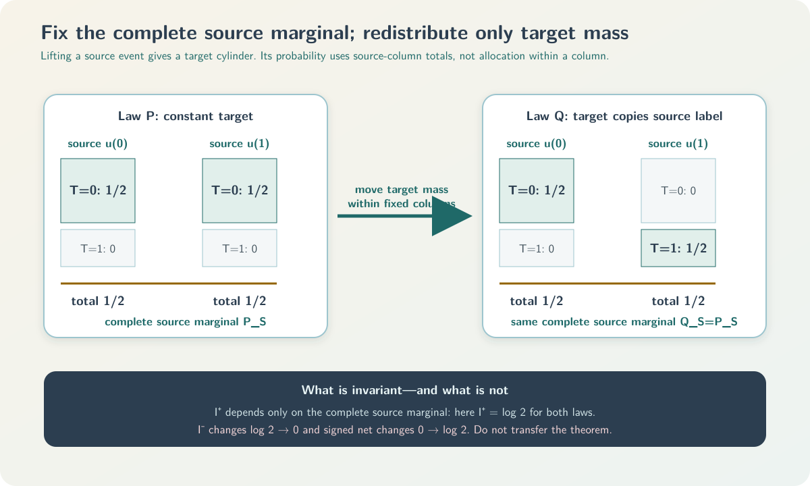

# Source-marginal factorization and a bounded exact audit of a declared categorical SxPID3 transcription

## Abstract

This report documents two related but logically separate project results for a supplied local
transcription intended to represent the finite categorical shared-exclusions PID of Makkeh,
Gutknecht, and Wibral (MGW). First, a generic
finite-alphabet theorem shows that every averaged informative cumulative factors exactly through
the complete joint source marginal. Consequently, any one fixed linear transform of those
cumulatives—including a separately justified Möbius inverse—is constant when that complete source
marginal is held fixed, even if the finite target alphabet or target-conditioned allocation
changes. A counterexample proves that this invariance does not transfer to the misinformative or
signed-net components.

Second, a bounded executable audit evaluates 108 keyed scalar expressions on every labelled binary
16-cell count vector with total count $1\le N\le5$. Here
$108=18\times2\times3$: 18 three-source antichain positions, two representation stages, and three
components. The number 166 instead belongs to the four-source redundancy lattice. Two
implementation-disjoint-under-shared-semantics exact routes produced the same route-neutral digest
and the same exact six-block sign/zero census under a source-bound execution receipt.

Neither result defines a new PID. Williams--Beer $I_{\min}$, BROJA, the Ehrlich continuous
shared-exclusions estimator, and KSG are not imported or identified with the categorical quantity
studied here. The bounded audit is exhaustive only on its declared sparse binary count domain. It
does not establish paper-to-code correspondence, compiled Rust numerical refinement, population
validity, estimator calibration, causality, or scientific priority.

## Status and claim boundary

This report explains two separate project-defined assurance results around a supplied transcription
of the paper-defined categorical shared-exclusions PID:

1. **Informative source-marginal factorization.** Under the finite-alphabet assumptions stated in
   Section 1, an averaged informative cumulative depends on the complete joint source marginal and
   not on the target-conditioned allocation. Equality survives any one fixed finite linear
   transform.
2. **Bounded SxPID3 keyed-scalar agreement.** Under the exact binary-count domain in Section 4,
   two exact routes agree on a declared stream digest and complete sign/zero census for 108 keyed
   scalar audit expressions.

These results do **not** correct the MGW/Wibral definition, prove that the local transcription
follows from the paper, certify compiled Rust numerics, or supply a statistical or application
theorem. The method remains paper-defined; the factorization proof, formalization, exact routes,
hostile tests, receipt lifecycle, and this report are project-defined assurance.

The historical labels “P1” and “P5” are avoided because the claim packet used similar labels for
other obligations. This report uses **factorization result** and **bounded audit**.

## Provenance firewall

| Ingredient | Provenance | Exact role here | Not transferred |
|---|---|---|---|
| Informative, misinformative, and signed-net categorical shared exclusions | MGW (2021) | Functional the audit is intended to transcribe | No automatic paper-to-checker correspondence |
| Antichain carrier and redundancy order | Williams and Beer (2010) | Lattice carrier and order | The $I_{\min}$ redundancy value is not used |
| Finite-poset Möbius inversion | Rota (1964) | Passage from cumulatives to atoms | No PID-specific conclusion follows from inversion alone |
| Source-marginal factorization | Project analysis of the paper-defined informative component | Exact theorem, fixed-transform corollary, and prohibited-transfer boundary | No new-PID or priority claim |
| Registry, finite corpus, census, neutral stream, and receipt | Project-defined validation | Bounded software assurance for a declared transcription | No general theorem, estimator, or population claim |

Sharing an antichain lattice does not identify two PID measures. Every PID-specific conclusion
below concerns categorical MGW shared exclusions only.

## 1. Objects and notation

**Standing assumptions for this section.** Fix nonempty finite source alphabets
$\mathcal S_1,\mathcal S_2,\mathcal S_3$, a nonempty finite target alphabet $\mathcal T$, and one
probability law $P$ on their complete Cartesian product, including zero-mass cells. All logarithms
are natural, so information is measured in nats. MGW write these definitions with $\log_2$ in
bits; for the same positive probability ratio $r>0$, the repository value is
$\log r=(\log 2)\log_2 r$. This fixed positive change of units preserves every equality and sign
used below but changes numerical magnitudes. Define

$$
\mathcal S=\mathcal S_1\times\mathcal S_2\times\mathcal S_3,
\qquad
\mathcal Z=\mathcal S\times\mathcal T.
$$

Let $S=(S_1,S_2,S_3)$ and $T$ be the coordinate projections. The complete joint source marginal is

$$
P_S(s)=\sum_{t\in\mathcal T}P(s,t).
$$

“Source marginal” always means the distribution of the complete tuple
$(S_1,S_2,S_3)$. It does not mean the three separate marginals and does not assume source
independence.

A three-source redundancy-lattice position $\alpha$ is a nonempty antichain of nonempty subsets of
$\{1,2,3\}$. For $s\in\mathcal S$, define the source-only shared-exclusions event

$$
\begin{aligned}
E_\alpha(s)
&=\left\{s'\in\mathcal S:
\exists a\in\alpha\;\forall i\in a,\;s'_i=s_i
\right\}.
\end{aligned}
$$

This is OR across antichain branches and AND within one branch. It is the local event supplied by
the repository transcription, with MGW (2021), Equation (6), as its intended paper anchor. Proving
that this supplied event, carrier, and order are exactly the publication objects remains a separate
correspondence obligation. In the complete source-target space the supplied event is the cylinder

$$
E_\alpha(s)\times\mathcal T.
$$

The target coordinate is absent from event membership. That typing fact is more informative than
saying that a target term happens to cancel numerically.

### 1.1 The 18/108/166 crosswalk

The source arity determines the carrier. Let $\mathcal L_n$ be the nonempty antichains of nonempty
subsets of $\{1,\ldots,n\}$. The Dedekind number $M(n)$ counts all antichains of the full Boolean
lattice. Removing the empty antichain and the singleton antichain $\{\varnothing\}$ gives, under
this declared carrier convention,

$$
|\mathcal L_3|=M(3)-2=20-2=18,
$$

and

$$
|\mathcal L_4|=M(4)-2=168-2=166.
$$

| Object | Count |
|---|---:|
| SxPID3 antichain positions | 18 |
| Usual SxPID3 signed-net atoms | 18 |
| One three-component cumulative block | $18\times3=54$ |
| One three-component atom block | $18\times3=54$ |
| Complete audit vector | $54+54=108$ |
| SxPID4 antichain positions and signed-net atoms | 166 |


The exact audit registry is

$$
\begin{aligned}
\mathcal R
&=\mathcal L_3
\times\{\text{cumulative},\text{atom}\}
\times\{+, -, \mathrm{net}\},\\
|\mathcal R|&=18\cdot2\cdot3=108.
\end{aligned}
$$

The 108 entries are not independent. Under the component convention used here,

$$
C^{\mathrm{net}}=C^+-C^-,
$$

and, for one fixed Möbius inverse $M$,

$$
\Pi^u=MC^u,
\qquad
\Pi^{\mathrm{net}}=\Pi^+-\Pi^-.
$$

Once $C^+$ and $C^-$ are known, the other four blocks are determined. Retaining all six blocks is
still valuable: it localizes event, component, lattice-orientation, inversion, and subtraction
defects that a final signed value could hide through cancellation.

### 1.2 Redundancy order, zeta transform, and the fixed 18-position registry

**Standing assumptions for this subsection.** Use the three-source antichain carrier just defined,
represent nonempty source subsets by masks `01` through `07`, and sort a multi-mask key first by
its number of masks (the antichain cardinality) and then lexicographically.

| Index | Stable key | Source collections |
|---:|---|---|
| 0 | `01` | $\{\{1\}\}$ |
| 1 | `02` | $\{\{2\}\}$ |
| 2 | `03` | $\{\{1,2\}\}$ |
| 3 | `04` | $\{\{3\}\}$ |
| 4 | `05` | $\{\{1,3\}\}$ |
| 5 | `06` | $\{\{2,3\}\}$ |
| 6 | `07` | $\{\{1,2,3\}\}$ |
| 7 | `01+02` | $\{\{1\},\{2\}\}$ |
| 8 | `01+04` | $\{\{1\},\{3\}\}$ |
| 9 | `01+06` | $\{\{1\},\{2,3\}\}$ |
| 10 | `02+04` | $\{\{2\},\{3\}\}$ |
| 11 | `02+05` | $\{\{2\},\{1,3\}\}$ |
| 12 | `03+04` | $\{\{1,2\},\{3\}\}$ |
| 13 | `03+05` | $\{\{1,2\},\{1,3\}\}$ |
| 14 | `03+06` | $\{\{1,2\},\{2,3\}\}$ |
| 15 | `05+06` | $\{\{1,3\},\{2,3\}\}$ |
| 16 | `01+02+04` | $\{\{1\},\{2\},\{3\}\}$ |
| 17 | `03+05+06` | $\{\{1,2\},\{1,3\},\{2,3\}\}$ |

Define the redundancy order by

$$
\alpha\preceq\beta
\quad\Longleftrightarrow\quad
\forall b\in\beta\;\exists a\in\alpha:\;a\subseteq b.
$$

MGW Equation (13) supplies the pointwise zeta relation for the signed-net component; Equations
(14a), (15a), and (15b) define the split, and their Appendix A supplies componentwise Möbius
inversion. For every supported $z$, and for $u\in\{+,-,\mathrm{net}\}$, the pointwise relation is
$i_i^u(z)=\sum_jZ_{ij}\pi_j^u(z)$. Equation (17), applied componentwise, then commutes with that
finite zeta sum:

$$
\begin{aligned}
C_i^u
&=\sum_{z:P(z)>0} P(z)i_i^u(z)\\
&=\sum_{z:P(z)>0} P(z)\sum_j Z_{ij}\pi_j^u(z)\\
&=\sum_j Z_{ij}\sum_{z:P(z)>0} P(z)\pi_j^u(z).
\end{aligned}
$$

Writing $\Pi_j^u=\sum_{z:P(z)>0}P(z)\pi_j^u(z)$ gives the averaged zeta relation below. The support
restriction avoids the undefined expression $0$ times a local value outside its domain. This short
bridge is why pointwise inversion may be reused after averaging; it does not by itself establish
that the supplied registry and order are the paper's intended ones.

With cumulatives as rows and atoms as columns, define

$$
Z_{ij}=\mathbf1\{\alpha_j\preceq\alpha_i\},
\qquad
C_i^u=\sum_{j=0}^{17}Z_{ij}\Pi_j^u,
\qquad
M=Z^{-1}.
$$

Thus

$$
\Pi_i^u=\sum_{j=0}^{17}M_{ij}C_j^u.
$$

The complete row signatures and sparse inverse are frozen in
`claims/SX-CERTIFIED-AVERAGED-PID3-001/conventions.md`.
The matrix has 129 ones; its inverse has 65 nonzero entries in $\{-1,1\}$; and both $MZ=I_{18}$
and $ZM=I_{18}$ are required. Those identities alone do not prove that the entries implement the
paper-defined event semantics.

### 1.3 A two-source inversion example

**Standing assumptions for this example.** Use the conventional two-source four-position carrier,
the same down-set orientation as above, and one component $u$. The label $1.2$ denotes the
antichain $\{\{1\},\{2\}\}$; it is not a decimal number. Writing
$C_{1},C_{2},C_{12},C_{1.2}$ for the corresponding cumulatives, Möbius inversion gives atoms such
as

$$
\Pi_{1}=C_{1}-C_{1.2},
\qquad
\Pi_{2}=C_{2}-C_{1.2}.
$$

The example shows why the direction of $Z$ and the distinction between cumulative and atom stages
are load-bearing. It is illustrative only; it is not evidence for the 18-position transcription.

## 2. Informative source-marginal factorization

**Standing assumptions for this section.** Continue with the probability law $P$ on the finite
product $\mathcal S\times\mathcal T$ fixed in Section 1. Evaluate local values only at supported
$(s,t)$, so $P(s,t)>0$. Define the target fibre $F_t=\mathcal S\times\{t\}$. The anchored event
contains $s$, so $P(E_\alpha(s)\times\mathcal T)$,
$P((E_\alpha(s)\times\mathcal T)\cap F_t)$, and $P(F_t)$ are all positive and every logarithm below
is defined.

For a supported realization, the local informative, misinformative, and signed-net components are

$$
\begin{aligned}
i^+_\alpha(s,t;P)
&=-\log P(E_\alpha(s)\times\mathcal T),\\
i^-_\alpha(s,t;P)
&=\log\frac{P(F_t)}{P((E_\alpha(s)\times\mathcal T)\cap F_t)},\\
i^{\mathrm{net}}_\alpha(s,t;P)
&=i^+_\alpha(s,t;P)-i^-_\alpha(s,t;P)\\
&=\log\frac{P((E_\alpha(s)\times\mathcal T)\cap F_t)}
{P(E_\alpha(s)\times\mathcal T)P(F_t)}.
\end{aligned}
$$

The source anchors used by this transcription are MGW Equations (14a), (15a), and (15b) for the
directed local split and Equation (17) for the joint-law averaging convention, applied to the
split componentwise by linearity. Citing those equations does not discharge the paper-to-local
correspondence obligation.

For every component $u\in\{+,-,\mathrm{net}\}$, define its averaged cumulative by

$$
\begin{aligned}
I^u_\alpha(P)
&=\sum_{s,t:P(s,t)>0}P(s,t)i^u_\alpha(s,t;P).
\end{aligned}
$$

For $u=+$, the absence of $t$ from the local logarithm is visible, but this average initially uses
joint weights.

Because

$$
\begin{aligned}
P(E_\alpha(s)\times\mathcal T)
&=\sum_{s'\in E_\alpha(s)}P_S(s'),
\end{aligned}
$$

the finite sum can be regrouped over $t$:

$$
\begin{aligned}
I^+_\alpha(P)
&=
\sum_{s,t:P(s,t)>0}P(s,t)
\left[-\log\sum_{s'\in E_\alpha(s)}P_S(s')\right]\\
&=
\sum_{s:P_S(s)>0}P_S(s)
\left[-\log\sum_{s'\in E_\alpha(s)}P_S(s')\right]\\
&=:G_\alpha(P_S).
\end{aligned}
$$

The load-bearing equality is $\sum_tP(s,t)=P_S(s)$. The theorem therefore proves a factorization

$$
P_{S,T}\longmapsto P_S\longmapsto G_\alpha(P_S).
$$

### 2.1 Exact invariance consequence

**Standing assumptions for this consequence.** Let $P$ and $Q$ have the same finite source
alphabet and the same complete joint source marginal. Their finite target alphabets may differ,
because the target has already been marginalized out. Then

$$
P_S=Q_S
\quad\Longrightarrow\quad
I^+_\alpha(P)=I^+_\alpha(Q).
$$

Define the complete informative cumulative vector by
$C^+(P):=(I^+_{\alpha_i}(P))_{i=0}^{17}$. For one literally fixed finite matrix $M$, linearity
gives

$$
\Pi^+(P)=M C^+(P)=M C^+(Q)=\Pi^+(Q).
$$

Calling $M$ a Möbius inverse requires a separate proof that it is the inverse for the intended
carrier, order, orientation, and key registry.

### 2.2 What was fixed and what was allowed to change

Fixed: source alphabets, source-only event family, complete source marginal, logarithm base, units,
and any transformed-coordinate matrix. Allowed to change: target alphabet and the allocation of
each source tuple's joint mass among target values—equivalently, a target kernel on positive-mass
source tuples. Not allowed: changing the source event, quantizer, source alphabet, lattice,
coordinate order, or matrix while calling the result the same theorem.

### 2.3 Probability semantics and the algebraic theorem

The executable routes use integer counts and exact positive rational products. The law-level proof
above instead concerns exact real probabilities and logarithms. Their correspondence requires the
count-to-empirical-law bridge in Section 3; neither representation may silently stand in for the
other.

The generic Lean theorem at
the [Lean informative-invariance development](audit/formal/lean-sxpid3-informative-invariance/PidSxPid3InformativeInvariance.lean)
formalizes supplied finite events and a supplied linear transform. It does not by itself prove
that those supplied objects equal the publication objects.

### 2.4 Retained prohibited-transfer witness

**Standing assumptions for this counterexample.** Take source support
$u^{(0)}=(0,0,0)$ and $u^{(1)}=(1,1,1)$, each with probability $1/2$, and use the full-source
cumulative event $\alpha=\{\{1,2,3\}\}$. Compare one constant target with a target that copies the
source-state label.
Then

$$
I^+_{\{\{1,2,3\}\}}=H(S)=\log2
$$

under both laws, while

$$
I^-_{\{\{1,2,3\}\}}:\log2\longrightarrow0,
\qquad
I^{\mathrm{net}}_{\{\{1,2,3\}\}}:0\longrightarrow\log2.
$$



This is not a missing proof for minus/net invariance. It is a counterexample to that invariance.

**Standing assumptions for the separate-marginals counterexample.** On the common binary source
alphabet, let

$$
P_S=\tfrac12\delta_{000}+\tfrac12\delta_{111},
$$

and

$$
Q_S=\tfrac14(\delta_{000}+\delta_{011}+\delta_{101}+\delta_{110}).
$$

Every individual source is Bernoulli$(1/2)$ under both laws, but at the full-source event
$\alpha=\{\{1,2,3\}\}$,

$$
I^+_{\{\{1,2,3\}\}}(P)=\log2,
\qquad
I^+_{\{\{1,2,3\}\}}(Q)=\log4.
$$

Thus the theorem factors through $P_{S_1,S_2,S_3}$, not through the list of one-source marginals;
those separate marginals do not determine the complete informative vector.

### 2.5 What remains after the factorization is proved

The short algebra does not close the following obligations:

- correspondence between local source events and the paper-defined events;
- completeness and order of the intended 18-position carrier;
- the intended zeta orientation and Möbius inverse;
- bytes-to-counts and counts-to-law decoding;
- compiled Rust or binary64 refinement;
- sampling assumptions, estimator calibration, causality, and application validity.

The defensible description is an elementary but reusable law-level lemma with explicit scope, a
mechanized generic algebraic layer, and a retained falsifier for a tempting false transfer.

### 2.6 Relation to continuity

**Standing assumptions for this subsection.** Let $P$ and $Q$ be probability laws on finite
source-target products with one declared common finite source alphabet, the same supplied
source-only event family, and natural logarithms. Their target alphabets may differ. Let $P_S$ and
$Q_S$ be their complete joint source marginals, and let

$$
\eta_S=d_{\mathrm{TV}}(P_S,Q_S)
=\frac12\sum_s|P_S(s)-Q_S(s)|.
$$

Define overlap $r_s^\cap=\min\{P_S(s),Q_S(s)\}$, residuals
$a_s=P_S(s)-r_s^\cap$ and $b_s=Q_S(s)-r_s^\cap$, and

$$
\begin{aligned}
E_\vee^S
&=\max\left\{
-\sum_{a_s>0}a_s\log a_s,
-\sum_{b_s>0}b_s\log b_s
\right\}.
\end{aligned}
$$

These definitions imply $0\le\eta_S\le1$, $a_s,b_s\ge0$,
$\sum_sa_s=\sum_sb_s=\eta_S$, and $a_sb_s=0$ for every $s$. Thus $E_\vee^S$ is the larger of two
subprobability-residual entropy sums, with the zero terms omitted; it is not the Shannon entropy of
either normalized residual law.

For $J\ge1$ and $0<\eta<1$, define

$$
g_J(\eta)
=(1-\eta)\log\left(1+\frac{J\eta}{1-\eta}\right),
$$

with $g_J(0)=g_J(1)=0$. The separately proved support-change theorem then gives, for
$J_\alpha=|\alpha|$,

$$
|I^+_\alpha(P)-I^+_\alpha(Q)|
\le E_\vee^S+g_{J_\alpha}(\eta_S).
$$

For one fixed matrix $M$,

$$
|\Pi_i^+(P)-\Pi_i^+(Q)|
\le
\sum_\alpha|M_{i\alpha}|
\left[E_\vee^S+g_{J_\alpha}(\eta_S)\right].
$$

The support-change theorem applies because every antichain branch is the coordinate-projection
equivalence class

$$
B_a(s)=\{s':\forall i\in a,\ s'_i=s_i\},
$$

the supplied Sx event is exactly $E_\alpha(s)=\bigcup_{a\in\alpha}B_a(s)$, and therefore the number of
branches in that theorem is $J_\alpha=|\alpha|$. No different event geometry is being smuggled
into the continuity bound.

The function $g_J$ is not globally monotone, so a radius bound must not be substituted blindly.
This is a deterministic stability statement, not a confidence bound. A separate statistical
theorem is required to justify a random radius for an empirical law. The full theorem and its
negative results are in
[`SUPPORT_CHANGE_TOLERANT_AVERAGED_SXPID_CONTINUITY.md`](SUPPORT_CHANGE_TOLERANT_AVERAGED_SXPID_CONTINUITY.md).

## 3. Exact finite-count formulation used by the bounded audit

**Standing assumptions for this section.** There are exactly three ordered binary sources and one
binary target. A labelled 16-cell table has nonnegative integer counts $c_z$ and total
$N=\sum_zc_z>0$. Let $\mathcal Z_+=\{z:c_z>0\}$. Every supported state occurs once in the keyed
representation and is weighted by its count, not uniformly over distinct keys.

For supported $z=(s,t)$, first define the lifted events

$$
E_\alpha(z)
=\{(s',t'):s'\in E_\alpha(s),\ t'\in\{0,1\}\},
\qquad
T(z)=\{(s',t'):t'=t\}.
$$

Thus $E_\alpha(z)$ is the lifted source cylinder and $T(z)$ is the target fibre. The count vector
induces the exact empirical law

$$
\widehat P_c(z')=\frac{c_{z'}}N.
$$

Define the exact
integer masses

$$
U_{\alpha,z}=\sum_{z'\in E_\alpha(z)}c_{z'},
\quad
V_{\alpha,z}=\sum_{z'\in E_\alpha(z)\cap T(z)}c_{z'},
\quad
T_z=\sum_{z'\in T(z)}c_{z'}.
$$

Because the anchored state $z$ belongs to all required events,

$$
0<c_z\le V_{\alpha,z}\le U_{\alpha,z}\le N,
\qquad
V_{\alpha,z}\le T_z\le N.
$$

Direct summation under $\widehat P_c$ gives the promised count-to-law bridge:

$$
\widehat P_c(E_\alpha(z))=\frac{U_{\alpha,z}}N,
\qquad
\widehat P_c(E_\alpha(z)\cap T(z))=\frac{V_{\alpha,z}}N,
\qquad
\widehat P_c(T(z))=\frac{T_z}N.
$$

Substitution into the three law-level definitions in Section 2 gives the well-defined local count
forms

$$
i^+_\alpha(z)=\log\frac{N}{U_{\alpha,z}},
$$

$$
i^-_\alpha(z)=\log\frac{T_z}{V_{\alpha,z}},
$$

and

$$
i^{\mathrm{net}}_\alpha(z)
=\log\frac{NV_{\alpha,z}}{U_{\alpha,z}T_z}.
$$

For each cumulative, the exact positive-rational products are

$$
Q^+_\alpha
=\prod_{z\in\mathcal Z_+}
\left(\frac{N}{U_{\alpha,z}}\right)^{c_z},
$$

$$
Q^-_\alpha
=\prod_{z\in\mathcal Z_+}
\left(\frac{T_z}{V_{\alpha,z}}\right)^{c_z},
$$

and

$$
Q^{\mathrm{net}}_\alpha=\frac{Q^+_\alpha}{Q^-_\alpha}.
$$

Under these assumptions the averaged cumulative is

$$
\begin{aligned}
C^u_\alpha
&=\frac1N\sum_{z\in\mathcal Z_+}c_z i^u_\alpha(z)\\
&=\frac1N\log Q^u_\alpha.
\end{aligned}
$$

**Standing assumptions for the transformed products.** Use the fixed integer Möbius inverse
$M$ from Section 1.2 and the positive cumulative products above. For atom key $\gamma$, define

$$
Q^u_{\gamma,\mathrm{atom}}
=\prod_\alpha\left(Q^u_\alpha\right)^{M_{\gamma\alpha}},
\qquad
\Pi^u_\gamma
=\frac1N\log Q^u_{\gamma,\mathrm{atom}}.
$$

Negative entries of $M$ create reciprocal factors but no zero or undefined product. Since every
product is strictly positive and $N>0$, exact classification uses

$$
Q=1\Longleftrightarrow \frac1N\log Q=0,
$$

$$
Q>1\Longleftrightarrow \frac1N\log Q>0,
\qquad
Q<1\Longleftrightarrow \frac1N\log Q<0.
$$

No floating-point tolerance participates in this sign/zero decision.

## 4. Why there are 20,348 tables

**Standing assumptions for this count.** Treat all 16 binary joint cells as labelled and count
every nonnegative integer vector with total mass between one and five. For one fixed $N$, write the
$N$ observations as stars and use 15 separators to split them among the 16 labelled cells.
Choosing the star/separator arrangement gives $\binom{N+15}{15}$ vectors. Pascal's identity in
telescoping form, $\binom{k}{15}=\binom{k+1}{16}-\binom{k}{16}$, then gives

$$
\sum_{N=1}^{5}\binom{N+15}{15}
=\binom{21}{16}-1
=20{,}348.
$$

The totals contribute respectively

$$
16,\ 136,\ 816,\ 3{,}876,\ 15{,}504.
$$

Only 20,164 vectors represent primitive rational laws; 184 are integer rescalings. The latter
count is also explicit: totals two, three, and five each have 16 nonprimitive point-mass vectors,
while the nonprimitive total-four vectors are exactly the 136 vectors obtained by doubling every
total-two vector. Hence $16+16+136+16=184$. The audit nevertheless retains all 20,348 vectors
because replicated counts are executable regression cases. There are no full-support 16-cell laws
in this sparse domain because $N\le5$.

With 108 expressions per table, each route evaluates

$$
20{,}348\times108=2{,}197{,}584
$$

strictly positive exact products.

## 5. The two exact routes and what “agreement” means

**Standing assumptions for this evidence statement.** The receipt is accepted only after its
schema, source bindings, command statuses, stdout/stderr digests, normal/optimized parity, and
source-state checks pass. Under that recorded boundary, the primary route and the independently
implemented exact route emitted the same route-neutral v2 expression-stream SHA-256:

```text
20c234cc664ad903aa66689d33d95b2db5bca5da3b0f9ee0b497d1246e3139b8
```

The primary and independent routes also emitted identical six-block exact sign/zero censuses. They
are implementation-disjoint under shared semantics, not logically independent: both retain the
human paper transcription, declared registry, Python runtime class, and other documented premises.

The routes differ in their executable mechanisms:

| Layer | Primary route | Independent route |
|---|---|---|
| Table enumeration | Recursive weak compositions | Lexicographic stars-and-bars unranking |
| Exact arithmetic | Python `Fraction` | Signed prime-exponent vectors |
| Event mass | Direct membership scan | Cylinder marginals and inclusion--exclusion |
| Atom transform | Fixed exact inverse-product rows | Recursive subtraction on the declared poset |
| Native stream | Primary-specific framing | Independent-route-specific framing |

Because $1\le N\le5$, every positive integer mass entering a ratio belongs to
$\{1,2,3,4,5\}$. Its prime factorization therefore uses only $2$, $3$, and $5$, making the second
route's exponent vector exact on this bounded domain. This representation argument would have to
change for a larger total-count bound.

Both routes separately serialize each freshly computed result into the same neutral-v2 frame. A
frame binds the table ordinal, all 16 labelled counts, expression index, ASCII key, exact exponents
of $2$, $3$, and $5$, and the sign class. Neither route reads a per-table answer key or imports a
pid-rs floating-point result. Expected aggregate pins are compared only after the route has
recomputed and streamed every table-expression pair.

The receipt does not claim a direct record-by-record comparison of two retained output streams.
It records agreement through one neutral stream digest plus the six census blocks. SHA-256 binds
bytes under the stated host assumptions; it is not authenticity, authorship, or scientific truth.

A third lane lexically examines the Rust sources. It checks declared source anchors and
configuration boundaries but computes zero Rust numerical values. It therefore does not establish
Rust parsing, name resolution, compilation, execution, binary64 refinement, or keyed numerical
agreement.

Source inspection and hostile tests found no per-table answer table, endpoint-specific forced-value
branch, or cross-route import of numerical output. Those controls reduce these risks; they cannot
eliminate fabrication, a shared mistranscription, a coordinated erroneous change followed by
resealing the expected aggregate hashes, a framing defect, or compromise of the common
runtime/host. The correct description is therefore “implementation-disjoint under shared
semantics,” not “independent proof.”

## 6. Exact sign/zero census

**Standing assumptions for this table.** Within each block, every pair consisting of one labelled
count vector and one of the 18 antichain keys has unit weight. Thus each table contributes 18
classifications to each block, for 366,264 classifications per block. These classifications are
not weighted by prevalence or probability. Every classification is made by exact comparison of a
strictly positive rational product $Q$ with one.

| Stage and component | Negative | Positive | Zero | Total |
|---|---:|---:|---:|---:|
| cumulative informative | 0 | 321,856 | 44,408 | 366,264 |
| cumulative misinformative | 0 | 278,984 | 87,280 | 366,264 |
| cumulative net | 29,496 | 252,816 | 83,952 | 366,264 |
| atom informative | 0 | 145,100 | 221,164 | 366,264 |
| atom misinformative | 0 | 71,468 | 294,796 | 366,264 |
| atom net | 31,284 | 96,768 | 238,212 | 366,264 |

Every row totals $20{,}348\times18=366{,}264$. Negative signed-net cumulatives and atoms are exposed,
not clamped. Informative and misinformative component entries are nonnegative on this bounded
corpus; this census is not itself the general component-nonnegativity theorem.

**Standing assumptions for one retained negative witness.** Give count one to exactly

$$
(S_1,S_2,S_3,T)\in
\{(1,0,1,1),(1,1,0,1),(1,1,1,0)\},
$$

and count zero to every other labelled cell, so $N=3$. At atom key `02+04`, the exact informative,
misinformative, and signed-net products are respectively

$$
\frac94,\qquad 4,\qquad \frac9{16}.
$$

Hence

$$
\Pi^{\mathrm{net}}_{\texttt{02+04}}
=\frac13\log\frac9{16}<0.
$$

This is a finite categorical functional value, not a causal or population interpretation.

### 6.1 The 108 expressions are algebraically dependent

The receipt records 18 cumulative and 18 atom net-equals-plus-minus identities and 54 zeta
reconstruction identities. It explicitly does not adjudicate a “base rank” or statistical
independence of components. The expanded registry is an audit design, not a claim of 108
mathematical degrees of freedom.

## 7. Formal, executable, and receipt evidence

### 7.1 Factorization-result evidence

The finite-event and fixed-transform algebra is checked in Lean, with the paper-to-supplied-event
correspondence retained as an external premise. The parity checker compares Lean declarations with
the executable theorem inventory. This supports the algebraic implication within its theorem
statement; it does not validate the publication transcription or estimator semantics.

### 7.2 Bounded-audit evidence

The authoritative receipt is
the [source-bound bounded-audit receipt](audit/evidence/sxpid3-bounded-keyed-scalar-audit-expressions-receipt-v1-2026-08-26.json).
It binds:

- the receipt schema and exact source inputs;
- primary and independent exact lanes in normal and optimized Python;
- both mutation/self-test suites in normal and optimized Python;
- the lexical Rust route and its self-test;
- stdout, stderr, source, runtime, Git, and host observations;
- the exact domain, digests, census, algebraic dependencies, and nonclaims.

The receipt supplies bounded local execution provenance. It explicitly supplies no external
custody, replay, trusted timestamp, authenticity, general theorem, or semantic-transfer authority.

## 8. Current certificate-obligation status

The complete certificate program remains open. In particular:

| Obligation | Current status |
|---|---|
| Paper-to-local event correspondence | External premise; open |
| Exact source-marginal algebra | Analytically and generically formally supported |
| Bounded two-route exact agreement | Supported on the declared $N\le5$ corpus |
| Concrete three-source carrier/order proof in two formal systems | Open |
| Exact logarithm magnitude enclosure | Open for this 108-expression package |
| Keyed compiled-Rust numerical refinement | Open |
| Two-route executable product audit beyond binary alphabets or $N\le5$ | Open |
| Population/statistical validity | Outside this deterministic claim |

A complete certificate would need canonical decoding, exact event/count reconstruction, the
concrete carrier and order, exact products, directed logarithm intervals, resource preflight,
keyed Rust refinement, mutation evidence, and independently replayed custody. The bounded receipt
is evidence for some of those obligations, not a substitute for all of them.

## 9. Computational cost and estimator impact

The factorization is an algebraic reuse result. Once the complete source marginal and source-event
probabilities are available, changing only the target allocation requires no recomputation of the
informative cumulatives. A fixed transformed informative vector is one matrix-vector operation.

The bounded audit is intentionally expensive but finite: each exact route evaluates 2,197,584
products plus registry, mutation, and framing controls. Big-integer cost depends on count size and
intermediate bit length; calling the number of scalar expressions finite is not a constant-bit-cost
claim.

No new estimator is required to evaluate these deterministic identities on a *supplied* finite
categorical probability law or count table. Inferring a population categorical Sx quantity from
sampled data still requires an explicitly specified estimator: the empirical plug-in law is one
choice, and its bias, consistency regime, uncertainty, and dependence assumptions remain separate
statistical questions. Moving to continuous variables requires a matching continuous estimand and
estimation theory. Quantization changes the estimand and must be fitted and reported rather than
treated as a transparent bridge.

Practical implementations should cache source-only event counts, use exact keys rather than array
positions, preflight memory and projected integer size, and reserve exact products for validation
or escalation when a fast floating path is insufficient. Any optimization of the exact audit path
must retain the same event semantics and the exact positive-rational product computed from event
counts and compared with one—not an answer table, tolerance rule, or imported Rust output. A fast
production path need not compute that product on every call, but it must preserve the declared
semantics and remain checked against exact fixtures in the domains for which agreement is claimed.

## 10. Why these results are useful

### 10.1 Mathematical use

- The factorization isolates precisely which part of categorical Sx depends only on the complete
  source marginal.
- The target-allocation counterexample prevents a false extension to misinformative and net terms.
- The 18/108/166 crosswalk prevents a bookkeeping vector from being mistaken for a lattice.
- Exact products make zero and sign questions algebraic rather than tolerance-dependent.
- The census demonstrates that negative signed-net atoms occur inside the declared finite domain.

### 10.2 Engineering use

- Cache informative coordinates across target permutations that preserve source rows.
- Test event extraction, component signs, Möbius orientation, and net subtraction separately.
- Compare implementations by stable antichain key, not positional array index.
- Use the finite corpus as a strong regression gate for a declared transcription.
- Preserve negative and exact-zero cases as mandatory mutation targets.

### 10.3 Example application interpretations

1. **Neuroscience target surrogates.** When spike-pattern sources are fixed and behavioural labels
   are permuted, the categorical informative coordinates can be reused. Exchangeability and the
   validity of the surrogate design remain separate statistical obligations.
2. **Distributed-system monitoring.** If source-state frequencies are unchanged while an outcome
   label allocation changes, the factorization distinguishes reusable source geometry from
   target-conditioned computation. It does not make the PID causal.
3. **Genomic categorical screens.** Exact-count fixtures can detect lattice-key or sign regressions
   in a fast implementation. Population inference still needs a sampling model and multiplicity
   control.
4. **Cross-library comparison.** The 108-key registry can diagnose where two Sx transcriptions
   disagree. It cannot equate Sx with BROJA, $I_{\min}$, or another PID.

## 11. Explicit nonclaims and negative results

- The factorization does not extend in general to misinformative or signed-net components.
- Three individual source marginals do not determine the complete informative vector.
- The bounded audit is not an arbitrary-alphabet or arbitrary-total theorem.
- Agreement is not paper-to-code correspondence and not logical independence.
- The lexical Rust lane is not compiled numerical refinement.
- Exact products classify sign and zero but do not enclose nonzero logarithm magnitude.
- No binary64 correctness, portable logarithm, estimator calibration, confidence coverage,
  population PID, causal interpretation, or application decision is established.
- Negative signed-net atoms are legitimate and must not be clamped.
- Within each census block, every labelled-table/antichain-key pair has unit weight. Each table
  therefore contributes 18 classifications; the census is not a probability distribution over
  empirical laws or datasets.
- The receipt provides repository custody, not authenticity, authorship, priority, or attestation.

## 12. Reproduction entry points

Run the authoritative receipt checker and its mutation suite with the required isolated Python
flags:

```text
python3 -I -S -B scripts/check-sxpid3-bounded-keyed-scalar-audit-expressions-receipt-v1.py --committed-or-preserved
python3 -O -I -S -B scripts/check-sxpid3-bounded-keyed-scalar-audit-expressions-receipt-v1.py --committed-or-preserved
python3 -I -S -B scripts/check-sxpid3-bounded-keyed-scalar-audit-expressions-receipt-v1-self-test.py
python3 -O -I -S -B scripts/check-sxpid3-bounded-keyed-scalar-audit-expressions-receipt-v1-self-test.py
```

The committed-or-preserved mode intentionally requires complete Git history and an exactly clean
worktree. Run it from a clean checkout of the commit under review; a shallow or dirty checkout is a
fail-closed result, not evidence failure to be bypassed.

The source-marginal algebra and its formal/hostile checks use the separate pinned Lean lane:

```text
(cd audit/formal/lean && lake exe cache get)
python3 -I -S -B scripts/check-lean-sxpid3-informative-invariance.py
python3 -O -I -S -B scripts/check-lean-sxpid3-informative-invariance.py
python3 -I -S -B scripts/check-lean-sxpid3-informative-invariance-self-test.py
python3 -O -I -S -B scripts/check-lean-sxpid3-informative-invariance-self-test.py
python3 -I -S -B scripts/check-lean-sxpid3-informative-invariance-parity.py
```

The parity checker binds exact source and dependency bytes and compares the declared theorem
inventory with kernel-checked output. It does not close the publication-object correspondence or
the concrete Rust/count refinement.

The underlying exact lanes and their hostile tests are:

```text
python3 -I -S -B scripts/check-sxpid3-bounded-full-coordinates.py
python3 -O -I -S -B scripts/check-sxpid3-bounded-full-coordinates.py
python3 -I -S -B scripts/check-sxpid3-bounded-full-coordinates-self-test.py
python3 -O -I -S -B scripts/check-sxpid3-bounded-full-coordinates-self-test.py
python3 -I -S -B scripts/check-sxpid3-all108-independent.py
python3 -O -I -S -B scripts/check-sxpid3-all108-independent.py
python3 -I -S -B scripts/check-sxpid3-all108-independent-self-test.py
python3 -O -I -S -B scripts/check-sxpid3-all108-independent-self-test.py
python3 -I -S -B scripts/check-sxpid3-p5-rust-source-route.py
python3 -O -I -S -B scripts/check-sxpid3-p5-rust-source-route.py
python3 -I -S -B scripts/check-sxpid3-p5-rust-source-route-self-test.py
python3 -O -I -S -B scripts/check-sxpid3-p5-rust-source-route-self-test.py
```

The two-source count/event bridge is documented in the
[two-source bridge note](audit/formal/TWO_SOURCE_SXPID_COUNT_ATOM_BRIDGE.md).
It is adjacent evidence, not a proof of the full three-source executable route.

## References

- Abdullah Makkeh, Aaron J. Gutknecht, and Michael Wibral, “Introducing a Differentiable Measure
  of Pointwise Shared Information,” *Physical Review E* 103, 032149 (2021),
  [doi:10.1103/PhysRevE.103.032149](https://doi.org/10.1103/PhysRevE.103.032149). Equation anchors
  in this report were checked against
  [arXiv:2002.03356v5](https://arxiv.org/abs/2002.03356v5).
- Aaron J. Gutknecht, Michael Wibral, and Abdullah Makkeh, “Bits and Pieces: Understanding
  Information Decomposition from Part-Whole Relationships and Formal Logic,” *Proceedings of the
  Royal Society A* 477, 20210110 (2021),
  [doi:10.1098/rspa.2021.0110](https://doi.org/10.1098/rspa.2021.0110).
- Paul L. Williams and Randall D. Beer, “Nonnegative Decomposition of Multivariate Information”
  (2010), [arXiv:1004.2515](https://arxiv.org/abs/1004.2515). This is the source for the lattice
  carrier, not for the MGW redundancy value.
- Nils Bertschinger, Johannes Rauh, Eckehard Olbrich, Jürgen Jost, and Nihat Ay, “Quantifying
  Unique Information,” *Entropy* 16, 2161–2183 (2014),
  [doi:10.3390/e16042161](https://doi.org/10.3390/e16042161). It identifies the distinct BROJA
  family and is not transferred into the categorical Sx result.
- David A. Ehrlich, Kyle Schick-Poland, Abdullah Makkeh, Felix Lanfermann, Patricia Wollstadt, and
  Michael Wibral, “Partial Information Decomposition for Continuous Variables Based on Shared
  Exclusions,” *Physical Review E* 110, 014115 (2024),
  [doi:10.1103/PhysRevE.110.014115](https://doi.org/10.1103/PhysRevE.110.014115). Its continuous
  estimator is not identified with this finite categorical audit.
- Gian-Carlo Rota, “On the Foundations of Combinatorial Theory I. Theory of Möbius Functions,”
  *Zeitschrift für Wahrscheinlichkeitstheorie und Verwandte Gebiete* 2, 340–368 (1964),
  [doi:10.1007/BF00531932](https://doi.org/10.1007/BF00531932).
- OEIS Foundation, “A000372: Dedekind numbers,”
  [oeis.org/A000372](https://oeis.org/A000372). Only the standard small antichain counts are used;
  the PID carrier restrictions are stated separately above.
