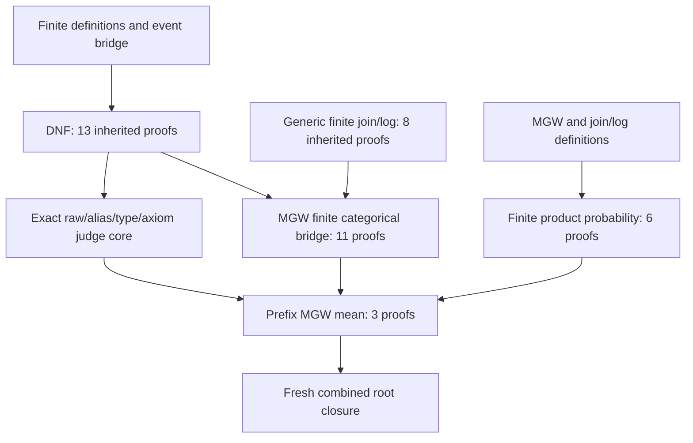

# Source, proof and acceptance dependencies

The package contains the **24 exact modules compiled in the accepted mean closure**. Eighteen are inherited dependencies, three are frozen mean target views, two are the mean candidate and semantic judge, and one is the root import module. A successful full route compiles all 24 and then performs one fresh-kernel check. Source copies are intentional immutable snapshots; the replay never substitutes a current aggregate-project module.

The graph has three distinct kinds of edge: a Lean import, reuse of an already accepted theorem family, and the scientific correspondence identifying the mathematical object. None of those edges publishes a pending package automatically.

| Family | Accepted source identity used here | Public status at proposal preparation | Role in this package |
|---|---|---|---|
| DNF/order, 13 | `MgwBridgeDepsV1/SxDnf/Proofs.lean`, `04cc028cc9a7321b96445345a55e44c5bbda62b7697819e31726a880265f0eda` | [Existing public package](../lean-sx-dnf-order/README.md) | Previously accepted qualified import of its proofs; inherited judge core and event definitions. |
| Generic join/log, 8 | `MgwBridgeDepsV1/JoinLog/Proofs.lean`, `a43d99a15947db5641cfb69bcf8a634d1c651ff5ad2ddea33630a36d5113360b` | Standalone public package proposal remains pending | Nonnegative inverse, finite join convolution, logarithmic series and support results reused by MGW. |
| MGW bridge, 11 | `PidMgwBridge/Candidate.lean`, `a4eb24978708267394d27b4c4127e40243061c7a2b0790a28bb6bd8411f69453` | Standalone public adapter/replay remains pending | Actual raw order and join, mismatch weights, conditional law, support domains, and unique MGW component inverses. |
| Prefix probability, 6 | `PidPrefixProbability/Candidate.lean`, `2e0e56e5921f07601169d7bf18f8bc672a4bf386838275540364d002e3e43323` | Standalone public adapter/replay remains pending | Actual finite product measures, integrals, retained target ranks, bounds and block independence. |
| Prefix MGW mean, 3 | `PidPrefixMgwMean/Candidate.lean`, `17fc2d8fce5ad0ba28cc8348e9348911c393e6eb00515c8139fbd27b85331b6a` | This new source proposal; public replay pending | Word/convolution correspondence, exact block expectation, component series and mean limit. |

The separate probability closure imports MGW and join/log definitions, but it does **not** import their proof candidates. The mean closure does import both proof candidates. This distinction prevents a six-proof probability replay from receiving credit for the eleven MGW or eight generic results.

The mean semantic root emits three new mean records and checks the inherited eleven MGW and six probability records against their accepted arrays. The thirteen DNF and eight generic exports are in the fresh dependency closure, but this mean route does not produce separate new 13-record or 8-record family reports. Recompilation, cosmetic repetitions, raw/alias views and controls add no distinct proof families. The headline result remains three mean targets.

## Exact transport already accepted before this package

The original isolated DNF candidate has SHA-256 `af925aacc56cf765e875ba8bdce41e62139fc9c8be9317a87e5d63df69cf7af2`. Its previously accepted composition snapshot differs only in the first line, `import Contract` becoming `import MgwBridgeDepsV1.SxDnf.Contract`. The original generic candidate has SHA-256 `ae1ff72723795038f58ed1c052f1f538be41bbd588cff2b502cc802cf67ffb6f`; its composition snapshot similarly imports `MgwBridgeDepsV1.JoinLog.Contract`. The theorem namespaces and bodies are unchanged. The [transport diffs](../../evidence/prefix-mgw-mean-formal-verification-2026-09-08/dependencies/IMPORT_TRANSPORT.diff) retain that distinction.

Those transports belong to the already accepted MGW dependency graph. This packaging proposal introduces **no further import, module, declaration or proof change**. All 13 overlapping mean/MGW-proposal modules and all 11 overlapping mean/probability-proposal modules matched byte for byte during source preparation.

## Prerequisites still to be satisfied

The source graph is closed within this package apart from pinned Lean/Mathlib and the repository's two pinned preflight helpers. It can therefore be replayed without first installing the separate pending generic/MGW/probability public packages. If those packages are adopted together, preserve their independent manifests, receipts and reader claims. Their missing standalone adapters are still separate infrastructure work; this mean adapter does not silently implement them.

The public graph still needs review/adoption of its exact snapshot ownership and historical acceptance links, the new adapter controls and replay matrix, source/catalog/documentation coherence checks and hosted integration evidence. A future deduplicated shared library must preserve these snapshots and receive a newly bound import graph/replay; it cannot silently change this manifest.

Pinned external baseline: Lean 4.33.0, release commit `d8b18978322de05a8f3dba51ef03cf5461676c17`; Mathlib commit `db584cd6d46c92f209a44c0f1c829460d327499d` and the nine-package manifest in the [formal replay guide](../LEAN_4_33_FREEZE_AND_REPLAY.md). Dependency cache availability and local binary hashes are checked at the later replay. No source-to-external-olean authenticity or external custody claim is added.
