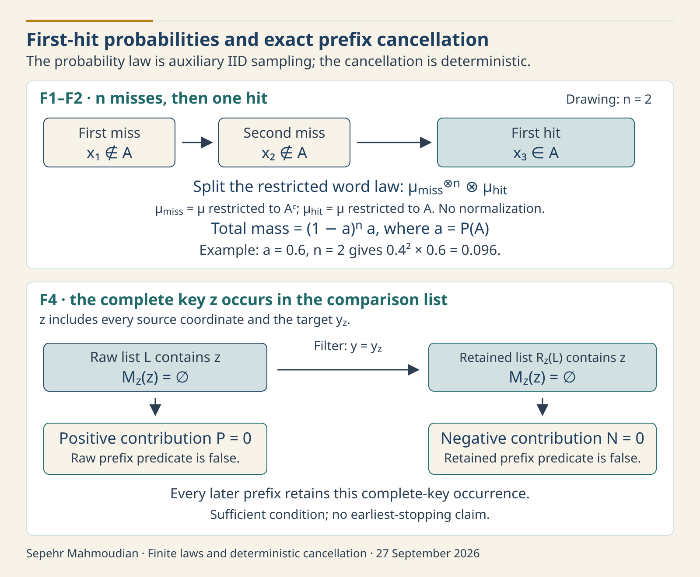

# Finite first-hit laws and exact MGW prefix cancellation

Sepehr Mahmoudian · 27 September 2026

**Local formal acceptance.** On 26 September 2026 at 21:28:05 UTC, the exact joint source closure received local acceptance for F1 and F2 and a fresh recheck of the historically accepted F4 proof. The [acceptance projection](LOCAL_FORMAL_ACCEPTANCE.json), [root acceptance projection](evidence/ROOT_ACCEPTANCE.projection.json), [three-export theorem map](THEOREM_MAP.md) and [retained command evidence](evidence/COMMANDS.json) identify that bounded result. Portable native replay and hosted theorem replay remain open. No scientific-priority claim is made.

A prefix calculation can avoid later updates when its definitions make every later contribution zero. For the categorical prefix construction below, a return to the complete anchor has that property. Two ordinary finite-probability identities describe the associated first-hit event. Keeping these facts separate makes clear what a future stopping implementation may use and what still needs proof.

The surrounding information functional is Makkeh, Gutknecht and Wibral's categorical shared exclusions. Its source event is an OR of source-collection matches, each collection being an AND of coordinate matches; the shared-information definition is in [MGW, equations (6)–(8)](https://arxiv.org/pdf/2002.03356v5). The finite-prefix statistic is a project construction documented in [the existing prefix exposition, Section 2](../../research/finite-prefix-mgw-gradient/EXPOSITION.md). F1 and F2 are classical finite IID probability, and F4 is an invariant of the exact prefix definitions. None introduces a new PID functional or general gradient method.

The upper panel illustrates two misses followed by a hit under a fixed auxiliary IID law; the restricted factors retain their original masses. The lower panel shows why a complete source-plus-target key survives target filtering and makes both prefix contributions zero. The arguments have different premises.

## 1. Finite rows and their actual probability law

Let $I$ be a finite nonempty source-index set. Each source has a finite alphabet $X_i$, and the target has a finite alphabet $Y$. A complete key is

$$
z=((z_i)_{i\in I},y_z)\in K=\left(\prod_{i\in I}X_i\right)\times Y.
$$

Equality of keys includes every source coordinate and the target. Source coordinates and the target within one row may be dependent.

Fix real weights $p(x)$ satisfying $p(x)\ge0$ and $\sum_{x\in K}p(x)=1$. Zero weights are allowed. These are exactly `Law p` in [the MGW bridge contract](../lean-prefix-mgw-gradient/sources/PidMgwBridge/Contract.lean). If $K$ is empty no such law exists. No full-support or positive-event-mass hypothesis is added.

Every subset of $K$ is measurable. Define

$$
\mu=\sum_{x\in K}p(x)\delta_x,
\qquad \mu_n=\mu^{\otimes n}.
$$

The [probability contract](../lean-prefix-mgw-gradient/sources/PidPrefixProbability/Contract.lean) implements these as `keyMeasure p`, a finite sum of weighted Dirac measures, and `rowLaw p n`, using native `Measure.pi`. Lean measure values lie in the extended nonnegative reals: its weights are `ENNReal.ofReal (p x)`. The nonnegativity assumption makes this conversion faithful to the stated real probabilities. The empty product $\mu_0$ is the unit mass on the sole empty word.

Here IID refers to complete auxiliary draws from the fixed $p$. One permitted interpretation is resampling with replacement from a fitted table after freezing that table. The identities then concern that conditional table law. They do not assert that the original sensor windows were IID, that the table equals a population law, or that a seeded pseudorandom implementation realizes the ideal product measure. No new sampler is implemented by these definitions.

## 2. F1: an unnormalized first-hit factorization

Let $A\subseteq K$ be arbitrary and let $n$ be a nonnegative integer. In a word $(x_1,\ldots,x_n,x_{n+1})$, define

$$
H_n(A)=\{x_1\notin A,\ldots,x_n\notin A,\ x_{n+1}\in A\}.
$$

Thus $n$ counts misses before the first hit; the word has $n+1$ entries. Let $\sigma_n$ split a word into its $n$-entry prefix and final entry. For $B\subseteq K$, put $p^B(x)=p(x)1_B(x)$ and $\mu_B=\sum_xp^B(x)\delta_x$. This is the restriction $\mu|_B$, without normalization.

The accepted F1 statement is

$$
(\sigma_n)_*\bigl(\mu_{n+1}|_{H_n(A)}\bigr)
=\mu_{A^c}^{\otimes n}\otimes\mu_A. \tag{F1}
$$

The pushforward means that an event of prefix/final pairs receives the restricted mass of its inverse image. This is an equality of finite measures, not a conditional distribution given $H_n(A)$.

To prove it, fix a prefix $v=(v_1,\ldots,v_n)$ and a final key $y$.

1. The split map has exactly one preimage of $(v,y)$: concatenate $v$ and $y$.
2. By the finite product law, that word's mass is $\bigl(\prod_{i=1}^np(v_i)\bigr)p(y)$.
3. Restriction keeps this mass exactly when every $v_i$ misses $A$ and $y$ hits $A$. Hence the left singleton mass is

   $$
   \left(\prod_{i=1}^n p(v_i)1_{A^c}(v_i)\right)p(y)1_A(y).
   $$

4. The right singleton mass is the same expression, by the definitions of the masked weights and the product measure.
5. Every event in the finite pair space is a disjoint union of singletons. Summing the equal singleton masses proves equality on every event, hence (F1).

All maps and events used here are measurable in the finite discrete spaces. The [accepted proof source](sources/PidStoppedPrefixF1F2/Candidate.lean) follows this route through singleton masses, `splitLast`, restriction, product measures and measure extensionality. No assumed cycle law or normalized masked-law premise replaces the native measure.

## 3. F2: mass and endpoint cases

Write $a=\sum_{x\in A}p(x)$. Nonnegativity gives $a\ge0$. Partitioning $K$ into $A$ and $A^c$ gives $\sum_{x\in A^c}p(x)+a=1$; the first sum is nonnegative, so $a\le1$ and $\mu_{A^c}(K)=1-a$.

Evaluate (F1) on the whole prefix/final space. Its inverse image is the whole word space, and the restricted measure's total is $\mu_{n+1}(H_n(A))$. The total of a finite product measure is the product of its factor totals. Therefore

$$
0\le a\le1,
\qquad \mu_{n+1}(H_n(A))=(1-a)^n a. \tag{F2}
$$

The exact Lean conclusion embeds the final real expression with `ENNReal.ofReal`. It is nonnegative because $0\le a\le1$. This is the familiar first-hit mass, proved here without division by $a$ or $1-a$.

For $0<a<1$, (F2) is the classical geometric first-success mass with success index $n+1$; see [Grinstead and Snell, Section 5.1, pages 184–185](https://math.dartmouth.edu/~prob/prob/OLD/prob.pdf). This reference identifies the standard mass formula. The exact unnormalized finite-measure factorization (F1) is derived above, and the endpoint cases below follow directly from (F2).

| Case | Result and reason |
|---|---|
| $n=0$ | There are no preceding misses; the empty product is $1$, so mass is $a$. |
| $a=0$ | Every first-hit event has mass $0$, including when $A$ contains only zero-mass keys. |
| $a=1,\ n=0$ | Mass is $1$. The empty-power convention gives $0^0=1$. |
| $a=1,\ n>0$ | A preceding miss has probability $0$, so mass is $0$. |
| $A=\varnothing$ or $A=K$ | These are respectively the $a=0$ and $a=1$ cases. |

For example, $a=0.6$ and $n=2$ give mass $0.4^2\times0.6=0.096$. A concrete normalized model is one source with a one-point alphabet and a binary target having masses $2/5$ and $3/5$, with $A$ the second target value. Restriction retains this first-hit mass; renormalizing the factors would change the theorem.

F1/F2 hold for every finite horizon separately. Their source targets do not construct an infinite stopping process, prove almost-sure return, or bound expected runtime. To use them for F4's complete-key return guard, instantiate $A=\{z\}$ for the entire source-plus-target key; the $n+1$ entries then represent IID comparison draws after that fixed anchor. If the anchor is random, conditioning and independence of future draws must be stated when transferring this fixed-event identity. A target fiber or a source-only match is a different event.

## 4. The project prefix terms

Let $\alpha$ be a nonempty inclusion-antichain of nonempty source subsets. For a supplied anchor $z$ and row $x$, define the source mismatch set

$$
M_z(x)=\{i\in I:x_i\ne z_i\}.
$$

For every mismatch set $M\subseteq I$, define its singleton family

$$
S(M)=\{\{i\}:i\in M\},\qquad S(\varnothing)=\varnothing.
$$

Join two families by taking all pairwise unions and retaining the inclusion-minimal unions. Put $J_z([])=\varnothing$. For a nonempty list $L=[x_1,\ldots,x_m]$, start with $S(M_z(x_1))$ and join $S(M_z(x_2)),\ldots,S(M_z(x_m))$ from left to right. In particular, $J_z([x])=S(M_z(x))$. This specifies the fold even when some mismatch sets are empty. The first generator initializes every nonempty fold; the empty family is absorbing for this join.

The exact prefix predicate is

$$
F_{z,\alpha}(L)\iff L\ne[]\ \land\
(\forall x\in L,\ M_z(x)\ne\varnothing)\ \land\ J_z(L)=\alpha.
$$

Define the positive contribution $P(z,\alpha,L)$ to be $1/|L|$ when $F_{z,\alpha}(L)$ holds and $0$ otherwise. Let $R_z(L)$ retain, in order, precisely the rows with target $y_z$. The negative contribution $N(z,\alpha,L)$ is $1/|R_z(L)|$ when the final row of $L$ has target $y_z$ and $F_{z,\alpha}(R_z(L))$ holds; it is $0$ otherwise, including for an empty list.

These are `positiveOnPrefix` and `negativeOnPrefix` in the [native definitions](../lean-prefix-mgw-gradient/sources/PidPrefixProbability/Contract.lean). Both contributions are nonnegative; “negative” identifies the term subtracted in the signed prefix sum. The negative denominator is retained target rank, not raw list length. A nonzero branch has a nonempty list, so its denominator is positive. The weights are dimensionless; the associated information construction uses natural logarithms and nats, whereas MGW's paper displays base-two logarithms.

## 5. F4: a complete-key return makes both terms zero

For every supplied anchor $z$, valid node $\alpha$ and finite list $L$,

$$
z\in L\quad\Longrightarrow\quad
P(z,\alpha,L)=0\quad\text{and}\quad N(z,\alpha,L)=0. \tag{F4}
$$

There is no probability law, support, independence or differentiability premise.

1. A key agrees with itself at every source coordinate, so $M_z(z)=\varnothing$.
2. If $z\in L$, the requirement that every row have a nonempty mismatch set fails. Thus $F_{z,\alpha}(L)$ is false, and $P=0$. No property of $J_z$ is needed.
3. The complete key $z$ has target $y_z$. Therefore target filtering retains it: $z\in R_z(L)$.
4. The same empty mismatch set makes $F_{z,\alpha}(R_z(L))$ false. If the negative definition already returns zero because there is no final row or its target differs, the conclusion holds immediately. In its remaining branch the retained predicate is false, so $N=0$ there too.

These are the steps in the [F4 proof source](sources/PidStoppedPrefixF4/Candidate.lean). The occurrence of $z$ may be anywhere in $L$; it need not be last. Later prefixes still contain that occurrence, so applying F4 to each later prefix gives zero again. This is a sufficient condition, not an equivalence or an earliest-stopping theorem. Contributions can vanish before the complete-key return; F4 does not characterize when earlier zeros persist.

Complete equality matters. With one binary source and a binary target, anchor $z=(0;0)$, node $\{\{1\}\}$ and $L=[(1;0)]$, target equality alone leaves $P=N=1$. With $L=[(0;1),(1;0)]$, a source match makes $P=0$, but filtering removes that row and leaves $N=1$. Conversely $L=[(0;1)]$ has $P=N=0$ without a complete-key return: the raw mismatch is empty and the final target differs. These are direct checks of the definitions, not additional claimed Lean exports.

## 6. Rust implementation and computational cost

For an already specified finite prefix sum, a complete-anchor return is a sound mathematical reason to omit subsequent $P-N$ updates: those summands are exactly zero. An implementation must still preserve any separately required sampling, score or output behavior. This is not a proof that the entire surrounding program may stop at that point.

This formal packet introduces no Rust API or feature gate for a stopped-prefix sampler or return guard. The guard's input would be one complete anchor with $|I|$ source coordinates and one target, followed by $n$ supplied complete comparison rows over the same finite alphabets. Its output is whether a complete-anchor return has occurred. The exact predicate needs no probability law; using its output to skip summands relies on (F4).

The law's occupied support is $m=|\{x\in K:p(x)>0\}|\le|Y|\prod_{i\in I}|X_i|$. The deterministic guard itself needs no PMF table. Fitting or storing that table, preprocessing sensor rows and generating comparison draws are separate operations. For an offline categorical sensor analysis, the source categories, target and any quantizer must be fixed and reported before interpreting resampling from such a table.

A direct return guard compares at most $|I|+1$ coordinates per supplied row. Under constant-cost categorical equality, scanning $n$ rows costs $O(n|I|)$ equality operations. It stores $O(|I|)$ categorical values for the anchor and $O(1)$ additional guard state. These counts exclude sampling, input storage, lattice joins and other estimator state. No timing is reported, and no expected cost, variance advantage or seeded-sampler refinement is established here. No implementation-specific memory budget, cancellation contract or failure behavior is introduced; those would belong to a future sampler/guard API. The finite guard can be interpreted offline over a supplied list or incrementally over supplied rows, but no real-time guarantee follows. Small known PMFs can instead be evaluated or differentiated directly, and a predictive task may be served by MI, CMI or task loss without PID.

### The unfinished stopping argument

F1/F2 provide finite first-hit probabilities, while F4 identifies zero increments. A stopped-gradient theorem additionally needs the specified joint sampling law, integrability, justified interchange of any infinite sums and expectations, and the correct probability score. In a statistic formed by multiplying the accumulated pre-return prefix value by the score of the stopped path, a zero terminal increment does not make the terminal likelihood-score contribution zero. This caveat concerns that score construction; it does not assert that every unbiased stopped estimator must explicitly include a terminal score.

The [retained stopped-gradient counterexamples](../../archive/stopped-prefix-research/gradient-counterexamples-2026-09-19.md.txt) give a four-cell example at parameter $3/4$ where omitting the anchor or terminal score gives mean $0$ instead of the intended derivative $\log3$; a hard horizon of one gives $1/2$. These are separate handwritten negative evidence. They do not refute F1, F2 or F4. The [latent-transfer critique](../../archive/stopped-prefix-research/latent-transfer-critique-2026-09-20.md.txt) separately corrects a whole target-cycle score mean by subtracting its target-conditional mean. The [archive disposition](../../archive/stopped-prefix-research/DISPOSITION.md) keeps the proposed second-moment bound and other stopped-gradient claims distinct from accepted finite-horizon results.

## 7. Local acceptance and preserved failures

An earlier F1/F2 candidate compiled, but its semantic judge rejected the F1 raw/contract comparison. That attempt accepted neither export and reached no fresh-kernel step; its [failure record](../../archive/stopped-prefix-f1f2-v3/DISPOSITION.md) is preserved. This was a formal-correspondence failure, not a mathematical counterexample to the first-hit identities.

Retained elaborated declarations and causal comparisons distinguish a complement-derived `Set.decidableCompl` from a direct classical proposition decision. The accepted repair explicitly uses `Classical.propDecidable` in both independently written mask views. For an element in the event, either indicator returns $p(x)$; outside it, either returns zero. The repair preserves the probability meaning, complete premises, universes and endpoint cases. The native run checked exact raw/alias/candidate correspondence; it did not replace it with a name comparison.

The [contract](sources/PidStoppedPrefixStageA/Contract.lean), [raw targets](sources/PidStoppedPrefixStageA/RawTargets.lean) and [aliases](sources/PidStoppedPrefixStageA/AliasTargets.lean) retain all three universes, finite alphabets, equality instances and the complete propositions. F1/F2 retain `Law p`; F4 does not acquire it. The [F1/F2 semantic judge](sources/PidStoppedPrefixF1F2/SemanticJudge.lean) compares complete target types and the exact two-export roster. Matching names or candidate compilation alone cannot replace that comparison.

The exact joint run completed 29 commands with 58 stdout/stderr streams. Its 41 typed records comprise 19 F1/F2 controls, two F1/F2 exports, 12 F4 controls, one F4 export, six causal comparisons and one forbidden-axiom rejection. Thus there are three theorem exports, not 41 theorems. All three reported only `Classical.choice`, `Quot.sound` and `propext`. The explicit forbidden-axiom fixture was rejected and is excluded from the fresh-kernel root. The selected root passed `leanchecker --fresh StoppedPrefixProbabilityRoot`; the retained kernel call returned zero after approximately 206.891 seconds. This is proof-checking cost for the recorded run, not estimator runtime. Root adopted the result after reading its evidence within the original execution window.

F1/F2's actual [printed type records](evidence/EXPORTED_TYPES.json) name target abbreviations. Those strings remain unchanged. The [expanded statements](THEOREM_STATEMENTS.md), pinned source and complete semantic-judge comparisons establish what the abbreviations mean; no expanded prose was substituted for raw output. The [source map](SOURCE_MAP.json) selects 25 project modules: 18 package files and seven exact existing public dependencies. Source comments saying “uncompiled,” “unaccepted” or “source proposal” are frozen preexecution metadata. This later acceptance section supplies their current disposition without changing the accepted source bytes.

The [historical F4 evidence](evidence/historical-f4-v4/DISPOSITION.md) retains acceptance of its original exact closure, including its older two StageA target files. F4's proof body is unchanged; its reuse with the repaired shared targets was checked anew in the accepted joint run. An initial combined operational attempt ended before admission because its inventory was stale, so no Lean proof commands ran there. The [history record](HISTORY.md) preserves that operational failure and the earlier semantic failure separately; neither was overwritten or counted as success.

The public evidence is a selected projection of retained local records. Original-native hashes identify unchanged private receipts; first-publication hashes identify the retained initial projection; current projected hashes identify the corresponding public files. The [metadata projection ledger](evidence/PUBLIC_METADATA_PROJECTIONS.json) records complete private-root replacements and omissions of process, session and terminal handles. Of the 58 main stream files, 56 are exact native-byte copies and two are declared PRE/POST boundary stdout projections. All 41 theorem/control values and accepted source bytes remain unchanged. Sequential source/object/input and installed-boundary observations are bounded evidence, not atomic custody, binary authenticity or a complete off-host installed archive. The [replay boundary](REPLAY.md) explains why publishing these exact sources does not itself establish a portable or hosted replay. This publication supplies no new native acceptance. No F3/cycle theorem, full stopped-gradient result, variance theorem, implementation or application acceptance is inferred.

To cite this report: Sepehr Mahmoudian, *Finite first-hit laws and exact MGW prefix cancellation*, pid-rs, 2026, followed by the exact containing repository commit or release. Cite the defining MGW paper separately, and use [CITATION.cff](../../../CITATION.cff) for the software.

Defining method: Abdullah Makkeh, Aaron J. Gutknecht and Michael Wibral (2021), *Introducing a differentiable measure of pointwise shared information*, Physical Review E 103, 032149, [doi:10.1103/PhysRevE.103.032149](https://doi.org/10.1103/PhysRevE.103.032149), [arXiv:2002.03356v5](https://arxiv.org/abs/2002.03356v5).

Classical probability reference: Charles M. Grinstead and J. Laurie Snell, *Introduction to Probability*, Section 5.1, “Geometric Distribution,” pages 184–185, [author-hosted text](https://math.dartmouth.edu/~prob/prob/OLD/prob.pdf). This citation supports the classical first-success mass formula; it is not a citation for the project prefix statistic or a formal-verification result.
