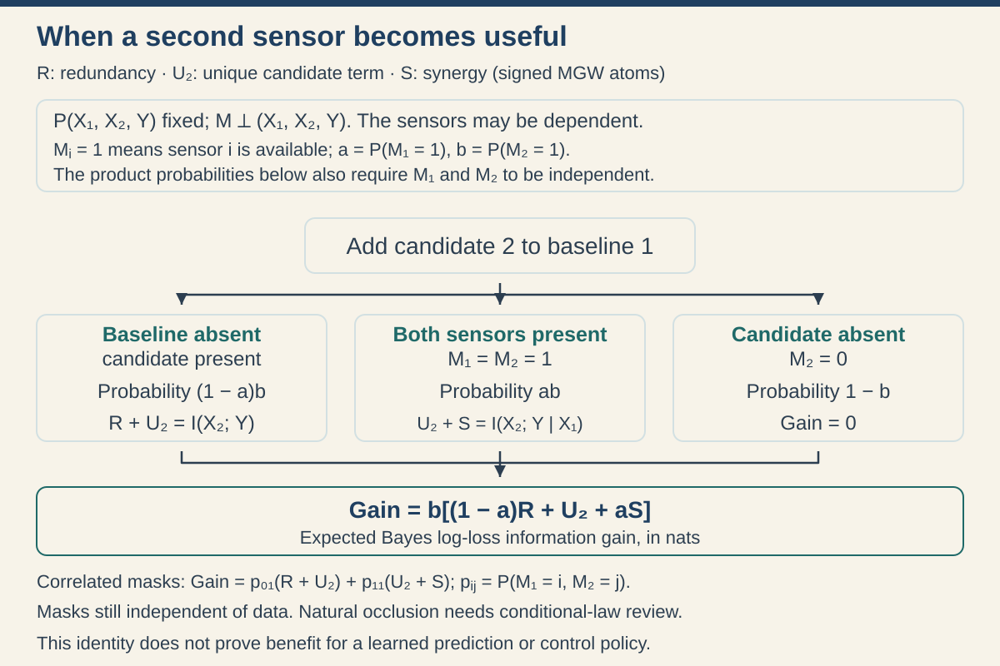
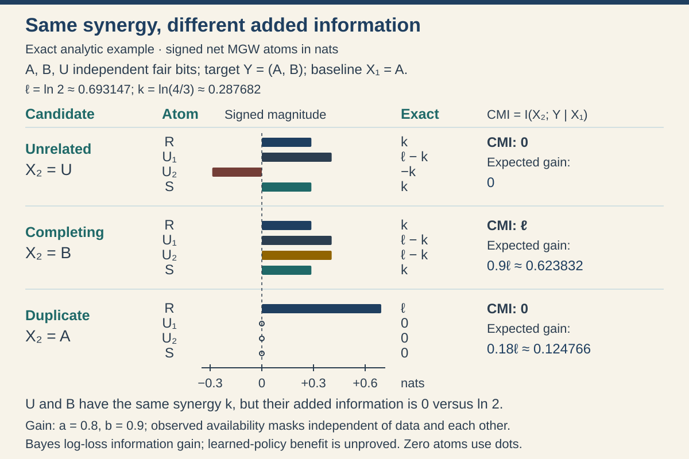
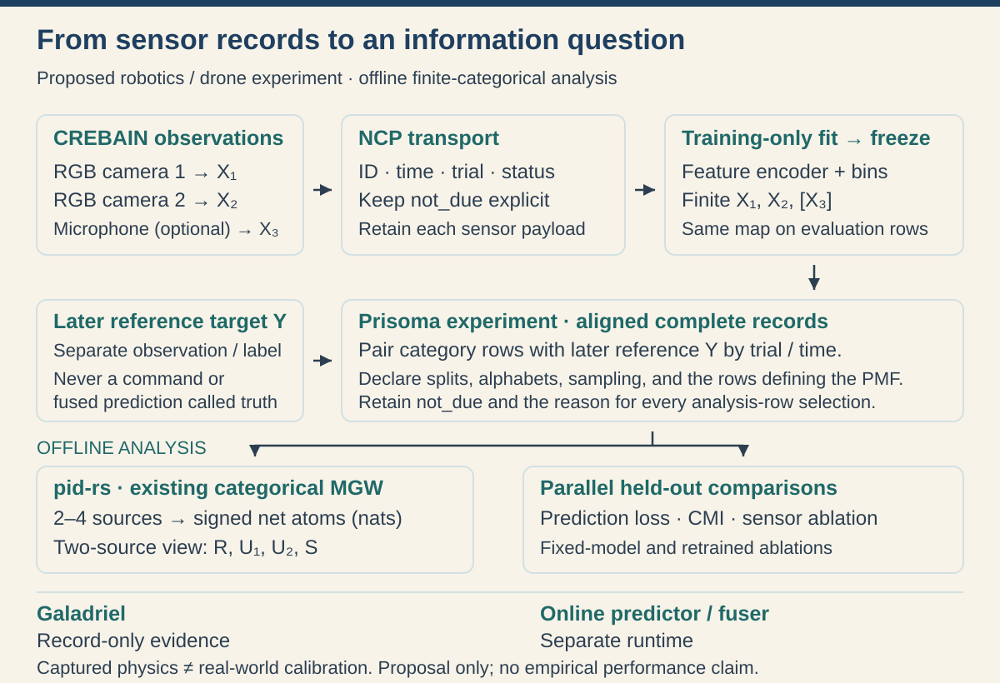

# Sensor information for embodied agents

An embodied agent predicts and acts in a physical environment. A useful sensor study must connect the recorded measurements to a specific future outcome and to a decision. More information in the data, better use of that information by a model, and better physical control are three different results.

This report develops an offline starting point: two camera instances and, when useful, one microphone. It explains how categorical shared-exclusions PID can describe their information about a declared outcome. It derives a sensor-availability objective, gives exact examples, and identifies the experiment needed to establish practical value. Robotics and aerial-object observation share parts of this measurement problem. They need separate outcome definitions and task evaluations.

**Status.** Four classical finite-PMF foundations have been checked locally in Lean: probability mass and measure, finite expectation as an integral, supported Gibbs nonnegativity, and log-score decomposition, lower bound and attainment. Section 3 explains their exact scope. The conditional prediction, availability/mask and application arguments remain handwritten; 13 downstream formal targets remain open. Existing linked formal results keep their individual theorem and replay status. The report contains no new sensor benchmark, trained policy, field result, or claim of scientific priority. Its useful contribution is a precise connection between signed MGW atoms, sensor availability, predictive loss, and the current ecosystem interfaces.

## 1. The question and the named PID

Suppose camera 1 sometimes cannot be used. Should an agent also have camera 2 or a microphone? Three questions must be separated:

1. Does the additional measurement contain information about the chosen outcome?
2. Can the selected model use that information with the available training data?
3. Does the resulting prediction improve a physical task under the intended policy?

The first question has a population information answer. Held-out predictions address the second. Closed-loop experiments address the third. A positive answer to one does not establish the next.

The PID in this report is **Makkeh–Gutknecht–Wibral categorical shared exclusions**, abbreviated MGW. Its defining source is [Makkeh, Gutknecht and Wibral, *Introducing a differentiable measure of pointwise shared information*, arXiv:2002.03356v5](https://arxiv.org/abs/2002.03356v5), [Physical Review E 103, 032149](https://doi.org/10.1103/PhysRevE.103.032149). All logarithms are natural; all information is in nats. Net atoms can be negative.

This is not Williams–Beer `I_min`. It is also not the continuous shared-exclusions functional of [Ehrlich et al., arXiv:2311.06373v3](https://arxiv.org/abs/2311.06373v3). Applying MGW to fitted bins estimates information in those categorical variables. It does not estimate the continuous functional or recover information in raw images.

### Complete-data law and row meaning

Let $X_1,\ldots,X_n$ be finite-valued source variables, with $2\leq n\leq4$, and let $Y$ be a finite-valued target. Write $P$ for one fixed joint law. A source may contain several features from one sensor, but its alphabet and grouping must be fixed. Two cameras are two source instances even though they use the same modality.

Examples of a target are a future position sector, a future contact state, or a future object-pose category. The target must come from a separate reference measurement or a declared simulator reference state. A command sent to the environment is an action, not an observed future outcome. The label time must follow the feature window if the task is prediction.

The identities in Sections 2–7 require no Gaussian model and no independence between the source values. They are population statements, so they require no sample size. Estimation and uncertainty add sampling assumptions in Section 9. The empirical version replaces $P$ by the PMF of admitted rows; this replacement alone gives no population error guarantee.

## 2. Shared exclusions and signed atoms, from definitions

For an observed source value $x=(x_1,\ldots,x_n)$ and a nonempty source set $B$, write $X_B=x_B$ for the event that every source in $B$ matches that value. A **nonempty antichain** $\alpha$ is a nonempty collection of nonempty source sets, none of which contains another. Its matching event is

$$
E_\alpha(x)=\bigcup_{B\in\alpha}\{X_B=x_B\}.
$$

At a joint state $(x,y)$ with $P(x,y)>0$, the MGW cumulative local quantity is

$$
i_\alpha(y;x)=\ln\frac{P(Y=y\mid E_\alpha(x))}{P(Y=y)}
=\ln\frac{P(E_\alpha(x)\mid Y=y)}{P(E_\alpha(x))}.
$$

The observed state belongs to $E_\alpha(x)$. Both conditional probabilities needed here are therefore positive. Zero-mass joint states are omitted from expectations. The averaged cumulative quantity is

$$
I_\alpha=\sum_{x,y:P(x,y)>0}P(x,y)i_\alpha(y;x).
$$

The local expression also equals $i_\alpha^+-i_\alpha^-$, where $i_\alpha^+=-\ln P(E_\alpha(x))$ and $i_\alpha^-=-\ln P(E_\alpha(x)\mid Y=y)$. These are surprisal components. The words informative and misinformative in this construction do not mean that a sensor is truthful or deceptive.

Order antichains by $\alpha\preceq\beta$ when every set in $\beta$ contains at least one set in $\alpha$. The net atoms $\pi_\alpha$ are the unique finite triangular solution of

$$
I_\beta=\sum_{\alpha\preceq\beta}\pi_\alpha.
$$

Use the full carrier of all nonempty antichains of nonempty subsets of $[n]$. This is finite Möbius inversion: proceed from lower nodes to higher nodes and subtract the already determined lower atoms. It is a decomposition of cumulative quantities, not a partition into nonnegative physical pieces.

### Entropy and the reconstruction link

For a finite target, define $H(Y)=-\sum_{y:P(y)>0}P(y)\ln P(y)$. Define $H(Y\mid O)=\sum_{o:P(o)>0}P(o)H(P(\cdot\mid o))$. Mutual information is $I(Y;O)=H(Y)-H(Y\mid O)$, equivalently the average of $\ln[P(Y\mid O)/P(Y)]$. Conditional information is $I(Y;V\mid O)=H(Y\mid O)-H(Y\mid O,V)$.

At the singleton antichain $\{A\}$, the event is exactly $X_A=x_A$. The average local log ratio is therefore $I(Y;X_A)$. This property is called self-redundancy. The same finite inversion can be applied locally and then averaged: inversion is linear, so it commutes with the joint-law average. This report uses those averaged net atoms.

### Two sources

For two sources, the four atoms are redundancy $R$, unique information $U_1,U_2$, and synergy $S$. Put $I_1=I(Y;X_1)$, $I_2=I(Y;X_2)$ and $I_{12}=I(Y;X_1,X_2)$. Reconstruction gives

$$
I_1=R+U_1,\qquad I_2=R+U_2,
$$

$$
I_{12}=R+U_1+U_2+S.
$$

Thus $U_1=I_1-R$, $U_2=I_2-R$ and $S=I_{12}-I_1-I_2+R$. In particular,

$$
\boxed{I(Y;X_2\mid X_1)=I_{12}-I_1=U_2+S.}
$$

Synergy alone is not additional Shannon information. A negative unique atom can cancel positive synergy. Section 5 gives an exact example. No atom is clipped to zero.

## 3. Why predictive log loss gives an information objective

### The locally checked finite-law foundation

First fix a finite, nonempty label alphabet $\mathcal Y$, with every subset measurable, and two normalized probability mass functions $r$ and $q$. Write their real coordinates as $r_y,q_y\geq0$, with

$$
\sum_{y\in\mathcal Y}r_y=\sum_{y\in\mathcal Y}q_y=1,
\qquad S=\{y:r_y>0\}.
$$

The true law is $r$; the forecast is $q$. Require $q_y>0$ for every $y\in S$. Outside $S$, $q_y$ may be zero or positive. Neither full support nor a sampling or independence assumption is required. The [finite log-score formal package](../../formal/lean-finite-logscore/PUBLICATION.md) records the four exact targets, proof sources and local replay scope. They establish this unconditional finite-law foundation, not a conditional sensor theorem or a new PID result.

Define entropy, supported KL divergence and expected log loss by

$$
H(r)=-\sum_{y\in S}r_y\ln r_y,
\qquad D(r\Vert q)=\sum_{y\in S}r_y\ln\frac{r_y}{q_y},
$$

$$
L_r(q)=\int_{\mathcal Y}[-\ln q_y]\,d\mu_r(y),
$$

where $\mu_r$ is the probability measure induced by $r$. In this real-valued integral, take $\ln0=0$, as Lean's total real logarithm does. Any finite value at a label with $r_y=0$ would give the same integral. Positivity of $q$ on $S$ ensures that the loss agrees with ordinary log loss wherever the true law has mass. This convention must not be used to assign finite loss to a forecast that excludes a possible true outcome.

The four proof steps are as follows.

**1. From a PMF to real mass and a probability measure.** A native PMF has nonnegative extended-real masses summing to one. Each mass is at most one, hence finite. Passing these finitely many masses to real numbers preserves their sum and order. Thus $0\leq r_y\leq1$, the real masses sum to one, and membership in the support is equivalent to $r_y>0$. On the discrete measurable alphabet, the induced measure satisfies $\mu_r(\{y\})=r_y$ and $\mu_r(\mathcal Y)=1$. These are properties of the PMF's actual induced measure, not a separately assumed expectation formula.

**2. From integration to a finite sum.** Every real-valued function $f$ on a finite discrete alphabet is measurable and bounded, so it is integrable under this probability measure. Expanding it into its singleton indicators gives

$$
f=\sum_{y\in\mathcal Y}f(y)\mathbf 1_{\{y\}},
\qquad
\int f\,d\mu_r=\sum_{y\in\mathcal Y}r_yf(y).
$$

Here $\mathbf 1_{\{y\}}$ is one at $y$ and zero elsewhere. Linearity of the integral and the singleton masses justify the second equality. In particular, $L_r(q)=\sum_{y\in S}r_y[-\ln q_y]$. Finiteness of the alphabet and supported positivity make this a finite real number for each admitted pair $(r,q)$.

**3. Gibbs nonnegativity with forecast mass outside the true support.** For $u>0$, the function $u-1-\ln u$ has derivative $1-1/u$: negative below one and positive above one. Its minimum is zero at one, so $\ln u\leq u-1$. Taking $u=1/t$ gives $\ln t\geq1-1/t$ for $t>0$. At a supported label use $t=r_y/q_y>0$ and multiply by $r_y$:

$$
r_y-q_y\leq r_y\ln\frac{r_y}{q_y}.
$$

At a label outside $S$, $r_y=0$ and $r_y-q_y=-q_y\leq0$, while its supported KL summand is defined as zero. Summing these inequalities over the entire alphabet and using both normalizations proves

$$
0=\sum_y r_y-\sum_y q_y\leq D(r\Vert q).
$$

This explains why $q$ may assign mass outside $S$. It also explains why one cannot drop normalization or clip individual KL summands: a supported summand can be negative even though their total is nonnegative.

**4. Decomposition, lower bound and attainment.** On $S$, both logarithm arguments are positive, so the logarithm quotient identity gives

$$
r_y[-\ln q_y]
=-r_y\ln r_y+r_y\ln\frac{r_y}{q_y}.
$$

Sum over $S$ and use the integral identity from step 2 and Gibbs nonnegativity from step 3:

$$
\boxed{L_r(q)=H(r)+D(r\Vert q)\geq H(r).}
$$

The forecast $q=r$ is admissible because $r$ is positive on its own support. Each supported ratio is then one, so $D(r\Vert r)=0$ and $L_r(r)=H(r)$. The checked target establishes decomposition, the lower bound and its attainment. Strict uniqueness is not part of that target.

For a concrete three-label example, take

$$
r=(1/2,1/2,0),\qquad q=(1/4,1/4,1/2).
$$

Both are normalized, and the forecast is positive on the two true labels. Direct substitution gives

$$
H(r)=\ln2,\qquad L_r(q)=\ln4,\qquad D(r\Vert q)=\ln2.
$$

The third label has true probability zero, yet its positive forecast probability is allowed. Allocating half the forecast mass there reduces the probabilities available for the true labels. Choosing $q=r$, including its true zero, attains $\ln2$. These are exact finite-law calculations, not an empirical calibration result.

The support requirement has a concrete failure case. With the same $r$, let $q_{\rm bad}=(1,0,0)$. Ordinary log loss is infinite when the second label occurs. Blindly applying the total real convention $\ln0=0$ instead produces the spurious loss zero, below $H(r)=\ln2$. The theorem excludes this forecast because it violates supported positivity. Likewise, an unnormalized vector $(2,2,0)$ would give the apparent loss $-\ln2$; it is not a PMF and is outside the theorem.

These results concern one exact law and admitted forecasts. They do not provide a uniform loss bound over forecasts approaching zero, nor do observed zero counts establish true zero probabilities. Flooring forecast probabilities and renormalizing changes the allowed forecast family; its optimum need not attain $H(r)$ when the true law has zeros. Floating-point evaluation, estimation from dependent observations and changes of environment each need separate justification.

### Conditional prediction and sensor information

The following conditional argument applies the same classical calculation to each positive-probability observation and averages. Its posterior construction and downstream availability/mask steps are handwritten here; the four checked finite-law targets do not close the 13 remaining conditional sensor/application targets.

A predictor $q(y\mid o)$ assigns a probability to each possible outcome after observing $O=o$. Its loss when $Y=y$ is $-\ln q(y\mid o)$. Assume $q>0$ on every outcome with positive conditional probability. For a finite expected loss,

$$
\begin{aligned}
L(q)&=\sum_{o,y}P(o,y)[-\ln q(y\mid o)]\\
&=\sum_{o,y}P(o,y)[-\ln P(y\mid o)]
 +\sum_{o,y}P(o,y)\ln\frac{P(y\mid o)}{q(y\mid o)}\\
&=H(Y\mid O)+D(q),
\end{aligned}
$$

where $D(q)=\sum_oP(o)\mathrm{KL}(P(\cdot\mid o)\Vert q(\cdot\mid o))$ is the conditional predictive KL excess loss. Summands with $P(o,y)=0$ contribute zero.

To see that KL is nonnegative, apply $\ln t\leq t-1$ to $t=q_y/p_y$ on the support of a PMF $p$:

$$
\sum_{y:p_y>0}p_y\ln\frac{q_y}{p_y}
\leq\sum_{y:p_y>0}q_y-1\leq0.
$$

Therefore the Bayes predictor $q=P(\cdot\mid O)$ minimizes expected log loss and attains $H(Y\mid O)$. With no source, its loss is $H(Y)$. With source set $A$, it is $H(Y\mid X_A)$. Their difference is $I(Y;X_A)$. Adding $X_2$ to $X_1$ reduces Bayes loss by $I(Y;X_2\mid X_1)$.

This is the classical logarithmic-score connection, not a new PID theorem; see [Gneiting and Raftery, *Strictly Proper Scoring Rules, Prediction, and Estimation*](https://doi.org/10.1198/016214506000001437). It is specific to this predictive criterion. Position error, missed detections, task success, latency and energy have their own losses and need not rank sensors in the same order.

For two actual trained predictors on the same evaluation law,

$$
\boxed{\Delta_{\rm learned}=\Delta_{\rm Bayes}+D_{\rm baseline}-D_{\rm augmented}.}
$$

The augmented model can perform worse despite a positive Bayes gain. Its excess loss includes approximation, estimation and optimization error, not only calibration. If either expected loss is infinite, subtracting the two losses or KL terms needs separate treatment; infinity minus infinity is undefined.

## 4. Exactly which atoms matter when sensors are unavailable?

Let $M_i\in\{0,1\}$ indicate whether source $i$ is available. Assume that the vector $M=(M_1,M_2)$ is independent of the complete-data triple $(X_1,X_2,Y)$. The two mask bits may be correlated. Put $p_{ij}=P(M_1=i,M_2=j)$.

Both compared Bayes predictors observe the same full mask. The baseline uses source 1 when present. The augmented predictor also uses source 2 when present. Both retain the same complete-data law, baseline availability and permitted context. In particular, withholding a recorded input does not change the behavior policy or the already recorded future target.

| Mask | Baseline observation | Additional source | Conditional loss reduction |
|---|---|---|---|
| $00$ | No source | None | $0$ |
| $10$ | $X_1$ | None | $0$ |
| $01$ | No source | $X_2$ | $I_2$ |
| $11$ | $X_1$ | $X_2$ | $I_{12}-I_1$ |

Independence from complete data lets every row use the same $P$. Average the four reductions, then substitute the reconstruction identities:

$$
\begin{aligned}
\Delta&=p_{01}I_2+p_{11}(I_{12}-I_1)\\
&=p_{01}(R+U_2)+p_{11}(U_2+S)\\
&=\boxed{p_{01}R+(p_{01}+p_{11})U_2+p_{11}S}.
\end{aligned}
$$

If the mask bits are also independent, with availabilities $a=P(M_1=1)$ and $b=P(M_2=1)$, then $p_{01}=(1-a)b$ and $p_{11}=ab$. Hence

$$
\boxed{\Delta=b[(1-a)R+U_2+aS].}
$$

The redundancy coefficient is the probability that source 2 can act as a backup. The unique coefficient is its availability. The synergy coefficient is joint availability. These are weights on signed allocations; an individual atom is not an independently realizable utility.

The boundary cases provide useful checks. If $b=0$, the gain is zero. If $a=1$, it is $b(U_2+S)$. If $a=0$, it is $b(R+U_2)$. For correlated failures, use $p_{01},p_{11}$ directly. Marginal availabilities alone do not identify the backup benefit.

An acquisition cost can be included as $\Delta-\lambda C$ only after defining expected incremental cost $C$ and the conversion factor $\lambda$ in nats per cost unit. Otherwise report the loss–cost trade-off without adding incompatible units.

## 5. Same synergy, different value: a complete calculation

Let $A,B,U$ be independent fair bits, so each of the eight triples has probability $1/8$. Set the common target to $Y=(A,B)$ and the baseline to $X_1=A$. Compare three candidate second sources: independent noise $U$, the complementary bit $B$, and a duplicate of $A$. The target, baseline and underlying world are unchanged across candidates.

Write $\ell=\ln2$ and $k=\ln(4/3)$. For candidate $U$, the shared-exclusions event at an observed $(a,u)$ is $\{A=a\}\cup\{U=u\}$. Its probability is $1/2+1/2-1/4=3/4$. Conditional on the observed target $(a,b)$, the first event is certain. The local redundancy is therefore $\ln(1/(3/4))=k$ at every supported state, so $R=k$.

The baseline reveals one fair target bit: $I_1=\ell$. Independent $U$ reveals none: $I_2=0$. Together they still reveal only $A$: $I_{12}=\ell$. Substitution gives

$$
R=k,\quad U_1=\ell-k,\quad U_2=-k,\quad S=k.
$$

For candidate $B$, the union event again has probability $3/4$ and is certain given $Y$. Hence $R=k$. Now $I_1=I_2=\ell$ and $I_{12}=2\ell$, giving

$$
R=k,\quad U_1=\ell-k,\quad U_2=\ell-k,\quad S=k.
$$

For duplicate candidate $A$, the union event is just $\{A=a\}$, with probability $1/2$. Thus $R=\ell$, and $I_1=I_2=I_{12}=\ell$. All other atoms are zero.

| Candidate | $R$ | $U_1$ | $U_2$ | $S$ | Gain for independent masks |
|---|---|---|---|---|---|
| Independent $U$ | $k$ | $\ell-k$ | $-k$ | $k$ | $0$ |
| Complement $B$ | $k$ | $\ell-k$ | $\ell-k$ | $k$ | $b\ell$ |
| Duplicate $A$ | $\ell$ | $0$ | $0$ | $0$ | $b(1-a)\ell$ |

With $a=0.8$ and $b=0.9$, the gains are respectively $0$, $0.623832$ and $0.124766$ nats, rounded to six decimals. The noise and complement have exactly equal synergy. Their unique atoms distinguish their added information. The duplicate has zero synergy but can be useful as a backup. If its failures always coincide with those of the baseline, $p_{01}=0$ and that backup gain disappears.

These are analytic controls, not sensor measurements. A target made of two ideal factors makes every probability explicit. It does not authorize copying an eventual outcome into a deployed feature. In real data, feature ancestry must exclude future reference labels. The [fixed-world results guide](../../../MATHEMATICAL_RESULTS_GUIDE.md) links the existing equal-synergy and target-copy formal work and its exact limits.

## 6. Natural occlusion changes the assumptions

Occlusion often depends on object position, scene geometry or viewpoint. It can therefore depend on $Y$. The independence assumption of Section 4 must not be inferred from the word “missing.” Packet loss, detector rejection and absent annotations can also be value-dependent.

If both predictors observe the same full mask, condition on each positive-probability mask $m$. Let $P_m=P(\cdot\mid M=m)$. The exact replacement is

$$
\Delta=p_{01}I_{P_{01}}(Y;X_2)
+p_{11}I_{P_{11}}(Y;X_2\mid X_1).
$$

Each term uses its own conditional law. In general, one cannot substitute the unconditional MGW atoms. Information carried by the mask itself cancels because both comparators already observe it.

If the baseline sees only $O_1=(M_1,\text{available }X_1)$ while the augmented predictor also sees $M_2$, there is an additional term $I(Y;M_2\mid O_1)$, followed by the added source-value information conditional on $O_1,M_2$. It is not generally $I(Y;M)$. If the baseline has no mask information at all, the information of the full available observation relative to the unconditional prior is

$$
I(Y;M)+\sum_mP(M=m)I_{P_m}(Y;X_m).
$$

Zero-probability mask strata contribute zero and need no conditional law. Rare positive strata may be impossible to estimate well from the available data.

### Why separate independence checks are insufficient

Let $Y,X$ be independent fair bits and set $M=1$ exactly when $X=Y$. Each pair $(Y,X)$ has probability $1/4$. For either value of $Y$, exactly one value of $X$ gives $M=1$, so $P(M=1\mid Y)=1/2$. The same argument gives $P(M=1\mid X)=1/2$. Thus $M$ is independent of each variable separately, but not of their joint pair.

Give both predictors $M$. The baseline receives no source reading, so its loss is $H(Y\mid M)=\ln2$. When $M=1$, the augmented predictor sees $X=Y$ and its conditional loss is zero. When $M=0$, it sees no reading and $Y$ remains fair, so its conditional loss is $\ln2$. Its expected loss is $(\ln2)/2$ and its gain is $(\ln2)/2$.

Yet unconditional $I(Y;X)=0$. Multiplying this by availability would predict zero gain incorrectly. The correct gain is $P(M=1)I_{P(\cdot\mid M=1)}(Y;X)=(\ln2)/2$. No extra mask information was hidden from the baseline. The source–target law changed within the available stratum. This exact negative control explains why the assumption concerns joint-law independence.

**First experiment.** Draw software masks independently of the complete recorded values, using fixed declared probabilities, and withhold the selected inputs from a fixed-policy recording. This makes availability exogenous by design and leaves the recorded target unchanged. Then test natural occlusion in a separate study with its conditional-law assumptions. Neither study alone establishes the effect of changing an active sensing or control policy.

If a common context $C$ such as a task instruction is used, give it to both comparators. Apply the derivation within each context and average, provided $M$ is independent of the complete data conditional on $C$. Context-dependent mask probabilities must remain inside that average.

## 7. Two to four sources: a useful limit of the objective

Let $M$ now denote a random available subset of $[n]=\{1,\ldots,n\}$, independent of the complete-data law. Write $q_A=P(M=A)$. The expected Bayes log-loss reduction relative to the no-source predictor is

$$
J=\sum_{A\subseteq[n]}q_A I(Y;X_A),\qquad I(Y;X_\varnothing)=0.
$$

For each nonempty $A$, reconstruction at the singleton antichain $\{A\}$ gives

$$
I(Y;X_A)=\sum_{\alpha:\exists B\in\alpha,\ B\subseteq A}\pi_\alpha.
$$

Substitute this identity into $J$ and interchange the two finite sums:

$$
\begin{aligned}
J&=\sum_Aq_A\sum_\alpha
\mathbf1\{\exists B\in\alpha:B\subseteq A\}\pi_\alpha\\
&=\sum_\alpha\left[\sum_Aq_A
\mathbf1\{\exists B\in\alpha:B\subseteq A\}\right]\pi_\alpha\\
&=\boxed{\sum_\alpha w_\alpha\pi_\alpha},\qquad
w_\alpha=P(\exists B\in\alpha:B\subseteq M).
\end{aligned}
$$

Every weight is between zero and one. Compute the probability of the union event; do not add the probabilities of overlapping matching branches. Mask bits need not be independent. The atoms are all from the same complete $n$-source law. A pairwise decomposition is not a substitute for the full lattice.

There are 4, 18 and 166 net atoms for two, three and four sources. This particular objective nevertheless depends only on the 3, 7 and 15 nonempty subset MI values. If two laws have the same subset MI values, every exogenous availability objective of this form agrees. Full PID adds an allocation, but no additional decision information for this exact oracle criterion.

This derivation uses only self-redundancy and lattice reconstruction. Its availability identity is therefore not exclusive to MGW; the signed numerical example in Section 5 is MGW-specific.

This is a useful negative conclusion: a PID-based optimizer of $J$ must not claim an intrinsic advantage over an equivalent subset-MI optimizer. Finite estimators can differ in error and cost; such differences require measurement. Other PID questions remain possible, but they must specify what is learned beyond the subset-MI description.

## 8. From recorded measurements to a valid row

The current ecosystem can record real simulator payloads. A payload record is not yet a target-specific statistical dataset. The proposed offline study needs the following explicit join.

### Concrete source representation

Start with two camera instances and one pressure microphone. An illustrative row at a predeclared time $t$ could use:

- $X_1$: a low-dimensional, training-frozen feature of camera 1 at or before $t$, encoded in a fixed alphabet;
- $X_2$: the same declared type of feature for camera 2, with its own sensor identity and timestamp;
- $X_3$: a fixed pressure-window feature, for example RMS over a specified interval ending at $t$, followed by training-fitted bins;
- $Y$: a future reference sector at $t+\tau$, with fixed horizon $\tau>0$, coordinate frame and bin edges.

For pressure samples $p_1,\ldots,p_m$ in pascals, RMS is $\sqrt{m^{-1}\sum_jp_j^2}$ pascals. RMS is only an example: it can discard direction, phase and frequency information needed by the task. It does not become range or object identity. A frozen audio feature must be judged against a no-audio baseline and alternative features.

Image features can likewise discard useful geometry. Record color space, orientation, calibration, instance, exposure/time policy and feature-model identity. A detector confidence is a model output, not a physical distance. No Gaussian prior is required for the resulting categorical PMF.

| Row field | Required interpretation |
|---|---|
| Run, episode, scene and landmark | Identifies one sampling unit and its physical context |
| Sensor instance, frame and time window | Prevents accidental mixing of cameras or stale observations |
| Feature and quantizer identity | Fixes what each categorical value means |
| Availability and reason | Distinguishes withheld, not due, failed and unobserved values |
| Target reference, frame, time and horizon | Binds an outcome independently of predictor features |
| Action/policy and split identity | Prevents policy and training/evaluation leakage |

Do not encode “not due” as a zero-valued measurement. Choose either synchronized landmarks with all required sources, a declared causal holding/window rule, or an explicit missing-data study. These choices define different laws. Excluding incomplete rows can also select a different population.

The inspected native example advances six body ticks at 120 Hz. Camera periods two and three produce five total images, not six synchronized camera pairs. The microphone produces 133, 133, 134, 133, 133 and 134 pressure samples: 800 samples over 0.05 seconds. The retained two-camera-plus-audio capture contains 11 payloads and 1,542,400 bytes. These figures describe an engineering capture, not 800 independent observations or a PID evaluation. The native model's physical calibration and any real-world transfer remain separate questions.

### Fit, evaluate and preserve the estimand

Split complete episodes before fitting features, quantizers or predictors. Fit all choices on training episodes, freeze them, and apply them to evaluation episodes. Report bin edges, alphabet sizes, occupancy, clipping/out-of-range behavior and rejected rows. An empirical zero cell is not evidence of a population zero. Training and evaluation occupancy must not be silently pooled.

If every source and the target has eight categories, three sources allow $8^4=4096$ complete cells; four allow $8^5=32768$. This explains why raw high-dimensional inputs cannot simply be discretized finely. More bins can reduce representation bias while making population estimation worse. Report sensitivity to prespecified coarser encodings. Selecting the best encoding on the final test data invalidates an ordinary held-out comparison.

Hyperbolic latent coordinates do not remove this problem. Quantizing them produces a categorical representation with a declared geometry-dependent encoder. It does not establish a hyperbolic continuous PID estimator or avoid the joint-alphabet cost. Continuous and manifold-supported inputs need their own support and metric analysis.

## 9. A falsifiable first study and its statistics

The first study is offline future-outcome prediction under controlled camera withholding. Keep all variants of one physical episode together. Freeze the target, features, mask probabilities, learners, tuning budgets, subgroup roster and useful improvement margin before evaluating untouched episodes.

For three sources, evaluate all eight masks. Compare a context-only predictor, the three single-source predictors, the source subsets, and the complete-source predictor. Distinguish two interventions:

- **Fixed-model outage:** remove an input at evaluation from a model trained by a declared masking procedure. This tests its robustness.
- **Retrained subset:** train each subset model separately with a matched tuning budget. This tests how well each allowed sensor set can support prediction.

The primary metric is the declared task loss. Report direct subset MI/CMI and the full signed MGW result as diagnostics, with estimator assumptions. A win against synergy alone is not evidence that PID improves on these stronger comparators.

### One conservative finite-sample rule

Condition on the frozen training/design artifacts. Assume an integer $N\geq1$ independent evaluation episodes from the same declared law. Within an episode, frames and mask variants may be dependent. Define one episode loss by a prespecified weighted average with nonnegative weights summing to one.

Require every predictor probability to be at least $\varepsilon>0$ on the finite target alphabet, with $\varepsilon\leq1/|\mathcal Y|$. A specified normalized smoothing rule is needed; clipping each coordinate independently need not preserve a PMF. For example, with $d=|\mathcal Y|$ and a fitted PMF $\widetilde q$, set $q_\varepsilon(y\mid o)=(1-d\varepsilon)\widetilde q(y\mid o)+\varepsilon$. Its entries sum to one and each is at least $\varepsilon$. Each log loss is in $[0,B]$, where $B=\ln(1/\varepsilon)$. Such smoothing generally leaves KL excess above the unrestricted Bayes entropy; the bounded-loss evaluation is not an assertion that the entropy optimum is attained.

Let $D_i$ be the baseline episode loss minus augmented episode loss, after averaging all masks with their fixed weights. Then $-B\leq D_i\leq B$. If $B=0$, the admitted target is a singleton and all losses and differences are zero; no concentration estimate is needed. For $B>0$ and $t>0$, Hoeffding's classical bounded-variable inequality gives

$$
P\!\left(\overline D-E D\geq t\right)
\leq\exp\!\left(-\frac{Nt^2}{2B^2}\right).
$$

Set the right side equal to $\delta\in(0,1)$ and solve for $t$:

$$
t=B\sqrt{\frac{2\ln(1/\delta)}{N}}.
$$

Thus, with probability at least $1-\delta$,

$$
E D\geq\overline D-B\sqrt{\frac{2\ln(1/\delta)}{N}}.
$$

Require this lower bound to exceed the predeclared useful margin before asserting a useful mean improvement under this evaluation law. A one-sided error allowance at most $w>0$ has sufficient planning size $N\geq2B^2\ln(1/\delta)/w^2$. This bound can be expensive and conservative; it is not a promise that the available capture meets the assumptions. The source is [Hoeffding, *Probability Inequalities for Sums of Bounded Random Variables*](https://doi.org/10.1080/01621459.1963.10500830).

All eight masks of an episode still give one $D_i$, not eight independent samples. Reused scenes, overlapping trajectories, adaptation, optional stopping and selective successful-capture inclusion require further design. For several selected primary comparisons, allocate the error budget across them or use a separately justified simultaneous procedure. This bound concerns predictive loss, not PID estimator calibration.

## 10. Learning, planning and physical intelligence

A realistic first training objective is ordinary masked prediction:

$$
\mathcal L(\theta)=\sum_Aq_A\,
E[-\ln q_\theta(Y\mid X_A,M=A)].
$$

Here $P$ and mask weights $q_A$ are fixed; $q_\theta$ is the learned predictive distribution. This is a proper-loss baseline. Under the Bayes predictor its improvement over the prior equals Section 7's $J$, so merely rewriting $J$ in PID coordinates does not create a distinct learning algorithm.

PID can instead support a stated diagnostic question. For example: do camera and audio allocations change across predefined occlusion regimes while predictive loss stays stable? Does a world-model representation retain an interaction that its policy fails to exploit? Answering the latter requires both an information analysis of the representation and matched model ablations. A PID table alone does not show what a policy uses.

Wibral and colleagues studied PID as a language for neural objective functions in [*Partial Information Decomposition as a Unified Approach to the Specification of Neural Goal Functions*, arXiv:1510.00831v1](https://arxiv.org/abs/1510.00831v1). That work predates the MGW construction. It motivates specifying information objectives but does not identify every PID, estimator or robotics use as the same method.

The existing pid-rs finite-prefix gradient work supplies a separate research tool for a finite stochastic encoder. It requires the exact common-support, score and target-marginal hypotheses stated in its [complete derivative exposition](../finite-prefix-mgw-gradient/EXPOSITION.md). Its finite-block score identity includes all $h+1$ row scores: the random anchor and the other sampled rows. The atom derivative-bias bound additionally requires zero target-fiber tangents and the specified inverse identities. A finite-prefix bias bound alone cannot be differentiated. The [support-change counterexample](../support-change-mi-cusp/EXPOSITION.md) explains why support boundaries matter. No consumer PID optimizer or training advantage follows from those proofs.

For action-conditioned world models, do not use a latent computed from a candidate action to claim information about that same action. Cross-fitting does not remove that target injection. Use independently observed future outcomes and an explicit fixed behavior policy first. Adaptive planner candidates from one initial state are not independent physical episodes.

Sensor placement and closed-loop RL change the joint law through geometry, acquisition or policy. If availability weights depend on a parameter, differentiating $\sum_Aq_A(\theta)I_A(\theta)$ requires both $\sum_Aq'_A I_A$ and $\sum_Aq_A I'_A$. Holding the weights fixed omits the first term. Changing actions can also change the target law. The fixed-law derivation is not a placement theorem or a policy-gradient guarantee.

## 11. Comparison with established methods

No result here establishes that PID outperforms a current sensor-fusion, tracking or robot-learning method. The practical question is whether it adds a useful diagnosis at a justified cost, or supports a new objective whose benefit survives a matched comparison.

| Method | Relevant role | Fair comparison boundary |
|---|---|---|
| Proper task loss and all subset ablations | Direct predictive and outage performance | Required first comparator; use the same data and tuning budget |
| MI and conditional MI | Available information and incremental information | Already sufficient for the exact oracle availability objective |
| Random modality masking during training | Robustness to missing sensors | A simple strong training baseline, not a PID method |
| MAD: merging and disentangling views | Multi-view visual reinforcement learning | Relevant to camera robustness; does not establish audio or this simulator's performance |
| Motion/appearance association methods | Tracking and re-identification | Solve association/control problems that PID does not replace |

[Skand et al., *Simple Masked Training Strategies Yield Control Policies That Are Robust to Sensor Failure*](https://proceedings.mlr.press/v270/skand25a.html) directly motivates the sensor-failure baseline. [Almuzairee et al., *Merging and Disentangling Views in Visual Reinforcement Learning for Robotic Manipulation*](https://proceedings.mlr.press/v305/almuzairee25a.html) is a relevant multi-view training comparator. Their published experiments do not constitute evidence for the proposed MGW addition.

For re-identification, a target might be whether two observations belong to the same object, with identity labels defined independently of the compared features. [Deep OC-SORT](https://arxiv.org/abs/2302.11813) combines appearance with motion association and provides an established comparator. Aerial scenes need their own association labels, distractors and metrics. Information about position, presence or a future sector is not automatically information about identity. PID can analyze declared cue interactions; it does not itself maintain tracks through occlusion or solve association.

## 12. Current project functions and the missing connections

These are source observations from 20 September 2026. The inspected checkouts are actively developed; a stable read of selected files is not a complete runtime or remote-version qualification. No protected project was modified for this report.

**CREBAIN and NCP.** `EnvironmentOwner.advance` and the optional sensor application's `SensorSession.advance` produce typed observations with explicit due/not-due states. NCP carries the contracts and payloads. Existing capture includes two RGB instances and pressure audio. A future-label exporter and a declared feature table are still needed. A rendered 3D scene does not by itself supply a radar forward model. Radar is not needed for the first study.

**Prisoma.** `SensorExperiment.advance`, `finish`, `inspect_sensor_run` and `_replay_sensor_run` provide an existing capture and offline inspection boundary. The inspector is the appropriate entry point for a future bounded feature extractor; its successful final return matters before accepting extracted rows. The inspected sensor path does not yet produce a feature/target/PID dataset. Its separate Rust `compute_pid_screen_metrics` already has categorical and continuous pairwise screens, but the supplied screen rows are also used for quantizer fitting. That is not the proposed training-fitted, held-out three-source experiment. Do not relabel cameras and pressure as language or depth to fit an older interface.

**pid-rs.** `stable::categorical::discrete_sxpid_n_averaged_with_budget_and_cancellation` supplies the Rust categorical 2–4-source calculation. The fitted quantizer routes preserve the transformed estimand and provenance. These are available building blocks, not an already connected application. Run PID offline first, alongside subset information and task loss.

**Galadriel.** `run_crebain_drone_mgw_study` already has categorical PID2/PID3 study calls; its deterministic categorical fixture is conformance evidence. `run_continuous_sign_parity_justification` is a separate Ehrlich continuous PID2 study. `assess_with_dependence` is a KSG-MI companion, not PID or calibrated confidence. Use the existing report patterns to retain diagnostics and abstentions; do not turn an atom into an alarm threshold without a separate calibration study. Existing false-alert and missingness failures remain relevant negative evidence.

**Manwe.** `make_scenario`, `Measurement` and `MultiSensorTracker.step` provide simulated measurements and tracking baselines. The inspected measurement record does not carry a truth-target association identifier. Begin any extraction with a declared single-target, no-clutter study or add an independently validated association contract. Compare tracking metrics and sensor ablations. Shared-prior association planning does not make sequential update innovations interchangeable with common-prior sensor projections.

Repository entry points are the [ecosystem capabilities](../../../ECOSYSTEM_CAPABILITIES.md), [sensor and Galadriel guide](../../../PID_SENSOR_PLACEMENT_AND_GALADRIEL_GUIDE.md), and [alternatives and incremental value](../../../PID_ALTERNATIVES_AND_INCREMENTAL_VALUE.md). Current consumer code and pins must be rechecked before an implementation milestone.

## 13. Rust implementation and computational cost

The existing runtime building block is Rust: `stable::categorical::discrete_sxpid_n_averaged_with_budget_and_cancellation` evaluates empirical categorical MGW for two to four sources. Specialized PID2/PID3 averaged calls also exist. The [public exports](../../../crates/pid-core/src/lib.rs) and [implementation](../../../crates/pid-core/src/sxpid.rs) define this status. A sensor-data adapter, masked predictor evaluator and learned PID controller for this study remain proposed. The finite-prefix derivative proofs do not supply those implementations.

Let $N$ be the number of complete evaluation rows, $K\leq N$ the number of occupied complete source-target states, $n$ the source-group count, $d$ the total number of categorical scalar columns across sources and target, and $m$ the lattice size (4, 18 or 166). This cost notation $N$ counts rows; it is distinct from the independent-episode count used for the evaluation bound in Section 9. Write $D=d+n+1$ to include per-row vector bookkeeping. Under a machine-word/binary64 operation-count model and fixed supported $n$, the current direct path has the source-derived bound

$$
T_{\mathrm{PID}}=O_n\!\left(ND\log(N+1)+K^2mD+Km^2\right)+L_n.
$$

Here $L_n$ is the per-call lattice preparation cost; it is a fixed $n$-dependent cost, not a cached resource promised by the API. The general route enumerates nonempty families of the $2^n-1$ nonempty masks and constructs a topological order. This is not an unrestricted-$n$ algorithm. The $K^2$ term comes from scanning support for every occupied anchor and node. Subset-MI diagnostics, state materialization and sorting contribute to the first term; lattice inversion contributes to the third. This is source analysis, not a measured latency or formally verified complexity theorem.

The current averaged path still materializes the row states and the empirical PMF. Its working storage is $O_n(ND+KD+m)$, up to bounded arithmetic state and allocation overhead. Retaining pointwise output additionally stores $O(K(D+m))$ state/atom data. Averaged output saves that retained output; it does not remove event scans or provide a streaming estimator. `ResourceBudget` is a preflight estimate and cancellation is cooperative, so neither is a hard operating-system memory or latency guarantee.

For real-valued features, fit `EqualWidthQuantizer` on training rows and apply the frozen transform to evaluation rows, or use the matching `fitted_quantized_sxpid2/3/n` adapter. Quantizer fitting, label transformation, occupancy/provenance reports and their storage are additional costs. With $b$ bins per scalar column and $N_{\mathrm{train}}$ training rows, the numeric fitting loops take $O(N_{\mathrm{train}}d+bd)$ work and $O(bd)$ edge storage; metadata validation, descriptions and optional training-data hashing also have costs. Label assignment includes $O(Nd\log(b+1))$ worst-case edge-search work and $O(Nd)$ label storage. The report-producing path additionally sorts rows for occupancy and analyzes bin geometry, so the labels-only cost is not its complete bound. The labels-only path retains a conservative report-sized preflight budget even though it skips constructing that report. Quantization changes the estimand; sparse occupied cells do not certify the population alphabet or minimum probability.

For prediction, let $J$ be the total number of evaluated landmarks and $A\leq2^n$ the number of masks. Applying fixed predictors requires $AJ$ prediction evaluations, plus feature extraction and aggregation; it does not require a fresh PID fit at every landmark. Any per-mask training adds the corresponding training costs and model storage. For $E$ optimizer updates with bounded step cost $C_{\mathrm{step}}$, the training component is $O(EC_{\mathrm{step}})$; model parameters, optimizer state, minibatches and any differentiation graph must be counted separately in peak memory. This notation prices a proposed training procedure and does not supply an implemented PID learner. The full availability objective can already be computed from subset MI; choosing full PID for explanation does not eliminate this cheaper baseline. The proposed first workflow remains offline. Online use needs a separately measured budget for extraction, transformation, prediction, diagnostics and missed deadlines.

For dense vectors over $K_Y=|\mathcal Y|$ target labels, direct validation and evaluation of $H(r)$, $D(r\Vert q)$ and $L_r(q)$ require $O(K_Y)$ arithmetic/logarithm operations and $O(1)$ extra working storage beyond the input vectors. Validation must include nonnegative finite coordinates and normalization over the whole alphabet, including forecast mass outside the true support; logarithmic summands skip true zero mass. For $J$ dense forecasts, validation takes $O(JK_Y)$ work, while scoring the realized labels takes $O(J)$ after validation. This excludes model inference and training. It is an algorithmic cost observation, not a new Rust API or measured benchmark. Using $\ln r_y-\ln q_y$ avoids forming a potentially overflowing ratio, but support decisions, underflow, summation error and numerical normalization still require a separate floating-point contract. The Lean proof does not establish that contract.

For $R_b$ resamples or $P$ null permutations, budget the repeated statistic evaluations and row copies separately. For the existing sequential moving-block bootstrap with $N$ rows and $g$ output coordinates, a common per-call statistic bound $T_{\mathrm{stat}}$ gives $(R_b+1)T_{\mathrm{stat}}$ plus $O(R_bND+gR_b\log(R_b+1))$ copying/schedule/summary work. Additional storage is $O(ND+R_bg)$, plus the callback workspace and failure/provenance records; all successful aligned output vectors remain retained. Here $g=4$ for its PID2 callback. The existing `experimental::pipelines::bootstrap_quantized_sxpid2` is a two-source full-pipeline bootstrap that recomputes same-sample quantization on each resample. It does not implement the proposed held-out, fixed-training-transform study. Generic callback resampling retains aligned outcomes but does not provide calibrated PID confidence automatically. A selected fixed-transform callback needs its own implementation and assumptions. Repeating learning for each fold, candidate, resample or seed also repeats its training cost; an estimator timing cannot stand in for that total.

The existing [Criterion definitions](../../../crates/pid-core/benches/estimators.rs) include small categorical averaged cases and quantizer label/report cases. They do not benchmark this sensor workflow, a prefix gradient or a stopped estimator. No new timing is reported here. Any runtime claim must cite an actual retained release measurement with revision, features, hardware, $N,K,d,n,m$, repetitions, peak memory and failure/cancellation scope.

### Approximation and formal evidence

Direct enumeration is the reference for a small specified PMF. Prefix approximations need their own bias, variance and runtime comparisons. An observed minimum cell count does not establish a population probability floor. A bounded second moment for a stopped statistic does not automatically bound that statistic multiplied by a terminal score.

| Existing result | Useful intermediate role | Boundary |
|---|---|---|
| Finite-PMF mass, integral, Gibbs and log-score foundations | Locally checked classical foundation for exact-law expected predictive loss | Unconditional law only; 13 downstream conditional sensor/application targets remain open |
| Fixed-world equal-synergy and target-copy results | Negative controls for a sensor-selection score | Not field utility or an estimator confidence theorem |
| Fixed-alphabet continuity | Convert a justified PMF perturbation radius into an atom sensitivity statement | Does not supply that radius or permit changing bins |
| Dependency-color concentration | Conditional route from a specified dependence structure to law error | Requires its independence/common-law premises; arbitrary time series do not qualify |
| Finite-prefix mean and bias | Understand a proposed finite sampling approximation | Expectation/bias does not establish finite-sample accuracy |
| Finite-prefix gradient | Study a declared finite-law encoder objective | Support, score and target-tangent assumptions; no trained robot implementation |

The [mathematical results guide](../../../MATHEMATICAL_RESULTS_GUIDE.md) and each linked theorem map distinguish compiled local proofs, replay obligations, paper correspondence and open application edges. Section 3's four finite-PMF foundations have local Lean checking evidence. Its conditional continuation and the application derivations in Sections 4, 6, 7 and 9 remain handwritten. Algebraic reconstruction, mathematical validity, estimator calibration and physical usefulness are separate obligations.

### How verification supports the study

Verification addresses separate questions between a stated mathematical claim, its implementation, its publication and a useful sensor experiment. Existing repository processes help detect different errors; their results must remain tied to the exact statement, source revision or evaluated sample. They do not automatically establish the next step.

| Process | Where it fits and why it is useful | Limits and cost |
|---|---|---|
| Lean proof checking | For separately formalized results, the kernel checks a proof of the encoded statement under its imports and axioms. This can expose logical gaps in a conditional mathematical argument. | The encoded statement can differ from the intended paper claim. It does not establish Rust refinement or application value. Formalization and pinned replay need maintenance; see the [formal baseline](../../../audit/formal/LEAN_4_33_FREEZE_AND_REPLAY.md). |
| Compiled Rust tests and numerical fixtures | Exercise selected inputs and builds to detect implementation and numerical regressions in the available library. | Coverage is finite, and a shared incorrect reference can mislead several tests. Test execution is distinct from a universal proof, estimator calibration and the runtime budget of this sensor workflow. |
| Source-specific audit scripts | Check declared record structure, anchor syntax, identities and status boundaries, making some evidence drift repeatably detectable. The custom [PrimeGaps transfer-ledger checker](../../../scripts/check-primegaps-to-pid-transfer-ledger.py) is one example. | That checker validates bounded records and selected local byte identities, not a PrimeGaps or PID theorem. Its external entries are hash-only observations, not retained source bytes. Custom checks need their own review and maintenance. |
| PDF reproduction and page inspection | Compare builds under a declared production profile and inspect rendered equations, figures and text. This helps keep the publication stable and readable. | Byte equality is profile-specific; visual inspection can miss errors. Neither establishes mathematical truth or sensor performance, and both add publication work. |
| Held-out episode evaluation | The proposed experiment tests whether the selected sensors and predictors yield a useful improvement against matched baselines. This is the application question the preceding checks cannot answer. | It remains open for this study. It needs valid splits, bounded losses or another justified uncertainty design, adequate episodes, and measured computational cost. |

The [verification and durability blueprint](../../../PID_DISCOVERY_VERIFICATION_AND_DURABILITY_BLUEPRINT.md) explains the connections and their open conditions. The PrimeGaps comparison contributes proof-engineering lessons, not prime-gap mathematics to the sensor objective. This report's new availability derivations remain handwritten; existing formal results keep their individual statement and replay scope. Practical benefit still requires the held-out evaluation described in Section 9.

## 14. Findings and next acceptance criteria

The useful positive finding is a precise answer to “synergy plus what?” Under one fixed complete-data law and exogenous availability, the added-source Bayes gain combines redundancy, unique information and synergy with explicit availability weights. The same-world example explains both cancellation and backup value.

The useful negative finding is equally important: this entire oracle objective is already determined by subset MI. Full PID therefore needs an additional, testable explanatory role. It is not automatically a superior sensor selector or training objective.

The next implementation is a bounded offline feature/label join over the existing two-camera-plus-audio capture, followed by all-subset predictive evaluation. Accept a practical benefit only against matched task-loss, MI/CMI and masking baselines on untouched independent episodes or another justified sampling design. Retain no-benefit results, sparse-cell failures, missingness exclusions and runtime failures.

Only after that result should the work move to learned sensor selection, physical placement, multi-object association or closed-loop robot control. Each changes assumptions that this report keeps fixed. A successful transition must state what changed, which prior result still applies, and what new evidence closes the next step.

## Citation and attribution

Sepehr Mahmoudian. *Sensor information for embodied agents: categorical shared exclusions, availability and predictive utility*. pid-rs technical report, 2026. Cite the report with its exact repository commit or release, and cite the defining MGW paper separately for the shared-exclusions functional. The repository [citation metadata](../../../CITATION.cff) identifies the software author and the underlying method sources. The availability exposition is a project application synthesis of classical identities; it makes no scientific-priority claim.
